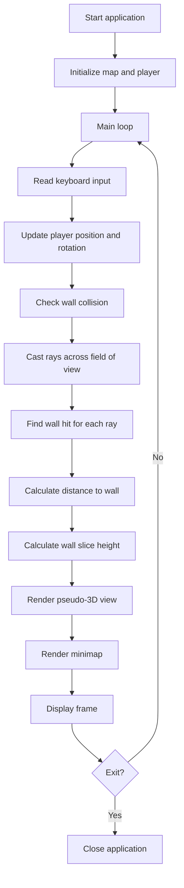

# Lab: Wolfenstein-like Ray Casting Engine

## Goal

Create a simple pseudo-3D engine inspired by early games like **Wolfenstein 3D**.

The goal is not to build a full game, but to understand how a **2D map** can be transformed into a **first-person pseudo-3D view** using **ray casting**.

You will practice:

- working with 2D arrays;
- basic geometry and trigonometry;
- keyboard input;
- collision detection;
- rendering loop;
- simple software architecture.

---

## Idea

The world is stored as a 2D grid:

```txt
1111111111
1000000001
1011110101
1000010101
1011010001
1000000001
1111111111
```

Where:

- `1` means wall;
- `0` means empty space.

The player is located somewhere inside the map and looks in some direction.

For every vertical column of the screen, the program sends a ray from the player’s position.  
When the ray hits a wall, the distance to that wall is used to calculate how tall the wall should look on the screen.

Closer wall = taller vertical slice.  
Farther wall = smaller vertical slice.

---

## Ray Casting Engine Workflow



---

## Task

Implement a small ray casting application where the user can move inside a 2D maze and see a pseudo-3D view.

Your application must have:

- a 2D map;
- a player position and direction;
- keyboard movement;
- collision detection with walls;
- ray casting;
- pseudo-3D wall rendering;
- a simple minimap or debug 2D view.

You may use any suitable language or framework.

Recommended options:

- C++ with SDL2 / SFML / raylib;
- JavaScript with Canvas;
- Python with pygame;
- C# with a graphics framework.

---

## Functional Requirements

### 1. Map

The map must be stored as a 2D array, string array, or loaded from a file.

Example:

```txt
111111
100001
101001
100001
111111
```

Requirements:

- `1` means wall;
- `0` means empty space;
- the player cannot walk through walls;
- map borders should be closed by walls.

---

### 2. Player Movement

The player must be able to:

- move forward;
- move backward;
- rotate left;
- rotate right.

Optional:

- strafe left/right;
- mouse rotation;
- sprint mode.

The player must not be able to move through walls.

---

### 3. Ray Casting

The program must cast multiple rays from the player’s position.

Each ray should:

- have its own angle;
- move through the map until it hits a wall;
- calculate the distance to the wall;
- return information needed for rendering.

Minimum requirement:

- cast at least **60 rays** per frame.

Recommended:

- make the field of view configurable;
- reduce fish-eye distortion;
- draw rays on the minimap for debugging.

---

### 4. Rendering

The application must draw a pseudo-3D view.

Requirements:

- close walls look taller;
- far walls look smaller;
- the screen updates when the player moves;
- wall slices are drawn based on ray distances.

Recommended:

- draw ceiling and floor;
- add simple distance-based shading;
- use different colors for different wall types.

---

### 5. Minimap

Add a simple minimap or debug view.

It should show:

- map walls;
- empty cells;
- player position;
- player direction;
- optionally, visible rays.

The minimap is important because it helps explain how the algorithm works.

---

## Suggested Project Structure

Your code should not be written as one huge file.

Recommended structure:

```txt
ray-casting-engine/
  README.md
  src/
    main.*
    GameMap.*
    Player.*
    Raycaster.*
    Renderer.*
    InputHandler.*
  maps/
  assets/
```

Possible responsibilities:

- `GameMap` — stores the map and checks walls;
- `Player` — stores position, direction, and movement;
- `Raycaster` — casts rays and finds wall hits;
- `Renderer` — draws the pseudo-3D scene and minimap;
- `InputHandler` — reads keyboard input.

You do not have to use exactly these names, but your project should have clear structure.

---

## Difficulty Levels

### Basic

Implement:

- hardcoded map;
- forward/backward movement;
- left/right rotation;
- collision detection;
- simple ray casting;
- pseudo-3D wall rendering;
- basic minimap.

This is enough for a passing grade if the code is clean and the student can explain it.

---

### Standard

Implement everything from Basic plus:

- configurable field of view;
- strafe movement;
- visible rays on minimap;
- distance-based wall shading;
- fish-eye correction;
- map loaded from a file;
- better project structure.

This is the recommended level.

---

### Advanced

Implement some of the following:

- textured walls;
- doors;
- different wall types;
- simple sprites or enemies;
- mouse control;
- multiple maps;
- level editor;
- optimized DDA ray casting.

Advanced features are optional. The core ray casting engine must work first.

---

## Implementation Plan

Recommended steps:

1. Create a 2D map.
2. Draw the map as a simple 2D view.
3. Add player position and direction.
4. Add keyboard movement.
5. Add collision detection.
6. Cast one ray and find where it hits a wall.
7. Cast many rays across the field of view.
8. Draw rays on the minimap.
9. Convert ray distances into wall heights.
10. Draw vertical wall slices.
11. Add simple floor and ceiling.
12. Refactor the code into modules.
13. Write README and prepare demo.

---

## Testing

You should test at least the following:

### Map

- wall cells are detected correctly;
- empty cells are detected correctly;
- out-of-map positions do not crash the program.

### Movement

- player can move through empty space;
- player cannot move through walls;
- player can rotate left and right.

### Ray Casting

- rays hit walls;
- distance to wall is calculated;
- the program does not crash near map borders.

Automated tests are recommended but not strictly required.  
If you do not write automated tests, describe manual test cases in `README.md`.

---

## Demo

During the demo, show:

- movement inside the map;
- collision with walls;
- pseudo-3D rendering;
- minimap or debug view;
- project structure;
- explanation of how one ray finds a wall.

Be ready to change the map and show that the engine still works.

---

## README Requirements

Your repository must include `README.md` with:

1. Project name.
2. Short description.
3. Selected difficulty level.
4. Technologies used.
5. How to run the project.
6. Controls.
7. Map format.
8. Short explanation of ray casting.
9. Screenshots or demo link, if possible.
10. Known problems or limitations.

---

## Defense Questions

Be ready to answer:

1. How is your map stored?
2. How do you check wall collisions?
3. What is a ray in your project?
4. How do you calculate ray direction?
5. How do you know that a ray hit a wall?
6. Why do close walls look taller?
7. What is field of view?
8. What is fish-eye distortion?
9. What does your game loop do?
10. Which part of your code renders the scene?
11. Which part stores the player state?
12. What was the hardest part of this project?
13. What would you improve next?

---

## Evaluation Criteria

| Criterion | Points |
|---|---:|
| Map representation | 10 |
| Player movement and collision detection | 15 |
| Ray casting logic | 20 |
| Pseudo-3D rendering | 20 |
| Minimap / debug view | 10 |
| Code structure | 10 |
| README and explanation | 10 |
| Demo and defense | 5 |
| **Total** | **100** |

---

## Common Mistakes

Avoid these mistakes:

- no collision detection;
- all code in one very large file;
- random vertical lines instead of real ray casting;
- no minimap or debug view;
- no explanation of the algorithm;
- program crashes near map borders;
- README does not explain how to run the project.

---

## Expected Result

At the end of this lab, you should have a small working pseudo-3D engine.

The user should be able to move inside a maze, see walls in a first-person view, and understand how the 3D illusion is created from a 2D map.
