# JavaScript Course — Build a Multiplayer Browser Game, Learn the Language Properly

> "Any application that can be written in JavaScript will eventually be written in JavaScript."
> — Atwood's Law

This is a 16-week, 8-lab course for 3rd–4th-year students who **already program**. You will not study JavaScript syntax — you can read a `for` loop and an arrow function. Instead, you'll build **one real project across all eight labs**: a real-time multiplayer game that runs in the browser and on a Node.js server, growing from a single ship on a canvas into an authoritative-server game with client-side prediction, a typed binary protocol, tests, profiling, and a public URL that two strangers can join.

Every lab has two halves that reinforce each other:

1. **One language feature, explored properly.** Not "here's the syntax" — the mental model, what the engine actually does, the classic pitfalls, and the interview questions it generates.
2. **One increment of the project** that *needs* that feature. You meet the event loop when a blocking call freezes your frame. You meet prototypes when entities need shared behavior. You meet promises when assets must load. You meet Node streams when match logs must hit disk without eating memory. You meet TypeScript when your message protocol has forty shapes and one typo.

A game is the ideal vehicle for JavaScript because it exercises **both runtimes** the language lives in — the browser (DOM, canvas, `requestAnimationFrame`, WebSocket client) and Node (streams, `EventEmitter`, WebSocket server) — and because the event loop, garbage collection, and network latency are not abstractions in a game: you *see* them as dropped frames and rubber-banding players.

By Lab 8 you'll have a portfolio project a recruiter can play in ten seconds, and you'll be able to explain the event loop, prototypes, promises, backpressure, client-server reconciliation, and V8's hidden classes at a whiteboard — which is exactly what a JavaScript interview at a serious company looks like.

This project counts as [Lab 27 — Multiplayer Browser Game](../../labs/lab-27-multiplayer-browser-game.md) of the [main 42-lab program](../../README.md) (and draws on [Lab 13](../../labs/lab-13-physics-sandbox.md) and [Lab 23](../../labs/lab-23-realtime-multiplayer.md)). Everything in the [root README](../../README.md) about portfolio, AI assistants, and the spirit of the program applies here.

---

## The project: a real-time multiplayer arena

The reference project in these labs is **`dogfight`**: a top-down 2D arena where players fly ships, shoot, and dodge, in real time, across the internet. You choose the **theme** — WWI biplanes, FPV drones, tanks, spaceships, submarines, wizards on brooms — the physics and networking are the same. Name yours whatever you like.

```mermaid
flowchart LR
    L1[Lab 1<br/>Event loop & modules<br/><i>game loop, a ship you fly</i>] --> L2[Lab 2<br/>Objects, prototypes, classes<br/><i>entities, bullets, collisions</i>]
    L2 --> L3[Lab 3<br/>Promises & async<br/><i>asset loading, lobby, audio</i>]
    L3 --> L4[Lab 4<br/>Node: streams & EventEmitter<br/><i>server, rooms, WebSockets</i>]
    L4 --> L5[Lab 5<br/>Binary data & networking<br/><i>authoritative server, prediction</i>]
    L5 --> L6[Lab 6<br/>TypeScript<br/><i>typed protocol, shared sim</i>]
    L6 --> L7[Lab 7<br/>V8, GC, testing<br/><i>tests, profiling, pooling, bots</i>]
    L7 --> L8[Lab 8<br/>Ship it<br/><i>Docker, CI/CD, deploy, observe</i>]
```

---

## The eight labs

| # | Lab | Language / runtime focus | What you add to the project |
|---|---|---|---|
| 1 | [The Event Loop Is the Game Loop](lab-01-event-loop-and-game-loop.md) | Call stack, task and microtask queues, `requestAnimationFrame`, ES modules, scope and closures, canvas | A ship you fly at 60 fps with a fixed-timestep simulation |
| 2 | [Objects, Prototypes, and `this`](lab-02-objects-prototypes-classes.md) | Prototype chain, `class` sugar, `this` binding rules, composition, `Map`/`Set`, iterables and generators | Entities, bullets, obstacles, collisions, an entity manager |
| 3 | [Asynchronous JavaScript](lab-03-async-javascript.md) | Promises, `async`/`await`, microtask ordering, `fetch`, `AbortController`, `EventTarget`, Web Audio | Asset pipeline with a loading screen, a lobby, sound |
| 4 | [Node.js: The Other Runtime](lab-04-node-streams-websockets.md) | Node vs browser, CommonJS vs ESM, `EventEmitter`, streams and backpressure, `http`, npm, `ws` | A game server with rooms, WebSocket join/leave/chat, match logs streamed to disk |
| 5 | [Real-Time Networking](lab-05-realtime-networking.md) | `ArrayBuffer`/`DataView`/typed arrays, shared modules via workspaces, timers in Node | Authoritative server, client-side prediction and reconciliation, interpolation, binary snapshots |
| 6 | [TypeScript](lab-06-typescript.md) | Structural typing, discriminated unions, generics, `unknown`, strict mode, runtime validation at boundaries | Whole codebase typed; a shared typed protocol; optional UI framework |
| 7 | [Engines, Memory, and Tests](lab-07-engine-performance-testing.md) | V8 internals (hidden classes, JIT, GC), DevTools profiling, object pooling, Web Workers, Vitest, fast-check, Playwright | Test suite, GC-hitch-free render loop, bots, a server load test |
| 8 | [Ship It](lab-08-ship-it.md) | Production Node, Docker, CI/CD, WebSockets behind proxies, logging, metrics, abuse limits, PWA | Public URL, two strangers playing, dashboards, README, demo video |

Each lab is **two weeks**. The schedule below assumes a 16-week semester with the final week doubling as the showcase.

| Weeks | Lab | Weeks | Lab |
|---|---|---|---|
| 1–2 | Lab 1 | 9–10 | Lab 5 |
| 3–4 | Lab 2 | 11–12 | Lab 6 |
| 5–6 | Lab 3 | 13–14 | Lab 7 |
| 7–8 | Lab 4 | 15–16 | Lab 8 + showcase |

---

## What each lab looks like

Every lab file has the same shape:

1. **This lab's feature** — what you'll master and why it matters beyond this project.
2. **Theory** — a compact, self-contained explanation: the mental model, what's under the hood, the pitfalls, and a few *prove-it-to-yourself* experiments to run in the browser console or Node REPL. This is the reading; it replaces a lecture.
3. **Project step** — what to add to the game, with milestones and a definition of done.
4. **Resources** — hand-picked English talks, articles, and book chapters, each with one line on *why this one*.
5. **Deliverable checklist** — what "done" means for this lab.
6. **Reflection** — "explain it at the whiteboard" questions. These *are* the interview questions.
7. **Stretch** — one optional deeper cut for when you're ahead.

---

## Rules of the course

- **Solo.** Individual work. You'll hold the whole system — client, server, protocol — in your head by the end, which is the point.
- **One repository, from day one.** Public GitHub repo. Commit as you go. At the end of each lab, **tag it** (`lab-01`, `lab-02`, …) so the history shows the game growing.
- **README is part of every deliverable.** Each lab adds a section: what you built, the measurement or evidence the lab asked for, what you learned. By Lab 8 that README is your portfolio write-up.
- **Every lab ends in a 5-minute defense.** You demo the increment and answer 2–3 Reflection questions. You should be able to explain every line you committed.
- **AI assistants** — follow the [program-wide policy](../../README.md). Use them to learn faster, not to skip understanding. If you can't explain it at the defense, it doesn't count.
- **Vanilla first, frameworks later — and optional.** Labs 1–5 are framework-free on purpose: the event loop, prototypes, promises, streams, and WebSockets *are* the curriculum, and frameworks exist to hide them. From Lab 6 you *may* introduce a framework where it earns its place — Svelte, Vue, or React for the lobby/HUD; Fastify or NestJS on the server — if you can articulate what it buys you. The game loop and canvas stay vanilla throughout.

---

## Tooling standard

Modern JavaScript, the way it's done in 2026. Alternatives are allowed if you can justify them.

- **Node.js 22 LTS or newer** (Node 24 recommended). Use [`nvm`](https://github.com/nvm-sh/nvm) or [`fnm`](https://github.com/Schniz/fnm) to manage versions; commit an `.nvmrc`.
- **npm** (bundled) with **workspaces** for the `client/`, `server/`, `shared/` packages from Lab 5. `pnpm` is a fine alternative.
- **[Vite](https://vite.dev/guide/)** for the client dev server and production build. Zero config, instant reload, native ESM in development.
- **ES modules everywhere** (`"type": "module"` in `package.json`; `import`/`export` on both sides).
- **TypeScript** from Lab 6 (strict). You may adopt it earlier if you already know it; the labs are written so that it's a deliberate migration.
- **Vitest** for tests, **fast-check** for property tests, **Playwright** for end-to-end (Lab 7).
- **ESLint (flat config) + Prettier**, or **Biome** as a single replacement. Pick one in Lab 1 and stop thinking about it.
- The [`ws`](https://github.com/websockets/ws) library for the WebSocket server; the browser's built-in `WebSocket` on the client. No Socket.IO — you're learning the protocol, not a wrapper.

---

## The resource shelf

Books and channels that recur across the labs. Everything essential is free.

- **[javascript.info](https://javascript.info/)** — the best free JavaScript textbook on the web; precise, modern, deep. The course leans on it heavily.
- **[You Don't Know JS Yet](https://github.com/getify/You-Dont-Know-JS)** by Kyle Simpson — free on GitHub. *Scope & Closures*, *Objects & Classes*, and (1st ed.) *Async & Performance* are the depth behind Labs 1–3.
- **[MDN Web Docs](https://developer.mozilla.org/en-US/docs/Web/JavaScript)** — the reference. Guides on modules, promises, typed arrays, canvas, workers, WebSockets.
- **[Node.js docs — Learn](https://nodejs.org/learn)** and the [API reference](https://nodejs.org/api/). The official guides on the event loop, streams, and backpressure are excellent.
- **[Game Programming Patterns](https://gameprogrammingpatterns.com/)** by Robert Nystrom — free online. Game Loop, Update Method, Component, Object Pool, Event Queue — you'll use all of them.
- **[Gaffer On Games](https://gafferongames.com/)** (Glenn Fiedler) and **[Gabriel Gambetta's Fast-Paced Multiplayer](https://www.gabrielgambetta.com/client-server-game-architecture.html)** — the two canonical sources on game networking.
- **[The TypeScript Handbook](https://www.typescriptlang.org/docs/handbook/intro.html)** and Matt Pocock's free **[Total TypeScript Essentials](https://www.totaltypescript.com/books/total-typescript-essentials)**.
- **[V8 blog](https://v8.dev/blog)** and **[web.dev](https://web.dev/)** — for how the engine and browser actually work.
- **Lydia Hallie's "JavaScript Visualized"** series (articles and videos) — the clearest diagrams of the event loop, prototypes, promises, and the engine anywhere.

---

## What you'll be able to say at the end

Not "I know JavaScript." Instead:

- *"I built a real-time multiplayer game with an authoritative Node server and client-side prediction; here's the URL, join me."*
- *"The protocol is a binary format over WebSockets — I cut bandwidth 6× versus JSON and can show you the `DataView` code."*
- *"I profiled the render loop, found GC pauses from bullet allocation, and eliminated them with object pooling — frame-time p99 went from 31 ms to 9 ms."*
- *"Client and server share one TypeScript simulation module; the message protocol is a discriminated union with exhaustive handling and zod validation at the boundary."*
- *"It's containerized, deployed with CI/CD, has structured logs and metrics, and rate-limits abusive clients."*

Each of those sentences is a job interview going well. Let's start with [Lab 1](lab-01-event-loop-and-game-loop.md).
