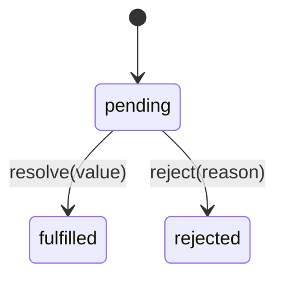
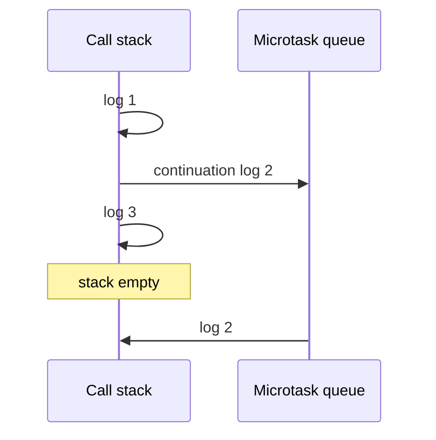
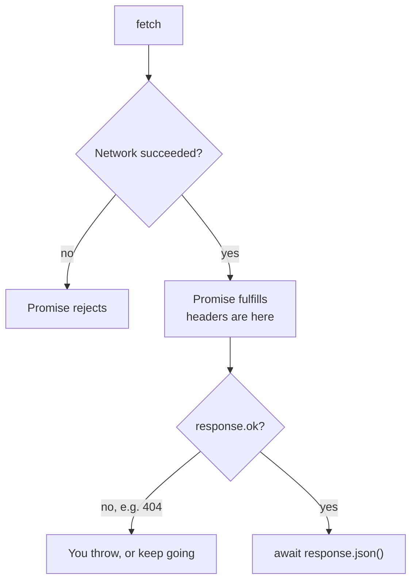

# Notes 03 — Promises і `async`/`await`

Поруч із лабою: [lab-03-async-javascript.md](lab-03-async-javascript.md).

Лаба — **що здати** (екран завантаження, лобі, звук, тег). Цей файл — **з чим розібратись**. Chrome → будь-яка сторінка → F12 → Console. Перед запуском скажи вголос, що очікуєш. Потім звіряй. Якщо `await` нарікає — обгорни: `(async () => { … })()`.

**Що здати гру:** спрайти й звук вантажаться паралельно, з прогресом і без блокування циклу; 404 і обрив не валять усе; лобі скасовується, коли гравець пішов; симуляція не імпортує звук.

**На парі (п’ять дослідів):** §1 один раз і завжди пізніше; §2 порядок з `await`; §4 `fetch` і 404; §5 послідовно vs `all`, і що сусіди не зупиняються; §7 проміс пам’ятає, подія — ні.

**Не брама для тега:** Web Audio по вузлах, `for await` і стріми, написати `Promise.all` з нуля, формула backoff. Це лаба, Stretch і Lab 4.

Етапи здачі (**M1–M4**):

| | Що зробити | Як перевірити |
|---|---|---|
| **M1** | завантаження ассетів + екран «Loading» | гра не стартує, поки картинки не готові |
| **M2** | спрайти й звук у бою | постріл щось малює і чути |
| **M3** | лобі по HTTP | список кімнат / «готовий» без WebSocket ще |
| **M4** | головоломки порядку + галерея помилок | у README: що reject, а що 404 |

---

## Ідея

Promise — значення, якого ще немає, плюс обіцянка: скажуть **рівно один раз**. Стан: pending → fulfilled або rejected. Назад не повертається.

`.then` і продовження після `await` — **мікрозадачі**. Це друга половина event loop з Lab 1: черга мікрозадач спустошується вся, перед одним таймером і перед paint. Тому ланцюжок `.then` може з’їсти кадр, а `setTimeout` — ні.



У грі не можна `while (!image.complete) {}` — це Lab 1. Треба чекати без блокування: спрайти, звук, лобі.

---

## 1. Один раз, і завжди пізніше

Колбек тобі не належить: чужий код може викликати його двічі, або ніколи, або синхронно — а може й ні. Від цього залежить, чи твій наступний рядок уже бачить результат. Проміс це забороняє.

```js
const p = new Promise((resolve) => {
  resolve(1)
  resolve(2)
})
p.then(console.log)
```

**Очікуй:** лише `1`. Другий `resolve` ігнорується.

Тепер головне, чому `.then` **ніколи** не біжить у тому самому повороті, навіть якщо проміс уже готовий:

```js
Promise.resolve('ready').then((v) => console.log('then', v))
console.log('after subscribe')
```

**Очікуй:** спочатку `after subscribe`, потім `then ready`.

Якби вже готовий проміс кликав `.then` синхронно, а ще неготовий — пізніше, один і той самий код мав би два порядки. Залежно від того, встиг файл закешуватись чи ні. Мова це прибирає: підписка завжди «пізніше». На співбесіді це і є відповідь на «чому `2`, потім `1`», не просто «бо мікрозадача».

**Навіщо в грі:** `onload` картинки може спрацювати синхронно, якщо вона вже в кеші. Обгортка в проміс дає один порядок і для кешу, і для мережі.

---

## 2. Порядок: синхронне, мікрозадача, таймер, `await`

```js
Promise.resolve(1).then(console.log)
console.log(2)
```

**Очікуй:** `2`, потім `1`.

Додай таймер:

```js
setTimeout(() => console.log(4), 0)
Promise.resolve(1).then(() => console.log(1))
console.log(2)
```

**Очікуй:** `2`, `1`, `4`. Мікрозадачі — усі, таймер — одна задача після них (Lab 1).

`await` **завжди** віддає чергу, навіть якщо справа не проміс:

```js
async function a() {
  console.log(1)
  await null
  console.log(2)
}
a()
console.log(3)
```

**Очікуй:** `1`, `3`, `2`. Функція добігла до `await`, повернулась у цикл, `3` встиг надрукуватись, і лише потім мікрозадача дописала `2`. `await null` — не «нічого не чекай». Це «продовж у мікрозадачі».



Головоломка з лаби, якщо встигаєте. Прогноз уголос до запуску:

```js
setTimeout(() => console.log(1), 0)
Promise.resolve().then(() => console.log(2)).then(() => console.log(3))
;(async () => {
  console.log(4)
  await 0
  console.log(5)
})()
console.log(6)
```

**Очікуй:** `4`, `6`, `2`, `5`, `3`, `1`.

`4` і `6` — цей поворот. `2` уже стояв у мікрочерзі. `await 0` поставив `5` слідом за ним. `3` стає в чергу лише коли відпрацює `2` (кожен `.then` — новий проміс). `1` — задача, після всієї мікрочерги.

**Навіщо в грі:** код після `await` — це вже інший поворот. Прапорець «лобі ще на екрані», виставлений після `await`, може бути пізно: гравець уже натиснув «вийти».

---

## 3. Ланцюжок: поверни, не вкладай

`.then` повертає **новий** проміс. Ланцюг чекає на те, що ти повернув. Забув `return` — далі приїде `undefined`, і ніхто не кине помилку.

```js
Promise.resolve(1)
  .then((n) => {
    Promise.resolve(n + 1)
  })
  .then((n) => console.log('forgot', n))

Promise.resolve(1)
  .then((n) => Promise.resolve(n + 1))
  .then((n) => console.log('returned', n))
```

**Очікуй:** `forgot undefined`, потім `returned 2`.

Помилка їде вниз, поки хтось не зловить. `throw` у обробнику — це reject. Після `.catch` ланцюг знову fulfilled, якщо catch сам не кинув:

```js
Promise.resolve(1)
  .then((n) => {
    console.log('a', n)
    throw new Error('boom')
  })
  .then((n) => console.log('b', n))
  .catch((e) => console.log('c', e.message))
  .then(() => console.log('d'))
```

**Очікуй:** `a 1`, `c boom`, `d`. Рядка `b` немає.

`async`/`await` — той самий ланцюг, написаний зверху вниз. `try/catch` ловить і `throw`, і reject після `await`. Функція `async` завжди повертає проміс: `return 5` зовні виглядає як fulfilled `5`, `throw` — як reject.

**Навіщо в грі:** `fetchJson` кидає на `!r.ok`. Далі один `try/catch` на завантаженні, а не `if (err)` у кожному колбеку.

---

## 4. `fetch`: 404 — це fulfill, тіло — другий крок

```js
fetch('https://httpbin.org/status/404').then((r) =>
  console.log('ok', r.ok, 'status', r.status),
)
```

**Очікуй:** проміс **виконався**, `ok false`, `status 404`. Мережа відбулась, сервер відповів. Reject — коли запиту не було: немає хоста, обрив, abort.

```js
fetch('https://no-such-host.invalid/').catch((e) => console.log('reject', e.name))
```

**Очікуй:** `reject TypeError` (або подібне ім’я мережевої помилки). Не статус 404.

Проміс `fetch` вирішується, коли прийшли **заголовки**. Тіло — окремий `await`:

```js
const r = await fetch('https://httpbin.org/json')
console.log('headers', r.status, r.ok)
const data = await r.json()
console.log('body', Object.keys(data))
```

**Очікуй:** спочатку рядок `headers`, потім ключі JSON. Між ними з’єднання ще може впасти: перший крок fulfilled, другий — reject.



**Навіщо в грі:** спрайт з 404 не «зламав мережу». Його треба відрізнити від «сервер не відповів» і від «JSON битий». Це три різні кадри галереї в M4.

---

## 5. Послідовно vs `all`: коли стартує робота

```js
const wait = (ms) => new Promise((r) => setTimeout(r, ms))

console.time('seq')
await wait(1000)
await wait(1000)
console.timeEnd('seq')

console.time('all')
await Promise.all([wait(1000), wait(1000)])
console.timeEnd('all')
```

**Очікуй:** seq ~2000 мс, all ~1000 мс.

Пастка не в слові `await`. Пастка в тому, **коли** ти запускаєш другу роботу. `const a = await loadA(); const b = await loadB()` стартує B лише після A. `Promise.all([loadA(), loadB()])` стартує обидві до очікування.

`all` падає на **першому** reject. Решта **не скасовується** — вони добігають:

```js
const slow = new Promise((r) =>
  setTimeout(() => {
    console.log('slow still ran')
    r('s')
  }, 300),
)
Promise.all([slow, Promise.reject(new Error('fast'))]).catch((e) =>
  console.log('all', e.message),
)
```

**Очікуй:** одразу `all fast`, і через ~300 мс все одно `slow still ran`.

Тому для пака ассетів:

- **`Promise.all`** — потрібні всі (немає корабля → немає гри).
- **`Promise.allSettled`** — один файл може відвалитись, решту все одно показати (немає звуку вибуху → гра жива). Кожен результат: `{ status: 'fulfilled', value }` або `{ status: 'rejected', reason }`.
- **`Promise.race`** — хто перший settle, той і відповідь. Програвший **теж не зупиняється**. Таймаут через `race` лишає запит висіти.
- **`Promise.any`** — перший успіх; якщо впали всі — `AggregateError`.

Прогрес-бар з голого `all` не вийде: він мовчить до кінця. Рахуй завершені шматки сам, до того як віддати їх у `all`:

```js
let done = 0
const total = urls.length
const loads = urls.map((url) =>
  loadOne(url).then((v) => {
    done += 1
    console.log(done + '/' + total)
    return v
  }),
)
await Promise.all(loads)
```

**Навіщо в грі:** M1. Послідовні `await` на спрайтах — це і є «чому завантаження довге». Заміна на `all` і різниця в часі — рядок у README.

---

## 6. Скасування: відповідь «з того світу»

Проміс не має `.cancel()`. Зупиняє робота той, хто її почав, через **`AbortController`**.

```js
const c = new AbortController()
fetch('https://httpbin.org/delay/5', { signal: c.signal }).catch((e) =>
  console.log(e.name),
)
c.abort()
```

**Очікуй:** `AbortError`. Те саме без ручного `abort`: `fetch(url, { signal: AbortSignal.timeout(1000) })`.

Сенс не в спінері. Гравець вийшов з лобі, а відповідь про кімнати приїхала потім і записала список у екран, якого вже немає. `abort()` у момент виходу відсікає цей апдейт. `race` з таймаутом так не вміє: програвший `fetch` досі може виконатись.

Без `.catch` rejected promise у браузері дає `unhandledrejection`. У Node (Lab 4) такий проміс за замовчуванням валить процес — помилку видно, а не ковтає сторінка.

```js
window.addEventListener('unhandledrejection', (e) => {
  console.log('unhandled', e.reason)
  e.preventDefault()
})
Promise.reject(new Error('x'))
```

**Навіщо в грі:** `refresh()` лобі на інтервалі, сигнал скасовується, коли екран зник. Свій `loadImage(url, signal)` теж приймає сигнал і відписується на `abort`, інакше скасований пак все одно викличе `resolve`.

---

## 7. Проміс пам’ятає, подія — ні

Проміс — значення **один раз**. Хто підпишеться пізніше, все одно отримає його. Подія — те, що стається **знову**. Хто спізнився, той пропустив.

```js
const sprite = Promise.resolve('ship.png')
sprite.then((v) => console.log('early', v))
sprite.then((v) => console.log('late', v))
```

**Очікуй:** і `early`, і `late`. Другий `.then` не «проґавив» завантаження.

```js
const bus = new EventTarget()
bus.addEventListener('exploded', (e) => console.log('heard', e.detail))
bus.dispatchEvent(new CustomEvent('exploded', { detail: 1 }))
bus.addEventListener('exploded', (e) => console.log('too late', e.detail))
```

**Очікуй:** лише `heard 1`. Підписник `too late` мовчить, поки вибух не станеться ще раз.

Один раз → проміс (картинка, відповідь `/api/rooms`). Багато разів → подія (`fired`, `hit`, `exploded`). Симуляція шле подію і не імпортує `audio.js`. Звук слухає. Той самий прийом, що `EventEmitter` у Node на Lab 4.

Одну подію можна дочекатись як проміс, якщо вона справді одна:

```js
function once(target, type) {
  return new Promise((resolve) => {
    target.addEventListener(type, resolve, { once: true })
  })
}
```

---

## У проєкті

| Ідея | Де в грі |
|---|---|
| один порядок для кешу і для мережі | `loadImage` через `new Promise`, не голий `onload` |
| `Promise.all` + лічильник прогресу | екран Loading, M1 |
| `fetchJson` кидає, якщо `!r.ok` | маніфест і лобі; 404 не маскується під «немає мережі» |
| `allSettled`, якщо звук не критичний | пак може доїхати без одного файлу |
| `AbortSignal` на кожен запит | вихід з лобі, таймаут |
| `EventTarget`, сим не імпортує звук | постріл → подія → `audio.js` |

Web Audio коротко, без досліду: файл → `arrayBuffer` → `decodeAudioData` ще на екрані завантаження. `AudioContext` стартує лише після кліку. На першому пострілі декодувати пізно — буде клацання.

---

## На співбесіді

- `Promise.resolve().then(log); console.log(2)` — порядок і **чому** вже готовий проміс все одно не кличе `.then` зараз.
- `async function` з `await null` — що друкується до і після. Продовження — мікрозадача.
- Чому `fetch` на 404 не reject? Де тоді HTTP-помилка? Чому тіло — другий `await`?
- `const a = await loadA(); const b = await loadB()` vs `Promise.all`. Що роблять сусіди, коли `all` уже впав?
- Чим `AbortController` відрізняється від `Promise.race` з таймаутом?
- Коли проміс, коли подія? Що побачить той, хто підписався пізно?

---

## Якщо мало часу

Три запуски: §1 (другий `resolve` і «after subscribe»), §2 (`await null`), §5 (seq vs `all` і «slow still ran»). Потім одне речення: 404 — це fulfill, скасування лобі — `abort`, постріл — подія, картинка — проміс. Решту — з лаби, секції Theory 4–6.
