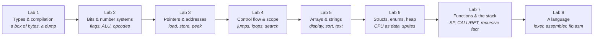

# Programming Fundamentals — Build a Computer You Can See

[English](README.md) · [Українською](README.uk.md)

> "The computer is a machine that moves bits. Types, names, and languages are stories we tell about those bits so we can think."

A 16-week, 8-lab course for **first-year** students. You do not need to have programmed before — [week 0](setup.notes.md) installs the tools, [C++ за годину](cpp-survival-kit.notes.md) gives you the language you need for Lab 1, and Lab 1 itself starts from a [working skeleton](starter/README.md), not an empty file. Across the semester you build **one machine**: a tiny virtual computer. By Lab 8 you write programs *for* it in a language *you* scanned and assembled. A recruiter can clone the repo, run one command, and see the dump, the pixels, and a Fibonacci that lives on a stack you implemented.

The working name of that machine is **`ember`**. It is not a library and not a programming language — it is the program *you* write, named so every lab can point at the same thing. Call your repo whatever you like. Everyone builds the same machine: memory, registers, a display, an assembler. What differs is the README, extra opcodes if you want them, and the programs you write for it.

---

## How we think about the course

Each lab has two halves that need each other:

1. **One idea about how programs actually work** — the mental model, what the machine is doing, the classic pitfalls, and a few experiments you run in the terminal until the idea is boring.
2. **One increment of `ember`** that *cannot be built without that idea*. You meet integers when a byte wraps from 255 to 0. You meet bits when an instruction is a byte you have to decode. You meet pointers when the CPU has to *find* a value instead of holding it. You meet arrays when a screen is a grid of pixels. You meet a lexer when typing hex by hand becomes unbearable and you want to write `ADD A, B`.

A virtual computer is the vehicle because nothing important stays a metaphor. Overflow shows up in a dump. Walking off an array is a sanitizer report you caused on purpose. Recursion is a stack that grows until it doesn't. Source code becoming instructions is a scanner you wrote.

Work happens in the **terminal**: you compile with `c++` / `cmake`, you talk to `ember` by typing commands, you paste the output into your README. That output *is* the test.

---

## What we drew on

This course sits in the same family as the [Python](../python/README.md) and [JavaScript](../javascript/README.md) courses in this repository: **one project, eight two-week labs**, theory that exists because the next feature needs it, notes you can run on a pair of screens, a five-minute defense instead of a paper exam.

The wider [42-lab program](../../README.md) — and behind it [École 42](https://42.fr/) — is the posture: you learn by shipping something you can demo, not by collecting completed worksheets.

For the *machine* itself we borrowed freely:

- **[Ben Eater's 8-bit breadboard computer](https://eater.net/8bit)** — registers and an ALU you can point at on a desk. When Lab 2 feels abstract, watch an episode.
- **[NAND2Tetris](https://www.nand2tetris.org/)** (Nisan & Schocken) — a computer from simple parts all the way to a program. These eight labs are a compressed, C++-flavored cousin of the middle of that journey.
- **CHIP-8** — a 64×32 display made of bits; Lab 5's screen is in that family.
- **[Crafting Interpreters](https://craftinginterpreters.com/)** (Bob Nystrom) — Lab 8's attitude: a language begins as a scanner that turns text into tokens, then into bytes the CPU already understood.

C++ is the glass: a small subset (types, functions, structs, pointers) so you can *see* the bytes. It is not a tour of the whole language.

---

## The project: `ember`

`ember` is a C++ program that *pretends to be a small computer*:

- 4096 bytes of RAM you can print (`dump`)
- a few registers (named slots the CPU uses right now)
- an instruction set you grow opcode by opcode
- from Lab 5, a 64×32 pixel display drawn with characters in the terminal
- from Lab 8, an assembler: you type `ADD A, B` instead of poking hex

You run it like any other command-line program: `./build/ember`. It prints a prompt. You type `dump`, `get 0`, `step`. Later: `./build/ember programs/fib.asm`.

### The 4 KB, once

Every lab points at the same picture. It is written down once, in **[ISA.md](ISA.md)** — the memory map and the instruction set, frozen in Lab 2 and grown a few rows at a time.

```txt
0x000  CODE  2048 B   your program; PC starts here
0x800  DATA   512 B   strings, arrays, counters
0xA00  VRAM   256 B   64 x 32 pixels, 1 bit each -- the screen IS memory
0xB00  spare  256 B
0xC00  HEAP   768 B   ALLOC bumps upward
0xF00  STACK  256 B   SP starts at 0xFFF and walks down
```



Everyone builds the same machine. What differs is the README, extra opcodes if you want them, and the programs you write for it.

---

## Words the labs use

Read this once. The labs assume these meanings.

| Word | What it means here |
|---|---|
| **`ember`** | The name of *your* project — the virtual computer you are writing in C++. Rename it if you want. |
| **Virtual machine (VM)** | A program that behaves like a CPU + memory. `ember` is a VM. |
| **Byte** | 8 bits. One cell of `ember` RAM. |
| **Dump** | Print memory as hex (and ASCII), like the Unix tool `hexdump`. Command: `dump`. |
| **Peek / poke** (`get` / `set`) | Read a byte at an address; write a byte at an address. |
| **CLI / prompt** | You run a program in the terminal and type commands at it. No window, no Run button. |
| **Register** | A named slot inside the CPU (`A`, `B`, `PC`) that holds a value *now*. |
| **`PC` (program counter)** | The address of the *next* instruction to run. |
| **Opcode** | The byte (or field of a byte) that means “which instruction this is” (`ADD`, `HALT`, …). |
| **ALU** | Arithmetic-logic unit: the part that adds, ANDs, shifts — in our case, C++ functions you write. |
| **Guest vs host** | *Guest* = numbers inside `ember` (address `0…4095`). *Host* = your real C++ process (`Byte*` into the array). Don't mix them. |
| **Assembler** | A program that turns text (`ADD A, B`) into the bytes `step` already runs. |
| **Lexer / scanner** | The first stage of that: walk characters, emit tokens, or report an error with a line number. |
| **Sanitizer** | Extra checks compiled *into* the binary. When you walk off an array, the program aborts and prints a report instead of “maybe printing 42.” |
| **ASan** | **AddressSanitizer** (`-fsanitize=address`). Catches out-of-bounds, use-after-free, double-free. |
| **UBSan** | **UndefinedBehaviorSanitizer** (`-fsanitize=undefined`). Catches things like signed integer overflow. |
| **UB** | Undefined behaviour: the language does not promise what happens. Sanitizers make some of it visible. |
| **CMake** | The build tool: you describe the project once, then `cmake --build` compiles it the same way on every OS. |
| **`H`** | The address register: 16 bits, holds *where* rather than *what*. A pointer the CPU can hold. |
| **`SP`** | Stack pointer. `PUSH` writes below it, `POP` reads back. |
| **VRAM** | The 256 bytes of `ember` memory the display is made of. Not a separate array — [ISA.md §7](ISA.md#7-the-display-is-memory). |

---

## Before Lab 1

Three pages, one evening, once per semester. Everything after this assumes them.

| Page | What it gives you |
|---|---|
| [Інструменти, термінал і git](setup.notes.md) | compiler, CMake and git installed per OS; the ten terminal commands; the git you actually need for tags and a public repo |
| [C++ за годину](cpp-survival-kit.notes.md) | `cout`, variables, `if`, loops, functions, arrays, strings — exactly enough to read Lab 1's skeleton and write your four `TODO`s |
| [Помилки, які ви точно побачите](errors.notes.md) | real compiler, linker and sanitizer messages, decoded. Keep it open all semester |
| [GLOSSARY.md](GLOSSARY.md) | the course's bilingual glossary: Ukrainian as we speak it, English as you search for it |
| [CHECKS.md](CHECKS.md) + [`checks/`](checks/) | verified numbers your machine must produce, per lab. Run them the day you think you're done — not the day before the defense |

Then copy the [starter skeleton](starter/README.md) and open [Lab 1](lab-01-a-box-of-bytes.md).

The machine's reference — memory map, instruction set, calling convention — lives in **[ISA.md](ISA.md)** and is the contract every lab builds against.

---

## The eight labs

| # | Lab | Notes | What you understand | What you add to `ember` |
|---|---|---|---|---|
| 1 | [A Box of Bytes](lab-01-a-box-of-bytes.md) | [notes](lab-01-a-box-of-bytes.notes.md) | Compilation, types as sizes, overflow, `const`, characters as numbers | A CMake project, 4 KB of memory, a hex dump, poke/peek |
| 2 | [Bits Don't Lie](lab-02-bits-dont-lie.md) | [notes](lab-02-bits-dont-lie.notes.md) | Binary/hex, two's complement, flags, bitwise ops, masks | An ALU, a flags register, opcode decode, `step` |
| 3 | [Addresses, Not Names](lab-03-addresses-not-names.md) | [notes](lab-03-addresses-not-names.notes.md) | Pointers, `&`/`*`, `void*`, `sizeof`, pointer arithmetic | `LOAD`/`STORE`, a program counter that walks memory |
| 4 | [The Shape of Control](lab-04-the-shape-of-control.md) | [notes](lab-04-the-shape-of-control.notes.md) | Booleans, `if`/`switch`/`while`/`for`, short-circuit, block scope | `JMP`/`JZ`, a loop in bytecode, linear search |
| 5 | [Many of One Thing](lab-05-many-of-one-thing.md) | [notes](lab-05-many-of-one-thing.notes.md) | Arrays, 2D indexing, strings, search, simple sorts | A 64×32 display, `PLOT`, sort a region, print a string |
| 6 | [Named Bundles](lab-06-named-bundles.md) | [notes](lab-06-named-bundles.notes.md) | `struct`, `enum`, lifetime, stack vs heap, leaks | `CPU`/`Instruction` as structs, a heap region, sprites |
| 7 | [Call and Return](lab-07-call-and-return.md) | [notes](lab-07-call-and-return.notes.md) | Functions, value vs pointer, the call stack, recursion, headers | `SP`, `PUSH`/`POP`, `Stack` ADT, `CALL`/`RET`, recursive factorial |
| 8 | [Give It a Language](lab-08-give-it-a-language.md) | [notes](lab-08-give-it-a-language.notes.md) | Tokens, scanners, linked lists, ADTs, syntax errors | A lexer + assembler; `hello`, `search`, `fib` as `.asm` |

Each lab is **two weeks**, checked at the end of that window. Eight defenses across the semester, not one showcase in week 16.

| Weeks | Lab | Weeks | Lab |
|---|---|---|---|
| 1–2 | Lab 1 | 9–10 | Lab 5 |
| 3–4 | Lab 2 | 11–12 | Lab 6 |
| 5–6 | Lab 3 | 13–14 | Lab 7 |
| 7–8 | Lab 4 | 15–16 | Lab 8 |

**The labs and the notes are written in Ukrainian**, because the students are. This README is the English entry point to the repository; the machine reference has both an [English](ISA.md) and a [Ukrainian](ISA.uk.md) version.

---

## What each lab looks like

Same shape as the Python and JavaScript courses:

1. **Терміни цієї лаби** — the 5–8 terms it introduces, Ukrainian and English.
2. **Про що ця лаба** — what you'll master and why it matters beyond this project.
3. **Notes** — a short companion: theory, paste-ready snippets, expected output. Use it in class or alone; it does not replace the lab.
4. **Теорія** — the mental model, what's under the hood, pitfalls, *prove-it-to-yourself* experiments. This is the reading.
5. **Крок проєкту** — what to add to `ember`, with milestones and a definition of done.
6. **Рівні** — Basic / Standard / Advanced, with honest hour estimates. Pick a landing spot before you start; Basic is a real, passing lab.
7. **Чекліст здачі** — the deliverable checklist.
8. **На захисті** — explain it at the whiteboard.
9. **Якщо встигаєте** — optional, when you're ahead.
10. **Що почитати й подивитись** — a few talks and chapters, each with one line on *why this one*.

(The lab files are in Ukrainian. The section names above are the headings you will
actually see; this list is here so an English reader can navigate them.)

### What lives where, so nothing is read twice

Every thing has one home. If the other file needs it, it links rather than copies.
This is not tidiness for its own sake: a first-year reads both files back to back,
and every repetition reads as new information until they work out that it isn't.

| Thing | Home |
|---|---|
| terms, theory, milestones, levels, checklist, defense questions | **the lab** |
| code snippets, the build line, expected output, "if you're short on time" | **the notes** |
| memory map, instruction set, calling convention | [ISA.md](ISA.md) |
| the numbers to check against | [CHECKS.md](CHECKS.md) |
| how the defense runs, trace variants, break-it tasks | [DEFENSE.md](DEFENSE.md) |
| terminology, Ukrainian and English | [GLOSSARY.md](GLOSSARY.md) |

The lab says **what you should come away with** from each experiment; the notes hold
the experiment. That is why "Перевірте самі" in a lab is a table of takeaways, not a
second copy of the code.

### A note on Levels, because the cohort is not uniform

First-year groups arrive split: some wrote code at school, some have never opened
a terminal. This course handles that with the **Levels**, not with two syllabuses.

- **Basic** is a complete, passing lab. It is sized so that someone who has never
  programmed can reach it in about **4–5 hours a week**, using the given code.
  A student who lands on Basic for all eight labs has still built a working
  virtual computer and should be told so.
- **Standard** is the target, about **6–7 hours a week**. This is where the
  course's claims get earned: the traces, the explanations, the README.
- **Advanced** exists so the experienced students have somewhere to go. It is
  deliberately *the same machine, harder* — never "do an extra lab." That keeps
  the group defending one artifact in one vocabulary.

Across all eight labs that is roughly **62–78 hours** at Basic and **102–118** at
Standard. On a fixed 16-week semester, plan the group around Standard and expect
a real tail at Basic.

Some work is **given as code you read rather than write** — Lab 1's prompt and
dump, Lab 2's `cpu.hpp`, `step()` shape and `reg` command, Lab 3's `get16`, Lab 5's `show()`, Lab 7's `fact` listing, Lab 8's token
list. In every case what is given is scaffolding and what is left is the lab's
actual idea. Reading working code is a skill the course teaches on purpose.

The three Levels map onto the program-wide rubric in [`INSTRUCTOR_HANDBOOK.md`](../../INSTRUCTOR_HANDBOOK.md) §6: Basic passes, Standard is the target, Advanced is distinction.

---

## Rules of the course

- **Solo.** You'll hold the whole machine in your head by the end, which is the point.
- **One machine.** The memory map and instruction set in [ISA.md](ISA.md) are the same for everyone. Extend them in the reserved range; never redefine what is already there.
- **One repository, from day one.** Public GitHub. Commit as you go. Tag each lab (`lab-01`, `lab-02`, …).
- **README is part of every deliverable.** Each lab adds a section: what you built, pasted terminal output, what surprised you. By Lab 8 that README is the story of a computer.
- **Terminal only.** Compile, run, and check from a shell. Notes snippets → `c++ … scratch.cpp`. `ember` → a prompt you type into. Evidence is **pasted stdout** (and sanitizer reports).
- **Every lab ends in a 5-minute defense.** Run the lab's checks, trace a few bytes on paper with numbers you have not seen, predict what one changed line will break, answer one Reflection question. If you can't explain a line, it doesn't count. The format is in [DEFENSE.md](DEFENSE.md).
- **AI assistants are allowed.** How to use them without skipping the understanding is [its own section below](#ai-assistants).
- **Sanitizers stay on.** A program that is undefined behaviour is not “working,” even if it printed something.

---

## AI assistants

Honestly: an assistant can write `ember` in an evening. [ISA.md](ISA.md) and
[CHECKS.md](CHECKS.md) specify the machine so precisely that one prompt passes
every check. So code and pasted output show that the machine works, not that you
understand it. The defense shows that: a paper trace with numbers you have not
seen, and one line the instructor changes ([DEFENSE.md](DEFENSE.md)). The
assistant is not in the room.

A lab is yours if you can change any line of it and say in advance what will
happen. Who typed the line does not matter.

| Hand to the assistant | Do yourself |
|---|---|
| plumbing: command parsing, output formatting, `CMakeLists.txt`, splitting files | the lines the lab exists for: the mask in `decode`, the flags, how far `PC` moves, the `plot` formula, byte order in `CALL`/`RET`, labels in the assembler |
| explaining a compiler error or an ASan report | the prediction before every run: what it prints, and why |
| "explain this line" about the code a lab gives you | the paper trace |
| checking: "does my `step` match the ISA table?" | the conclusion when the prediction and the machine disagree |

One habit that pays off: when an assistant hands you code, predict what it will
print on `checks/` before you run it. Assistants make plausible mistakes — `PC`
moves by the wrong amount, carry comes from the wrong bit, bytes land in the
wrong order — exactly the bugs a trace and the checks catch. And passing the
checks does not mean correct: [DEFENSE.md](DEFENSE.md#lab-2--біти-не-брешуть)
(Lab 2, break 4) has a broken `step` that almost passes them.

The program-wide rules are in the [repository README](../../README.md#using-ai-assistants).

---

## Tooling standard

- **C++17** (or newer). Subset: types, functions, structs, pointers. No class hierarchies. You may *compare* with `std::vector` / `std::string` after you've built the thing yourself.
- **CMake**

  ```bash
  cmake -S . -B build -DCMAKE_BUILD_TYPE=Debug
  cmake --build build
  ./build/ember
  ```

- **clang or gcc** in the terminal (`c++`, `clang++`, or `g++`):  
  `-std=c++17 -Wall -Wextra -Werror -fsanitize=address,undefined`  
  On Windows, use WSL (or another Unix-like shell) so ASan/UBSan work.
- **Notes experiments**

  ```bash
  c++ -std=c++17 -Wall -Wextra -Werror -fsanitize=address,undefined scratch.cpp -o scratch && ./scratch
  ```

  The same line sits at the top of [Notes 01](lab-01-a-box-of-bytes.notes.md).
- **clang-format** — pick a style in Lab 1 and stop thinking about it.
- **A debugger is optional.** If you use one, it is `lldb` or `gdb` in that same terminal. Printing a byte with `get` / `std::cout` is the required proof.
- **[Compiler Explorer](https://godbolt.org/)** — optional Stretch. The required path never leaves your shell.

---

## The resource shelf

Everything essential is free.

- **[Ben Eater — Building an 8-bit breadboard computer](https://eater.net/8bit)** — the hardware twin of Labs 2–3.
- **[NAND2Tetris](https://www.nand2tetris.org/)** — from parts to a program.
- **[learncpp.com](https://www.learncpp.com/)** — the best free C++ textbook for a first pass. Reference, not syllabus.
- **[cppreference.com](https://en.cppreference.com/)** — the language. Grep it; don't read it cover to cover.
- **K&R, *The C Programming Language*** — short, dense. Chapters 1–5 overlap Labs 1–5.
- **[Crafting Interpreters](https://craftinginterpreters.com/)** — scanning and tokens (Lab 8). You are not building Lox; you are stealing the attitude.
- **[CS:APP](https://csapp.cs.cmu.edu/)** — bits, memory, and machine code when you want more depth on Labs 2–3.
- **[Crash Course Computer Science](https://www.youtube.com/playlist?list=PL8dPuuaLjXtNlUrzyH5r6jN9ulIgZBpdo)** — binary, registers, machine code in about ten minutes.
- **[CHIP-8 technical reference](http://devernay.free.fr/hacks/chip8/C8TECH10.HTM)** — a whole 1970s virtual machine specified in a few pages. Read it once and `ISA.md` stops feeling arbitrary.

---

## What you'll be able to say at the end

- *"I built a virtual computer with 4 KB of memory. Here's a dump; here's the program counter; here's a pixel I plotted."*
- *"Instructions are bytes. I decode them with masks and implement ADD as bits — and I also used C++ `+` so I could check myself."*
- *"Functions are not magic: `CALL` pushes a return address, `RET` pops it. I can show you Fibonacci overflowing the stack."*
- *"I wrote a lexer that turns `ADD A, B` into tokens and an assembler that turns tokens into the bytes the CPU already understood. That is why Fibonacci was twenty lines instead of forty hand-computed jump targets."*
- *"The screen is 256 bytes of the same memory I dump. Here is the byte; here are its eight pixels."*
- *"I can explain two's complement, why `0.1 + 0.2` is not `0.3`, what a pointer is, and what AddressSanitizer printed when I walked off the array."*

Start with [week 0](setup.notes.md), then [Lab 1](lab-01-a-box-of-bytes.md).
