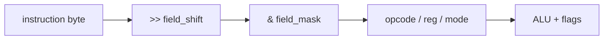

# Notes 02 — Біти, системи числення, ALU

Поруч із лабою: [lab-02-bits-dont-lie.md](lab-02-bits-dont-lie.md).

Лаба — **що здати** (ALU, прапорці, `step`, тег). Цей файл — **з чим розібратись**. Фрагмент → `scratch.cpp`, збірка як у [Notes 01](lab-01-a-box-of-bytes.notes.md). `ember`: `./build/ember`, далі команди в prompt. Перед запуском — прогноз уголос. **Етапи, терміни й питання на захист — у [лабі](lab-02-bits-dont-lie.md); тут вони не повторюються.** Цей файл — фрагменти, які ти запускаєш.

| | Зроби зараз | Зупинись, коли |
|---|---|---|
| **§1** | шістнадцятковий ↔ двійковий запис байта | читаєш дамп без калькулятора |
| **§2** | доповняльний код `-5` | `0xFF` це і 255, і −1 |
| **§3** | маска + зсув | вийняв три поля з одного байта |
| **§4** | `x & 1 == 0` без дужок | розумієш пріоритет операцій |
| **§5** | ADD по бітах | збіг з `uint8_t(a+b)` |

З цього тижня в курсу є **[ISA.uk.md](ISA.uk.md)** — одна таблиця на весь семестр: опкод,
**розмір у байтах**, які прапорці змінює, що робить. Опкоди не вигадуємо. Якщо
`step()` і таблиця розійшлись — винен `step()`. Цього тижня твої групи `0x0_` і
`0x1_`.

---

## Ідея

Байт уже є. Цього тижня ти ним **оперуєш**. Інструкція — це не текст `"ADD"`, а біти. Щоб вийняти опкод, зсуваєш і маскуєш. Щоб виставити прапорець, не зачіпаючи інші, — `|`; щоб скинути — `&` і `~`.



Шістнадцятковий запис — зручний запис бітів: одна шістнадцяткова цифра = 4 біти. Тому дамп з Lab 1 уже був шістнадцятковим.

---

## 1. Прочитати байт

`0xA3` = `1010 0011` = 163. Зроби навпаки: `0b1111` = `F`.

### Спробуй

```cpp
#include <iostream>
#include <cstdint>
int main() {
    std::uint8_t x = 0xA3;
    std::cout << std::hex << (int)x << '\n';
    for (int i = 7; i >= 0; --i)
        std::cout << ((x >> i) & 1);
    std::cout << '\n';
}
```

**Очікуй:** `a3` і `10100011`.

---

## 2. Доповняльний код

Інверсія + 1 = зміна знаку в доповняльному коді (two's complement).

### Спробуй

```cpp
#include <iostream>
#include <cstdint>
int main() {
    std::int8_t a = 5;
    std::int8_t n = (std::int8_t)(~a + 1);
    std::cout << (int)n << '\n';                 // -5

    std::uint8_t u = 5;
    std::cout << (int)(~u) << '\n';              // -6, а не 250: u стає int ще до ~
    std::cout << (int)(std::uint8_t)(~u) << '\n'; // 250
}
```

**Очікуй:** `-5`, потім `-6` (`u` підвищується до `int`, і `~` перевертає всі 32 біти), потім `250`.

Той самий байт `0xFF`: як `uint8_t` це 255, як `int8_t` — −1. Різниця лише в типі.

---

## 3. Маски: три поля з одного байта

Формат `opcode:4 | dest:2 | src:2`.

### Спробуй

```cpp
#include <iostream>
#include <cstdint>
int main() {
    std::uint8_t ins = 0b1011'10'01;
    std::uint8_t opcode = (ins >> 4) & 0x0F;
    std::uint8_t dest   = (ins >> 2) & 0x03;
    std::uint8_t src    =  ins       & 0x03;
    std::cout << (int)opcode << ' ' << (int)dest << ' ' << (int)src << '\n';
}
```

**Очікуй:** `11 2 1` (тобто `0b1011`, `0b10`, `0b01`).

Виставити біт `n`: `f |= (1u << n)`. Скинути: `f &= ~(1u << n)`. Перевірити: `(f & (1u << n)) != 0`.

---

## 4. Дужки навколо `&`

`==` тісніше за `&`.

### Спробуй

```cpp
#include <iostream>
int main() {
    int x = 2;
    std::cout << (x & 1 == 0) << '\n';
    std::cout << ((x & 1) == 0) << '\n';
}
```

**Очікуй:** `0` (бо `x & (1==0)` → `2 & 0`), потім `1` (парне). Завжди `(x & MASK) == 0`.

`<<` на знаковому `int` у знаковий біт дає від'ємне число, а на ширину типу й далі — UB. Пиши `1u << 31`.

Бітові `& | ^` ≠ логічні `&& ||`. `1 & 2` це `0`; `1 && 2` це `true`. Lab 4.

---

## 5. ADD як біти (перевірка ALU)

Біт суми — XOR, перенесення — AND, зсунуте ліворуч.

### Спробуй

```cpp
#include <iostream>
#include <cstdint>
std::uint8_t add8(std::uint8_t a, std::uint8_t b, bool& carry) {
    std::uint8_t s = 0;
    carry = false;
    for (int i = 0; i < 8; ++i) {
        bool ab = (a >> i) & 1, bb = (b >> i) & 1;
        bool t = ab ^ bb ^ carry;
        carry = (ab && bb) || (ab && carry) || (bb && carry);
        if (t) s = (std::uint8_t)(s | (1u << i));
    }
    return s;
}
int main() {
    bool c = false;
    auto r = add8(200, 100, c);
    std::cout << (int)r << ' ' << c << ' '
              << (int)(std::uint8_t)(200 + 100) << '\n';
}
```

**Очікуй:** `44 1 44`. Це M1 лаби в консолі.

---

## У проєкті `ember`

| Ідея | Де |
|---|---|
| ADD/AND/… + Z N C | `alu.cpp` |
| `step`, `regs` | `cpu.cpp` |
| таблиця опкодів | [ISA.uk.md](ISA.uk.md) — контракт до Lab 8 |
| розмір інструкції | звідти ж, не «на око» |

Невідомий опкод поки може бути NOP; з Lab 4 — помилка.

Старший півбайт опкода — **група** (`0x1_` це ALU). Тому `decode` — не таблиця
магічних чисел, а `(op >> 4) & 0x0F` і `op & 0x0F`. Це §3 у роботі.

---

## Якщо мало часу

§3, §4, §5. Потім запиши ADD і HALT через `set` і зроби `step`. Решта — розділ «Теорія» в лабі.
