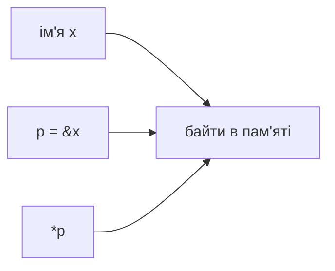

# Notes 03 — Вказівники, адреси, LOAD/STORE

Поруч із лабою: [lab-03-addresses-not-names.md](lab-03-addresses-not-names.md).

Лаба — **що здати** (`LOAD`/`STORE`, little-endian, ASan, тег). Фрагмент → `scratch.cpp`, збірка як у [Notes 01](lab-01-a-box-of-bytes.notes.md). ASan сам надрукує звіт у термінал. **Етапи, терміни й питання на захист — у [лабі](lab-03-addresses-not-names.md); тут вони не повторюються.** Цей файл — фрагменти, які ти запускаєш.

| | Зроби зараз | Зупинись, коли |
|---|---|---|
| **§1** | `&x` / `*p` | малюнок «коробка і стрілка» збігається з виводом |
| **§2** | `p + 1` для `int*` проти `char*` | арифметика в **елементах**, не в «+1 байт» завжди |
| **§3** | `sizeof(p)` проти `sizeof(*p)` | 8 проти 4 на типовій 64-бітній машині |
| **§4** | `inc(int)` проти `inc(int*)` | копія не змінює змінну того, хто викликав |
| **§5** | вихід за межі масиву + ASan | звіт є в README |

Цього тижня в ember з'являється **`H`** — 16-бітний регістр, у якому лежить
**адреса**, а не значення. `A` і `B` тримають числа, `H` тримає «де». Це вказівник
усередині заліза: `LOAD A, [H]` це `*p`, `INCH` це `++p`. Опкоди й розміри —
[ISA.uk.md](ISA.uk.md), група `0x2_`. [Карта пам'яті](ISA.uk.md#2-карта-памяті): код з `0x000`,
дані з `0x800`.

---

## Ідея

Ім'я `x` живе в компіляторі. У машині є **місце**. Вказівник — папірець із номером місця. `PC` у VM — той самий папірець, тільки номер комірки всередині ember, не `int*` твоєї C++-програми.



`LOAD` копіює з пам'яті в регістр. `STORE` — навпаки. `LOADI` читає **наступний** байт після опкоду — тому `PC += 2`.

---

## 1. Коробка і стрілка

### Спробуй

```cpp
#include <iostream>
int main() {
    int x = 65;
    int* p = &x;
    std::cout << x << ' ' << *p << '\n';
    *p = 66;
    std::cout << x << '\n';
}
```

**Очікуй:** `65 65`, потім `66`. Сам `p` не дорівнює 66; 66 лежить *там, куди p вказує*.

Намалюй до запуску. Якщо малюнок і вивід розійшлись — малюнок неправильний.

---

## 2. `+ 1` залежить від типу

### Спробуй

```cpp
#include <iostream>
int main() {
    int a[3] = {10, 20, 30};
    int* p = a;
    std::cout << *p << ' ' << *(p + 1) << ' ' << *(p + 2) << '\n';
    std::cout << (p + 1) - p << '\n';                 // 1 елемент
    std::cout << (char*)(p + 1) - (char*)p << '\n';   // sizeof(int) байт
}
```

**Очікуй:** `10 20 30`, `1`, `4` (якщо `int` 4 байти).

У ember комірка — `Byte`, тому індекс `addr+1` це наступний байт. Саме тому `INCH`
рухає `H` на **один** байт, а `p + 1` на `int*` — на чотири. Арифметика вказівників
рахує **елементи**. Не ходи `int*` по пам'яті ember «по одному» — перескочиш комірки.

`void*` — «адреса без типу». Присвоїти можна, `*` і `++` — ні: компілятор не знає розміру.

---

## 3. `sizeof` вказівника ≠ `sizeof` об'єкта

### Спробуй

```cpp
#include <iostream>
int main() {
    int x = 0;
    int* p = &x;
    std::cout << sizeof(p) << ' ' << sizeof(*p) << ' ' << sizeof(void*) << '\n';
}
```

**Очікуй:** `8 4 8` на 64-бітній машині. `sizeof(p)` — ширина **адреси**.

Читати `float` через `int*` — UB (aliasing). Чесний спосіб — `memcpy` у `uint32_t` або покласти байти в ember і зробити `dump`.

---

## 4. Передача в функцію

### Спробуй

```cpp
#include <iostream>
void inc_copy(int x) { x = x + 1; }
void inc_ptr(int* p) { *p = *p + 1; }
int main() {
    int x = 1;
    inc_copy(x);
    std::cout << x << '\n';   // 1
    inc_ptr(&x);
    std::cout << x << '\n';   // 2
}
```

**Очікуй:** `1` потім `2`. Копія живе в кадрі `inc_copy` і вмирає. Це Lab 7 у мініатюрі.

---

## 5. ASan — сусідня комірка вже чужа

### Спробуй

```cpp
#include <iostream>
int main() {
    int a[4] = {1, 2, 3, 4};
    a[4] = 5;                 // off-by-one
    std::cout << a[4] << '\n';
}
```

З `-fsanitize=address`. **Очікуй:** звіт, не «ну, 5 надрукувалось». Встав звіт у README, **прибери** цей код. У VM те саме: `get(4096)` — повідомлення, не загортання (якщо ти загортання не задумав).

Молодший байт уперед: `set16 0 0x1234` → за адресою 0 байт `34`, за 1 — `12`. Перевір дампом.

---

## У проєкті `ember`

| Ідея | Де |
|---|---|
| індекс, не вказівник хоста як PC | `uint16_t pc` |
| `Memory*` у CPU | у C++: «де лежить коробка» |
| `get16`/`set16` | little-endian |
| група `0x2_` + `OUT`/`OUTN` | `step` |
| `H`, `LOADH`, `LOAD A, [H]`, `INCH` | вказівник усередині CPU |

Код з `0x000`, дані з `0x800` — щоб було видно: адреса це число, яке програма
*обчислює*.

Сім інструкцій, які варто прогнати покроково й подивитись на `regs`:

```txt
LOADH H, 0x0800
LOAD  A, [H]
OUT
INCH
LOAD  A, [H]
OUT
HALT
```

**Очікуй:** `AB` (якщо за `0x800` лежать `65 66`), і `H` у `regs` зріс на 1.
У Lab 4 ці сім рядків стануть циклом.

---

## Якщо мало часу

§1, §2, §5. Потім `LOADI` + `OUT` літери `'A'`. `H` — з лаби M2, це головне тут.
