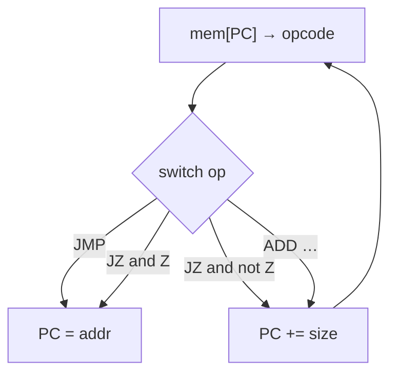

# Notes 04 — Умови, цикли, область видимості, стрибки

Поруч із лабою: [lab-04-the-shape-of-control.md](lab-04-the-shape-of-control.md).

Лаба — **що здати** (`JMP`/`JZ`, зворотний відлік, `find`, тег). Фрагмент → `scratch.cpp`, збірка як у [Notes 01](lab-01-a-box-of-bytes.notes.md). Зворотний відлік і `find` — команди в `./build/ember`. **Етапи, терміни й питання на захист — у [лабі](lab-04-the-shape-of-control.md); тут вони не повторюються.** Цей файл — фрагменти, які ти запускаєш.

| | Зроби зараз | Зупинись, коли |
|---|---|---|
| **§1** | `=` проти `==` у `if` | `-Werror` рятує, але ти знаєш *чому* |
| **§2** | коротке замикання | друга функція не викликалась |
| **§3** | `switch` без `break` | провалювання |
| **§4** | затінення `x` + `static` | внутрішнє ім'я ховає зовнішнє |
| **§5** | лінійний пошук на папері | цикл із виходом |

Опкоди стрибків — група `0x3_` у [ISA.uk.md](ISA.uk.md). Дві пастки звідти: `JMP`, що спрацював,
**не** додає ще й розмір, а `LOAD`/`LOADI` **не чіпають прапорці** — тому між
завантаженням і `JZ` має бути `CMP` або `DEC`.

---

## Ідея

C++: `if`, `while`, `for`. Процесор: **записати нову адресу в `PC`**. Усе інше — як саме ти це складаєш.



`run` — `for (;;)` з лімітом кроків, інакше зламаний `JMP` повісить процес.

---

## 1. Присвоєння в умові

### Спробуй

```cpp
#include <iostream>
int main() {
    int x = 3;
    if (x = 1) std::cout << "yes " << x << '\n';
    if (x == 0) std::cout << "zero\n";
}
```

Без `-Werror` (цей один дослід):

```bash
c++ -std=c++17 -Wall -Wextra scratch.cpp -o scratch && ./scratch
```

**Очікуй:** `yes 1` — бо `x = 1` має значення `1` (true), і `x` уже 1.

Зі звичайними прапорцями курсу (`-Werror`) той самий файл часто **не збереться** — компілятор напише в термінал `using the result of an assignment as a condition`. Пам'ятай обидва світи.

`&&` `||` `!` — логічні. `&` `|` — бітові. `1 && 2` true; `1 & 2` це 0.

---

## 2. Коротке замикання

### Спробуй

```cpp
#include <iostream>
bool a() { std::cout << 'A'; return false; }
bool b() { std::cout << 'B'; return true; }
int main() {
    if (a() && b()) {}
    std::cout << '\n';
    if (a() || b()) {}
    std::cout << '\n';
}
```

**Очікуй:** `A` (другого виклику не було), потім `AB`.

Навіщо: `if (p && *p == 3)` безпечно, якщо `p` може бути `nullptr`. Ціна: `g()` у `f() && g()` може не виконатись — побічний ефект зник.

---

## 3. `switch` — це твій `step`

### Спробуй

```cpp
#include <iostream>
int main() {
    int n = 1;
    switch (n) {
        case 1: std::cout << '1';
        case 2: std::cout << '2'; break;
        default: std::cout << 'D';
    }
}
```

**Очікуй:** `12`. Без `break` після `1` виконання **провалюється** в `2`. У `step` кожен `case` закінчуй `break;` (або `return`). `default:` — невідомий опкод, не тихий NOP.

---

## 4. Блок, затінення, `static`

### Спробуй

```cpp
#include <iostream>
int main() {
    int x = 1;
    {
        int x = 10;
        static int c = 0;
        c = c + 1;
        std::cout << x << ' ' << c << '\n';
    }
    std::cout << x << '\n';
    for (int i = 0; i < 3; ++i) {
        static int a = 0;
        int b = 0;
        a++; b++;
        std::cout << a << ' ' << b << '\n';
    }
}
```

**Очікуй:** `10 1`, потім зовнішнє `1`. У циклі `a` росте `1 2 3`, `b` щоразу `1`. `static` живе до кінця програми; **ім'я** `c` з внутрішнього блоку назовні не видно.

Не використовуй `static`, щоб «зберегти між викликами step» — тримай стан у `CPU`.

---

## 5. Лінійний пошук

На папері: масив `3 1 4 1 5`, шукаємо `4`. Ідемо зліва, порівнюємо, зупиняємось на індексі 2. Промах — повертаємо «за кінцем».

У C++ це `for` + `if` + `return`. У ember — `H` це `i`, `INCH` це `++i`, `CMP` це
`==`, `JZ` це `if`:

```txt
        LOADH H, 0x0800
        LOADI B, 0x41
loop:   LOAD  A, [H]
        CMP   A, B
        JZ    found
        INCH
        JMP   loop
found:  ...
```

Як цикл дізнається, що дійшов до `hi`, і як повідомляє про промах — вирішуєш ти.
Відповідь запиши в README: на захисті спитають саме про ці два місця.

Вкладений `for` `(i,j)` — сітка 3×3; це вже Lab 5 (екран), тут досить уявити.

---

## У проєкті `ember`

| Ідея | Де |
|---|---|
| `switch` з `default` | `step` |
| `JMP`/`JZ`/`JNZ`/`CMP` | не додавай розмір після `JMP` |
| ліміт кроків | `run` |
| `find lo hi byte` | цикл у C++ |
| зворотний відлік | [ISA.uk.md §9](ISA.uk.md#9-дві-програми-щоб-перевірити-себе) — байти вже пораховані |

Трасування зворотного відліку: кожен рядок `PC A Z`. Поруч — `while (a > 0)` на C++. Той самий малюнок.

Свої лістинги пиши з колонкою адрес, як в ISA.uk.md. У Lab 8 асемблер має видати
саме ці байти — буде з чим звіряти.

---

## Якщо мало часу

§1, §2, §3. Потім зворотний відлік у віртуальній машині. Пошук — з лаби M4.
