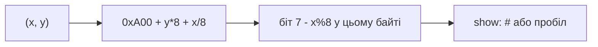

# Notes 05 — Масиви, рядки, екран, сортування

Поруч із лабою: [lab-05-many-of-one-thing.md](lab-05-many-of-one-thing.md).

Лаба — **що здати** (64×32, `PLOT`, `OUTS`, `find`, тег). Фрагмент → `scratch.cpp`, збірка як у [Notes 01](lab-01-a-box-of-bytes.notes.md). Екран — команда `show` у `./build/ember` (ASCII в терміналі). **Етапи, терміни й питання на захист — у [лабі](lab-05-many-of-one-thing.md); тут вони не повторюються.** Цей файл — фрагменти, які ви запускаєте.

| | Зроби зараз | Зупинись, коли |
|---|---|---|
| **§1** | `sizeof(масив)` vs `sizeof(вказівник)` | decay |
| **§2** | `y * W + x` | те саме, що `m[y][x]` |
| **§3** | рядок без `'\0'` | ASan або сміття |
| **§4** | один прохід бульбашки на папері | своп сусідів (сортування — Advanced) |

Екран **не** окремий масив на хості. Це 256 байтів пам’яті ember за адресою
`0xA00` ([ISA.uk.md §7](ISA.uk.md#7-екран-це-память)). Після малювання зроби
`dump` — і побачиш свої пікселі в hex.

---

## Ідея

Пам’ять ember уже масив. Цього тижня ти ним користуєшся як програміст: `i`-й елемент, сітка, текст, свопи.

Двовимірності в RAM немає. Є формула. А оскільки піксель — це **біт**, вона
двоповерхова:

```txt
адреса байта = 0xA00 + y * 8 + (x / 8)    ; 64 пікселі / 8 біт = 8 байтів на рядок
номер біта   = 7 - (x % 8)                ; біт 7 — найлівіший піксель байта
горить       = (mem[адреса] >> номер) & 1
```

`y * 8` — stride. `x / 8` — який байт у рядку. `x % 8` — який біт у байті. `7 -`
тому, що пишемо зліва направо, а біти нумеруємо справа наліво. Переплутаєш —
картинка вийде дзеркальною групами по вісім (дуже впізнаваний баг).



Виставити біт — `mem[a] |= (1u << n)`, зняти — `mem[a] &= ~(1u << n)`. Це та сама
трійка з Lab 2, тільки тепер у неї є робота.

---

## 1. Масив «стає» вказівником

### Спробуй

```cpp
#include <iostream>
int main() {
    int a[] = {1, 2, 3};
    std::cout << sizeof(a) << ' ' << sizeof(&a[0]) << '\n';
}
```

**Очікуй:** `12 8` на 64-bit (`3*4` проти ширини вказівника). Тому в функцію передають `buf` **і** `size`. `buf[i]` це `*(buf + i)` (Lab 3).

`Byte buf[8];` без `{}` — сміття. `Byte buf[8]{};` — нулі.

---

## 2. Сітка — один масив

### Спробуй

```cpp
#include <iostream>
int main() {
    int m[2][3] = {{1,2,3},{4,5,6}};
    int* base = &m[0][0];
    std::cout << m[1][2] << ' ' << *(base + 1 * 3 + 2) << '\n';
}
```

**Очікуй:** `6 6`. `1*3+2` — рядок 1, колонка 2; рядки лежать підряд (row-major).

`show()` у лабі **дано готовим** — це вкладений цикл, як дамп із Lab 1. Твоє —
`plot`: та сама формула навпаки, три рядки. Прочитай `show`, поки не зможеш
сказати, де там stride, де байт, а де біт — і пиши `plot`, не підглядаючи.

`plot(x,y)` — перевірка меж, потім одна маска: `mem.data[0xA00 + y*8 + x/8] |= (1u << (7 - x%8))`.

---

## 3. Рядки

`"AB"` це три байти: `65 66 0`.

### Спробуй

```cpp
#include <iostream>
int main() {
    char s[] = "AB";
    std::cout << (int)s[0] << ' ' << (int)s[1] << ' ' << (int)s[2] << '\n';
    s[2] = 'X';
    std::cout << s << '\n';   // немає термінатора — UB / ASan
}
```

З ASan **очікуй:** репорт на другому друці, або сміття без sanitizer. Тому `OUTS` має **стелю** (max байтів або `MEM_SIZE`), не лише `'\0'`.

`'0' + 3` це `'3'` — надрукувати одну цифру без `printf`.

---

## 4. Бульбашка — вкладений цикл і tmp

Масив `4 1 3 2`. Перший прохід сусідів: порівняли (4,1)→`1 4 3 2`, (4,3)→`1 3 4 2`, (4,2)→`1 3 2 4`. Найбільший «виплив» управо.

### Спробуй

```cpp
#include <iostream>
int main() {
    int a[] = {4, 1, 3, 2};
    int n = 4;
    for (int i = 0; i < n; ++i)
        for (int j = 0; j < n - i - 1; ++j)
            if (a[j] > a[j + 1]) {
                int t = a[j]; a[j] = a[j + 1]; a[j + 1] = t;
            }
    for (int i = 0; i < n; ++i) std::cout << a[i] << ' ';
}
```

**Очікуй:** `1 2 3 4`. У ember — те саме на `mem_get`/`mem_set` у діапазоні `[lo, hi)`.

Insertion sort: взяти наступний, зсунути більших управо. На вже відсортованому майже не свопає — корисне питання на захисті.

---

## У проєкті `ember`

| Ідея | Де |
|---|---|
| 64×32 всередині пам’яті, `0xA00` | `display.cpp` читає `mem.data` |
| `CLS`/`PLOT`/`SHOW` | опкоди `0x40`–`0x43` |
| `HELLO\0` за `0x800` | `OUTS` з cap |
| `find` по даних і по VRAM | той самий цикл, два питання |
| `sort lo hi` | **Advanced**, не обов'язково |

Рамка з C++ — перший раз бачиш екран. Три пікселі з програми всередині ember —
доказ, що опкод живий.

Головний дослід лаби — **без `PLOT` взагалі**:

```txt
CLS
LOADI A, 0x80
LOADH H, 0x0A00
STORE [H], A
SHOW
HALT
```

**Очікуй:** один піксель у лівому верхньому куті. Якщо він десь інде — не так
щось одне з трьох: карта пам’яті, порядок бітів або `show`. Потім `dump` і покажи
пальцем на байт `80`.

Бітова упаковка: 64×32×1 біт = 256 байт. Байт на піксель був би 2048 — половина
машини. Lab 2 тут не «для галочки».

---

## Якщо мало часу

§2, §3, рамка на `show`, і піксель через `STORE [H], A`. Перевірка — `checks/lab-05.txt`.
