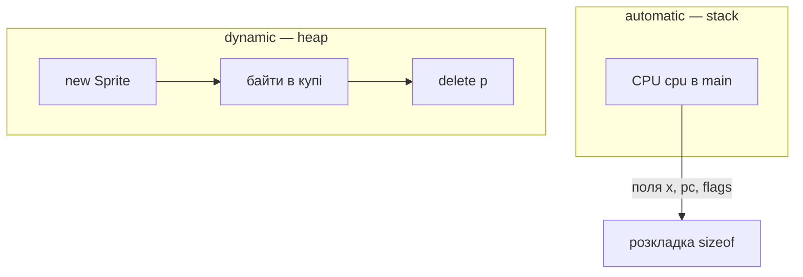

# Notes 06 — struct, enum, купа, спрайти

Поруч із лабою: [lab-06-named-bundles.md](lab-06-named-bundles.md).

Лаба — **що здати** (CPU як struct, спрайти, звіти санітайзера). Фрагмент → `scratch.cpp`, збірка як у [Notes 01](lab-01-a-box-of-bytes.notes.md). Звіт ASan/LSan — це stdout/stderr термінала. **Етапи, терміни й питання на захист — у [лабі](lab-06-named-bundles.md); тут вони не повторюються.** Цей файл — фрагменти, які ти запускаєш.

| | Зроби зараз | Зупинись, коли |
|---|---|---|
| **§1** | `sizeof` struct з `char`+`int` | вирівнювальні байти: не 5 |
| **§2** | `enum class` = `1` | не компілюється без приведення типу |
| **§3** | читання після звільнення | ASan |
| **§4** | `new` без `delete` | LeakSanitizer |
| **§5** | два спрайти в масиві | рухаються, `plot` |

Значення `enum class Op` беруться з [ISA.uk.md](ISA.uk.md), не вигадуються. Купа
всередині ember (`0xC00`–`0xEFF`, опкод `ALLOC`) цього разу **Advanced** — на
обов'язковому рівні досить позначити регіон на карті пам'яті в README.

Перевірка лаби — що **всі попередні** перевірки з [CHECKS.md](CHECKS.md) досі
проходять. Рефакторинг, який щось зламав, — це і є та помилка, яку `enum class`
мав спіймати.

---

## Ідея

Набір полів поруч — `struct`. Набір імен для малих цілих — `enum class`. Час життя: стек (автоматичний) проти купи (`new`/`delete` або регіон усередині 4 КБ).



Спрайт — це `Sprite { x, y, vx, vy, alive }`. Кілька спрайтів — масив таких записів.

---

## 1. Розкладка

### Спробуй

```cpp
#include <iostream>
struct P { char c; int n; };
int main() {
    std::cout << sizeof(P) << ' ' << sizeof(char) + sizeof(int) << '\n';
}
```

**Очікуй:** часто `8 5`. Компілятор вставляє байти, щоб `n` стояв на межі 4. Надрукуй `&p.c` і `&p.n` (різниця) — це і є лекція.

`Sprite s{10, 5, 1, 0, true};` — агрегатна ініціалізація; хвіст без значень стає нулем.

---

## 2. `enum class`

### Спробуй

```cpp
#include <iostream>
enum class Op : unsigned char { Halt = 0, Add = 0x10 };
int main() {
    Op o = Op::Add;
    // o = 1;            // розкоментуй: c++ … має впасти на компіляції
    o = (Op)0x10;
    std::cout << (int)o << '\n';
}
```

**Очікуй:** `16`. З розкоментованим `o = 1` — помилка компілятора в терміналі, а не під час виконання. Опкоди з Lab 2 переїжджають сюди; `switch` на `Op`.

---

## 3. Читання після звільнення (use-after-free)

### Спробуй

```cpp
#include <iostream>
int main() {
    int* p = new int{42};
    std::cout << *p << '\n';
    delete p;
    std::cout << *p << '\n';   // dangling
}
```

З ASan **очікуй:** звіт на другому читанні. Після `delete` — `p = nullptr`.

Подвійний `delete p; delete p;` — інший звіт. І не роби так.

---

## 4. Витік

```cpp
int main() {
    new int{1};   // забули вказівник
}
```

```bash
c++ -std=c++17 -fsanitize=address scratch.cpp -o scratch
ASAN_OPTIONS=detect_leaks=1 ./scratch
```

**На Linux і в WSL очікуй:** звіт про витік — об'єкт є, імені немає.

**На macOS з чипом Apple очікуй:**

```txt
==58976==AddressSanitizer: detect_leaks is not supported on this platform.
```

Це не твоя помилка й не помилка налаштування: LeakSanitizer там просто немає.
Два способи здати M3 — обидва зараховуються:

- прогнати цей один файл у Linux / WSL / Docker і вставити справжній звіт;
- вставити рядок `detect_leaks is not supported` як доказ спроби і пояснити витік
  двома реченнями: об'єкт живий, останній вказівник на нього зник, звільнити вже
  нікому.

Що обрав — напиши в README. Докладніше — [errors.notes.md §3](errors.notes.md).

---

## 5. Масив записів

```cpp
#include <iostream>
struct Sprite { int x, y, vx, vy; bool alive; };
int main() {
    Sprite s[2] = {{0,0,1,0,true},{10,5,-1,0,true}};
    for (int i = 0; i < 2; ++i) {
        if (!s[i].alive) continue;
        s[i].x += s[i].vx;
        std::cout << i << ' ' << s[i].x << '\n';
    }
}
```

**Очікуй:** `0 1` і `1 9`. У ember після руху — `plot` і `show` у тому ж терміналі. Відскок від краю: якщо `x==0` або `x==63`, `vx = -vx`.

---

## Купа всередині ember — Advanced

Регіон `0xC00`–`0xEFF`, вказівник `heap_ptr`. `ALLOC` (`0x60`): виділити `A` байтів —
адреса блока лягає в `H`, `heap_ptr` посувається. Не влізло — виставити `C`, `H` не
чіпати. `free` немає: bump-алокатор так і живе. Два `ALLOC` підряд — два шматки в дампі без
дірок між ними; поясни в README, чому дірок не буває і що мало б змінитись заради `FREE`.

На обов'язковому рівні `new`/`delete` у C++ робить свою справу: показує, як
виглядають завислий вказівник і подвійне звільнення. Купа гостя — коли лишився час.

`CPU&` у `step` — не копіювати всю машину (Lab 7 уже тут: посилання).

---

## У проєкті `ember`

| Ідея | Де |
|---|---|
| `struct CPU`, `Flags`, `enum class Op` | рефакторинг без нової поведінки |
| `sprites[8]`, `tick` | відскок |
| `alloc` | bump-алокатор — Advanced |
| звіти санітайзера | README, зламані команди прибрати перед тегом |
| витік на Apple Silicon | не ловиться — див. §4 |

---

## Якщо мало часу

§1, §3, два спрайти на екрані. Купа всередині ember — розділ «Якщо встигаєте» в лабі.
