# Python Course — Build a Search Engine, Learn the Language Properly

> "Python is the second-best language for everything."
> — a compliment, once you understand why

This is a 16-week, 8-lab course for 3rd–4th-year students who **already program**. You will not study Python syntax — you know how a `for` loop works. Instead, you'll build **one real project across all eight labs**: a full-text search engine over a corpus *you* choose, that grows from a 40-line script into a deployed web service with an async crawler, a tested and packaged CLI, and (optionally) semantic search.

Every lab has two halves that reinforce each other:

1. **One language feature, explored properly.** Not "here's the syntax" — the mental model, what's happening under the hood, the classic pitfalls, and the interview questions it generates.
2. **One increment of the project** that *needs* that feature. You meet generators when the corpus is too big for memory. You meet the GIL when indexing is too slow. You meet `asyncio` when the crawler is waiting on the network.

By Lab 8 you'll have a portfolio project a recruiter can use in the browser, and you'll be able to explain the GIL, the data model, iterators, `asyncio`, and packaging at a whiteboard — which is exactly what a Python interview at a serious company looks like.

This project also counts as [Lab 15 — Mini Search Engine](../../labs/lab-15-mini-search-engine.md) of the [main 42-lab program](../../README.md) (and Lab 8 optionally reaches into [Lab 31 — LLM + RAG](../../labs/lab-31-llm-rag-app.md)). Everything in the [root README](../../README.md) about portfolio, AI assistants, and the spirit of the program applies here.

---

## The project: your own search engine

You pick a **corpus** — a body of text you actually care about. Your lecture notes. A Wikipedia dump (English, Simple English, or Ukrainian). Every Project Gutenberg novel. The Python documentation. arXiv abstracts. A subreddit. Your university's website, crawled by you.

Over 16 weeks you build a system that indexes it, ranks results, exposes them through a CLI and a web API, crawls new content asynchronously, and does it fast. The working name in these labs is **`findex`**; name yours whatever you like.

```mermaid
flowchart LR
    L1[Lab 1<br/>Iterators & generators<br/><i>stream the corpus</i>] --> L2[Lab 2<br/>Data structures & hashing<br/><i>inverted index</i>]
    L2 --> L3[Lab 3<br/>The object model<br/><i>ranking + query language</i>]
    L3 --> L4[Lab 4<br/>Typing, testing, packaging<br/><i>installable CLI</i>]
    L4 --> L5[Lab 5<br/>Concurrency & the GIL<br/><i>parallel indexing</i>]
    L5 --> L6[Lab 6<br/>asyncio<br/><i>async crawler</i>]
    L6 --> L7[Lab 7<br/>FastAPI<br/><i>web search, deployed</i>]
    L7 --> L8[Lab 8<br/>Performance & numpy<br/><i>profiling + semantic search</i>]
```

---

## The eight labs

| # | Lab | Language focus | What you add to the project |
|---|---|---|---|
| 1 | [Streams, Not Lists](lab-01-iterators-and-the-corpus.md) | Iteration protocol, generators, lazy pipelines, `pathlib`, `re`, Unicode | Choose a corpus; stream it into tokens and term statistics in constant memory |
| 2 | [The Inverted Index](lab-02-data-structures-and-the-inverted-index.md) | `dict`/`set` internals, hashing, `collections`, `dataclasses`, `__slots__`, serialization | Build, persist, and measure the inverted index |
| 3 | [Ranking and the Object Model](lab-03-the-object-model-and-ranking.md) | Dunder methods, properties, protocols, decorators, `functools`, context managers | TF-IDF/BM25 ranking, a query language (AND/OR/phrase), `@timed`/`@cached` |
| 4 | [Make It a Real Tool](lab-04-typing-testing-packaging-cli.md) | Type hints + pyright/mypy, `pytest` + Hypothesis, `pyproject.toml`, `uv`, `typer`, `logging` | An installable, tested `findex` CLI |
| 5 | [Concurrency and the GIL](lab-05-concurrency-and-the-gil.md) | `threading` vs `multiprocessing`, `concurrent.futures`, the GIL, free-threaded Python | Parallel indexing, with benchmarks you can explain |
| 6 | [The Async Crawler](lab-06-asyncio-crawler.md) | `asyncio`, coroutines, `httpx`, semaphores, rate limiting, retries, structured concurrency | A polite async crawler that feeds the corpus |
| 7 | [Search on the Web](lab-07-fastapi-web-search.md) | ASGI, FastAPI, Pydantic, dependency injection, background tasks, Docker | A search API + web UI with snippets, live at a public URL |
| 8 | [Fast, Then Smart](lab-08-performance-and-semantic-search.md) | Profiling (`cProfile`, `py-spy`, Scalene), numpy vectorization, memory; embeddings | Profile and speed up the hot path; optional hybrid keyword + vector search; final polish |

Each lab is **two weeks**. The schedule below assumes a 16-week semester with the final week doubling as the showcase.

| Weeks | Lab | Weeks | Lab |
|---|---|---|---|
| 1–2 | Lab 1 | 9–10 | Lab 5 |
| 3–4 | Lab 2 | 11–12 | Lab 6 |
| 5–6 | Lab 3 | 13–14 | Lab 7 |
| 7–8 | Lab 4 | 15–16 | Lab 8 + showcase |

---

## What each lab looks like

Every lab file has the same shape, so you always know where you are:

1. **This lab's feature** — what you'll master and why it matters beyond this project.
2. **Theory** — a compact, self-contained explanation: the mental model, what's under the hood, the pitfalls, and a few *prove-it-to-yourself* experiments to run in the REPL. This is the reading; it replaces a lecture.
3. **Project step** — what to add to `findex`, with milestones and a definition of done.
4. **Resources** — hand-picked English talks, articles, and book chapters, each with one line on *why this one*.
5. **Deliverable checklist** — what "done" means for this lab.
6. **Reflection** — "explain it at the whiteboard" questions. These *are* the interview questions.
7. **Stretch** — one optional deeper cut for when you're ahead.

---

## Rules of the course

- **Solo.** This course is individual work. You'll have the whole system in your head by the end, which is the point.
- **One repository, from day one.** Public GitHub repo. Commit as you go. At the end of each lab, **tag it** (`lab-01`, `lab-02`, …) so the history shows the project growing.
- **README is part of every deliverable.** Each lab adds a section to your project README: what you built, the measurement or evidence the lab asked for, and what you learned. By Lab 8 that README is your portfolio write-up.
- **Every lab ends in a 5-minute defense.** You demo the increment and answer 2–3 of the Reflection questions. You should be able to explain every line you committed.
- **AI assistants** — follow the [program-wide policy in the root README](../../README.md). Short version: use them to learn faster, not to skip understanding. If you can't explain it at the defense, it doesn't count.
- **The corpus is yours.** Pick something you'll enjoy searching. Start small enough to iterate in seconds; scale up when the code is right.

---

## Tooling standard

Modern Python, the way it's done in 2026. Alternatives are allowed if you can justify them; the defaults are chosen so you fight your tools as little as possible.

- **Python 3.12+** (3.13 recommended — Lab 5 uses its free-threaded build as an experiment).
- **[`uv`](https://docs.astral.sh/uv/)** for project, environment, and dependency management (`uv init`, `uv add`, `uv run`). It replaces `pip` + `venv` + `pip-tools` and is *fast*.
- **[`ruff`](https://docs.astral.sh/ruff/)** for linting and formatting. One tool, one config, no arguments.
- **`pytest`** for tests (formally from Lab 4; you're encouraged to start earlier).
- **`pyright`** or **`mypy`** for type checking (Lab 4 onwards).
- A `src/` layout: `src/findex/…` — the layout that installs cleanly and avoids the classic import traps.

---

## The resource shelf

Books and channels that recur across the labs. You don't need to buy anything; the free material is excellent.

- **[Fluent Python, 2nd ed.](https://www.fluentpython.com/)** by Luciano Ramalho — *the* book on how Python actually works. The course roughly follows its spine.
- **[Python Distilled](https://www.dabeaz.com/python-distilled/)** by David Beazley — short, dense, and exactly the level of this course.
- **The official [Python HOWTOs](https://docs.python.org/3/howto/index.html)** — Functional Programming, Unicode, Logging, Descriptors, Sorting. Underrated and authoritative.
- **Raymond Hettinger's talks** (core developer) — search YouTube for "Hettinger" + any topic; his PyCon talks on dictionaries, concurrency, and class design are canonical.
- **David Beazley's talks and tutorials** — [dabeaz.com/tutorials](http://dabeaz.com/tutorials.html). Generators, the GIL, concurrency from the ground up.
- **[Real Python](https://realpython.com/)** — the best tutorial site for depth-with-clarity on a single topic.
- **[Python Developer's Guide — "Python's internals"](https://devguide.python.org/internals/)** and [CPython Internals](https://realpython.com/products/cpython-internals-book/) by Anthony Shaw — for when you want to go under the hood.
- **[Trey Hunner's blog](https://treyhunner.com/)** — precise, short essays on the iteration protocol, comprehensions, and the data model.

---

## What you'll be able to say at the end

Not "I know Python." Instead:

- *"I built a search engine that indexes 500 MB of text in constant memory using generator pipelines."*
- *"I measured threads vs. processes for indexing, hit the GIL, and can explain exactly why one was 4× faster."*
- *"I wrote an async crawler with a semaphore-bounded connection pool and exponential backoff."*
- *"It's a typed, tested, packaged CLI and a deployed FastAPI service — here's the URL."*
- *"I profiled the hot path with py-spy and made it 12× faster with numpy."*

Each of those sentences is a job interview going well. Let's start with [Lab 1](lab-01-iterators-and-the-corpus.md).
