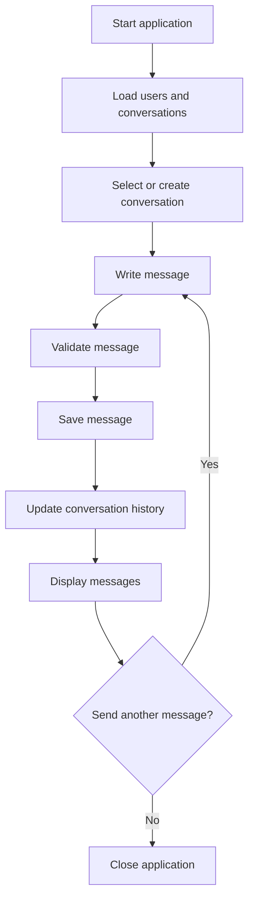

# Lab 01: Mini Messenger

## Goal

Create a simple messenger application where users can send and view messages.

The goal is not to build a production chat system, but to understand how messages, users, conversations, storage, and application layers can be organized.

You will practice:

- CRUD operations;
- data models;
- simple API or UI design;
- local or database storage;
- basic software architecture;
- validation and error handling.

---

## Idea

A messenger is built around a few core concepts:

- user;
- conversation;
- message;
- message history;
- message status.

A minimal version can work locally on one computer. A more advanced version may use a client-server architecture.

---

## Messenger Workflow



---

## Task

Implement a simple messenger application.

Your application must allow the user to:

- create or select a user;
- create or select a conversation;
- send messages;
- view message history;
- store messages between application runs.

You may implement it as:

- console application;
- web application;
- desktop application;
- simple backend API with frontend.

---

## Functional Requirements

### 1. Users

The application must support users.

Requirements:

- each user has an id or unique name;
- messages must be linked to the sender;
- the current user must be clearly visible.

### 2. Conversations

The application must support conversations.

Requirements:

- create a conversation;
- list existing conversations;
- open one conversation;
- show all messages in selected conversation.

### 3. Messages

Each message must have:

- text;
- sender;
- creation date/time;
- conversation id.

Requirements:

- empty messages are not allowed;
- messages must be shown in correct order;
- messages must be stored after restart.

### 4. Storage

Use one of the following:

- JSON file;
- SQLite database;
- PostgreSQL/MySQL;
- browser local storage;
- in-memory storage for Basic level only.

---

## Suggested Project Structure

```txt
mini-messenger/
  README.md
  src/
    main.*
    models/
      User.*
      Conversation.*
      Message.*
    services/
      MessageService.*
      ConversationService.*
    storage/
      MessageRepository.*
    ui/
```

---

## Difficulty Levels

### Basic

Implement:

- two hardcoded users;
- one or more conversations;
- send and display messages;
- store messages in memory or file;
- simple console or UI interface.

### Standard

Implement everything from Basic plus:

- create users;
- create conversations;
- persistent storage in JSON or SQLite;
- message validation;
- clean project structure;
- message search by text.

### Advanced

Implement some of the following:

- client-server architecture;
- real-time updates;
- message statuses;
- editing and deleting messages;
- authentication;
- group chats;
- attachments metadata.

---

## Implementation Plan

1. Create message, user, and conversation models.
2. Implement message storage.
3. Implement creating and listing conversations.
4. Implement sending messages.
5. Implement displaying message history.
6. Add validation.
7. Add persistence.
8. Refactor into modules.
9. Write README and prepare demo.

---

## Testing

Test at least the following:

- users can be created or selected
- messages are saved correctly
- empty messages are rejected
- message history is displayed in correct order
- application does not lose data after restart

Automated tests are recommended but not strictly required. If you do not write automated tests, describe manual test cases in `README.md`.

---

## Demo

During the demo, show:

- send a message
- open conversation history
- restart the app and show saved messages
- show project structure
- explain how messages are stored

---

## README Requirements

Your repository must include `README.md` with:

1. Project name.
2. Short description.
3. Selected difficulty level.
4. Technologies used.
5. How to run the project.
6. Main features.
7. Short explanation of the main algorithm or architecture.
8. Screenshots or demo link, if possible.
9. Known problems or limitations.

---

## Defense Questions

Be ready to answer:

1. What are the main entities in your messenger?
2. How do you store messages?
3. How do you validate messages?
4. How are conversations connected to messages?
5. What would change in a real-time messenger?
6. Which part of your code handles storage?
7. What limitations does your implementation have?

---

## Evaluation Criteria

| Criterion | Points |
|---|---:|
| Data models | 15 |
| Sending and displaying messages | 20 |
| Storage | 15 |
| Validation and errors | 10 |
| Code structure | 15 |
| README | 10 |
| Demo and defense | 15 |
| **Total** | **100** |

---

## Expected Result

At the end of this lab, you should have a working project called **Mini Messenger**.

The project should demonstrate both programming skills and the ability to structure, explain, and present a small but non-trivial software system.
