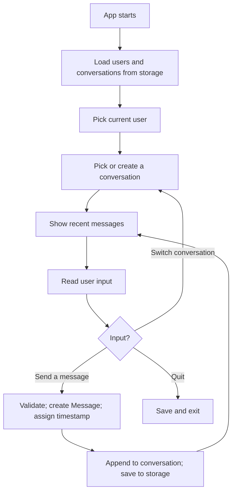

# Lab 01 — The App Everyone Has, Built From Nothing: A Mini Messenger

> "We built WhatsApp at the end of 2008 with the goal of being the most reliable messaging app on the planet."
> — Jan Koum, WhatsApp co-founder

**Time budget:** ~2 weeks, working at your own pace.
**Preferred language:** C# or TypeScript (any language is allowed; this is a backend-friendly lab and these two have the gentlest path for first-years).
**Working style:** solo, or in a team of up to 3 people. Both are equally welcome.

---

## The hook

In 2009, two former Yahoo engineers in California sat down to fix a problem: international SMS was expensive, and you couldn't tell whether your message had been delivered. They built a small app. They called it WhatsApp. Five years later, Facebook bought it for $19 billion. The whole product, at acquisition time, was running on **35 engineers** for **450 million users**.

You're not going to ship WhatsApp in two weeks. But you *will* ship the same skeleton WhatsApp started with: users, conversations, messages, persistent storage, and the boring-looking but absolutely critical work of "this message I sent yesterday must still be there when I open the app tomorrow." Those four things are the bones of every chat app ever made — Telegram, Discord, Slack, iMessage, Signal — and they're the same four things that show up under almost every web app you'll ever build for a job.

This is the lab where you stop being a programmer who solves textbook exercises and start being a programmer who builds *systems*. Data models that survive. Validation that protects you from your own bugs. A storage layer that doesn't lose user data. These habits are worth more than any single algorithm you'll ever learn.

If you want a perfect appetizer, read the first chapter of [*Designing Data-Intensive Applications*](https://www.oreilly.com/library/view/designing-data-intensive-applications/9781491903063/) by Martin Kleppmann — Chapter 1 is widely available as a free preview. It's the most-recommended systems book of the last decade for a reason. Pair it with the [WhatsApp founding story](https://en.wikipedia.org/wiki/WhatsApp#History) on Wikipedia — a 5-minute read that quietly motivates the whole lab.

---

## Why this is worth your time

- **Every job interview for a junior backend / full-stack role asks about CRUD, validation, and storage.** This lab is built around exactly those skills.
- The shape of this project — *users, items belonging to users, items linked to other items, history* — is the shape of **almost every real product you'll ever work on**: Twitter, Slack, e-commerce orders, hotel bookings, support tickets, CI build logs.
- Persistent storage is the thing that **separates a script from a product**. You'll cross that line in this lab.
- A small chat app on your portfolio that *actually works*, that you can demo on your laptop and explain end-to-end, is more memorable in an interview than five "made it through the tutorial" projects.

---

## The target

> **Reference build:** [Build and Deploy a Full Stack Realtime Chat Messaging App — JavaScript Mastery](https://www.youtube.com/watch?v=MJzbJQLGehs) — shows the polish bar a personal-chat product can hit end-to-end.

**Basic — "It Stores Messages"**
A console (or simple GUI) application. The user picks an identity (e.g., "alice" or "bob"), opens an existing conversation or creates a new one, types a message, and presses Enter. The message gets a timestamp and is saved to disk. Close the app, reopen it — the message is still there. Two hardcoded users can talk to each other by switching identities.

**Standard — "It's a Real Tool"**
Multiple users can be created and listed. Multiple conversations exist (one-on-one or group). Messages are validated (no empty, no insanely long). Storage is in JSON or SQLite — the user's data survives even if the program crashes mid-message. You can search messages by text. The CLI/UI is clean enough that you'd happily use it.

**Advanced — "Two Computers, One Chat"**
You've added something real: a **client-server architecture** where two clients connect to a small server and see each other's messages live, **authentication** with passwords (hashed, not in plaintext), **message statuses** (sent / delivered / read), **editing and deleting messages** with a history, **group chats**, or a **simple web UI** with a real chat layout.

---

## The big idea, in one diagram



The app is a tiny loop with three pieces of state behind it: **users**, **conversations**, and **messages**. The flow is short. The hard part is making the saved data *correct* — that no message is lost, that conversations don't get corrupted, that yesterday's chats are still readable tomorrow.

---

## Two-week plan with milestones

**Week 1 — The data model and a working basic app**

- **Day 1 — Sketch the model on paper.** Draw three boxes: `User`, `Conversation`, `Message`. Connect them with arrows. Decide what fields each one needs. Spend 15 minutes here. It saves hours.
- **Day 2 — Models and storage in memory.** Create `User`, `Conversation`, `Message` types. Write a `Repository` that holds them in lists. Add `addUser`, `getUserById`, `addMessage`, `getMessagesForConversation`. *Milestone: you can create a user and a message in a unit-test-style script.*
- **Day 3 — A simple console UI.** Pick the current user from a list. Type a message. Press Enter. The message appears in the conversation history along with its sender and time.
- **Day 4 — Persistence.** Save the repository to a JSON file on every change; load it on startup. *Milestone: close the app, reopen it, see your messages.* This is the moment your project graduates from "script" to "tool".
- **Day 5 — Validation.** Reject empty messages. Reject messages over 4000 characters. Reject conversations with no participants. Print clear error messages. (This unglamorous-feeling work is half of what real backend code is.)
- **Day 6 — Conversations and switching.** List existing conversations, switch between them. Create a new conversation between two users.
- **Day 7 — Polish + a small README.** Take a terminal screenshot or recording. *Milestone: you have a working messenger.*

**At this point you've completed the Basic level. You can stop here and submit a real, defendable project.**

**Week 2 — Make it feel real**

- **Day 8 — Multiple users, properly.** No more hardcoded "alice" and "bob" — let the user create new accounts at runtime. Keep them in storage.
- **Day 9 — Search.** Add a "search messages" command. Walk through messages, filter by substring (case-insensitive). Show file/conversation/time/snippet. *Milestone: you can find a message you sent two weeks ago.*
- **Day 10 — Better storage.** Move from "save the whole repository every time" to either (a) append-only logs per conversation (much faster on big histories), or (b) SQLite with proper tables. SQLite is recommended; it's a single library and a single file, deployed by every major operating system.
- **Day 11–12 — Pick a side quest.**
- **Day 13 — README, screenshots, demo prep.**
- **Day 14 — Buffer day.**

---

## Levels

### Basic — "It Stores Messages" (~10–14 hours)
- a `User` / `Conversation` / `Message` data model
- console (or simple UI) application
- two or more hardcoded users
- send a message, view conversation history
- persistent storage in JSON or SQLite
- empty messages rejected
- conversation history correctly ordered

### Standard — "It's a Real Tool" (~16–22 hours)
- everything from Basic
- create users at runtime
- multiple conversations, switch between them
- group conversations (≥ 3 participants)
- validation: length limits, character limits, empty-message rejection
- search messages by text
- error handling on storage failures
- clean separation between models, services, storage, and UI

### Advanced — "Side Quests" (each ~6–14h, pick what excites you)

- **Client-Server.** Split your project into a small server (using sockets or HTTP) and a client. Two clients connected to the same server should see each other's messages live, even on different machines. The single biggest "this is real software" upgrade you can make.
- **Authentication.** Add passwords. Store hashed passwords (SHA-256 with salt is fine; never plaintext). Add login. Add basic session tokens.
- **Message Statuses.** Sent / delivered / read. Show them next to each message.
- **Edit & Delete.** With a small history (so the user can see "edited 5 minutes ago"). This is harder than it looks — the data model gets richer.
- **Web UI.** A simple `<form>` + a chat panel served from your server. Polls the server every 2 seconds for new messages, or upgrade to WebSockets for live updates.
- **Attachments Metadata.** Allow attaching a "filename + size + type" to a message (no need to actually upload files yet — the metadata is the practice). Render them as a separate UI element.
- **Read Receipts and Typing Indicators.** A small but expressive feature that requires real-time messaging.
- **End-to-end Encryption (for the brave).** Use a library to encrypt messages with a per-conversation key. Read about Signal Protocol (don't reimplement — use a library).
- **Bot User.** A user that is actually a small program that responds to commands like `/weather kyiv` or `/joke`. Surprisingly fun.

---

## Extension challenges (3–5 weeks)

The 2-week scope above ships a real, defendable messenger. If you fall in love with it, here's how to grow it into a portfolio centerpiece:

- **Combine with [Lab 21](lab-21-rest-api-auth.md).** Move storage to a deployed REST API with proper auth. Now your messenger can run from any device. Two labs, one product.
- **Combine with [Lab 23](lab-23-realtime-multiplayer.md).** Replace polling with real WebSockets. Live message delivery, typing indicators, presence — the same architecture as Discord and Slack.
- **Combine with [Lab 22](lab-22-spa-frontend.md).** A polished SPA chat frontend. Looks like a real product.
- **Combine with [Lab 30](lab-30-cross-platform-app.md).** A cross-platform mobile companion. Same backend, three clients (CLI / web / mobile).
- **Combine with [Lab 31](lab-31-llm-rag-app.md).** Add an AI assistant user that joins any chat — RAG over your team's chat history.
- **Open source it.** Add CI, docs, a contributing guide. Get one external pull request.

---

## Make it yours (required)

Pick **one** personal twist. The mechanics are CRUD; the *story* is what makes the project memorable.

- **Build it for a specific community.** Your team's project chat. Your dorm. A "secret radio" between resistance fighters in a fictional setting. A code-review tool for your study group. The features stay the same; the polish, defaults, and language change.
- **A specific theme.** A 1990s IRC look — green-on-black, monospace, no images. A clean modern minimalism — black-on-white, generous spacing. A pen-and-paper metaphor with handwritten fonts and paper textures.
- **A specific constraint.** Messages are limited to 50 characters (Twitter-style discipline). Or messages auto-delete after 24 hours (Snapchat-style). Or messages can only be sent at certain hours (a "deep work" messenger).
- **Real domain.** A messenger for a specific small business: a barbershop confirming appointments, a tutoring service scheduling lessons, a flight school logging student-instructor messages. (Aviation tie-in: in real avionics, a similar message log called *ACARS* — Aircraft Communications Addressing and Reporting System — is how planes and ground stations exchange short structured messages. Your messenger is the ground-bound version.)

You'll defend why you chose your twist.

---

## Working solo or in a team

You can do this lab alone or in a team of **up to 3 people**.

If you go solo: you'll own the data model, storage, validation, and UI. This is the closest thing in this course to "building a real backend by yourself" — invaluable.

If you go as a team, sensible splits:

- *By layer:* one person owns models + storage + validation; the other owns UI, commands, search, and the demo polish. Talk in terms of clear interfaces (e.g., `IMessageRepository`).
- *By feature:* one person drives single-user → persistence → search; the other drives multi-user, group chats, and a side quest.
- *By client/server (if you do that side quest):* one person owns the server, the other owns the client.

For a 3-person team: add a "side quest + UX + README/demo" owner — authentication, message statuses, the chat UI.

Two rules for teams:

1. **Use git from day one** with a real branching workflow.
2. **In your README, list who did what.** Each member must be able to walk through the data model and the storage strategy on demand.

---

## Tooling and language tips

**C#**
- Console app or ASP.NET Core Minimal APIs both work.
- For storage: `System.Text.Json` (file storage) or `Microsoft.Data.Sqlite` (SQLite). Both are first-party and well-documented.
- If you do the server/client side quest: ASP.NET Core gives you HTTP + WebSocket support out of the box.

**TypeScript**
- Node.js + plain `fs.readFileSync`/`writeFileSync` is fine for JSON storage.
- For SQLite: [`better-sqlite3`](https://github.com/WiseLibs/better-sqlite3) is excellent.
- For the web UI side quest: any backend framework (Express, Fastify) plus plain HTML or React/Svelte.

**Anyone**
- **Atomic file writes.** When saving JSON: write to `messages.json.tmp`, then *rename* to `messages.json`. If your program crashes mid-write, you don't lose all data. (This is a real-world habit, not a textbook one.)
- **Don't trust the user's input.** Any input from the user is a potential attack on your storage. Validate before saving.
- **Timestamps in UTC.** Store every timestamp in UTC and convert to local time only when displaying. This will save your future self a real headache.

---

## Suggested project structure

```txt
mini-messenger/
  README.md
  src/
    main.*
    models/
      User.*
      Conversation.*
      Message.*
    services/
      MessageService.*
      ConversationService.*
      UserService.*
    storage/
      Repository.*           # interface
      JsonRepository.*
      SqliteRepository.*     # if you upgrade
    ui/
      ConsoleUi.*
      WebUi.*                # if you do the side quest
  data/
    messages.json
  docs/
    screenshots/
```

---

## When you get stuck

- **My messages disappear after restart.** You're probably saving to a temp file but never replacing the real one, or you forgot to call `save()` after `addMessage`.
- **My JSON file gets corrupted on crash.** You're not doing atomic writes (write-tmp-then-rename). Search "atomic file writes" — it's a 5-line fix.
- **My program is slow with 10000 messages.** Don't reload the entire repository on every operation. Load once at startup, save on every change, keep the in-memory copy.
- **Two users can't see each other's messages.** Make sure both users read from the *same* storage file/database. (Yes, this is obvious. Yes, students still hit this on day 1.)
- **Messages appear in the wrong order.** Sort by timestamp at display time — don't rely on insertion order if the file has been edited by hand.

If you're stuck for 30+ minutes: print the in-memory repository state, print the on-disk JSON, compare. The bug is almost always a mismatch between the two.

---

## Deployment checklist

- [ ] App runs end-to-end on a clean machine: clone → install → first user → first message.
- [ ] No crash on missing data file (it's created cleanly on first run).
- [ ] No data loss after a forced kill mid-write (atomic writes work).
- [ ] Empty / over-long messages rejected with a clear error.
- [ ] Timestamps stored in UTC, displayed in local time.
- [ ] No private paths in source.
- [ ] If you built the client-server side quest: **a deployed server URL** (Render / Fly.io / Railway) — friends can connect from another machine.
- [ ] If you built the web UI side quest: a **live demo URL** (Vercel / Render).
- [ ] **A 15-second screen recording** of a real conversation in the README.
- [ ] At least one screenshot / recording with *real* messages (your own, not "test 1 / test 2 / test 3").

---

## What recruiters look at

- **They open it.** First 15 seconds: does it look like real software, or a class assignment?
- **They look at your real messages** in the demo. "Hey, ready for class?" / "On my way" reads as a real product. "msg1 / msg2 / msg3" reads as something that was never used.
- **They look at the data model.** Clean separation between `Message`, `Conversation`, `User`, and the repository = strong engineering signal.
- **They look at storage atomicity.** Atomic writes + safe error handling = "this person has thought about real data."
- **They look at validation.** Empty-message rejection, length caps, sane character handling — small, deliberate decisions read as care.
- **They look at the README's "how data is stored" paragraph.** This is the most-cited interview question for backend juniors. A clear answer here is gold.
- **They check that it survives.** Send a message, kill the app, reopen, message is there. This is the *whole* point of CRUD; demonstrating it confidently matters.

---

## What to put in your README

1. Project name + one-sentence description.
2. **A screenshot or terminal recording** of a real conversation.
3. Which level + side quests.
4. Your personal twist and why.
5. How to run it + how to create a user / send a first message.
6. A short paragraph on **how data is stored**, in your own words. (This is the most important paragraph — it's the question every interviewer asks.)
7. A short paragraph on what validation rules you applied and why.
8. (Optional) Architecture diagram — even a hand-drawn box-and-arrow photo.
9. If you worked in a team — who did what.

---

## Reflection

Be ready to:

1. **Send a message, close the app, reopen it.** Show that the message survived. Explain how.
2. **Try to send an empty message.** Show what happens.
3. **Walk through your data model.** Show me the `User`, `Conversation`, `Message` classes/types and explain how they relate.
4. **Where in the code does storage actually happen?** Find that file/method live.
5. **What goes wrong** if two users send messages at the exact same millisecond? If the JSON file is hand-edited and becomes invalid? If the storage file disappears? Walk through each.
6. **What changes** if we want this messenger to support 1 million users?
7. **What was the hardest bug**, and how did you find it?

---

## Showcase

At the end of the semester there will be a small gallery — anonymous voting for **most polished UX**, **best architecture / data model**, and **most creative theme or community**. Bring a 30-second screen recording of a real chat happening.

---

## Going further

- *Designing Data-Intensive Applications* by Martin Kleppmann — the modern systems-design textbook. Read Chapter 1 before, Chapter 2 (data models) and Chapter 3 (storage and retrieval) after.
- *Database Internals* by Alex Petrov — when you're curious about how SQLite actually stores your messages.
- The [WhatsApp Architecture talk by Rick Reed at Erlang Factory 2014](https://www.youtube.com/watch?v=c12cYAUTXXs) — the legendary "10 engineers, 450 million users" engineering story.
- *Real-Time Web Apps* — pick any modern tutorial on WebSockets / Socket.IO once you're past Basic.

---

## A final word

Most CS coursework is full of toy programs that exist for one demo and are deleted the same week. A messenger is different — if you build it well, it works tomorrow, next month, next year. That's the difference between *exercises* and *systems*. After this lab you'll have one piece of software that has *survived storage* — that came back exactly as you left it. That's a habit you carry into every job after.
