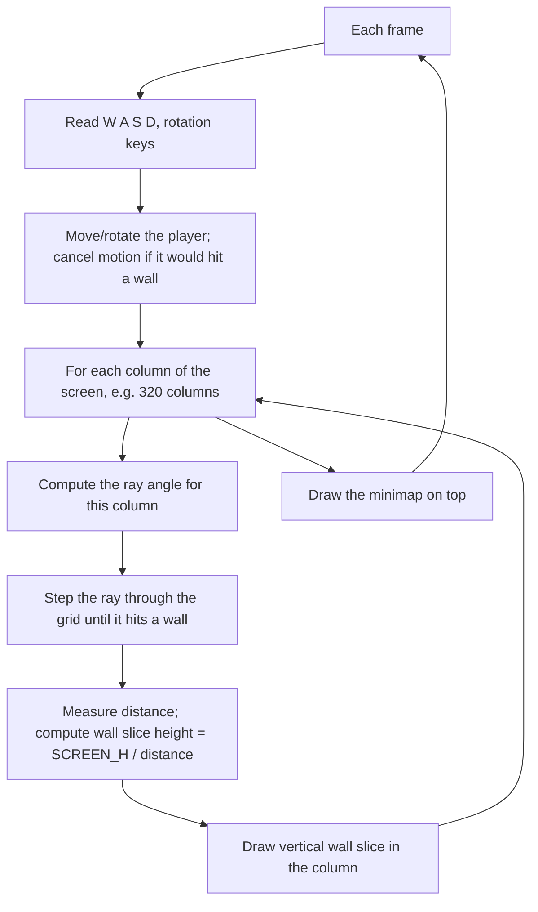

# Lab 02 — Build the Engine That Started a Genre: Wolfenstein-Style Ray Casting

> "It looks 3D. It isn't."
> — every player who first opened Wolfenstein 3D in 1992

**Time budget:** ~2 weeks, working at your own pace.
**Preferred language:** C++ or C# (any language is allowed, but real-time graphics is fastest in these).
**Working style:** solo, or in a team of up to 3 people. Both are equally welcome.

---

## The hook

In 1992, a small studio called id Software shipped a game called *Wolfenstein 3D*. It ran on PCs that today wouldn't even render a single frame of *Minecraft*. It looked like a real 3D world — corridors, doors, walls towering above you — and it kicked off the entire first-person-shooter genre. *Doom*, *Quake*, *Half-Life*, *Counter-Strike*, *Cyberpunk* — they all descend from this engine.

Here's the secret: **it's not 3D**. It's a 2D top-down map, and a clever trick called *ray casting* converts it into a first-person view, one vertical slice at a time. John Carmack figured this out at age 21. Now it's your turn.

In this lab you'll build the same engine. You'll start with a 2D map of `1`s and `0`s. By the end, you'll be walking through corridors in first person. The first time it works — when you press `W` and the walls actually grow taller as you approach them — the trick will lock into your brain forever, and you'll start spotting it in retro games for the rest of your life.

If you want a perfect appetizer, read the first few sections of [Lode's Computer Graphics Tutorial — Raycasting](https://lodev.org/cgtutor/raycasting.html). It is **the** classic resource for this exact lab — every Wolfenstein clone of the last 25 years started here. For a more visual intro, [3DSage's *Make Your Own Raycaster* series](https://www.youtube.com/watch?v=gYRrGTC7GtA) on YouTube is short and excellent.

---

## Why this is worth your time

- This is **the engine that built modern games**. After this lab, you'll know how a generation of FPS games actually worked under the hood.
- Trigonometry stops being abstract. You will literally use `sin`, `cos`, and the dot product to make pictures move.
- You'll touch every major piece of an interactive program: **a game loop, input handling, collision, math, and rendering** — in one self-contained project.
- Showing a friend "I built a Wolfenstein engine in two weeks" is a stronger flex than 90% of typical CS coursework.

---

## The target

> **Instructor TODO:** add reference screenshots to `docs/` once available.

**Basic — "I'm Inside the Map"**
A window split in two: on the right, a top-down 2D minimap of a hand-coded maze with the player as a dot and a line showing where they're looking. On the left, a column-by-column pseudo-3D rendering of what the player sees — walls grow taller as the player walks closer. `W A S D` move and rotate. Walls block the player. It works.

**Standard — "It Feels Like a Game"**
Movement feels good — speed is configurable, fish-eye distortion is corrected, walls have a flat shading that gets darker with distance, the sky and the floor are different colors. The minimap shows the rays fanning out from the player. The map can be loaded from a text file. Strafing left/right works (`Q`/`E` or `A`/`D`).

**Advanced — "It's Almost Wolfenstein"**
You've added something gnarly: **textured walls** (the most iconic Wolfenstein feature), or **doors that open**, or simple **sprites** (a torch, a guard, a barrel) that always face the camera, or a real **DDA algorithm** for fast pixel-accurate ray traversal. The frame rate is solid even at 800×600.

---

## The big idea, in one diagram



The whole "3D" effect is just: *closer wall → taller slice; farther wall → shorter slice*. Stack 320 of those slices side by side and your brain fills in the rest.

---

## Two-week plan with milestones

**Week 1 — From a top-down map to first-person view**

- **Day 1 — Window + map.** Open a window. Hard-code a 10×10 map of `1`s and `0`s. Render it as a 2D grid of squares: black for walls, dark gray for empty. *Milestone: a maze on screen.*
- **Day 2 — Player.** Add a player position `(px, py)` (floating point — fractional positions matter) and an angle. Draw the player as a circle and a short line in the looking direction. `W`/`S` move forward/back along that direction; `A`/`D` rotate.
- **Day 3 — Collision.** Before applying movement, check if the new cell is a `1` (wall). If it is, cancel the motion. *Milestone: you can walk through your maze without phasing through walls.*
- **Day 4 — One ray.** Cast a single ray from the player along the looking angle. Step in tiny increments (or jump cell-to-cell — see "DDA" later). When the ray enters a `1` cell, stop. Draw the ray on the minimap. *Milestone: a green line that always touches the nearest wall in the direction you're looking.*
- **Day 5 — Many rays.** Cast `N` rays (try 60 first, then push to 320) across a field of view of about 60–90°. Each ray's angle is `playerAngle + (i / N - 0.5) * FOV`. Draw them all on the minimap.
- **Day 6 — Vertical slices.** For each ray, compute its distance to the wall. Map distance to a slice height: `sliceH = SCREEN_H / distance`. Draw a vertical rectangle of that height in the corresponding screen column. *Milestone: the first time you press `W` and the walls grow taller. Everyone reacts the same way: small involuntary "oh."*
- **Day 7 — Polish.** Add a sky color (top half) and a floor color (bottom half). Tweak the field of view until movement feels natural. Save a screenshot for the README.

**At this point you've completed the Basic level. You can stop here and submit a real, defendable project.**

**Week 2 — Make it feel right and add depth**

- **Day 8 — Fish-eye correction.** Without correction, walls appear curved when you turn — that's the fish-eye effect. Multiply each ray's distance by `cos(rayAngle - playerAngle)` to fix it. *Milestone: corridors look straight again.*
- **Day 9 — Distance shading.** Make far walls darker. A simple formula: `brightness = 1 / (1 + distance * k)`. The world suddenly has depth.
- **Day 10 — Map loader.** Read a map from a text file. Now you can design levels in any text editor.
- **Day 11–12 — Pick a side quest.** Textured walls, doors, or sprites — choose one.
- **Day 13 — README, screenshots, demo prep.**
- **Day 14 — Buffer day.**

---

## Levels

### Basic — "I'm Inside the Map" (~10–15 hours)
- a 2D map (hardcoded is fine)
- player position, direction, and movement
- wall collision
- at least 60 rays cast per frame
- pseudo-3D rendering with vertical wall slices
- a minimap showing the player and walls

### Standard — "It Feels Like a Game" (~16–22 hours)
- everything from Basic
- 200–320 rays per frame for a smoother view
- fish-eye correction
- distance shading
- strafing
- map loaded from a text file
- minimap shows the rays fanning out
- configurable field of view

### Advanced — "Side Quests" (each ~5–12h, pick what excites you)

- **Textured Walls.** *The* iconic Wolfenstein feature. For each ray hit, sample a column of pixels from a wall texture based on where exactly the ray hit the wall. Read Lode's tutorial section on this — it's clearer than any explanation I could write here.
- **DDA Ray Traversal.** Replace tiny-step ray marching with a proper DDA (Digital Differential Analyzer) that jumps from grid line to grid line. Faster, pixel-accurate, the way every real engine does it.
- **Doors.** A new tile type (`2`) that disappears when you press `E` near it.
- **Sprites.** Place objects in cells (a torch, a guard). Render them as billboards that always face the camera, sorted by distance so they layer correctly.
- **Mouse Look.** Capture the mouse, rotate based on horizontal movement. Suddenly it feels like a real FPS.
- **Multiple Maps.** A small "level select" with 3+ maps. Add a finish tile that loads the next level.
- **Floor and Ceiling Texturing.** Harder. Look up "ray casting floor casting" — turns the colored bands above and below the walls into actual textured surfaces.
- **Mini Game.** Place a goal somewhere in the maze. Pickup items along the way. A timer. A simple win condition.

---

## Extension challenges (3–5 weeks)

The 2-week scope above ships a real, defendable engine. If retro graphics or game programming pulls you in, here's how to grow it into a portfolio standout:

- **Ship to the web.** Port to TypeScript + canvas (or compile your C/C++ to WASM with Emscripten). Anyone with the URL plays your engine.
- **Make it a real tiny game** with goals, enemies, a HUD, sound. Combine with Lab 25 (platformer) and Lab 28 (jam) as a 3-week game-dev capstone.
- **Combine with Lab 19 (USB-HID controller).** Play your own raycaster with your own custom-built controller. Two labs, one demo.
- **Combine with Lab 27 (multiplayer).** A two-player networked raycaster. Brutal but legendary.
- **Read the Wolfenstein 3D source code** ([open-source on GitHub](https://github.com/id-Software/wolf3d)) and write a deep blog post comparing your engine to id Software's 1992 implementation. *Surprisingly* impressive technical-writing piece.

---

## Make it yours (required)

Pick **one** personal twist:

- **Theme the engine.** It doesn't have to be Wolfenstein. Make it a haunted house with red lighting, an underwater shipwreck with blue-green murk, a Soviet-era apartment block hallway, an alien spaceship corridor.
- **Design a memorable map.** Recreate the floor plan of your university building, your dorm, a museum you've been to. The map can be ASCII; the experience of walking through it is what counts.
- **Soundtrack.** Add a single looping music track and a footstep sound when you move. (No code change in the engine — just a small audio layer.) The whole thing instantly becomes 5× more atmospheric.
- **Visual style.** Black-and-white with high contrast (Mac-Plus style), CRT scanlines, neon-noir cyberpunk colors, hand-drawn-looking textures.

You'll defend why you chose your twist.

---

## Working solo or in a team

You can do this lab alone or in a team of **up to 3 people**.

If you go solo: you'll touch every layer — math, input, rendering. Lonelier when the trigonometry fights back, but everything is yours.

If you go as a team, sensible splits:

- *By layer:* one person owns the `Player`, `Map`, `Raycaster` (math + collision); the other owns rendering, minimap, input, file loader.
- *By milestone:* one person drives Week 1 (top-down + first ray + slices), the other drives Week 2 (fish-eye, shading, side quest). Pair-program Day 6 (the moment slices appear).
- *By feature:* one person owns the engine core, the other owns content (maps, textures, sprites, music).

For a 3-person team: add a "polish + side quest + personal twist" owner.

Two rules for teams:

1. **Use git from day one** with a branching workflow. Branches per feature, merge through review.
2. **In your README, list who did what.** Each member must be able to explain how a single ray finds a wall and how its distance becomes a screen height.

---

## Tooling and language tips

**C++**
- [raylib](https://www.raylib.com/) is the easiest entry point — open a window and draw rectangles in 5 lines.
- SDL2 is a solid alternative, especially if you want pixel-level control.
- Compile with `-O2` or `-O3`. A 320-column raycaster in `-O0` is painful.

**C#**
- [Raylib-cs](https://github.com/ChrisDill/Raylib-cs) is the smoothest way in.
- WPF or Windows Forms work for getting started, but `SetPixel` is too slow for raycasting — write to a pixel buffer instead, then upload.
- [MonoGame](https://www.monogame.net/) and [Avalonia](https://avaloniaui.net/) are both options.
- Always run in `Release` mode.

**Anyone**
- Use `delta time` for movement: `position += direction * speed * dt`. Don't tie movement to frames.
- Cast rays in a tight loop and do *not* allocate per ray. Allocation inside the loop will tank performance.

---

## Suggested project structure

```txt
ray-casting-engine/
  README.md
  src/
    main.*
    GameMap.*              # 2D grid + load from file
    Player.*               # position, angle, movement
    Raycaster.*            # cast a ray, return distance + hit info
    Renderer.*             # walls, sky, floor, distance shading
    Minimap.*
    InputHandler.*
  maps/
    e1m1.txt
    classroom.txt
  assets/
    walls.png              # if you do textured walls
  docs/
    milestone-screenshots/
```

---

## When you get stuck

- **Walls look curved when I turn.** Fish-eye effect. Multiply the ray's distance by `cos(rayAngle - playerAngle)` before computing the slice height.
- **The player walks through walls.** Either you're checking collision *after* moving instead of before, or you're using the player's exact position when you should be checking the cell at `(int)px, (int)py`. Also check both axes separately so the player can slide along walls.
- **The walls stretch and shrink weirdly.** Your slice-height formula is wrong, or you're using the *euclidean* distance when you should be using the *perpendicular* distance to the wall (cos correction does this automatically).
- **The minimap looks fine but the 3D view is black.** You're probably casting rays correctly but drawing nothing — make sure your slice rectangle's `x` is the column index, `y` is `(SCREEN_H - sliceH) / 2`, and `height` is `sliceH`.
- **Frame rate drops at 320 rays.** Are you debugging in Debug mode? Are you allocating inside the ray loop? Is your inner step too small (try larger steps + DDA later)?

If you're stuck for 30+ minutes: drop to 1 ray and `print` its position step-by-step until you find where the math goes wrong. Then turn the rays back on.

---

## Submission checklist

- [ ] Engine runs end-to-end on a clean machine.
- [ ] Stable 60 FPS at 320 columns on a normal laptop (or document FPS at your chosen resolution).
- [ ] No crash on edge cases: player against a wall, ray cast straight up/down, very long open hallways.
- [ ] Player cannot walk through walls.
- [ ] Map loads from a text file; switching maps works.
- [ ] If you ported to web: **a live URL** (GitHub Pages, Vercel, itch.io for a polished version).
- [ ] **A 15-second GIF** of walking through the map in the README — raycasters are uniquely GIF-friendly.
- [ ] No private paths in source.
- [ ] Controls listed in the README.

---

## What evaluators look at

- **They watch the GIF.** A first-person walk through your map sells the project in 5 seconds.
- **They check the math.** Fish-eye correction (`cos(rayAngle - playerAngle)`) is the signature decision in this lab; getting it right reads as care.
- **They look at the engine/render separation.** A pure `Raycaster` (math + hit testing) decoupled from `Renderer` (drawing) is the same architecture every commercial engine uses.
- **They look at delta-time handling.** Same speed across machines = "this person knows games."
- **They look at performance.** Allocation inside the per-ray loop is a classic bug; clean tight loops with pre-allocated buffers read as engineered.
- **They look at the personal twist.** A themed map (your university, a haunted house, an alien ship) lifts this from "I followed Lode's tutorial" to "I made something."

---

## What to put in your README

1. Project name + one-sentence description.
2. **A GIF or short video** of the player walking through the map at the top. This README will look amazing.
3. Which level + side quests.
4. Your personal twist and why.
5. How to run it.
6. A short paragraph in your own words explaining how a single column on the screen gets its color.
7. (Optional but loved) Milestone gallery — top-down map, first ray, first slices, textured walls.
8. If you worked in a team — who did what.

---

## Reflection

Be ready to:

1. **Walk into a wall, live.** Show that the player slides along it instead of stopping dead.
2. **Trace one ray** from `(px, py)` and angle `θ` through your code, line by line.
3. **Explain why close walls look taller.** In one sentence. Without arm-waving.
4. **Show what fish-eye correction does** by toggling it off and on (if you can — otherwise explain).
5. **What breaks** if FOV is set to 180°? To 5°? If the player starts inside a wall? If the map is 1×1?
6. **What was the hardest bug** and how did you find it?
7. **What's the difference** between this lab's "ray casting" and Lab 03's "ray tracing"? (They share half a name. They're cousins, not the same thing.)

---

## Showcase

At the end of the semester there will be a small gallery — anonymous voting for **most atmospheric map**, **most polished engine**, and **most creative theme**. Bring a 30-second walkthrough video.

---

## Going further

- *Lode's Raycasting Tutorial* (the appetizer above) — step-by-step with code.
- *Game Engine Black Book: Wolfenstein 3D* by Fabien Sanglard. Beautiful, slow read about the actual original engine.
- *3DSage* on YouTube — short, accessible video versions.
- *Doom Black Book* (also Sanglard) — once you finish this lab, you'll be ready for *Doom*.
- The original [Wolfenstein 3D source code](https://github.com/id-Software/wolf3d) — yes, id Software open-sourced it. Reading the original alongside your own implementation is a real treat.

---

## A final word

Building a 3D-looking game out of a 2D grid is one of the most satisfying tricks in computer science. It feels impossible, then it works, then you wonder how it ever felt impossible. Take a video the first time the slices appear. Show a non-programmer friend. Watch them not believe you wrote it.
