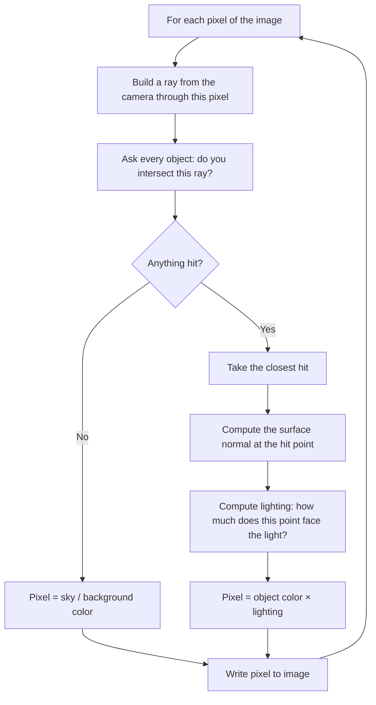

# Lab 03 — Make Light Behave: Build Your Own Ray Tracer

> "All you have to do is figure out what color each pixel should be."
> — every graphics engineer, ever

**Time budget:** ~2 weeks, working at your own pace.
**Preferred language:** C++ or C# (any language is allowed, but graphics code is fastest and most fun in these two).
**Working style:** solo, or in a team of up to 3 people. Both are equally welcome.

---

## The hook

Every Pixar movie. Every Cyberpunk reflection. Every architectural render of a building that doesn't exist yet. Every glossy product shot for a phone that hasn't been manufactured. They all come from one absurdly simple idea:

> Shoot a ray of light *backwards* from the camera into the scene, and ask: "what did you hit?"

That's it. That's the whole idea behind ray tracing. The first version of this algorithm was published in 1968. Fifty years later it won a Turing-style place inside every modern GPU (look up "RT cores" if you're curious). What you'll build in the next two weeks is a working — small but real — ray tracer. Written by you. From scratch. No engine. No shader language. No graphics library. Just math, a `for` loop, and a file you write pixel by pixel.

The first time your sphere actually appears on a black background, you will pause and stare at the screen. Almost everyone does. That moment is what this lab is for.

---

## Why this is worth your time

- This is the **same algorithm Disney uses** for the films you grew up watching — just smaller.
- Modern GPUs (NVIDIA RTX, AMD RDNA, Apple M-series) have **dedicated hardware** for exactly this loop. You'll understand what they're accelerating.
- Out of all 1st-year topics, this is one of the few where **math becomes literally visible**. Vectors, dot products, normals — they stop being abstract the moment they paint a pixel.
- A working ray tracer is a **permanent portfolio piece**. Far more memorable in an interview than a CRUD app. People love seeing pictures.

If you want a 9-minute appetizer before starting, search YouTube for *"How Ray Tracing Works in 9 minutes"* or read the first chapter of [*Ray Tracing in One Weekend* by Peter Shirley](https://raytracing.github.io/) — it's free, world-famous, and a perfect companion to this lab.

---

## The target

Here is what "done" looks like at each level. Every level is a complete, defendable project — you decide where you stop.

> **Instructor TODO:** drop a small `docs/target-basic.png`, `docs/target-standard.png`, and `docs/target-advanced.png` here once you render reference images. Until then, the descriptions below carry the lab.

**Basic — "First Light"**
A single matte-colored sphere, lit from one direction, on a solid colored background. The lit side of the sphere is brighter; the back side fades into shadow. You save it as a PNG or PPM file. It's small — maybe 400×300 pixels — and it took your computer a couple of seconds to render. You made that. From nothing. From math.

**Standard — "A Real Scene"**
Three or four spheres of different colors and sizes sit on a checker-pattern floor. One sphere casts a shadow on another. The light source is somewhere off-camera. You can change the camera position by editing two lines, re-run, and see the scene from a new angle.

**Advanced — "It Looks Almost Real"**
Same scene, but now one sphere is a perfect mirror that reflects the others. Shadows are crisp. Edges are smooth (no jaggies). The image takes maybe 30 seconds to render at 1280×720. You feel slightly powerful.

---

## The big idea, in one diagram



If you understand this diagram, you understand 90% of what you're about to build. The rest is naming things and not panicking.

---

## Two-week plan with milestones

You don't have to follow this exactly — but if you're not sure how to pace yourself, here's a safe path. Each milestone is a moment when something *visible* changes. Take a screenshot at every milestone. Seriously. They're small dopamine hits and they make a great README at the end.

**Week 1 — Make something appear**

- **Day 1–2 — Setup & first image.** Create the project. Write a function that produces a 200×200 image of a smooth color gradient (red increases left to right, green top to bottom). Save it as a PPM file. Open it. *Milestone: you've written a real image to disk.*
- **Day 3–4 — Vectors and rays.** Implement a tiny `Vec3` (add, subtract, scale, dot, length, normalize). Implement a `Ray { origin, direction }`. Don't render anything yet — just write a few `Console.WriteLine` / `std::cout` checks that the math is correct.
- **Day 5–6 — First ray hit.** Generate one ray per pixel from a fixed camera. Implement ray-sphere intersection (formula below). Color the pixel red if it hit the sphere, sky-blue if it didn't. *Milestone: you can see a flat red disk on a blue background. This is your first ray-traced image. Take the screenshot.*
- **Day 7 — Lighting.** Compute the surface normal at the hit point and shade the sphere with simple diffuse lighting (`max(0, dot(normal, lightDir))`). The disk becomes a sphere. *Milestone: it looks 3D for the first time.*

**At this point you have completed the Basic level. You can stop here and submit a real, defendable project.**

**Week 2 — Make it interesting**

- **Day 8–9 — Multiple objects.** Move from one hardcoded sphere to a `List<Sphere>` / `std::vector<Sphere>`. Loop over all of them and pick the closest hit. Add 3 spheres of different colors.
- **Day 10 — A floor.** Add a horizontal plane at y = 0. Give it a checkerboard pattern (`(int)(floor(x) + floor(z)) % 2 == 0`). The scene now feels like a *place*.
- **Day 11 — Shadows.** Before lighting a hit point, shoot a "shadow ray" toward the light. If anything is in the way, the point is in shadow. *Milestone: a sphere casts a shadow on the floor. This single change makes the scene believable.*
- **Day 12 — Polish & creativity.** Pick one or two side quests below. Make the image yours.
- **Day 13 — README, screenshots, demo prep.**
- **Day 14 — Buffer day.** Bugs always take longer than you think.

---

## Levels: pick where you'll stop

You don't have to do everything. Pick a level honestly based on how much time and energy you have.

### Basic — "First Light" (~6–10 hours)

You implement:
- one sphere
- a camera
- a sky background
- ray-sphere intersection
- one light source
- simple diffuse lighting (the sphere fades from bright to dark)
- saving the result as a PNG or PPM

If you finish this, you've written a real ray tracer. Don't let anyone tell you otherwise.

### Standard — "A Real Scene" (~15–20 hours)

Everything from Basic, plus:
- a `Scene` object containing many spheres
- nearest-object selection (no draw-order tricks)
- a horizontal plane / floor
- a checkerboard or solid-color material on the plane
- shadow rays
- a configurable camera position and resolution

### Advanced — "Side Quests" (pick any, each adds ~3–10h)

These are optional bonus quests. Each one teaches a different concept. Pick one or two that you find cool — don't try to do all of them.

- **Shiny Marble.** Add a perfectly reflective material. When a ray hits it, reflect and trace again. Cap recursion at depth 5 so your program doesn't loop forever.
- **Glass Marble.** Same idea, but with refraction (Snell's law). Hard. Looks incredible.
- **Sunset Mode.** Replace the flat sky with a vertical color gradient (orange at the horizon, deep blue at the top).
- **Cornell Box.** Reproduce the classic 1984 [Cornell Box](https://en.wikipedia.org/wiki/Cornell_box) test scene with a red and a green wall. Graphics researchers have been rendering this scene for forty years.
- **Anti-aliasing.** For each pixel, shoot 4 (or 16) rays through slightly different sub-pixel positions and average them. Edges become smooth.
- **More lights.** Two or three colored lights, summed together. Makes the scene feel cinematic.
- **JSON scene loader.** Read the scene description from a `scene.json` file instead of hardcoding it. Now you can render different scenes without recompiling.
- **Animation.** Render 24 frames where the camera moves slightly between each, then stitch them into a GIF or MP4 with `ffmpeg`. A 1-second animation that you rendered yourself is genuinely cool.
- **Speed run.** Parallelize the pixel loop across CPU threads. Measure the speedup. Be smug about it.

---

## Extension challenges (3–5 weeks)

The 2-week scope above ships a real, defendable ray tracer. If graphics pulls you in, here's how to grow it into a portfolio standout:

- **Path tracing.** Move from direct lighting to true Monte Carlo path tracing — soft shadows, caustics, color bleeding. Read Peter Shirley's [*Ray Tracing: The Next Week*](https://raytracing.github.io/) (free, sequel to the appetizer).
- **GPU port.** Rewrite the inner loop in WebGL / WGSL / CUDA. 100×–1000× speedup. Document the journey.
- **Animated short.** Render a 5-second 30-FPS animation (150 frames). Edit it together with `ffmpeg`. Post it to YouTube.
- **Combine with [Lab 22](lab-22-spa-frontend.md).** A web playground where users edit a scene JSON in-browser and watch the render appear (compile your tracer to WASM). *Genuinely impressive* portfolio piece.
- **Read PBRT.** *Physically Based Rendering* by Matt Pharr et al. is the canonical graphics textbook (and won an Academy Award for its impact on cinema). Pick one chapter and implement what's in it.

---

## Make it yours (required)

Pick **one** personal twist. This is required — it's what stops every submission from looking the same and forces you to actually *think* about the scene.

Examples:

- Recreate a famous album cover (*Pink Floyd — The Dark Side of the Moon*, *Joy Division — Unknown Pleasures*, etc.) using only spheres, planes, and lighting. Constraints are fun.
- Render a "self-portrait" scene that says something about you: your three favorite colors, an arrangement that means something, a photo you took translated into shapes.
- Render the logo of your university, your favorite team, or a video game using primitives.
- Render the same scene at sunrise, noon, and sunset by changing only the light direction and color. Submit all three.
- Anything else that makes you smile when you look at the final image.

The technical bar isn't higher because of this — but you'll defend why you made the choices you made, not just *what* the algorithm does.

---

## Working solo or in a team

You can do this lab alone or in a team of **up to 3 people**. Pick whichever sounds more fun — neither path gives you bonus points or a harder rubric.

If you go solo: you'll touch every part of the code, which is the fastest way to actually learn graphics. Lonelier when you get stuck, but everything you build is unambiguously yours.

If you go as a team: you'll learn something different — how to split a small system, agree on interfaces, and not step on each other's commits. Some sensible ways to split a 2-person team:

- *By layer:* one person owns `math/` + `Ray` + `Camera`; the other owns `Sphere`, `Plane`, `Renderer`, lighting.
- *By milestone:* one person drives Week 1 (Basic), the other drives Week 2 (Standard + side quests). Pair-program the hard bits.
- *By feature:* one person owns rendering core; the other owns scene loading, image output, and the README/demo.

For a 3-person team add: scene & materials owner, or someone who owns the personal twist + side quests + final polish.

Two rules for teams:

1. **Use git from day one** with a real branching workflow (one branch per feature, merge via PR/MR — even if the "review" is just a teammate eyeballing it). No zip files emailed around at midnight.
2. **In your README, list who did what.** Not for grading — for honesty, and so each person can talk confidently about their part during the demo.

Each team member must be able to defend the *whole* project, not just their slice. If you can't explain how your teammate's intersection code works, you'll struggle in the reflection questions.

---

## Tooling and language tips

You can use any language, but here's friendly advice for the two recommended ones:

**C++**
- For images: just write the **PPM (`.ppm`) format**. It's literally a text file. Three lines of header, then `R G B` numbers separated by spaces. No library needed. You can convert PPM to PNG later with `ffmpeg -i out.ppm out.png` or open it directly in IrfanView / GIMP / VS Code with a viewer extension.
- If you want PNG directly, drop in [`stb_image_write.h`](https://github.com/nothings/stb) — it's a single header file, MIT license, no build system changes.
- Use `-O2` or `-O3` when compiling, or your renders will feel painfully slow.

**C#**
- Easiest path: write PPM, same as above.
- For PNG: `System.Drawing.Common` (Windows-only friendly) or [SixLabors.ImageSharp](https://github.com/SixLabors/ImageSharp) (cross-platform, recommended).
- Build in `Release` configuration (not `Debug`) — the difference is roughly 10×.

**Anyone**
- Start at 200×200. Don't render at 1920×1080 until your code works. You'll thank yourself.
- The math (ray-sphere intersection) is a quadratic equation. Wikipedia has the formula and a clear derivation. You don't have to invent it from scratch.

---

## Suggested project structure

This is a suggestion, not a law. If your structure makes sense to *you*, that's enough.

```txt
ray-tracer/
  README.md
  src/
    main.*               # entry point
    math/
      Vec3.*             # vector with add, sub, scale, dot, length, normalize
      Ray.*              # origin + direction
    scene/
      Sphere.*
      Plane.*            # Standard level
      Light.*
      Scene.*            # holds a list of objects + lights
    render/
      Camera.*
      Renderer.*         # the main pixel loop
      ImageWriter.*      # PPM/PNG saving
  output/
    first-render.png
    final.png
  docs/
    milestone-screenshots/
```

---

## When you get stuck

Almost everyone hits these. They're not bugs in your understanding — they're rites of passage.

- **My image is upside down.** Image files store rows top-to-bottom; your camera math probably goes bottom-to-top. Flip the row index when writing.
- **My sphere looks like a flat circle.** You're probably not computing the normal yet — you're just checking "did it hit?" and painting a flat color. Once you compute `normal = (hit_point - sphere_center) / radius` and apply diffuse lighting, it becomes a sphere.
- **Black image.** Almost always one of: (a) your light direction is wrong-signed, (b) you're outputting RGB values >1.0 without converting to 0–255, (c) your ray direction isn't normalized.
- **Self-shadowing artifacts ("acne").** When you cast a shadow ray, start it slightly *off* the surface (`hit_point + normal * 0.001`), otherwise it instantly hits the surface it just left.
- **My program is so slow.** Are you in Debug mode? Is your image 4K? Are you using `Console.WriteLine` inside the pixel loop? Any of these will cost you 10–100×.

If you're stuck for more than ~30 minutes, the unblock order is: (1) print debug, (2) reduce to a tiny case (1×1 image, one sphere), (3) ask a friend to look at your screen. Don't sit silently for hours — that's not a learning experience, that's suffering.

---

## Submission checklist

- [ ] Renderer runs end-to-end on a clean machine: clone → build → `./trace > out.ppm` (or PNG) → image opens.
- [ ] No crash on edge cases: camera inside a sphere, sphere with radius 0, scene with no lights, ray direction degenerate.
- [ ] Released-mode build produces images in seconds, not minutes (debug-mode comparison documented).
- [ ] PPM/PNG output is valid (opens in IrfanView / GIMP / VS Code).
- [ ] **A final render at the top of the README** — the better the image, the stronger the project.
- [ ] (If extension) An animation: a small GIF/MP4 in the README.
- [ ] (If extension) A live web demo URL.
- [ ] No private paths in source.
- [ ] README explains how to reproduce the final render.

---

## What evaluators look at

- **They look at the image.** Graphics is unique: the final render *is* the project. A polished 800×800 image with shadows, reflections, and a thoughtful composition reads instantly.
- **They look at correctness.** Self-shadow acne, fisheye, missing normals — these are the classic ray-tracer bugs; absent = care.
- **They look at math separation.** Pure `Vec3` and `Ray` modules with tested operations = engineering signal. Math intermixed with rendering = "barely got it working."
- **They look at performance.** Compiled in release mode? Inner loop allocation-free? Simple speedup numbers in the README ("1080×1080 with 1 light + 5 spheres + reflections renders in 4.2 seconds on my laptop") are gold.
- **They look at the personal twist.** A self-portrait scene, an album cover, your university logo — these read as "I made this," not "I followed a tutorial."
- **They look at the math writeup.** A clear, in-your-own-words paragraph explaining ray-sphere intersection (with the discriminant) is *uniquely* impressive technical writing for a 1st-year student.

---

## What to put in your README

Keep it short. One page is plenty.

1. **Project name** and a one-sentence description.
2. **A screenshot of your final render**, right at the top. (Yes, the very first thing.)
3. **What level you reached** (Basic / Standard / Advanced + which side quests).
4. **What your personal twist is** and why you chose it.
5. **How to run it** (3 lines max).
6. **A short paragraph** explaining how the algorithm works in *your own words* — pretend you're explaining it to a friend who's never written graphics code.
7. (Optional but loved) Screenshots from your milestones, in order, like a tiny progress diary.
8. **If you worked in a team** — a short "who did what" list, one line per person.

---

## Reflection — instead of "defense questions"

When you present the project, be ready to answer these. They're not gotchas — they're the questions that prove you actually built it (vs. copy-pasted from a tutorial). Mix of practical, technical, and reflective:

1. **Show me what happens** if I move the light to the opposite side of the scene. Edit the code live and re-render.
2. **Pick the slowest part** of your renderer and explain *why* it's slow. (Hint: count multiplications inside your pixel loop.)
3. **What's a surface normal**, and why does the dot product with the light direction give you brightness? Explain like I'm a friend who hasn't taken linear algebra yet.
4. **Where does your code break** if I add a sphere with a negative radius? With radius 0? With the camera *inside* the sphere?
5. **What was the hardest bug** you hit, and how did you find it?
6. **If you had two more weeks**, what one feature would you add and why that one?
7. **What was the moment** when this lab clicked for you?

---

## Showcase

At the end of the semester there will be a small gallery of everyone's final renders — anonymous voting for **most beautiful image**, **most creative scene**, and **most technically impressive**. No pressure, no points — just bragging rights and a wall of screenshots. Make something you'd want to see on that wall.

---

## Going further (after the lab)

If this lab makes you want more:

- *Ray Tracing in One Weekend* (free, ~80 pages) — Peter Shirley. Picks up where this lab ends.
- *Physically Based Rendering* (book, free online) — the textbook used at Pixar and the major film studios. Long. Beautiful.
- The Sebastian Lague YouTube series on coding ray tracers, if video is your thing.
- The original 1980 paper "An Improved Illumination Model for Shaded Display" by Turner Whitted — three pages of math that quietly changed cinema.

---

## A final word

This lab will, for some of you, be the first time programming feels like *making* something instead of *solving exercises*. That's the point. You're not building a tool that's useful to anyone — you're using a computer to draw a picture that didn't exist before. Have fun. Take screenshots. Show your friends.

When your first sphere appears on screen — solo or as a team — send a picture to whoever taught you the dot product. They'll appreciate it.
