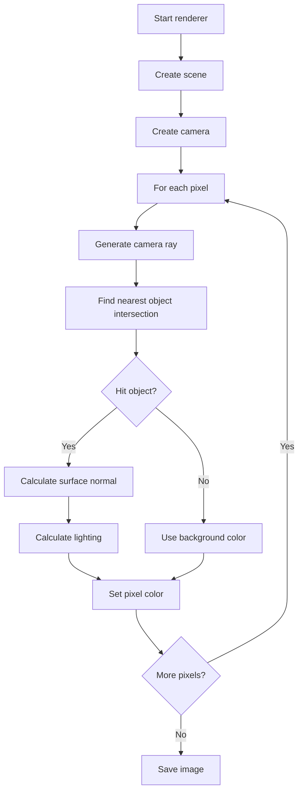

# Lab 03: Simple Ray Tracer

## Goal

Create a simple ray tracer that generates an image of a 3D scene.

The goal is to understand how rays can be used to simulate a camera, detect intersections with objects, and calculate simple lighting.

You will practice:

- vectors;
- geometry;
- file/image generation;
- object modeling;
- algorithm decomposition;
- rendering pipeline design.

---

## Idea

A ray tracer sends one ray through each pixel of the image. The ray travels from the camera into the scene. If the ray hits an object, the program calculates the color of that pixel.

A minimal scene may contain only spheres and a light source.

---

## Ray Tracing Workflow



---

## Task

Implement a simple ray tracer that creates an image file.

The image must contain at least:

- a camera;
- one or more spheres;
- a background color;
- one light source;
- simple diffuse lighting.

The output may be saved as:

- PNG;
- BMP;
- PPM;
- any other image format supported by your language.

---

## Functional Requirements

### 1. Image Output

The program must generate an image.

Requirements:

- image width and height are configurable;
- each pixel is calculated by the ray tracer;
- output file is saved successfully.

### 2. Camera

The camera must define:

- position;
- viewing direction or viewport;
- field of view or screen plane.

### 3. Objects

At minimum, support spheres.

Each sphere should have:

- center position;
- radius;
- color.

### 4. Ray-Object Intersection

The program must detect whether a ray intersects a sphere.

Requirements:

- find the nearest visible intersection;
- ignore objects behind the camera;
- avoid crashes when there is no intersection.

### 5. Lighting

Implement simple diffuse lighting.

Requirements:

- at least one light source;
- surface normal calculation;
- brighter surfaces facing the light;
- darker surfaces turned away from the light.

---

## Suggested Project Structure

```txt
simple-ray-tracer/
  README.md
  src/
    main.*
    math/
      Vector3.*
      Ray.*
    scene/
      Sphere.*
      Light.*
      Scene.*
    rendering/
      Camera.*
      RayTracer.*
      ImageWriter.*
  output/
```

---

## Difficulty Levels

### Basic

Implement:

- one sphere;
- background color;
- image output;
- simple ray-sphere intersection;
- flat object color without lighting.

### Standard

Implement everything from Basic plus:

- multiple spheres;
- nearest object selection;
- diffuse lighting;
- shadows or simple shadow check;
- configurable scene.

### Advanced

Implement some of the following:

- reflections;
- multiple lights;
- anti-aliasing;
- planes;
- materials;
- recursive ray tracing;
- scene loaded from JSON.

---

## Implementation Plan

1. Implement vector operations.
2. Create a ray structure.
3. Create image buffer.
4. Generate one ray per pixel.
5. Implement ray-sphere intersection.
6. Color pixels based on object hit.
7. Add multiple objects.
8. Add light source and normals.
9. Add diffuse lighting.
10. Save image.
11. Refactor into modules.
12. Prepare README and demo.

---

## Testing

Test at least the following:

- image file is created
- sphere intersection works
- background pixels render correctly
- nearest object is selected
- lighting changes color intensity

Automated tests are recommended but not strictly required. If you do not write automated tests, describe manual test cases in `README.md`.

---

## Demo

During the demo, show:

- generated image
- scene configuration
- one ray calculation explanation
- project structure
- how output image is saved

---

## README Requirements

Your repository must include `README.md` with:

1. Project name.
2. Short description.
3. Selected difficulty level.
4. Technologies used.
5. How to run the project.
6. Main features.
7. Short explanation of the main algorithm or architecture.
8. Screenshots or demo link, if possible.
9. Known problems or limitations.

---

## Defense Questions

Be ready to answer:

1. What is a ray?
2. How is a pixel color calculated?
3. How do you detect ray-sphere intersection?
4. What is a surface normal?
5. How does lighting work?
6. How do you choose the nearest object?
7. What would you add to make it more realistic?

---

## Evaluation Criteria

| Criterion | Points |
|---|---:|
| Image output | 10 |
| Ray generation | 15 |
| Object intersection | 20 |
| Lighting | 20 |
| Scene structure | 10 |
| Code organization | 10 |
| README | 10 |
| Demo and defense | 5 |
| **Total** | **100** |

---

## Expected Result

At the end of this lab, you should have a working project called **Simple Ray Tracer**.

The project should demonstrate both programming skills and the ability to structure, explain, and present a small but non-trivial software system.
