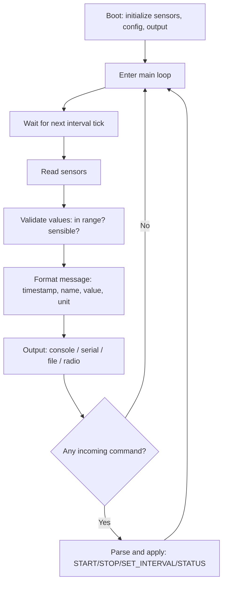

# Lab 04 — Talk to Hardware: Build a Sensor Logger

> "Every modern aircraft is, underneath, a network of sensors and the code that listens to them."
> — anyone who has worked on avionics for a single afternoon

**Time budget:** ~2 weeks, working at your own pace.
**Preferred language:** C / C++ (for real hardware), or C# / Python (for simulator and dashboard layers).
**Working style:** solo, or in a team of up to 3 people. Both are equally welcome.
**Hardware:** *optional*. A real microcontroller (STM32, Arduino, ESP32, Raspberry Pi Pico) is recommended; a pure software simulator is fully acceptable if you can't get hardware.

---

## The hook

Modern Boeing 787s carry over **6,000 sensors** generating roughly **500 GB of data per flight**. The familiar orange "black box" — the *Flight Data Recorder* — is, mechanically, a hardened sensor logger that has been running since 1958. Every commercial drone you can buy (DJI, Skydio, Parrot, Autel) is essentially a flying sensor logger that uses gyroscopes, accelerometers, magnetometers, GPS, and barometers to know where it is and what's happening. The world's most popular open-source autopilot, [PX4 / Pixhawk](https://docs.px4.io/), runs on **STM32** chips — the same chips you'll likely use in this lab.

This lab is the closest thing in the course to *real avionics work*. You'll build the smallest meaningful version of what every embedded engineer in aerospace does for a living: read data from a sensor (real or simulated), validate it, format it into a structured message, and log it somewhere that won't be lost. Add a command interface and a state machine, and you've reproduced the bones of a flight data recorder, a satellite telemetry transmitter, or a CubeSat experiment payload.

You'll also build something that, two summers from now, you can plug into an actual drone, an actual weather balloon, an actual robot — and it'll just *work*. Embedded skills compound. The earlier you start, the bigger your future options.

If you want a perfect appetizer, browse [**Phil's Lab**](https://www.youtube.com/@PhilsLab) on YouTube — Phil Salmony is an aerospace engineer who makes some of the clearest STM32 videos on the internet. His "STM32 from scratch" series is the canonical 1st-year-friendly entry. Pair it with [**Andreas Spiess**](https://www.youtube.com/@AndreasSpiess) ("the guy with the Swiss accent") for IoT/ESP32-flavored content. For aviation context, skim the [PX4 Pixhawk overview](https://docs.px4.io/main/en/) — that's what professional autopilots look like under the hood.

---

## Why this is worth your time (especially at an aviation institute)

- **Embedded software runs the modern world.** Aircraft, drones, satellites, cars, washing machines, hearing aids. Most of the actual code that keeps people alive is embedded code. There are far fewer 1st-year students learning this than learning web dev. **You'll stand out.**
- It's the lab where you genuinely write **C or C++ that runs outside a comfortable runtime** — no garbage collector, no exceptions, no `Console.WriteLine`. Just bytes, pins, and timing. Once you've done it, every other kind of programming feels easy.
- Ukraine has a serious and growing **drone, defense-tech, and aerospace industry** — Skyeton, Aerodrone, Quadrocopter Ukraine, the army's UAV programs, Skydome, Sirko, plus dozens of new defense-tech startups. They hire people who can talk to hardware. They especially hire people who showed up early.
- Even in a "non-embedded" career, the systems thinking — main loops, state machines, validation, framing, checksums — transfers everywhere.

---

## Pick your platform

You can do this lab on any of the following. **All are valid; pick the one closest to what you can borrow, afford, or already own.** If hardware is a problem, a pure software simulator is fully acceptable.

| Platform | Cost (UA, approx) | Language | Strengths | Weaknesses |
|---|---|---|---|---|
| **STM32** (e.g., Blue Pill, Nucleo-F401RE, Black Pill) | ~$3–25 | C / C++ | What real avionics, Pixhawk, BetaFlight, and many Ukrainian drone companies use. Closest to "professional embedded". | Steeper toolchain. Use STM32CubeIDE or PlatformIO. |
| **Arduino** (Uno, Nano, ESP32 in Arduino mode) | ~$3–15 | Arduino C++ | The friendliest first embedded experience. Massive library ecosystem. Hardest is a soldering iron. | "Arduino" hides what's really happening; you'll outgrow it. |
| **ESP32** | ~$5–10 | C++ (Arduino or ESP-IDF) | Built-in Wi-Fi and Bluetooth — a huge unlock for telemetry side quests. Cheap, powerful. | Less common in pro avionics. |
| **Raspberry Pi Pico** | ~$5–7 | C/C++ or MicroPython | Modern, cheap, well-documented. MicroPython is gentle for first-years. | Ecosystem younger than STM32/Arduino. |
| **Simulator only** | $0 | C / C++ / C# / Python | Zero hardware, all code. You can fake any sensor. | You miss the magic of physical readings — but you keep all the systems thinking. |

**Recommendation for an aviation institute:** STM32 if you can get one (it's what professional drones run), Pi Pico or ESP32 as friendly alternatives, simulator if no hardware is available.

---

## The target

> **Instructor TODO:** add reference photos / terminal recordings to `docs/` once available.

**Basic — "It Logs"**
A program runs on your chosen platform (or as a simulator on your PC). Every second, it generates or reads one sensor reading (temperature, voltage, distance — whatever you can get) and prints a structured line to the console / serial port. The output looks clean and parseable. The program runs forever until you press `Ctrl+C` or send a `STOP` command.

**Standard — "It's a Real Device"**
Multiple sensors are read on a configurable interval. Output is structured JSON or CSV, suitable for piping into another program. A small command parser lets you send `START`, `STOP`, `STATUS`, `SET_INTERVAL 500` over the serial port (or stdin in simulator mode). The system runs as a clear **state machine** — you can draw the states on paper. Logs are written both to the screen and to a file (or to the microcontroller's flash, if you're brave).

**Advanced — "Almost Avionics"**
You've added something from the real world: a **dashboard** on your PC that plots sensor data live (read serial → graph), a **flight-data-recorder** mode that survives power loss (writes to flash / EEPROM / SD card), a **CRC checksum** on every message (the way real aviation buses like ARINC 429 do it), an **IMU** (gyroscope + accelerometer) that actually senses orientation, **GPS logging** to a `.gpx` file you can open in Google Maps, or a **wireless telemetry** version using ESP32's Wi-Fi (sensor data appears in your browser in real time).

---

## The big idea, in one diagram



Three pieces — **read, format, write** — wrapped in a clock and a state machine. That's the heart of every embedded data logger from a $3 Blue Pill to a Boeing 747's flight recorder.

---

## Two-week plan with milestones

(Adjust days based on your platform — Arduino is faster to get running than bare-metal STM32.)

**Week 1 — Make it talk**

- **Day 1 — Toolchain.** Install whatever IDE/build tool your platform needs (STM32CubeIDE, PlatformIO, Arduino IDE, Thonny for MicroPython, or just a regular C# / Python project for simulator). Run a "blink an LED" or "print hello world" program. *Milestone: your platform talks back.*
- **Day 2 — Read one sensor.** Pick the simplest sensor available — built-in temperature on STM32, an LM35 or DS18B20 on Arduino, the Pico's onboard temperature sensor, or `random.uniform(20, 25)` for the simulator. Print the value once a second.
- **Day 3 — Structured output.** Format every reading as a single line of JSON or CSV: `{"t":"2026-05-09T11:00:00Z","sensor":"temp","value":24.7,"unit":"C"}`. Make sure another program (a Python script, even just `cat`) can parse it.
- **Day 4 — Configurable interval.** Define `INTERVAL_MS` once. Don't sprinkle `delay(1000)` everywhere. Use a single timer/tick. *Milestone: you can change one constant and the whole device respeeds.*
- **Day 5 — Multiple sensors.** Add at least one more reading (a second simulated channel, a button press, a knob, an IMU axis). Loop them in the output stream.
- **Day 6 — Validation.** Reject impossible readings (a temperature of 9999 °C should be flagged, not logged). Add a status flag to each message.
- **Day 7 — Polish + screenshots.** *Milestone: you have a working logger.*

**At this point you've completed the Basic level. You can stop here and submit a real, defendable project.**

**Week 2 — Add the systems-engineering layer**

- **Day 8 — A state machine.** Define states: `IDLE`, `RUNNING`, `ERROR`, `STOPPED`. Draw it on paper first. Codify transitions. Every action goes through the state machine.
- **Day 9 — Command interface.** Listen for commands on the serial port (or stdin). `START`, `STOP`, `STATUS`, `SET_INTERVAL 500`. Parse them, apply them, respond with `OK` or `ERR`.
- **Day 10 — File logging.** Write every message to a file (or to flash on hardware). On restart, the log is still there. *Milestone: a flight data recorder, in miniature.*
- **Day 11–12 — Pick a side quest.**
- **Day 13 — README, screenshots, demo prep.**
- **Day 14 — Buffer day.**

---

## Levels

### Basic — "It Logs" (~10–14 hours)
- runs on your chosen platform (or simulator)
- one sensor (real or simulated), reading once per configurable interval
- structured output (JSON or CSV) on the console/serial
- a clean main loop that doesn't busy-wait
- safe stop (Ctrl+C or a STOP command)
- README explaining the setup and a wiring/architecture diagram

### Standard — "It's a Real Device" (~14–22 hours)
- everything from Basic
- ≥ 2 sensors
- a real state machine (`IDLE / RUNNING / ERROR`)
- a command parser (`START / STOP / STATUS / SET_INTERVAL`)
- both screen output and file/flash logging
- error handling: bad commands, sensor failures, timeouts

### Advanced — "Side Quests" (each ~6–14h, pick what excites you)

- **PC Dashboard.** Write a small companion program (Python / C# / TS) that reads your serial output and plots live charts (matplotlib, [Plotters](https://github.com/plotters-rs/plotters), Chart.js). Watching a live graph of your sensor is genuinely fun.
- **Flight Data Recorder.** Write to non-volatile storage that survives power loss (microcontroller flash, EEPROM, an SD card). Bonus: implement a circular buffer so old data is overwritten when storage fills up.
- **Real IMU.** An MPU6050 or BNO055 costs ~$3 and gives you gyroscope + accelerometer. Read all 6 axes. Compute orientation. Tilt the board, see the data move.
- **GPS Logging.** A NEO-6M GPS module (~$5) gives you raw NMEA strings. Parse them. Log to a `.gpx` file. Open it in Google Maps and see where you walked.
- **CRC Checksum.** Add a simple CRC-16 or CRC-32 to every output line. Reject malformed incoming commands. This is exactly how real avionics buses (ARINC 429, MIL-STD-1553, CAN) protect against bit errors. Document the protocol in your README — that page alone is portfolio-worthy.
- **Wi-Fi Telemetry (ESP32).** Stream sensor data to your laptop over Wi-Fi. Build a tiny web page on the ESP32 that shows live readings. The kind of project recruiters actually remember.
- **LoRa Long Range.** With a $5 LoRa module, transmit data 1–10 km. Real telemetry, real range. The pet project of every drone hobbyist.
- **Battery + Solar.** Make it run untethered. A LiPo, a TP4056 charger, a small solar panel — and now you have a weather station you can leave on a balcony.
- **OTA Updates (ESP32).** Push new firmware over Wi-Fi. The way real IoT devices update.
- **Real-Time Operating System.** Use FreeRTOS to run sensor reading and command parsing on separate tasks. This is a first taste of what real avionics development looks like.

---

## Extension challenges (3–5 weeks)

The 2-week scope above ships a real, defendable logger. If embedded systems pull you in (and at an aviation institute, they should), here's how to grow it into a portfolio centerpiece:

- **Combine with [Lab 16](lab-16-smart-telemetry-beacon.md) (smart telemetry beacon).** Add Wi-Fi telemetry to a hosted dashboard. Two embedded labs, one product.
- **Combine with [Lab 22](lab-22-spa-frontend.md) (SPA frontend).** Build a polished web dashboard that visualizes your logger's data live. Charts, history, alerts.
- **Combine with [Lab 33](lab-33-object-detection-tracking.md) (computer vision).** Add a small camera (ESP32-CAM); your "logger" now logs *images* alongside numbers — a ground-truthed dataset of plant growth, weather, traffic.
- **A real flight-data recorder.** Add an IMU + GPS + barometer + SD card. Mount on a model rocket or drone. Recover the flight data after a real flight. *Wildly* impressive demo.
- **Open source the firmware** — license, contributing guide, GitHub Actions building the firmware. Get one external pull request.

---

## Make it yours (required)

The mechanics are universal. The *story* — what your device measures, why, and for whom — is what makes the project memorable.

Pick **one**:

- **A weather station.** Read temperature, humidity, pressure. Log to a CSV. Plot trends over a week. Mount it on your balcony. Real, useful, lasting.
- **A model rocket / drone telemetry recorder.** Even with a simulator: pretend you're recording an entire flight (climb, cruise, descent, landing). Generate believable data. Plot the "flight profile". This is the most aviation-aligned twist.
- **A plant moisture monitor.** A capacitive soil-moisture sensor + a buzzer that beeps when the plant is thirsty. Cheap, useful, and you'll start to actually water your plants.
- **A study-room monitor.** Temperature + light + sound level. Detect "is the room too noisy to study?" Output a single-number score over time.
- **A vehicle data logger.** Plug into a car's OBD-II port (with an ELM327 adapter, ~$5) and log RPM, speed, coolant temperature.
- **A fuel-flow / engine-parameter simulator.** For aviation enthusiasts: simulate a small piston engine's parameters (RPM, oil pressure, fuel flow, EGT) and log them as if it were a real engine monitor. Search "JPI EDM-700" for the real thing — that's the avionics product you're emulating.
- **Pure-software-only theme.** A "satellite ground station" simulator that pretends to receive data from a fictitious cubesat passing overhead, with realistic Doppler-shift jokes in the messages.

You'll defend why you chose your twist.

---

## Working solo or in a team

You can do this lab alone or in a team of **up to 3 people**.

If you go solo: you'll touch hardware, embedded code, and the system layer above it — broadest skillset of any lab on this course.

If you go as a team, sensible splits:

- *By layer:* one person owns the embedded firmware (sensors, main loop, state machine, command parser); the other owns the PC-side dashboard / log viewer / data analysis.
- *By feature:* one person drives Basic (one sensor, structured output), the other drives Standard (state machine + commands + persistence + a side quest).
- *By platform:* if you want to compare, two team members each implement the same logger on different platforms (e.g., STM32 vs ESP32). Compare in the README.

For a 3-person team: add a "side quest + telemetry + UX" owner — Wi-Fi, LoRa, dashboard, the personal twist.

Two rules for teams:

1. **Use git from day one** with a branching workflow.
2. **In your README, list who did what.** Each member must be able to explain the state machine and the message format.

---

## Tooling and language tips

**STM32**
- IDE: **STM32CubeIDE** (official) or **PlatformIO inside VS Code** (more modern, easier to start).
- HAL is fine for a 1st-year. Bare-metal register manipulation is a side quest, not a requirement.
- Boards: Blue Pill (~$3, but fragile clones), Black Pill (~$5, better), Nucleo-F401RE (~$15, official, debugger included — *recommended*).

**Arduino**
- Use a Nano clone (~$3) or an Uno (~$15). Arduino IDE is the friendliest start.
- Library ecosystem is enormous — almost every sensor has a one-line driver.

**ESP32**
- PlatformIO + Arduino-mode is the gentlest path. ESP-IDF is the professional path.
- Onboard Wi-Fi is your superpower — half the side quests become easier.

**Raspberry Pi Pico**
- Two language options:
  - **C/C++** with the Pico SDK (more "real embedded")
  - **MicroPython** with [Thonny](https://thonny.org/) (much friendlier — Python with sensor libraries, perfect for first-year)
- Both are valid choices.

**Simulator (no hardware)**
- C / C++ / C# / Python all work. Generate sensor values with `random` + a smooth interpolation (so it doesn't look like noise).
- Use stdin for "incoming serial commands" so the rest of the architecture is identical to a real device. Later, you can swap stdin for a real serial port and the code barely changes.

**Anyone**
- **Don't `delay(1000)` blindly.** That blocks the whole CPU. Use a non-blocking timer pattern: `if (millis() - lastTick >= INTERVAL_MS) { ... lastTick = millis(); }`.
- **Always print/log timestamps in UTC ISO 8601** — `2026-05-09T11:00:00Z`. Future you, processing the logs, will be grateful.
- **Sanity-check sensor values.** Sensors lie occasionally. A temperature of 8000 °C is wrong; flag it.

---

## Suggested project structure

```txt
sensor-logger/
  README.md
  firmware/
    src/
      main.c                 # or .cpp, .py, .ino
      sensors/
        TemperatureSensor.*
        ImuSensor.*           # if you add one
      core/
        Logger.*
        CommandParser.*
        StateMachine.*
        MessageFormat.*       # JSON/CSV serialization
      hal/                    # platform-specific glue
  dashboard/                  # optional PC-side companion
    plot.py
  docs/
    wiring-diagram.png
    state-machine-diagram.png
    message-format.md
    screenshots/
```

---

## When you get stuck

- **My program flashes but never produces output.** Are you connecting at the right baud rate? (115200 or 9600 are the usual.) Are you flushing the buffer? Are you printing to UART1 but reading UART2?
- **Sensor values look like garbage.** Wiring (in real hardware) or wrong scaling factor (in simulator). Check the datasheet — temperature sensors often output `(value - 0x40) * 0.5` or some other formula.
- **The device freezes.** Almost always a `while(true)` somewhere with no exit. Or you're calling `printf` from inside an interrupt — don't.
- **Logs are missing entries.** Your interval timer is probably drifting because of `delay()`. Switch to non-blocking time-tracking.
- **Commands aren't being recognized.** You're probably reading bytes one at a time and not buffering them into lines. Read until `\n`, then parse.

If you're stuck for 30+ minutes: print every byte you receive (in hex). The bug is almost always there.

---

## Deployment checklist

- [ ] Firmware builds end-to-end on a clean machine (toolchain documented in README).
- [ ] Device boots reliably from cold start.
- [ ] Sensor reads work without false zeros for at least 1 hour of continuous operation.
- [ ] Out-of-range / sensor-error values are flagged, not crashed on.
- [ ] Commands recognized: `START`, `STOP`, `STATUS` (or your equivalent) — documented in README.
- [ ] Message format is documented (every field, type, unit) in `docs/message-format.md`.
- [ ] If real hardware: a wiring diagram + a photo of the device in the README.
- [ ] If simulator: a screen recording of streaming output.
- [ ] **A 15-second video** of the device running (plus a CSV of real captured data, if applicable).
- [ ] No private API keys / Wi-Fi passwords in source — use a `secrets.h` or `.env` excluded from git.
- [ ] If you did Wi-Fi side quests: a deployed dashboard URL.

---

## What recruiters look at

- **Embedded recruiters look at code style.** A clean main loop with a state machine, non-blocking timers, and structured-message output reads as professional. A tangled `loop()` with hardcoded `delay(1000)` reads as student.
- **They look at message format.** A documented JSON or CSV protocol with units, types, and CRC = signal of someone who has seen real avionics buses.
- **They look at the wiring photo.** Clean wiring + a labeled diagram is taken as care; a bird's-nest of jumper wires reads as "first time."
- **They look at error handling.** What happens when the sensor returns garbage? The radio drops? Power flickers? Visible answers in the firmware = "this person knows real hardware lies."
- **They look at the personal twist.** A weather station that's been on your balcony for a week, or a flight-data recorder you flew in a real model rocket, is *vastly* stronger than "I read a temperature sensor for 10 minutes."
- **They look for the aviation crossover** at an aviation institute: an aviation-context twist (engine-monitor sim, model-rocket recorder, ATC-ish telemetry) is the natural conversation-opener.

---

## What to put in your README

1. Project name + one-sentence description.
2. **A photo of the device in action** (or a screenshot of the simulator output) at the top.
3. Which platform you used and why.
4. Which level + side quests.
5. Your personal twist and why.
6. Wiring diagram (a phone photo of a hand-drawn one is fine).
7. State machine diagram.
8. Message format spec — every field, every type, every unit.
9. How to build and flash.
10. (If you did the dashboard side quest) A screenshot of the live graph.
11. If you worked in a team — who did what.

---

## Reflection

Be ready to:

1. **Power on the device, live.** Show the structured output streaming.
2. **Send `STOP` and `START`.** Show the state transitions.
3. **Walk through the state machine** on the diagram you drew.
4. **Where is timing handled?** Is `delay()` involved? Why or why not?
5. **What goes wrong** if a sensor returns a wrong value? If a command arrives mid-message? If power is lost during a write?
6. **Show me one message** and explain every byte/field.
7. **What was the hardest bug** — toolchain, wiring, or code?
8. **What would change** if this were code on a real Boeing? (Hint: certification, redundancy, real-time guarantees, formal verification.)

---

## Showcase

At the end of the semester there will be a small gallery — anonymous voting for **most polished build**, **most useful real-world tool** (best personal twist), and **most impressive side quest** (telemetry, IMU, GPS, etc.). Bring the device (or simulator) running, plus a 30-second clip of it logging.

---

## Going further

- **Phil's Lab** on YouTube — STM32 from scratch, by an aerospace engineer.
- **Andreas Spiess** on YouTube — IoT, ESP32, sensors, with a Swiss accent.
- *Mastering STM32* by Carmine Noviello — the standard book. Comprehensive, friendly.
- *Programming Embedded Systems* by Michael Barr — the classic textbook.
- [PX4 / Pixhawk documentation](https://docs.px4.io/) — how a real autopilot is built. Browse the architecture page.
- [BetaFlight source code](https://github.com/betaflight/betaflight) on GitHub — the firmware behind most racing drones. Open source. Reading professional embedded code is its own education.
- *Make: Electronics* by Charles Platt — if the hardware side is new to you, this is the kindest entry point in the world.

---

## A final word

Embedded programming is one of the rare areas where the difference between "I read about it" and "I made it work" is *gigantic*. Most of your peers will never touch a microcontroller during their entire degree. You will. Two summers from now, when a Ukrainian drone company needs a junior who can read a sensor on STM32, write structured logs, and not panic when the toolchain misbehaves — that's a list of three skills you'll already have. Take a photo of your first sensor reading on real hardware. Frame it.
