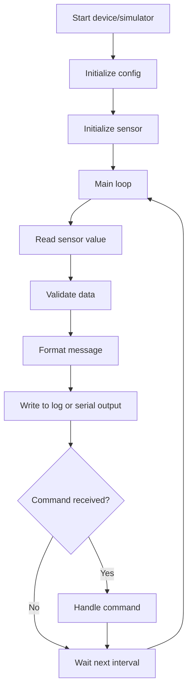

# Lab 04: STM32 Sensor Logger / Simulator

## Goal

Create a small embedded-style data logger or simulator inspired by STM32-based devices.

The goal is to understand how an embedded system reads sensor data, stores or transmits it, and works as a state machine.

You will practice:

- embedded-style thinking;
- state machines;
- sensor data modeling;
- serial communication format;
- logging;
- separation between hardware logic and application logic.

---

## Idea

A real STM32 device often reads data from sensors and sends it through UART, USB, radio, or another interface.

In this lab, you may either:

- implement the project for a real STM32 board;
- create a simulator on a PC that behaves like an STM32 device.

The simulator version is fully acceptable.

---

## Sensor Logger Workflow



---

## Task

Implement a sensor logger or simulator.

The system must periodically generate or read sensor data and output it in a structured format.

Example output:

```json
{
  "timestamp": "2026-05-08T12:00:00",
  "sensor": "temperature",
  "value": 24.7,
  "unit": "C"
}
```

---

## Functional Requirements

### 1. Sensor Data

Support at least one sensor type:

- temperature;
- humidity;
- voltage;
- distance;
- light level;
- custom simulated sensor.

Each measurement must have:

- timestamp;
- sensor name;
- value;
- unit.

### 2. Periodic Reading

The program must read or generate data periodically.

Requirements:

- configurable interval;
- continuous main loop;
- safe stop command or exit condition.

### 3. Output Format

Data must be printed or saved in a structured format.

Possible formats:

- JSON lines;
- CSV;
- plain text protocol;
- UART-like messages.

### 4. Commands

The system should support simple commands.

Examples:

- `START`;
- `STOP`;
- `STATUS`;
- `SET_INTERVAL 1000`.

Commands may come from console input, serial input, or simulated input.

---

## Suggested Project Structure

```txt
stm32-sensor-logger/
  README.md
  src/
    main.*
    Sensor.*
    SensorSimulator.*
    Logger.*
    CommandParser.*
    DeviceState.*
  logs/
```

---

## Difficulty Levels

### Basic

Implement:

- one simulated sensor;
- periodic data generation;
- console output;
- simple loop;
- README with explanation.

### Standard

Implement everything from Basic plus:

- multiple sensors;
- JSON or CSV logging;
- command parser;
- state machine with START/STOP;
- configurable interval.

### Advanced

Implement some of the following:

- real STM32 implementation;
- UART communication;
- checksum in messages;
- binary protocol;
- error states;
- data buffering;
- connection to a PC dashboard.

---

## Implementation Plan

1. Define measurement format.
2. Create sensor interface or class/module.
3. Implement simulated sensor values.
4. Add periodic reading loop.
5. Add logger.
6. Add command parser.
7. Add device states.
8. Add multiple sensors.
9. Refactor into modules.
10. Write README and prepare demo.

---

## Testing

Test at least the following:

- sensor values are generated or read
- timestamps are present
- output format is valid
- commands work
- state transitions work correctly

Automated tests are recommended but not strictly required. If you do not write automated tests, describe manual test cases in `README.md`.

---

## Demo

During the demo, show:

- start logger
- show periodic data output
- change interval or stop logging
- show logs
- explain state machine

---

## README Requirements

Your repository must include `README.md` with:

1. Project name.
2. Short description.
3. Selected difficulty level.
4. Technologies used.
5. How to run the project.
6. Main features.
7. Short explanation of the main algorithm or architecture.
8. Screenshots or demo link, if possible.
9. Known problems or limitations.

---

## Defense Questions

Be ready to answer:

1. What is the main loop?
2. What states does your device have?
3. How is sensor data represented?
4. How do commands affect the system?
5. How would this change on a real STM32?
6. How do you handle invalid commands?
7. What is the difference between simulator and firmware?

---

## Evaluation Criteria

| Criterion | Points |
|---|---:|
| Sensor data model | 15 |
| Periodic loop | 15 |
| Output/logging | 15 |
| Command handling | 15 |
| State machine | 15 |
| Code structure | 10 |
| README | 10 |
| Demo and defense | 5 |
| **Total** | **100** |

---

## Expected Result

At the end of this lab, you should have a working project called **STM32 Sensor Logger / Simulator**.

The project should demonstrate both programming skills and the ability to structure, explain, and present a small but non-trivial software system.
