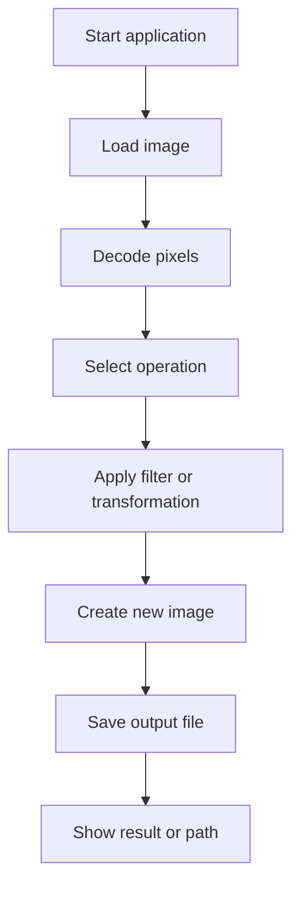

# Lab 05: Image Processor

## Goal

Create a simple image processing application.

The goal is to understand how images can be represented as pixels and how algorithms can transform those pixels.

You will practice:

- file input/output;
- working with matrices;
- pixel-level operations;
- filters;
- modular application design;
- testing visual results.

---

## Idea

An image can be treated as a 2D matrix of pixels. Each pixel has color components such as red, green, and blue.

Image processing means applying an operation to each pixel or to a group of neighboring pixels.

Examples:

- convert image to grayscale;
- invert colors;
- blur image;
- detect edges;
- resize image.

---

## Image Processing Workflow



---

## Task

Implement an image processor that loads an image, applies one or more transformations, and saves the result.

The application may be:

- console-based;
- desktop application;
- web application;
- simple script with command-line arguments.

---

## Functional Requirements

### 1. Image Loading

The application must load an image from a file.

Supported formats may include:

- PNG;
- JPG;
- BMP;
- PPM.

### 2. Image Operations

Implement at least three operations.

Required recommended operations:

- grayscale;
- color inversion;
- brightness change.

Additional operations:

- blur;
- sharpen;
- edge detection;
- resize;
- rotate;
- crop.

### 3. Output

The processed image must be saved as a new file.

Requirements:

- do not overwrite original image by default;
- output filename should be clear;
- invalid input file should be handled.

### 4. User Interface

The user should be able to choose operation.

Possible interfaces:

- command-line arguments;
- console menu;
- buttons in UI;
- API endpoint.

---

## Suggested Project Structure

```txt
image-processor/
  README.md
  src/
    main.*
    ImageLoader.*
    ImageProcessor.*
    filters/
      GrayscaleFilter.*
      InvertFilter.*
      BlurFilter.*
    ImageWriter.*
  input/
  output/
```

---

## Difficulty Levels

### Basic

Implement:

- load one image;
- grayscale filter;
- invert colors;
- save output image;
- simple README.

### Standard

Implement everything from Basic plus:

- at least three filters;
- command-line or menu selection;
- brightness/contrast adjustment;
- error handling;
- clean filter structure.

### Advanced

Implement some of the following:

- blur or convolution filters;
- edge detection;
- batch processing;
- preview UI;
- filter pipeline;
- custom kernel input;
- performance optimization.

---

## Implementation Plan

1. Load image file.
2. Read pixel data.
3. Implement grayscale.
4. Implement invert.
5. Implement brightness change.
6. Save image.
7. Add operation selection.
8. Add error handling.
9. Refactor filters into modules.
10. Write README and prepare demo.

---

## Testing

Test at least the following:

- valid image is loaded
- output image is saved
- filters produce visible changes
- invalid file is handled
- original image is not overwritten accidentally

Automated tests are recommended but not strictly required. If you do not write automated tests, describe manual test cases in `README.md`.

---

## Demo

During the demo, show:

- original image
- processed output
- different filters
- project structure
- how one filter works

---

## README Requirements

Your repository must include `README.md` with:

1. Project name.
2. Short description.
3. Selected difficulty level.
4. Technologies used.
5. How to run the project.
6. Main features.
7. Short explanation of the main algorithm or architecture.
8. Screenshots or demo link, if possible.
9. Known problems or limitations.

---

## Defense Questions

Be ready to answer:

1. How is an image represented in memory?
2. How does grayscale work?
3. How do you modify pixel colors?
4. What happens with invalid files?
5. How would you implement blur?
6. Why is filter structure useful?
7. How would you process many images?

---

## Evaluation Criteria

| Criterion | Points |
|---|---:|
| Image loading | 15 |
| Implemented filters | 25 |
| Output saving | 15 |
| User interface | 10 |
| Error handling | 10 |
| Code structure | 10 |
| README | 10 |
| Demo and defense | 5 |
| **Total** | **100** |

---

## Expected Result

At the end of this lab, you should have a working project called **Image Processor**.

The project should demonstrate both programming skills and the ability to structure, explain, and present a small but non-trivial software system.
