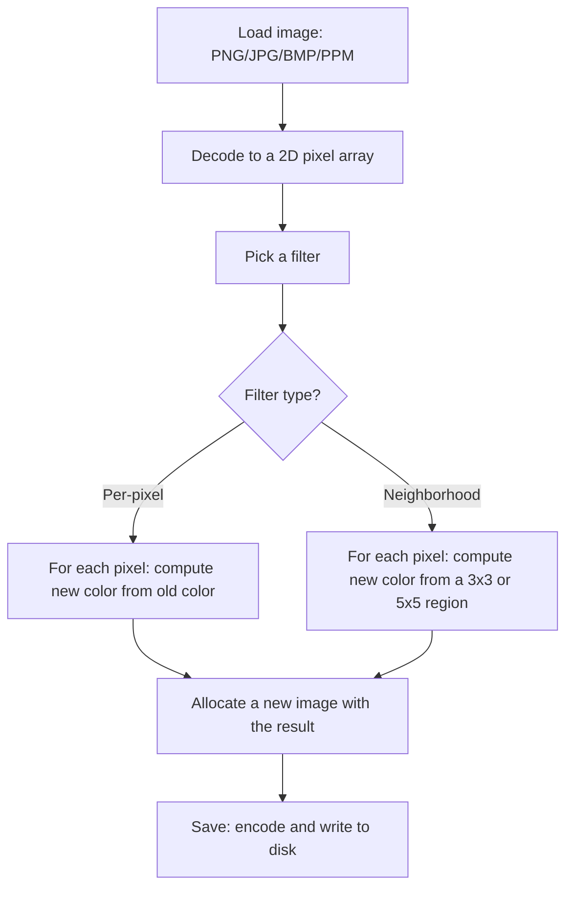

# Lab 05 — Pixels Are Just Numbers: Build an Image Processor

> "An image is just a 2D array. A filter is just a 2D array operation. Once you see this, half of computer vision is over."
> — every graphics professor on day one

**Time budget:** ~2 weeks, working at your own pace.
**Preferred language:** C++ or C# (any language is allowed; if you want a browser-based version, TypeScript with HTML canvas is also excellent).
**Working style:** solo, or in a team of up to 3 people. Both are equally welcome.

---

## The hook

Pick up your phone and look at a photo. There's no magic in it. There's no scene. It's a grid of numbers — a 2D array of small integers, three numbers per pixel for red, green, blue. That's the whole thing. Every filter you've ever swiped across an Instagram photo, every Snapchat lens, every "remove background" button, every Photoshop trick — all of them are short loops over those numbers.

In this lab you'll write those loops yourself. By the end of two weeks you'll be able to load an image, run it through your own filters — grayscale, invert, blur, sharpen, edge detect — and save the result. The first time you point your edge-detection filter at a photo of a friend and see their outline emerge from a sea of noise, you'll feel the same thing every computer-vision researcher felt the first time it worked for them: *that's all there is to it?* Yes. That's all.

If you want a perfect appetizer, watch 3Blue1Brown's [*But what is a convolution?*](https://www.youtube.com/watch?v=KuXjwB4LzSA) — 25 minutes, beautifully animated, and when you're done you'll *understand* the operation that does 80% of the work in this lab. Pair it with Computerphile's series on image processing (search "Computerphile Sobel" or "Computerphile blur" on YouTube — both are short and excellent).

---

## Why this is worth your time

- **An image is a 2D array.** Most working programmers never internalize this; the ones that do can answer half of computer-vision interview questions on instinct.
- The **convolution kernel** — a 3×3 grid of numbers slid over an image — is the engine behind classical image processing *and* the building block of every modern Convolutional Neural Network. After this lab, "CNN" stops being a buzzword.
- This is the rare lab where you can **see your code working** at every step. Bug in your filter? The output looks weird. Fix it? The output looks right. The feedback loop is instant.
- A small CLI you wrote that turns photos into edge maps is **the most fun command-line tool** you'll write all semester.

---

## The target

> **Instructor TODO:** add reference before/after image pairs to `docs/` once available.

**Basic — "It Filters"**
A program (CLI or simple GUI) that loads a `.png` file, applies a chosen filter (grayscale, invert, brightness adjust), and saves the result as a new file. The output looks correct: grayscale is grayscale, inversion looks like an old film negative, brightness +50 makes the image lighter. The CLI rejects bad input cleanly: missing files, unsupported formats, invalid arguments.

**Standard — "It Has a Toolbox"**
The program supports at least five filters, including at least one *neighborhood* filter (blur or sharpen) — meaning a filter that looks at a pixel's neighbors, not just the pixel itself. The CLI can chain filters: `grayscale → blur → edge-detect` in a single command. Brightness and contrast are adjustable as numeric parameters. Big images (≥ 4 megapixels) process in under a few seconds.

**Advanced — "It Surprises You"**
You've added something memorable: a **convolution engine** that can run any 3×3 kernel the user types in, **edge detection** with Sobel or Canny, **histogram equalization** that auto-improves contrast, **median filter** for noise reduction, **k-means color quantization** that reduces an image to N colors, **batch mode** that processes a folder, or a **live preview** GUI where you drag a slider and watch the output change.

---

## The big idea, in one diagram



Two flavors of filter are everything you need. **Per-pixel** filters (grayscale, invert, brightness) are a single `for` loop. **Neighborhood** filters (blur, sharpen, edge detection) are the same `for` loop, with another tiny `for` loop inside it that walks a small region — that's *convolution*, the trick the 3Blue1Brown video is about.

---

## Two-week plan with milestones

**Week 1 — Make per-pixel filters work**

- **Day 1 — Load and save.** Pick an image format and a library. Write a tiny program that *loads* `input.png` and *immediately saves* it to `output.png` without changing anything. *Milestone: round-trip works.* This sounds trivial; it's not, and it surfaces every encoding bug before you write a single filter.
- **Day 2 — Pixel access.** Print the RGB values of pixel (0, 0). Print pixel (100, 50). Loop over all pixels and count how many are "very dark" (sum of R+G+B < 100).
- **Day 3 — Grayscale.** For each pixel, compute `gray = 0.299*R + 0.587*G + 0.114*B` (the standard luminance formula — search "ITU-R BT.601" if curious). Set R, G, B all to `gray`. Save and admire. *Milestone: your first real filter.*
- **Day 4 — Invert.** For each pixel, set `R = 255 - R`, same for G and B. Save. The result looks like a film negative.
- **Day 5 — Brightness.** Add a number `b` (e.g., +30) to each channel, then **clamp** to 0–255. (Forgetting to clamp is the #1 first-week bug — overflow makes pixels wrap around and the image looks like a glitched JPEG.)
- **Day 6 — A clean CLI.** `imgproc input.png --filter grayscale --output out.png`. Use whatever argument-parsing library is idiomatic for your language. Validate inputs. Print a friendly help message.
- **Day 7 — Polish + a small README.** Take before/after screenshots. *Milestone: you have a working image processor.*

**At this point you've completed the Basic level. You can stop here and submit a real, defendable project.**

**Week 2 — Neighborhood filters and a real toolbox**

- **Day 8 — Box blur.** For each pixel, set its color to the *average* of itself and its 8 neighbors (a 3×3 region). Run on a photo. *Milestone: the image is visibly softer.* Notice that you must read from the *original* image and write to a *new* image — not in-place. (This is the same trap as Lab 14's cellular automata!)
- **Day 9 — Convolution engine.** Generalize the blur into `convolve(image, kernel)` where `kernel` is a 3×3 array of numbers. Test it: a kernel of all `1/9`s should be your blur from Day 8. Now you can implement many filters with the same engine.
- **Day 10 — More filters.** Sharpen kernel: `[[ 0,-1, 0],[-1, 5,-1],[ 0,-1, 0]]`. Edge detection kernel (simple): `[[-1,-1,-1],[-1, 8,-1],[-1,-1,-1]]`. Try them. Save. *Milestone: edges of objects pop out from the noise.*
- **Day 11 — Filter pipeline.** Allow chained filters from the CLI: `--pipeline grayscale,blur,edge`. Internally that just applies them in order.
- **Day 12 — Pick a side quest.**
- **Day 13 — README, before/after gallery, demo prep.**
- **Day 14 — Buffer day.**

---

## Levels

### Basic — "It Filters" (~8–12 hours)
- load and save at least one image format
- at least three filters: grayscale, invert, brightness
- a CLI or simple GUI to choose the filter
- input/output filenames as parameters
- the original image is never overwritten by accident
- error handling: missing file, unsupported format, invalid parameter

### Standard — "It Has a Toolbox" (~14–20 hours)
- everything from Basic
- at least 5 filters including ≥1 neighborhood filter (blur or sharpen)
- a generic convolution function that can run any 3×3 kernel
- adjustable parameters where it makes sense (brightness `+30`, blur radius `5`)
- a filter pipeline: chain multiple filters in one command
- handles large images (≥ 4 megapixels) in seconds, not minutes

### Advanced — "Side Quests" (each ~3–10h, pick what excites you)

- **Edge Detection Properly.** Sobel operator (two convolutions, then magnitude). The output looks like a pencil sketch of the input — magical.
- **Canny Edge Detector.** The full classic algorithm: blur → Sobel → non-maximum suppression → thresholding. Several days of work. Produces dramatically cleaner edges.
- **Custom Kernels.** Let the user paste a 3×3 kernel from the CLI: `--kernel "0 -1 0 -1 5 -1 0 -1 0"`. Suddenly your engine becomes a filter design playground.
- **Histogram + Equalization.** Compute and display the RGB histogram. Implement histogram equalization — a 30-line algorithm that auto-stretches contrast on dull photos. The result is often striking.
- **Median Filter.** Replace each pixel with the median of its 3×3 neighborhood. Removes salt-and-pepper noise without softening edges. Try it on a noisy photo.
- **K-Means Color Quantization.** Reduce a photo to N colors via k-means clustering (N = 8 or 16). The result looks like a vintage poster.
- **ASCII Art Mode.** Render the image as text characters mapped by brightness — `' .,:;ox%#@'`. Save it as a `.txt` file. Print it.
- **Live Preview GUI.** A simple window with the image and sliders for brightness/contrast/blur. As you drag, the image updates. The most addictive feature you can add.
- **Batch Mode.** Process a whole folder. `imgproc input/ --filter grayscale --output gray/`. With a progress bar.
- **GIF Maker.** Apply a filter with progressively stronger parameters across N frames; export as a GIF. Watching a photo slowly blur, frame by frame, is mesmerizing.

---

## Extension challenges (3–5 weeks)

The 2-week scope above ships a real, defendable image processor. If image processing pulls you in, here's how to grow it into a portfolio standout:

- **Ship a web playground.** A TypeScript port deployed to GitHub Pages — drag-drop a photo, pick a filter, download the result. Image tools shine on the web.
- **Combine with Lab 33 (computer vision).** Use your filters as the *preprocessing* stage of an object detector. Real CV pipelines are *exactly* "preprocess → infer → postprocess."
- **Combine with Lab 32 (neural net).** Train a tiny CNN to *learn* a filter (e.g., "make this look like a Sobel output") from data. Compare hand-coded vs. learned filters.
- **A real photo-editing app.** Add layers, undo/redo, exports at multiple sizes. Use it on your own photos.
- **GPU port.** Move the convolution loop to WebGL / a compute shader. Document the speedup. 100×+ is realistic.

---

## Make it yours (required)

Pick **one** personal twist:

- **Process something that means something.** A folder of your own photos. A photo of you and your grandparent (try edge detection — it's surprisingly emotional). A meme you want to deface. The covers of your favorite albums.
- **A signature filter.** Design *your own* filter or filter chain that produces a recognizable look — a "your-name-here Instagram filter". Document the kernel choices and parameters. Apply it to 5 different photos and put them in the README.
- **A specific use case.** Build a tiny "scan-to-pencil-sketch" tool: load a photo of a sketch you drew, threshold it, clean it up, export as a clean black-on-white PNG. Or a "passport photo" tool that crops and adjusts a portrait photo for an ID. Or a "low-bandwidth" tool that quantizes images for 1990s-era display.
- **Theme the CLI/UI.** Make the CLI feel like a 1980s graphics terminal, with green-on-black output and ASCII banners. Or make a glossy modern GUI with a single big "process" button.

You'll defend why you chose your twist.

---

## Working solo or in a team

You can do this lab alone or in a team of **up to 3 people**.

If you go solo: you'll touch I/O, math, and CLI design — three different muscles, all useful, all yours.

If you go as a team, sensible splits:

- *By layer:* one person owns the I/O (loading, saving, format conversion), the other owns filters (per-pixel + convolution + side quests).
- *By feature:* one person drives Basic (per-pixel filters + CLI), the other drives Standard (convolution engine + neighborhood filters + pipeline).
- *By output:* one person owns the engine, the other owns the front-end (CLI ergonomics, GUI if you do one, demo gallery).

For a 3-person team: add a "side quest + UX" owner — Sobel, equalization, live preview, the personal twist.

Two rules for teams:

1. **Use git from day one** with a branching workflow.
2. **In your README, list who did what.** Each member must be able to explain a convolution and walk through one neighborhood filter.

---

## Tooling and language tips

**C++**
- For PNG / JPG / BMP loading: [`stb_image.h`](https://github.com/nothings/stb) and `stb_image_write.h` — single-header, MIT, drop-in.
- For PPM output: literally just write text. Three lines of header, then RGB triples. No library needed.
- Build with `-O2`. A 4-megapixel convolution in `-O0` is *minutes*; in `-O2` it's a second.

**C#**
- `System.Drawing.Common` works on Windows; on cross-platform, [SixLabors.ImageSharp](https://github.com/SixLabors/ImageSharp) is the modern standard.
- For pixel access speed, lock the bitmap and walk the byte array — `GetPixel`/`SetPixel` are 100× too slow for this lab.
- Always run in `Release`.

**TypeScript (browser)**
- HTML `<canvas>` + `getImageData()` and `putImageData()`. The pixel array is a flat `Uint8ClampedArray` of `[R, G, B, A, R, G, B, A, ...]`.
- Drag-and-drop file input + a "process" button is a wonderful UX.
- Deploy to GitHub Pages — friends use your image processor without installing anything.

**Anyone**
- **Always allocate an output buffer.** Don't write filtered pixels back to the same buffer you're reading from — for neighborhood filters this corrupts the result (same bug as Lab 14).
- **Clamp every channel to 0–255 after every operation.** Forgetting to clamp is the #1 first-week bug.
- **Test on a tiny image first** — a 4×4 hand-crafted PPM is the best debugger.

---

## Suggested project structure

```txt
image-processor/
  README.md
  src/
    main.*
    io/
      ImageLoader.*
      ImageWriter.*
    filters/
      PerPixel/
        Grayscale.*
        Invert.*
        Brightness.*
      Neighborhood/
        Convolution.*       # the generic engine
        Blur.*              # 1/9 kernel
        Sharpen.*
        EdgeDetect.*
        Sobel.*             # if you do the side quest
      Pipeline.*            # chain filters
    cli/
      Args.*
  input/
    sample.png
  output/
    sample-grayscale.png
    sample-blur.png
  docs/
    before-after-gallery/
```

---

## When you get stuck

- **My output is all black or all white.** You forgot to clamp values to 0–255 *and* you're using an unsigned 8-bit type, so values overflow to wraparound. Always clamp after arithmetic.
- **The blur looks half-blurred / weird stripes appear.** You're reading and writing to the *same* image. For neighborhood filters, you must always read from a copy / source buffer and write to a fresh destination buffer.
- **The image looks slightly too dark or too green.** You probably skipped the proper grayscale luminance weights (`0.299, 0.587, 0.114`) and used a flat `(R+G+B)/3`. Both work, but luminance looks "right" to humans. Document which you used in your README.
- **The edges of the image are weird after a convolution.** You're trying to read pixel `(-1, -1)` which doesn't exist. Choose an edge policy: clamp coordinates to the edge, mirror them, or skip a 1-pixel border. Document your choice.
- **The whole thing is painfully slow.** Are you in Debug mode? Are you using `GetPixel` / `SetPixel` instead of locked bitmap access? Are you allocating a new array per pixel? All three are 100× perf hits.

If you're stuck for 30+ minutes: build a 4×4 hand-crafted image, run your filter, print the input and output side by side, and verify by hand.

---

## Submission checklist

- [ ] Tool runs end-to-end on a clean machine: clone → build → process a sample image → output saved.
- [ ] At least 5 filters work, including ≥ 1 neighborhood filter.
- [ ] No crash on edge cases: 1×1 image, fully black image, fully white, very large image, non-square image, images with alpha channels.
- [ ] Edge-policy for convolutions documented (clamp / mirror / skip).
- [ ] If you ported to web: **a live URL** (GitHub Pages, Vercel) — drag-drop a photo, get a result.
- [ ] **A before/after gallery** in the README — at least 5 input/output pairs.
- [ ] Pipeline chaining works: e.g., `--filter grayscale --filter blur=3 --filter sharpen`.
- [ ] Release-mode build benchmarked: 4MP image processed in seconds, not minutes.
- [ ] No private paths in source.

---

## What evaluators look at

- **They look at the gallery.** A side-by-side before/after for 5 different photos sells the project. *Use real, varied photos*; not just one stock image.
- **They check the convolution engine.** A clean, generic `applyKernel(image, 3x3 kernel)` function is the heart of this lab; reading it is the fastest way to judge engineering care.
- **They check the destination-buffer pattern.** Reading and writing to the same buffer is the signature bug; getting it right is signal.
- **They check clamping.** Wraparound bugs (where a bright pixel becomes black after a +30 brightness shift) reveal someone who didn't test enough.
- **They check performance.** A 4MP image processed in seconds = engineered. In minutes = "didn't think about real users."
- **They look at the personal twist.** A signature filter, a passport-photo tool, a pencil-sketch maker — these read as "I made something." Generic gray-scale-on-cat-photo reads as "I followed a tutorial."

---

## What to put in your README

1. Project name + one-sentence description.
2. **A before/after image pair at the top.** A photo and its edge-detected version is the most striking option.
3. Which level + side quests.
4. Your personal twist and why.
5. How to run it + at least 3 example commands.
6. A short paragraph in your own words explaining what a convolution is.
7. (Optional but loved) A small gallery: same input, 4–6 different filters.
8. If you worked in a team — who did what.

---

## Reflection

Be ready to:

1. **Run a filter on a photo I provide**, live. Save and open the result.
2. **Walk through your `convolve` function** in plain English.
3. **Explain why you can't apply blur in-place.** Demonstrate what goes wrong if you try.
4. **What would you change** in your sharpen kernel to make it stronger?
5. **Why does grayscale weight green more heavily** than red and blue? (Hint: human eyes.)
6. **Where does your code break** on a 1×1 image? On a fully transparent PNG? On a non-square image?
7. **What was the hardest bug** and how did you find it?

---

## Showcase

At the end of the semester there will be a small gallery — anonymous voting for **most striking before/after**, **most useful real tool**, and **most creative custom filter**. Bring 3 input/output pairs and the filter that produced them.

---

## Going further

- *But what is a convolution?* by 3Blue1Brown (the appetizer above).
- *Digital Image Processing* by Gonzalez & Woods — the textbook. Heavy. Comprehensive. Beautiful diagrams.
- The Computerphile YouTube channel — short, friendly videos on Sobel, Gaussian blur, JPEG compression, and more.
- The OpenCV documentation — once you've written your own convolution, OpenCV's `cv2.filter2D` will feel like a precision tool, not a black box.
- The original [Canny edge detection paper](https://www.cse.unr.edu/~bebis/CS474/Handouts/Canny.pdf) (1986) — readable and elegant.

---

## A final word

Most students go through their entire CS degree without realizing that an image is *just* a 2D array of numbers. After this lab, you'll never forget. That single shift makes the entire field of computer vision suddenly approachable. The convolution you'll build in Day 9 is the same operation a deep neural network does — millions of times — to recognize a cat. You're starting at the beginning of a very long, very interesting road.
