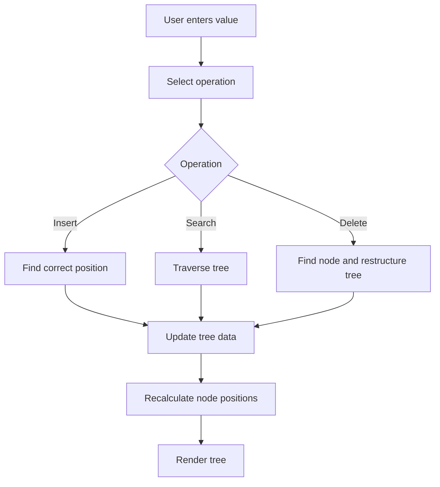

# Lab 06: Digital Tree Visualizer

## Goal

Create a visual application that shows how a tree data structure works.

The goal is to understand tree operations and make them visible through a frontend or graphical interface.

You will practice:

- tree data structures;
- recursion;
- search, insert, and delete operations;
- visual rendering;
- UI state management;
- algorithm explanation.

---

## Idea

A tree consists of nodes connected by parent-child relationships.

In this lab, you will create a visualizer for one tree type, for example:

- binary search tree;
- general tree;
- trie;
- expression tree.

The recommended option is **Binary Search Tree**.

---

## Tree Operation Workflow



---

## Task

Implement a visual tree application.

The user must be able to:

- add values;
- search for a value;
- delete a value;
- see the tree structure on screen.

---

## Functional Requirements

### 1. Tree Structure

Implement a tree data structure.

Recommended: Binary Search Tree.

Each node should contain:

- value;
- left child;
- right child.

### 2. Insert Operation

The user must be able to insert a value.

Requirements:

- new values are placed according to tree rules;
- duplicate handling must be explained;
- tree is redrawn after insertion.

### 3. Search Operation

The user must be able to search for a value.

Requirements:

- show whether value exists;
- optionally highlight visited nodes;
- explain search path.

### 4. Delete Operation

The user must be able to delete a value.

Requirements:

- handle leaf nodes;
- handle nodes with one child;
- handle nodes with two children, or explain limitation.

### 5. Visualization

The application must show:

- nodes;
- edges;
- root;
- parent-child relationships.

---

## Suggested Project Structure

```txt
digital-tree-visualizer/
  README.md
  src/
    main.*
    tree/
      TreeNode.*
      BinarySearchTree.*
    visualization/
      TreeRenderer.*
    ui/
      Controls.*
```

---

## Difficulty Levels

### Basic

Implement:

- insert values;
- display tree;
- simple search;
- no delete or simple delete only for leaf nodes.

### Standard

Implement everything from Basic plus:

- full search;
- delete operation;
- highlight visited nodes;
- clean visual layout;
- clear module structure.

### Advanced

Implement some of the following:

- animated traversal;
- AVL tree balancing;
- trie visualization;
- import/export tree as JSON;
- step-by-step algorithm mode;
- multiple traversal modes.

---

## Implementation Plan

1. Implement tree node.
2. Implement insert operation.
3. Render tree nodes.
4. Render edges between nodes.
5. Add search operation.
6. Add node highlighting.
7. Add delete operation.
8. Improve layout.
9. Refactor into modules.
10. Write README and prepare demo.

---

## Testing

Test at least the following:

- insert places values correctly
- search finds existing values
- search handles missing values
- delete works for required cases
- visualization updates after operations

Automated tests are recommended but not strictly required. If you do not write automated tests, describe manual test cases in `README.md`.

---

## Demo

During the demo, show:

- insert several values
- search for a value
- delete a value
- show visual tree update
- explain one operation

---

## README Requirements

Your repository must include `README.md` with:

1. Project name.
2. Short description.
3. Selected difficulty level.
4. Technologies used.
5. How to run the project.
6. Main features.
7. Short explanation of the main algorithm or architecture.
8. Screenshots or demo link, if possible.
9. Known problems or limitations.

---

## Defense Questions

Be ready to answer:

1. What tree type did you implement?
2. How does insert work?
3. How does search work?
4. How do you handle duplicates?
5. How does delete work?
6. How are node positions calculated?
7. What is recursion used for?

---

## Evaluation Criteria

| Criterion | Points |
|---|---:|
| Tree data structure | 20 |
| Insert/search/delete | 25 |
| Visualization | 20 |
| UI controls | 10 |
| Code structure | 10 |
| README | 10 |
| Demo and defense | 5 |
| **Total** | **100** |

---

## Expected Result

At the end of this lab, you should have a working project called **Digital Tree Visualizer**.

The project should demonstrate both programming skills and the ability to structure, explain, and present a small but non-trivial software system.
