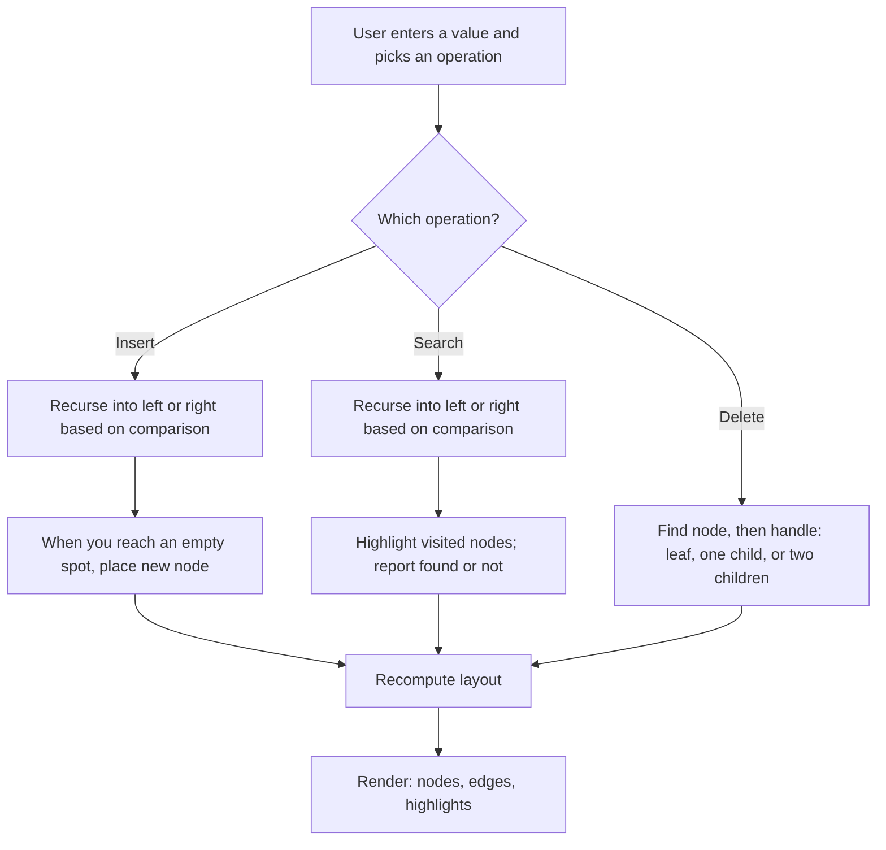

# Lab 06 — See Your Data Think: Build a Tree Visualizer

> "If I had known the data structure was a tree, I would have written half the code."
> — every engineer, eventually

**Time budget:** ~2 weeks, working at your own pace.
**Preferred language:** C# or TypeScript (any language is allowed; this is a UI-heavy project, so language with easy graphics wins — TypeScript with HTML canvas/SVG is excellent here, C# with WPF/Avalonia/MAUI is also great. C++ with raylib works but is more setup).
**Working style:** solo, or in a team of up to 3 people. Both are equally welcome.

---

## The hook

Most data structures live in your head as boxes and arrows on paper. You write the code, you write the tests, but you never quite *see* the thing you've built. A binary search tree is the perfect data structure to fix that — it has a shape, and that shape is the algorithm. Watching a balanced BST grow as you insert values, watching it stretch into a linked-list nightmare when you insert sorted data, watching the search lighting up nodes one by one as it walks down the tree — it's the most direct visual proof that "the data structure you choose decides how fast your program is."

In this lab you'll build a real, interactive BST visualizer. Type a number, watch the tree make room. Type another number, watch it find its spot. Search for a value, watch the algorithm trace its path. By the end, you won't be able to look at a tree on a whiteboard the same way again.

If you want a 30-second appetizer, open [VisuAlgo's BST page](https://visualgo.net/en/bst) right now in another tab and play with it for a few minutes — that's a famous, polished version of what you're about to build. For deeper understanding, MIT OpenCourseWare's *6.006 — Introduction to Algorithms*, [Lecture 5: Binary Search Trees](https://www.youtube.com/watch?v=9Jry5-82I68) is the canonical 50-minute lecture. (Erik Demaine is a wonderful teacher.)

---

## Why this is worth your time

- **Trees are everywhere.** File systems, JSON, the DOM, every database index, every compiler's syntax tree. Once you've built one, you'll see them in every system you ever touch.
- **Recursion finally clicks.** Insert, search, and delete on a BST are *the* canonical recursive algorithms. They're the example in every textbook for a reason.
- A working visualizer is a **portfolio piece that interviewers love**, because it proves you understand the data structure deeply enough to render it.
- It's the **rare project where the interface is the algorithm**. The visualization isn't a layer on top — it *is* the lesson.

---

## The target

> **Instructor TODO:** add reference screenshots to `docs/` once available. (Compare against [VisuAlgo](https://visualgo.net/en/bst) for the look-and-feel target.)

**Basic — "It Grows"**
A text input and an "Insert" button. Each value typed appears as a circle node connected to its parent by a line. The tree visibly grows as you insert. A search box highlights the path the search algorithm takes (for example, by coloring visited nodes yellow). Tree positions are computed automatically — the user doesn't place nodes by hand.

**Standard — "It Operates"**
You can insert, search, and delete values. Delete handles all three cases — leaf, one child, two children — with a clean animation that shows what's happening. The tree always re-lays out cleanly so it never overlaps itself. Visited nodes light up during search; you can see the comparison happen.

**Advanced — "It Balances"**
You've added something that goes beyond a basic BST: maybe AVL self-balancing with rotation animations, or a trie that auto-completes English words from a dictionary, or a side-by-side comparison of "BST vs sorted-input BST" to show why balancing matters, or a step-by-step playback mode where you can replay any operation slowly.

---

## The big idea, in one diagram



Insert, search, and delete all share the same skeleton: a recursive walk that compares the input to the current node and goes left or right. Delete is the only operation with real edge cases (specifically: deleting a node with two children — read about "in-order successor").

---

## Two-week plan with milestones

**Week 1 — Build the tree, then make it visible**

- **Day 1 — Pen on paper first.** Draw a BST on paper for the values `[50, 30, 70, 20, 40, 60, 80]`. Make sure you understand exactly where each node ends up *before* you write a line of code. Spend 15 minutes here. It saves hours.
- **Day 2 — The tree, in code (no UI yet).** Implement `TreeNode { value, left, right }` and `BST { root }`. Add `insert(value)` and a tiny `printInOrder()` debug helper. Insert ten values, print them in order — should come out sorted. *Milestone: a working BST that you can verify in the console.*
- **Day 3 — A blank canvas.** Open a window or browser canvas. Draw a single circle in the middle. Draw a line from one point to another. Get comfortable with the rendering API.
- **Day 4 — Lay out the tree.** Write a `layout` function that walks the tree and assigns each node an `(x, y)` coordinate. The simplest layout: depth determines `y`, in-order index determines `x`. Render circles at those coordinates and lines between parents and children. *Milestone: your tree appears on screen.* Take a screenshot.
- **Day 5 — Insert via UI.** A text input + a button. Typing `42` and clicking Insert calls `bst.insert(42)` and re-renders. Watch your tree grow.
- **Day 6 — Search with highlights.** Implement search. As it walks the tree, color the visited nodes yellow; color the final node green if found, red if not. Add a small "trace" panel that prints `42 < 50, go left → 42 > 30, go right → ...`.
- **Day 7 — Polish + screenshot.** Round corners, nicer font, tasteful colors. *Milestone: the tree explains itself when you use it.*

**At this point you've completed the Basic level. You can stop here and submit a real, defendable project.**

**Week 2 — Make it operate fully and add depth**

- **Day 8–9 — Delete (the right way).** Implement deletion. Three cases: leaf (just unlink), one child (replace with the child), two children (replace with in-order successor, then delete that successor). Animate the change.
- **Day 10 — Layout polish.** Make sure the tree never overlaps itself. The naive layout can produce overlap on deep, unbalanced trees. Look up "Reingold-Tilford tree layout" if you want the proper version, or use a simpler heuristic: subtree-width-aware spacing.
- **Day 11–12 — Pick a side quest.**
- **Day 13 — README, screenshots, demo prep.**
- **Day 14 — Buffer day.**

---

## Levels

### Basic — "It Grows" (~8–12 hours)
- a working BST with insert and search (delete optional or leaf-only)
- a real visual rendering — nodes as circles, edges as lines
- automatic layout (no manual node placement)
- visited nodes are highlighted during search
- input validation (no duplicates crash, no empty input crash)

### Standard — "It Operates" (~15–20 hours)
- everything from Basic
- delete operation handling all three cases
- clean re-layout after every operation (no overlap)
- a "trace" panel showing the comparisons in plain English
- duplicates are handled with an explicit policy you've chosen (reject? keep one? keep count?) and explained in the README
- clean separation between BST logic, layout logic, and rendering

### Advanced — "Side Quests" (each ~4–10h, pick what you find cool)

- **AVL Mode.** Implement AVL rotations. Add a toggle: insert to BST vs insert to AVL. Watch how the AVL stays balanced. **Animate the rotation** — it's the most satisfying animation in this lab.
- **Red-Black Mode.** Harder than AVL but more famous (it's the tree behind `std::map`, Java's `TreeMap`, the Linux kernel's CFS scheduler). Color the nodes correctly.
- **Trie Mode.** Switch the data structure to a trie. Load 10000 English words from a dictionary file. Build an autocomplete: type "ho" and the tree highlights all paths leading to "house", "horse", "honey", etc.
- **Step-by-step Playback.** Every operation can be replayed slowly with `<` and `>` keys. Like a debugger for your tree.
- **Compare Mode.** Two trees side by side. Insert the same sequence into both — say a BST and an AVL. Watch the BST become a long line while the AVL stays balanced.
- **Traversal Animations.** Buttons for in-order, pre-order, post-order, BFS. Each one walks the tree slowly with highlights. Excellent teaching tool.
- **JSON I/O.** Save the current tree as JSON, load it back. Now you can share trees as files.
- **Beauty Mode.** Replace circles with cards (showing extra info — child count, depth). Use a color palette that means something. Make it look like a finished product, not a homework assignment.

---

## Extension challenges (3–5 weeks)

The 2-week scope above ships a real, defendable visualizer. If algorithm visualization pulls you in, here's how to grow it into a portfolio standout:

- **Ship to the web.** A TypeScript + SVG version deployed to GitHub Pages — shareable URL, instant demo. Algorithm visualizers are uniquely strong portfolio pieces *only* when they're playable in-browser.
- **Build a teaching website.** Multiple data structures (BST, AVL, red-black, trie, heap) with narrative explanations and step-by-step walks. Distill.pub / Bret Victor energy.
- **Combine with [Lab 22](lab-22-spa-frontend.md).** A SPA that's *the visualizer* — polished UI, routing between data structures, save/load tree configurations.
- **Combine with [Lab 7](lab-07-graph-route-finder.md) (graph algorithms).** Same engine, but now visualize graph traversals — BFS, DFS, Dijkstra, A\*. Two labs, one beautiful product.
- **Open source it.** Ship as an npm package other students can drop into their own pages. *Wildly* impressive.

---

## Make it yours (required)

Pick **one** personal twist:

- **Operate on something that means something.** Don't just insert numbers — insert names of friends, words from a favorite song, the leaderboard scores from a game you play. The BST is the same; the *story* is yours.
- **Re-theme the visualization.** Forest mode (nodes are leaves, branches are tree branches), neural network mode (nodes are circles with glow, edges are pulsing wires), blueprint mode (white-on-blue technical-drawing aesthetic), retro CRT mode (green text, scan lines).
- **Embed a teaching narrative.** A sidebar that, in plain English, explains every operation as it happens — "I'm comparing 42 to 50. 42 is less, so I go left. The left subtree's root is 30. 42 is greater, so I go right..."
- **Tournament bracket mode.** Use the BST shape to model something a tree naturally fits — a tournament bracket, a folder hierarchy, a phylogenetic tree.

You'll defend why you chose your twist.

---

## Working solo or in a team

You can do this lab alone or in a team of **up to 3 people**.

If you go solo: you'll touch the algorithms *and* the rendering, which is a powerful combination — you'll understand the data structure twice as deeply because you've expressed it visually.

If you go as a team, sensible splits:

- *By layer:* one person owns the BST (insert / search / delete logic, plus tests), the other owns rendering and UI (layout, animations, controls).
- *By feature:* one person drives Basic (insert, search, layout), the other drives Standard (delete, trace panel, polish) plus a side quest.
- *By data structure:* one person owns the BST, the other owns AVL / trie / red-black for the side-quest level.

For a 3-person team: add a "narrative + UX + personal twist" owner who handles the trace panel, the theme, and the polish.

Two rules for teams:

1. **Use git from day one** with a branching workflow.
2. **In your README, list who did what.** Each member must be able to walk through insert, search, *and* delete on demand.

---

## Tooling and language tips

**TypeScript (browser)** — the easiest path for this lab
- Plain HTML + a `<canvas>` and `<svg>` works wonderfully. SVG is especially good here — each node is a real DOM element you can animate with CSS.
- Frameworks are not required, but if you want one: Svelte, React, or vanilla TS all work.
- You can deploy to GitHub Pages and share a link with friends.

**C#**
- WPF is the most natural fit — `Canvas` panel, `Ellipse` for nodes, `Line` for edges, animations come for free.
- Cross-platform: [Avalonia](https://avaloniaui.net/) is essentially WPF that runs on macOS and Linux.
- Windows Forms also works but is uglier.

**C++**
- raylib makes this doable (`DrawCircle`, `DrawLine`) but text rendering is a chore. Consider using ImGui as a wrapper if you want UI buttons.
- For just-the-algorithm + console rendering, C++ is fine — but you'll lose the "it looks alive" feel that makes this lab fun.

**Anyone**
- **Don't compute coordinates inside your insert/search/delete code.** Keep BST operations pure (they only touch the tree). Have a separate `layout(tree)` function that decides where nodes appear on screen. This separation is the cleanest single design decision in this lab.

---

## Suggested project structure

```txt
tree-visualizer/
  README.md
  src/
    main.*
    tree/
      TreeNode.*
      BST.*               # insert, search, delete (pure tree logic)
      AVLTree.*           # if you do the side quest
    viz/
      Layout.*            # walks the tree, assigns (x, y)
      TreeRenderer.*      # nodes, edges, highlights
      Animator.*          # smooth transitions when the tree changes
    ui/
      Controls.*          # input box, buttons, trace panel
  docs/
    milestone-screenshots/
```

---

## When you get stuck

- **Nodes overlap each other.** Your layout uses fixed horizontal spacing per depth, but unbalanced subtrees need different widths. Either give each node spacing proportional to its subtree size, or look up "Reingold-Tilford".
- **Insert seems to work but `printInOrder` is wrong.** Almost always: you're inserting into the wrong subtree, or you forgot to handle the "current node is null" base case.
- **Delete with two children corrupts my tree.** Walk through it on paper first. The trick is always: find the in-order successor (the smallest value in the right subtree), copy its value into the node you're "deleting", then delete the successor (which has at most one child).
- **Search highlight stays after I do another operation.** Reset highlight state at the start of every render or every new operation.
- **The whole canvas flickers.** You're probably re-creating DOM nodes / shapes every frame instead of updating their attributes. Or you're not using double-buffering in a desktop UI.

If you're stuck for 30+ minutes: drop the UI, work on a 5-node tree in the console with `printInOrder`, fix the algorithm, then re-attach the UI.

---

## Submission checklist

- [ ] Visualizer runs end-to-end on a clean machine.
- [ ] Insert / search / delete all work without crashing on edge cases (empty tree, single node, sequential inserts producing a "linked list").
- [ ] Layout updates cleanly after every operation; no overlaps.
- [ ] Search highlight clears between operations.
- [ ] If you ported to web: **a live URL** (GitHub Pages, Vercel, Netlify — all free).
- [ ] **A 15-second GIF** in the README — preferably a search animating its way to a node.
- [ ] No private paths in source.
- [ ] README explains your duplicate-handling policy.

---

## What evaluators look at

- **They watch the GIF.** A search highlighting its way down the tree, or an AVL rotation, sells the project in 5 seconds.
- **They look at BST/layout/render separation.** Pure tree logic, separate from layout, separate from rendering = strong engineering signal. Tangled code reads as "barely got it working."
- **They test the delete-with-two-children case.** This is the hardest case in any BST; getting it right (in-order successor swap) reads as algorithmic care.
- **They look at the "trace" panel** if you built it. Plain-English narration of comparisons makes the project unique among algorithm-visualizer portfolios.
- **They look at code clarity.** A 30-line `insert` is fine; a clever recursive one-liner that's unreadable is worse than no clever solution.
- **They poke pathological inputs.** Sequential `1, 2, 3, 4, 5` produces a linked list — does your visualizer handle it gracefully? Does the README acknowledge it?

---

## What to put in your README

1. Project name + one-sentence description.
2. **A screenshot of your tree at the top**, ideally with a search highlight active.
3. Which level + which side quests.
4. Your personal twist and why.
5. How to run it.
6. A short paragraph explaining how a search walks the tree, in your own words.
7. Your duplicate-handling policy and why you chose it.
8. (Optional but loved) A milestone gallery — first node, first 5 nodes, after a delete, after a balance.
9. If you worked in a team — who did what.

---

## Reflection

Be ready to:

1. **Insert the values `5, 3, 8, 1, 4, 7, 9` live**, in that order. Show me the resulting tree.
2. **Now insert `1, 2, 3, 4, 5` into a fresh tree.** Show me the result. Explain why this is bad and what AVL would do instead.
3. **Delete a node with two children**, live. Walk me through which node replaces it and why.
4. **Where does your code break** if I insert the same value twice? Insert nothing? Search in an empty tree? Delete a value that isn't there?
5. **Walk through your `layout` function.** What decides each node's `x`?
6. **What's the time complexity** of insert in your tree, in the best case and the worst case? Why are they different?
7. **What was the hardest bug**, and how did you find it?

---

## Showcase

At the end of the semester there will be a small gallery — anonymous voting for **best visual design**, **most informative trace narration**, and **most creative personal twist** (best non-numeric dataset, best theme, etc.). Bring a 30-second screen recording of an insert + search + delete sequence.

---

## Going further

- *Introduction to Algorithms* (CLRS), Chapters 12–13 — the textbook reference for BSTs and Red-Black trees.
- MIT 6.006 (free on OCW) — Lectures 5 and 6 on BSTs and AVL trees. Erik Demaine is a treasure.
- [VisuAlgo](https://visualgo.net/en/bst) — your reference benchmark for "good".
- *Algorithms, 4th Edition* by Sedgewick & Wayne — the cleanest BST chapter ever written, plus a free online companion.
- For trie fans: search "How autocomplete works" for the practical link to real systems.

---

## A final word

The first time you watch a search walk down your own tree, lighting up nodes one comparison at a time, you'll feel something specific: the data structure stops being a textbook abstraction and becomes a *thing*. Save that moment. The semester after this lab, when an interviewer asks you "what's a BST?", you'll have an answer that comes from your hands, not your memory.
