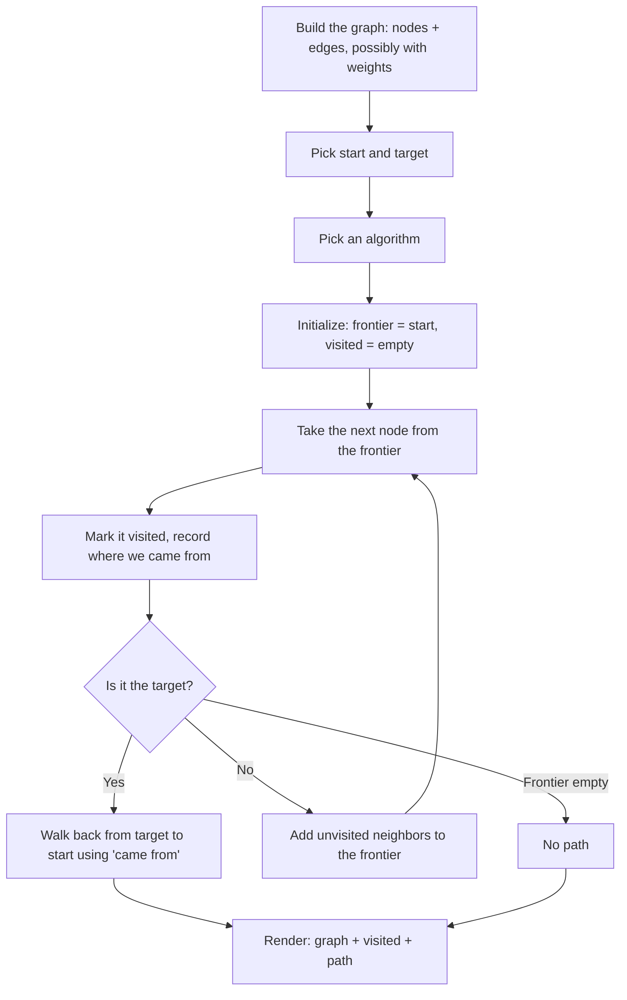

# Lab 07 — Everything Is a Graph: Build a Route Finder

> "The shortest path problem is the foundation of computer science. Almost every other algorithm is a special case of it."
> — Edsger Dijkstra, more or less

**Time budget:** ~2 weeks, working at your own pace.
**Preferred language:** C# or TypeScript (any language is allowed; this lab is visualization-friendly, so a language with easy graphics wins. C++ also works fine).
**Working style:** solo, or in a team of up to 3 people. Both are equally welcome.

---

## The hook

In 1736, Leonhard Euler walked across the seven bridges of Königsberg and asked himself a simple question: *can I cross every bridge exactly once?* The answer (no), and the way he proved it, accidentally invented the entire field of **graph theory**. Three centuries later, that one paper is the reason your phone can plan a 700 km drive in under a second, the reason Facebook can suggest friends-of-friends, and the reason DNS resolves your favorite website in milliseconds.

In 1956, a young Dutch programmer named Edsger Dijkstra was sitting in an Amsterdam café, designing the demo program for a new computer. He had 20 minutes. He needed a problem that was easy to explain and impressive to watch. He invented the **shortest-path algorithm** that now bears his name. Every GPS in the world uses a descendant of Dijkstra's idea.

In this lab you'll build the route finder yourself. Cities and roads, friends and connections, web pages and links — all the same shape underneath. Once you can find the path between any two nodes, you'll start seeing graphs in every system you touch.

If you want a perfect appetizer, read [*Introduction to A\**](https://www.redblobgames.com/pathfinding/a-star/introduction.html) by Amit Patel at Red Blob Games. It is the most-cited pathfinding tutorial on the entire internet — interactive, gorgeously illustrated, and exactly the right length. For cultural context, look up the *Six Degrees of Kevin Bacon* and the *Erdős number*: two delightful proofs that real-world networks are surprisingly small.

---

## Why this is worth your time

- **Graphs are everywhere.** Maps, social networks, the web, every dependency manager (`npm`, `pip`, `apt`), every compiler, every database query optimizer. Once this clicks, half of computer science suddenly has the same skeleton.
- BFS, DFS, and Dijkstra are **the three most-asked algorithms in technical interviews.** This is the highest-leverage two weeks you can spend.
- Watching an algorithm explore a graph — radiating outward from the start, following every wrong turn, finding the path — is **one of the most satisfying visualizations in programming.**
- This lab pairs a real algorithm with a real visualization. Most courses give you only one or the other.

---

## Note: how this lab differs from [Lab 10](lab-10-maze-generator-solver.md) (maze solver)

Both labs use BFS / DFS on grids and graphs. The difference is the *shape*:

- **[Lab 10](lab-10-maze-generator-solver.md)** uses a **rigid grid** — every cell has up to 4 neighbors at fixed positions. The graph is implicit; you don't store edges.
- **Lab 07** uses a **general graph** — nodes can be anywhere, edges can connect any pair, and you store them explicitly. This is the form GPS, social networks, and the web actually use.

If you've already done [Lab 10](lab-10-maze-generator-solver.md), this lab is the natural sequel: same algorithms, more flexible structure, more interesting examples.

---

## The target

> **Reference video:** [A* Pathfinding (E01: algorithm explanation) — Sebastian Lague](https://www.youtube.com/watch?v=-L-WgKMFuhE) — the cleanest A* explanation on YouTube. Pair with Computerphile's [A* (A Star) Search Algorithm](https://www.youtube.com/watch?v=ySN5Wnu88nE) for a tighter intuition primer.

**Basic — "It Finds a Path"**
A graph displayed on screen — circles for nodes, lines for edges, labels for names. The user picks a start and a target (by clicking, by keyboard, or by typing the names). The program runs BFS and shows the resulting path highlighted in yellow. Visited nodes are colored light blue. If no path exists, you get a clean "no path" message.

**Standard — "It Compares Algorithms"**
Same view, but now BFS, DFS, and Dijkstra are all available. Edges have visible *weights* (distances, time costs, anything). You can switch algorithms with a button and see *very* different results — BFS spreads in a flood, DFS snakes along one route, Dijkstra prioritizes shorter edges. The graph can be loaded from a JSON file. You can drag nodes around to rearrange the layout.

**Advanced — "It Routes Real Things"**
You've added something with real-world weight: A\* with a heuristic, an OpenStreetMap layer with actual roads, a Six Degrees of Kevin Bacon explorer (load an actor-movie graph and find the shortest path between any two actors), a graph editor where the user builds graphs by clicking, or a side-by-side animation of all four algorithms (BFS, DFS, Dijkstra, A\*) racing on the same graph.

---

## The big idea, in one diagram



The skeleton is *identical* for BFS, DFS, and Dijkstra. The only thing that changes is what kind of frontier you use:

| Algorithm | Frontier | What it finds |
|---|---|---|
| BFS | Queue (FIFO) | Shortest path in **edges** |
| DFS | Stack (LIFO) | *A* path, not necessarily shortest |
| Dijkstra | Priority queue (min by total cost) | Shortest path in **weight** |
| A* | Priority queue (min by cost + heuristic) | Same as Dijkstra, faster |

That table is half of an algorithms textbook in four lines.

---

## Two-week plan with milestones

**Week 1 — Build the graph and find a path**

- **Day 1 — The data structure.** Define `Node { id, name }` and `Edge { from, to, weight }`. Implement `Graph` as an adjacency list (`Map<NodeId, Node[]>` or similar). Hardcode a small example: 7 cities connected by 10 roads.
- **Day 2 — Pretty-print.** Print the graph in the console: `Kyiv → [Lviv, Odesa, Kharkiv]`. Verify the structure by eye before you write a single algorithm.
- **Day 3 — BFS.** Implement BFS from start to target, with a `cameFrom` map for path reconstruction. Test on your hardcoded graph. *Milestone: console output of `[Kyiv, Lviv, Krakow]`.*
- **Day 4 — Visualize.** Open a window. Lay nodes out in a circle (`x = cos(angle)`, `y = sin(angle)`). Draw circles, labels, edges. *Milestone: a graph on screen.*
- **Day 5 — Highlight the path.** Color visited nodes light blue, the final path yellow. *Milestone: a real picture of an algorithm.* Take a screenshot.
- **Day 6 — Pick start/target interactively.** Click a node to pick start, click another to pick target. The algorithm reruns and re-highlights.
- **Day 7 — Polish + a "no path" graph.** Add a disconnected graph as a test case. Verify the no-path branch is clean.

**At this point you've completed the Basic level. You can stop here and submit a real, defendable project.**

**Week 2 — More algorithms, real-world data**

- **Day 8 — DFS.** Same skeleton, swap the queue for a stack. Notice how visually different the search looks.
- **Day 9 — Weighted edges + Dijkstra.** Add weights to your edges (distance in km, or time in minutes). Implement Dijkstra with a priority queue. Verify it finds *cheaper* paths than BFS, even when BFS's path is shorter in number of edges. *Milestone: a path that depends on edge weights.*
- **Day 10 — Algorithm picker.** A dropdown or three buttons: BFS, DFS, Dijkstra. Switch between them on the same graph and watch the difference.
- **Day 11 — Load from JSON.** Move from hardcoded to file-loaded graphs. Now you can ship multiple datasets.
- **Day 12 — Pick a side quest.**
- **Day 13 — README, screenshots, demo prep.**
- **Day 14 — Buffer day.**

---

## Levels

### Basic — "It Finds a Path" (~10–14 hours)
- a `Graph` data structure (adjacency list recommended)
- at least one algorithm (BFS or DFS) with proper path reconstruction
- a visual rendering of the graph (nodes + edges + labels)
- start and target selection (click or keyboard)
- the visited region and the final path are highlighted differently
- "no path" handled cleanly

### Standard — "It Compares Algorithms" (~16–22 hours)
- everything from Basic
- both BFS *and* one of {DFS, Dijkstra} implemented
- edge weights and weighted shortest path (Dijkstra recommended)
- graph loaded from a JSON or text file
- algorithm switching at runtime
- a clean separation between graph data, algorithm, and rendering

### Advanced — "Side Quests" (each ~3–10h, pick what you find cool)

- **Dijkstra's Café.** Implement Dijkstra with a real priority queue (binary heap). Beat your BFS by an order of magnitude on weighted graphs. Mention in the README that Dijkstra invented this in 20 minutes in a café in 1956.
- **A\*.** Add a Manhattan or Euclidean heuristic. Watch how A\* makes a beeline toward the target compared to Dijkstra's circle-of-exploration. Read [Red Blob Games](https://www.redblobgames.com/pathfinding/a-star/introduction.html); it's the canonical reference.
- **Six Degrees of Kevin Bacon.** Load an actor-movie graph (small subset of IMDb) and find the shortest path between any two actors. The default is Kevin Bacon. Surprise your friends.
- **OpenStreetMap.** Download a small `.osm` file (a city, a neighborhood) and convert it into a graph. Now you have a real route finder.
- **Algorithm Race.** Run two or more algorithms simultaneously, animated. Watch BFS, Dijkstra, and A\* race on the same graph. The differences are mesmerizing.
- **Animated Search.** Slow the algorithm to one node per ~50 ms. Watch the frontier expand. The most teaching-effective single feature you can add.
- **Negative Weights.** Implement Bellman-Ford for graphs with negative-weight edges (Dijkstra fails on these). Currency exchange is the classic example.
- **Graph Editor.** Click empty space to add a node. Drag from one node to another to add an edge. Type a weight. Save to JSON.
- **All-Pairs Shortest Paths.** Implement Floyd-Warshall. Show the full distance matrix in a side panel. Watch it update as you change edges.

---

## Extension challenges (3–5 weeks)

The 2-week scope above ships a real, defendable route finder. If algorithms or visualization pulls you in, here's how to grow it into a portfolio standout:

- **Ship to the web.** A TypeScript + SVG version deployed to GitHub Pages — shareable URL, instant demo, mesmerizing animations.
- **Build a "race" interactive.** Side-by-side BFS / Dijkstra / A\* on the same map, animated. Distill.pub / Bret Victor energy.
- **A real OSM-based route finder** for your home city. Load OpenStreetMap, find car / cycling / walking routes. Compare to Google Maps. Document the differences.
- **Combine with [Lab 26](lab-26-procedural-roguelike.md) (procedural roguelike).** Use A\* for enemy pathfinding in your roguelike. Document the AI quality difference vs. random walks.
- **Combine with [Lab 6](lab-06-digital-tree-visualizer.md) (tree visualizer).** A unified algorithm-visualization library/site.
- **Open source as an npm package** other students can drop into their own projects. *Wildly* impressive.

---

## Make it yours (required)

Pick **one** personal twist:

- **A graph that means something.** Don't just connect nodes called `A`, `B`, `C`. Use cities of your country, stations of your local metro, friends in your group chat, characters from a book or game you love.
- **A real-world dataset.** Movie-actor graph (find the path between two actors). Airline routes (find the cheapest flight from Kyiv to Tokyo). Course prerequisites (find the order to take 5 specific courses).
- **Theme the visuals.** Subway-map style with rounded edges and bold colors. Hand-drawn paper-map look. Cyberpunk neon-on-black with glowing edges. Whatever feels like *you*.
- **Embed a teaching narration.** A side panel that explains, in plain English, what the algorithm just did: "I'm at Kyiv. Its neighbors are Lviv (500 km), Odesa (475 km), Kharkiv (480 km). The cheapest unvisited is Odesa. Going there next."

You'll defend why you chose your twist.

---

## Working solo or in a team

You can do this lab alone or in a team of **up to 3 people**.

If you go solo: you'll touch the data structure, algorithms, *and* the visualization. The whole pipeline is yours.

If you go as a team, sensible splits:

- *By layer:* one person owns the `Graph` data structure and algorithms (BFS, DFS, Dijkstra); the other owns rendering, layout, input, file I/O.
- *By milestone:* one person drives Week 1 (graph + BFS + render), the other drives Week 2 (Dijkstra + comparison + side quest).
- *By feature:* one person owns the algorithms, the other owns the dataset and personal twist (the actor graph, the real road map, the visual theme).

For a 3-person team: add a "side quest + animation + teaching narration" owner.

Two rules for teams:

1. **Use git from day one** with a branching workflow.
2. **In your README, list who did what.** Each member must be able to walk through both BFS and Dijkstra on demand.

---

## Tooling and language tips

**TypeScript (browser)** — strong fit for this lab
- HTML `<canvas>` or SVG. SVG is especially nice — each node is a real DOM element you can drag with mouse events.
- Vanilla TS works fine; no framework needed.
- Deploys to GitHub Pages — share your route finder with friends.

**C#**
- WPF is a natural fit (`Canvas` panel, `Ellipse`, `Line`, animations come for free).
- [Avalonia](https://avaloniaui.net/) for cross-platform.
- For console-only versions, a clean library structure also works — just lose the visual fun.

**C++**
- raylib makes the rendering side easy.
- For larger graphs (10K+ nodes), use efficient containers — `std::unordered_map`, `std::vector`, a binary heap for Dijkstra.

**Anyone**
- **Use an adjacency list, not an adjacency matrix.** For most real-world graphs, the matrix wastes 99% of its memory.
- **For Dijkstra, use a real priority queue.** A linear scan over an array works for small graphs but ruins the algorithm's complexity. `std::priority_queue`, `PriorityQueue<T>` (.NET 6+), or a small binary-heap class.
- **Layout matters.** A bad layout (all nodes on top of each other) hides the algorithm's beauty. Look up "force-directed layout" if you want one that arranges itself; or just place nodes manually for hand-built graphs.

---

## Suggested project structure

```txt
graph-route-finder/
  README.md
  src/
    main.*
    graph/
      Graph.*              # adjacency list + add/remove + load/save
      Node.*
      Edge.*
    algorithms/
      BFS.*
      DFS.*
      Dijkstra.*
      AStar.*              # if you do the side quest
    viz/
      Layout.*             # circle / force-directed / manual
      Renderer.*
      Animator.*
    io/
      JsonLoader.*
  graphs/
    cities.json
    metro.json
    actors.json
  docs/
    milestone-screenshots/
```

---

## When you get stuck

- **My BFS visits the same node multiple times.** Mark a node visited when you *enqueue* it, not when you dequeue it. Otherwise it can be enqueued many times before being processed.
- **My Dijkstra finds a wrong path.** Three classic mistakes: (a) not using a priority queue (so you process nodes out of order), (b) processing a node more than once (always `continue` if the popped distance is worse than the recorded one), (c) negative weights — Dijkstra doesn't handle them.
- **My path reconstruction returns nothing or loops.** You're walking from `start` instead of `target`, or your `cameFrom[start]` isn't `null`/sentinel and your loop never ends. Always: walk *backward* from target, stop at start.
- **My graph layout is a tangled mess.** For small graphs, place nodes manually. For larger ones, use a circular layout or a force-directed layout (a small physics simulation where edges pull and nodes push apart — basically [Lab 13](lab-13-physics-sandbox.md)'s physics engine reapplied).
- **Edges are drawn through nodes.** Render edges *first*, then nodes on top.

If you're stuck for 30+ minutes: print the visited set after every step on a 5-node graph, verify by hand, then re-attach the visualization.

---

## Submission checklist

- [ ] Tool runs end-to-end on a clean machine.
- [ ] Both BFS and at least one of {DFS, Dijkstra} work without crashing on edge cases (start=target, no path, self-loops, disconnected components).
- [ ] Algorithm switching at runtime works.
- [ ] Graphs load from at least 2 different JSON files.
- [ ] Path reconstruction is correct (not reversed, no loops).
- [ ] If you ported to web: **a live URL** (GitHub Pages, Vercel — both free).
- [ ] **A 15-second GIF** of the search animating in the README. Pathfinding is GIF-friendly; use this.
- [ ] No private paths in source.
- [ ] README explains BFS vs. Dijkstra in your own words.

---

## What evaluators look at

- **They watch the GIF.** A radiating BFS or a focused A\* sells the project in 5 seconds.
- **They check Dijkstra correctness.** A graph where BFS and Dijkstra return *different* paths is the demonstration that you actually understand weighted shortest paths. Recruiters look for this specifically.
- **They check the priority queue.** A linear scan over an array is a junior shortcut; a real binary heap reads as algorithmic care.
- **They look at the algorithm/render separation.** Pure algorithm code that returns a result, separate visualization that animates it = strong engineering signal.
- **They look at edge cases.** Self-loops, disconnected nodes, no-path cases — gracefully handled = "this person tested."
- **They look at the personal twist.** A real dataset (your city's metro, an actor graph, course prerequisites) lifts this from "I implemented BFS" to "I built something useful."

---

## What to put in your README

1. Project name + one-sentence description.
2. **A GIF of the search animating** at the top — radiating BFS or focused A\* both look amazing.
3. Which level + side quests.
4. Your personal twist and why.
5. How to run it.
6. A short paragraph explaining how BFS and Dijkstra differ, in your own words, with your own example.
7. (Optional but loved) A small gallery — same graph solved by BFS, DFS, Dijkstra, side by side.
8. If you worked in a team — who did what.

---

## Reflection

Be ready to:

1. **Run BFS, DFS, and Dijkstra on the same graph**, live. Walk me through why the visited region looks different in each.
2. **Show me a graph where BFS finds a different path than Dijkstra.** Explain why. (This is the most important question in the whole lab.)
3. **Why do you mark nodes visited when you enqueue, not when you dequeue?** What goes wrong otherwise?
4. **Where does your code break** if start = target? If start is not in the graph? If the graph has a self-loop? If two edges connect the same pair?
5. **Walk through your `cameFrom` reconstruction** in plain English.
6. **What was the hardest bug** and how did you find it?
7. **What's the difference between a graph and a tree?** When is a tree the right choice and when is a graph the right choice?

---

## Showcase

At the end of the semester there will be a small gallery — anonymous voting for **most informative comparison view**, **most beautiful graph layout**, and **most creative dataset** (best non-trivial real-world graph). Bring a 30-second clip.

---

## Going further

- *Introduction to A\** by Amit Patel (the appetizer above) — interactive, gorgeous.
- *The Algorithm Design Manual* by Steven Skiena — Chapters 5 and 6 turn graph algorithms into a way of thinking.
- *Algorithms* by Sedgewick & Wayne (free Coursera) — the cleanest BFS / DFS / Dijkstra explanations ever written.
- *Networks, Crowds, and Markets* by Easley & Kleinberg (free PDF) — once you know the algorithms, this is what graphs *mean*.
- The original 1736 Königsberg paper by Euler — search "Solutio problematis ad geometriam situs pertinentis." Three centuries old, still relevant. A small thrill to read.

---

## A final word

The first time you see Dijkstra's algorithm find a clearly cheaper path than BFS on a weighted graph — and you understand exactly why — something quietly enormous shifts in how you think about computation. BFS becomes a special case. Dijkstra becomes a tool. A* becomes a strategy. After this lab, "find the best route" stops being a vague description of an app and starts being a small handful of clean algorithms you carry with you for life.
