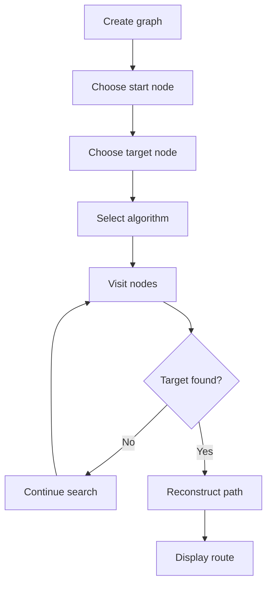

# Lab 07: Graph Route Finder

## Goal

Create an application that represents a graph and finds a route between two points.

The goal is to understand graph structures and basic graph traversal algorithms.

You will practice:

- graph representation;
- BFS and DFS;
- shortest path search;
- visualization;
- algorithm explanation;
- separation between data and rendering.

---

## Idea

A graph consists of vertices and edges.

Examples:

- cities connected by roads;
- rooms connected by doors;
- stations connected by routes;
- web pages connected by links.

The application should allow the user to choose start and end points and then find a path.

---

## Graph Search Workflow



---

## Task

Implement a graph route finder.

Your application must:

- create or load a graph;
- show graph nodes and edges;
- allow selecting start and target nodes;
- find a path;
- display the result.

---

## Functional Requirements

### 1. Graph Representation

Represent a graph using one of the following:

- adjacency list;
- adjacency matrix;
- list of nodes and edges.

Each node must have an id or name.

### 2. Graph Input

The graph may be:

- hardcoded;
- loaded from JSON;
- created by user through UI;
- read from a text file.

### 3. Search Algorithm

Implement at least one algorithm:

- BFS;
- DFS;
- Dijkstra for weighted graphs.

Recommended: BFS for unweighted shortest path.

### 4. Result Display

The application must show:

- found path;
- visited nodes, if possible;
- message if no path exists.

---

## Suggested Project Structure

```txt
graph-route-finder/
  README.md
  src/
    main.*
    graph/
      Graph.*
      Node.*
      Edge.*
    algorithms/
      BFS.*
      DFS.*
      Dijkstra.*
    visualization/
      GraphRenderer.*
```

---

## Difficulty Levels

### Basic

Implement:

- hardcoded graph;
- BFS or DFS;
- console output of path;
- simple README.

### Standard

Implement everything from Basic plus:

- visual graph display;
- start/target selection;
- path highlighting;
- no-path handling;
- graph loaded from file.

### Advanced

Implement some of the following:

- weighted graph;
- Dijkstra algorithm;
- interactive graph editor;
- animated search;
- multiple algorithms comparison;
- save/load graph.

---

## Implementation Plan

1. Create graph structure.
2. Add nodes and edges.
3. Implement BFS.
4. Reconstruct path.
5. Display path in console or UI.
6. Add no-path case.
7. Add visualization.
8. Add graph loading.
9. Refactor into modules.
10. Write README and prepare demo.

---

## Testing

Test at least the following:

- graph is represented correctly
- BFS/DFS returns valid path
- no-path case works
- visited nodes are tracked
- graph input works

Automated tests are recommended but not strictly required. If you do not write automated tests, describe manual test cases in `README.md`.

---

## Demo

During the demo, show:

- show graph
- choose start and target
- run algorithm
- display path
- explain visited nodes

---

## README Requirements

Your repository must include `README.md` with:

1. Project name.
2. Short description.
3. Selected difficulty level.
4. Technologies used.
5. How to run the project.
6. Main features.
7. Short explanation of the main algorithm or architecture.
8. Screenshots or demo link, if possible.
9. Known problems or limitations.

---

## Defense Questions

Be ready to answer:

1. How do you represent the graph?
2. What is BFS?
3. What is DFS?
4. How do you reconstruct the path?
5. How do you handle no path?
6. What changes for weighted graphs?
7. Why is adjacency list useful?

---

## Evaluation Criteria

| Criterion | Points |
|---|---:|
| Graph representation | 20 |
| Search algorithm | 25 |
| Path reconstruction | 15 |
| Visualization/output | 15 |
| Error handling | 10 |
| Code structure | 10 |
| Demo and defense | 5 |
| **Total** | **100** |

---

## Expected Result

At the end of this lab, you should have a working project called **Graph Route Finder**.

The project should demonstrate both programming skills and the ability to structure, explain, and present a small but non-trivial software system.
