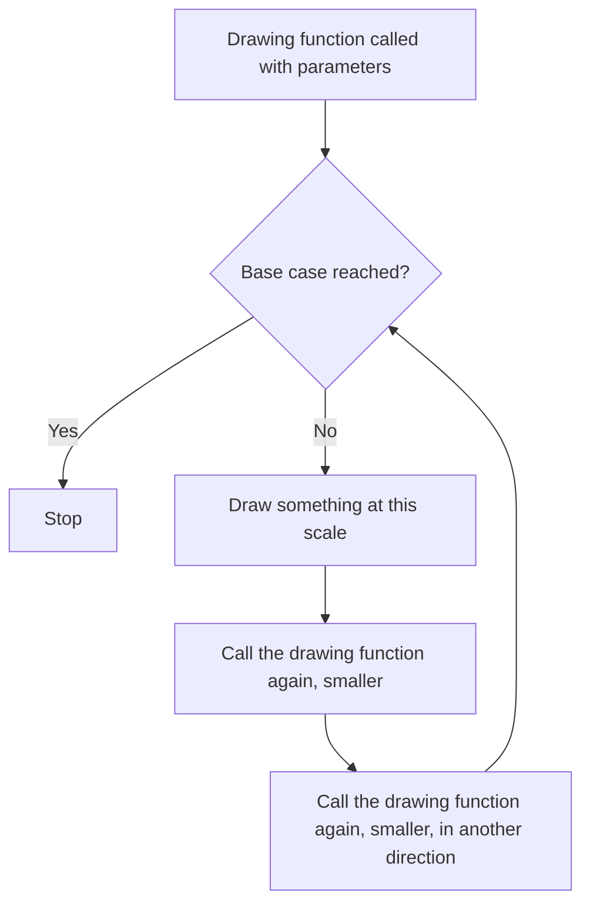

# Lab 08 — Infinity in a Loop: Build a Fractal Generator

> "Clouds are not spheres, mountains are not cones, coastlines are not circles."
> — Benoît Mandelbrot, 1982

**Time budget:** ~2 weeks, working at your own pace.
**Preferred language:** C++ or C# (any language is allowed, but graphics output is fastest in these).
**Working style:** solo, or in a team of up to 3 people. Both are equally welcome.

---

## The hook

Imagine a function so simple you can write it on a napkin: `z = z² + c`. That's it. Two multiplications and one addition, looped a few times for each pixel of an image. From that single line — a single line — comes the most famous shape in mathematics: the Mandelbrot set. Zoom into any edge of it and you find oceans of detail that no human has ever seen before, because nobody has zoomed there before. The set is infinite. Your screen is finite. You decide where to look.

In this lab you'll write the program that draws fractals. Recursion will stop being a textbook concept and become a thing that paints pictures. The first time you generate a tree that branches into smaller trees, or a triangle made of triangles made of triangles, you'll feel the tiny shock that everyone feels: *the computer just used itself to draw itself.*

If you want a 16-minute appetizer before starting, watch Numberphile's [*The Mandelbrot Set*](https://www.youtube.com/watch?v=NGMRB4O922I) with mathematician Holly Krieger — it's a beautiful introduction to what these objects actually *are*. For the practical side, Daniel Shiffman's [*Coding Train*](https://thecodingtrain.com/) channel has a famous Mandelbrot challenge and a fractal tree challenge — both perfect companions to this lab.

---

## Why this is worth your time

- Recursion is one of the hardest concepts in 1st-year programming. Drawing a fractal is the **fastest known cure** — once you see the picture appear, the concept locks into place forever.
- Fractals are real: **coastlines, lungs, lightning, broccoli, river deltas, blood vessels** all follow fractal patterns. You're not playing with toys; you're playing with the geometry of nature.
- Benoît Mandelbrot's 1980 paper is one of the most cited mathematics papers ever. You'll be implementing the algorithm from that paper.
- A high-resolution fractal poster is one of the cheapest, coolest pieces of decoration you'll ever produce.

---

## The target

> **Instructor TODO:** add reference screenshots to `docs/` once available.

**Basic — "It Branches"**
A black image with a recursive tree drawn in green: a trunk, two branches, four sub-branches, eight, sixteen. Or: a Sierpinski triangle — a big triangle made of three triangles made of three triangles, down to depth 7. It's static, the parameters are hardcoded, but it's *unmistakably* a fractal.

**Standard — "It Lives in a Window"**
The same fractal, but now the user can change parameters from the keyboard or a small UI: depth, branching angle, branch length ratio, base color. Every change re-renders almost instantly. The image saves to a PNG file with one button.

**Advanced — "Forty Years of Mathematics in Five Seconds"**
You've added the Mandelbrot set. Smooth color gradient. The user can click-and-drag to zoom into a region; each zoom takes a couple of seconds and reveals more detail than the previous frame. You can render at 4K and print it.

---

## The big idea, in one diagram



Three lines: *do the work, recurse smaller, recurse smaller again.* Add a base case so you don't loop forever. That's a recursive fractal in a nutshell.

For the Mandelbrot family the loop is different — you iterate `z = z² + c` per pixel — but the spirit is the same: a tiny rule, applied many times, producing structure.

---

## Two-week plan with milestones

**Week 1 — Make it branch**

- **Day 1–2 — Setup & first pixel.** Open a window or create an empty image. Draw a single line from `(100, 400)` to `(100, 100)`. *Milestone: a line on a screen.*
- **Day 3 — Recursion warm-up.** Write a `drawTree(x, y, length, angle, depth)` function. For now it just draws one line. Call it once. Same line, but now under your control.
- **Day 4 — The branching.** At the end of each line, recursively call `drawTree` twice — once rotated `+30°` and once rotated `-30°`, with `length * 0.7` and `depth - 1`. Run it. *Milestone: a tree appears. Take a screenshot.*
- **Day 5 — Knobs.** Pull `angle`, `length ratio`, `depth`, and `color` out into variables you can change. Try `angle = 45°`, then `15°`. Try `ratio = 0.5`. Try `depth = 12`. Each change makes a different tree.
- **Day 6 — Save it.** Output the result as a PNG (or PPM if you want zero dependencies — see the ray-tracer lab).
- **Day 7 — Pick a buddy fractal.** Implement *one of*: Sierpinski triangle, Koch snowflake, dragon curve. Same recursion idea, different shape. *Milestone: two different fractals from the same project.*

**At this point you've completed the Basic level. You can stop here and submit a real, defendable project.**

**Week 2 — Make it interactive (or go to Mandelbrot)**

- **Day 8–9 — Real-time controls.** Wire up sliders or keyboard keys to change parameters live. The tree should respond as you adjust the angle.
- **Day 10–11 — The big one (optional but strongly recommended).** Implement the Mandelbrot set. For each pixel `(x, y)`, map it to a complex number `c`, iterate `z = z² + c` up to ~100 times, and color the pixel based on how fast it escaped. *Milestone: you see the most famous shape in mathematics, generated by your own code.*
- **Day 12 — Color.** Replace the binary "in/out" coloring with a smooth gradient based on iteration count. The image goes from "decent" to "wallpaper-quality" with maybe 20 lines of code.
- **Day 13 — Polish, README, demo prep.**
- **Day 14 — Buffer day.**

---

## Levels

### Basic — "It Branches" (~6–10 hours)
- one fractal (recursive tree or Sierpinski triangle recommended)
- hardcoded parameters
- output to screen or PNG
- a working base case so the recursion terminates

### Standard — "It Lives in a Window" (~12–18 hours)
- everything from Basic
- at least two configurable parameters
- two different fractal types in the same project
- save the result to a PNG (not just on-screen)
- input validation (no infinite recursion, no crash on `depth = -1`)

### Advanced — "Side Quests" (each ~3–10h, pick what excites you)

- **The Classic.** Implement the Mandelbrot set with smooth color gradients. Required if you want to call yourself a graphics person.
- **Deep Zoom.** Click-and-drag a rectangle to zoom into the Mandelbrot. Add 2× / 0.5× zoom keys. Render an animation that zooms 1000× over 60 frames.
- **Julia Set.** Same iteration as Mandelbrot but with a different parameter. Looks like Mandelbrot's twin.
- **L-Systems.** Implement Lindenmayer systems — formal grammars that generate fractal shapes. With a 4-line grammar you can produce trees, ferns, and fractal curves.
- **Color Symphony.** Map iteration count to a smooth gradient (HSL, palettes from Adobe Color, or "fire", "ocean", "neon" presets).
- **Print Mode.** Render at 4K, 8K, even 16K resolution. Use it as your laptop wallpaper. Save it as a PDF and print it.
- **Live Edit.** A slider for every parameter, instant re-render. Make sure rendering is fast enough that dragging feels smooth.

---

## Extension challenges (3–5 weeks)

The 2-week scope above ships a real, defendable generator. If fractals or graphics pull you in, here's how to grow it into a portfolio standout:

- **Ship to the web.** A TypeScript + canvas (or WebGL) port deployed to GitHub Pages. Zoom-and-explore in any browser.
- **GPU port.** Move Mandelbrot iteration to a WebGL fragment shader. 100×–1000× speedup. Real-time deep zoom suddenly works.
- **Deep-zoom video.** Render a 1-minute zoom into the Mandelbrot, ending at a famous coordinate. Stitch frames with `ffmpeg`. Post to YouTube.
- **A poster-quality print.** Render at 16K resolution, print at A1 size, hang it in your room. *Yes, this counts.*
- **Combine with Lab 32 (neural net).** Train a tiny network to *imitate* the Mandelbrot — given a coordinate, predict the iteration count. A delightful ML toy.

---

## Make it yours (required)

Pick **one** personal twist:

- A fractal tree themed as something specific: an underwater coral, a windswept beach pine, a snowflake from your home town's winter.
- Your initials grown as a fractal — recursive `H`, recursive `M`, etc.
- A Mandelbrot zoom that lands on a specific famous spot (search for "Mandelbrot zoom coordinates" — there are dozens of well-known beautiful regions).
- A custom color palette that means something to you (your university colors, a favorite painting, a sunset photo you took).
- Anything that, when you show it, you smile.

You'll defend why you chose it — not just what it is.

---

## Working solo or in a team

You can do this lab alone or in a team of **up to 3 people**. Pick whichever sounds more fun — neither path is rewarded differently.

If you go solo: you'll touch every part of the code, which is the fastest way to actually internalize recursion and rendering. Lonelier when you get stuck, but everything is unambiguously yours.

If you go as a team: you'll learn how to split a small graphics system. Sensible splits:

- *By fractal:* one person owns the recursive-tree family, another owns the Mandelbrot family.
- *By layer:* one person owns the math/algorithms, the other owns rendering, UI, and image export.
- *By milestone:* one person drives Basic, the other drives the Standard + side quests; pair-program the hard bits.

For a 3-person team: add one person who owns the personal twist, the README, and the deep-zoom animation.

Two rules for teams:

1. **Use git from day one** with a real branching workflow (one branch per feature, merge via PR/MR). No zip files emailed at midnight.
2. **In your README, list who did what.** Each member must be able to defend the *whole* project, not just their slice.

---

## Tooling and language tips

**C++**
- Drawing options: SDL2 (battle-tested, simple), SFML (cleaner API), or raylib (the easiest of the three for graphics newcomers — strongly recommended).
- For PNG output without a window: `stb_image_write.h` (single header file).
- Always compile with `-O2` or `-O3` — Mandelbrot at depth 1000 is painful in `-O0`.

**C#**
- Easiest path: a Windows Forms or WPF app with a `Bitmap` and `SetPixel`. Slow but simple.
- Faster path: lock the bitmap, write directly to the byte array.
- Cross-platform: [Avalonia](https://avaloniaui.net/) or `SkiaSharp` for serious rendering.
- Build in `Release` — Mandelbrot in `Debug` will make you cry.

**Anyone**
- Start small (200×200). Never debug a fractal at 1920×1080.
- For the Mandelbrot, cap iterations at 100 for early development. Increase later.

---

## Suggested project structure

```txt
fractal-generator/
  README.md
  src/
    main.*
    fractals/
      FractalTree.*
      Sierpinski.*
      Mandelbrot.*
      Julia.*               # if you do the side quest
    rendering/
      Canvas.*               # owns the pixel buffer
      ImageWriter.*          # PNG / PPM export
      Palette.*              # color gradients
    ui/
      Controls.*             # sliders / keyboard
  output/
    tree.png
    mandelbrot.png
  docs/
    milestone-screenshots/
```

---

## When you get stuck

- **Stack overflow on deep recursion.** Either lower your depth, or convert to an iterative version using a stack/queue. Most languages have a fixed recursion-depth limit (~1000).
- **My tree only has one branch.** You probably forgot to call the recursive function *twice* (once for left, once for right). Or both calls share the same `depth` variable but you didn't decrement it.
- **My Mandelbrot is one solid color.** Most likely your `c = (mappedX, mappedY)` mapping is wrong — print a few values and confirm `c` is in the range roughly `[-2.5, 1] × [-1, 1]`.
- **It renders, but very slowly.** Are you in Debug mode? Are you calling `setPixel` per pixel via a slow API? In C# specifically, `Bitmap.SetPixel` is ~100× slower than locking the bitmap.
- **The image is all black.** Pixel coordinates probably go off-screen. Add bounds checks.

If you're stuck for 30+ minutes: print debug, shrink the problem (one branch, depth 2), then ask a friend to look at your screen.

---

## Submission checklist

- [ ] Generator runs end-to-end on a clean machine.
- [ ] No crash on edge cases: depth = 0, depth = 1, very high depth (`1000` for Mandelbrot iterations).
- [ ] Release-mode build benchmarked: 1080×1080 Mandelbrot at depth 200 renders in seconds, not minutes.
- [ ] Saves output as PNG (or PPM) — files open in standard image viewers.
- [ ] If you ported to web: **a live URL** (GitHub Pages, Vercel) — zoom-and-explore works in-browser.
- [ ] **Final image at the top of the README.** This is the project; show it loud.
- [ ] (If extension) A deep-zoom video or animation in the README.
- [ ] No private paths in source.
- [ ] README explains how to reproduce the final image.

---

## What evaluators look at

- **They look at the image.** Fractals are unique: the final image *is* the project. A polished Mandelbrot zoom or a hand-tuned recursive tree carries the README.
- **They check the recursion code.** A clean base case, clean recursive call, no global state = strong signal. Tangled recursion or hidden state = "barely got it working."
- **They check Mandelbrot math.** The escape-time iteration is well-known; getting the coordinate mapping right (the `(-2.5, 1) × (-1, 1)` rectangle) is the lab's signature decision.
- **They check performance.** Compiled in release mode? Pixel-buffer access (not `SetPixel`-per-pixel)? Reasonable iteration cap? Real numbers in the README ("at depth 200, 1080×1080 renders in 1.8 seconds on my laptop") read as engineered.
- **They check the personal twist.** Your initials, your university colors, a coral-themed tree — these read as "I made something." A vanilla Mandelbrot reads as "I followed a tutorial."
- **They look at the math writeup.** A clear in-your-own-words paragraph on *why* recursion produces the picture is uniquely impressive technical writing for a 1st-year student.

---

## What to put in your README

1. Project name + one-sentence description.
2. **Final image right at the top.** This README is going to look amazing.
3. Which fractals you implemented + which side quests.
4. Your personal twist and why.
5. How to run it.
6. A short paragraph in your own words explaining how recursion produces the picture.
7. (Optional but loved) A milestone gallery — depth 1, depth 3, depth 6, depth 10.
8. If you worked in a team — who did what, one line per person.

---

## Reflection

Be ready to:

1. **Live-edit the depth** to 1, 3, 6, 10. Explain what changed and why.
2. **Explain your base case** and what would happen if you removed it.
3. **Explain how a Mandelbrot pixel becomes a color.** From `(x, y)` on the screen to a final RGB triple — the whole pipeline.
4. **Where does your code break** if depth = 50? If depth = -1? If branching angle = 360°?
5. **What's the difference** between your fractal's recursion and, say, a recursive `factorial(n)` function?
6. **What was the hardest bug** you hit, and how did you find it?
7. **What was the moment** when this lab clicked for you?

---

## Showcase

At the end of the semester there will be a small gallery of everyone's final renders — anonymous voting for **most beautiful fractal**, **deepest zoom**, and **most creative personal twist**. No pressure, no points. Make something you'd want to see on the wall.

---

## Going further

- *The Coding Train* — Daniel Shiffman has free, friendly fractal-tree, L-system, and Mandelbrot videos.
- *The Beauty of Fractals* by Peitgen & Richter — the 1986 book that brought fractals to the mainstream. Heavy but stunning.
- *The Fractal Geometry of Nature* by Mandelbrot — the original 1982 book.
- *Coding Adventure: Mandelbrot Set* by Sebastian Lague on YouTube — an excellent watch even after the lab.

---

## A final word

Recursion will, for some of you, click for the first time during this lab. When it does, you'll suddenly understand a dozen other things in computer science you didn't realize you didn't understand. Take a screenshot of the moment your tree first branches correctly. Future-you will appreciate it.
