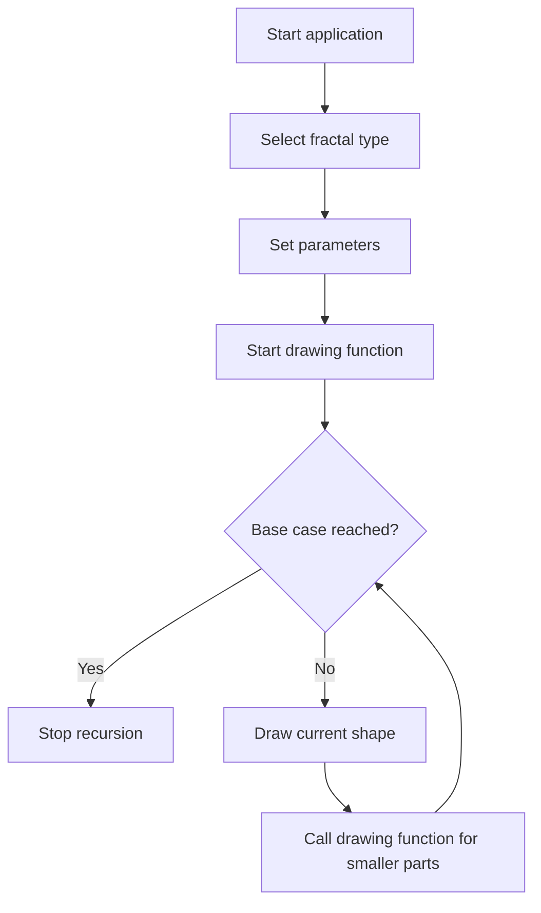

# Lab 08: Fractal Generator

## Goal

Create an application that generates fractal images.

The goal is to understand recursion, repeated transformations, and visual algorithms.

You will practice:

- recursion;
- loops;
- geometry;
- drawing on screen or image;
- parameterized algorithms;
- visual debugging.

---

## Idea

A fractal is a pattern that repeats itself at different scales.

Possible fractals:

- Sierpinski triangle;
- fractal tree;
- Mandelbrot set;
- Julia set.

Recommended starting point: **Sierpinski triangle** or **fractal tree**.

---

## Fractal Generation Workflow



---

## Task

Implement a fractal generator that displays or saves at least one fractal.

Your application should allow changing basic parameters, such as:

- depth;
- size;
- angle;
- color;
- image resolution.

---

## Functional Requirements

### 1. Fractal Type

Implement at least one fractal.

Recommended:

- Sierpinski triangle;
- fractal tree;
- Mandelbrot set;
- Julia set.

### 2. Parameters

The user should be able to configure at least two parameters.

Examples:

- recursion depth;
- starting size;
- angle;
- color;
- zoom;
- number of iterations.

### 3. Rendering

The fractal must be rendered to:

- screen;
- canvas;
- image file;
- terminal output for very simple versions.

### 4. Stability

The program must not crash for reasonable input values.

Requirements:

- validate depth or iteration count;
- avoid infinite recursion;
- handle invalid parameters.

---

## Suggested Project Structure

```txt
fractal-generator/
  README.md
  src/
    main.*
    fractals/
      FractalTree.*
      SierpinskiTriangle.*
      Mandelbrot.*
    rendering/
      Renderer.*
    ui/
      Controls.*
```

---

## Difficulty Levels

### Basic

Implement:

- one fractal;
- fixed parameters;
- screen or file output;
- simple README.

### Standard

Implement everything from Basic plus:

- configurable depth or iterations;
- at least two parameters;
- clean rendering module;
- input validation;
- save generated image.

### Advanced

Implement some of the following:

- multiple fractal types;
- zoom and pan;
- color gradients;
- animation;
- interactive UI;
- high-resolution export.

---

## Implementation Plan

1. Choose fractal type.
2. Implement drawing primitives.
3. Implement recursive or iterative generation.
4. Add base case.
5. Render result.
6. Add parameters.
7. Add validation.
8. Add export or screenshot.
9. Refactor into modules.
10. Write README and prepare demo.

---

## Testing

Test at least the following:

- fractal is generated
- base case works
- parameters change result
- invalid values are handled
- program does not crash on reasonable depth

Automated tests are recommended but not strictly required. If you do not write automated tests, describe manual test cases in `README.md`.

---

## Demo

During the demo, show:

- generate fractal
- change parameters
- show output image/screen
- explain recursion or iterations
- show project structure

---

## README Requirements

Your repository must include `README.md` with:

1. Project name.
2. Short description.
3. Selected difficulty level.
4. Technologies used.
5. How to run the project.
6. Main features.
7. Short explanation of the main algorithm or architecture.
8. Screenshots or demo link, if possible.
9. Known problems or limitations.

---

## Defense Questions

Be ready to answer:

1. What fractal did you implement?
2. Where is recursion used?
3. What is the base case?
4. How does depth affect result?
5. How do you prevent infinite recursion?
6. How would you add another fractal?
7. What parameters can the user change?

---

## Evaluation Criteria

| Criterion | Points |
|---|---:|
| Fractal algorithm | 25 |
| Rendering | 20 |
| Parameters | 15 |
| Validation | 10 |
| Code structure | 10 |
| README | 10 |
| Demo and defense | 10 |
| **Total** | **100** |

---

## Expected Result

At the end of this lab, you should have a working project called **Fractal Generator**.

The project should demonstrate both programming skills and the ability to structure, explain, and present a small but non-trivial software system.
