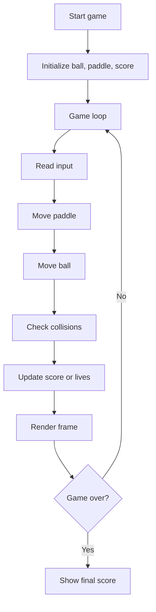

# Lab 09: Console Paddle Game

## Goal

Create a simple console or graphical paddle game similar to Pong.

The goal is to understand the game loop, keyboard input, movement, collision detection, and score tracking.

You will practice:

- game loop;
- input handling;
- 2D coordinates;
- collision detection;
- state updates;
- simple UI rendering.

---

## Idea

The game contains:

- paddle;
- ball;
- walls or borders;
- score;
- game loop.

The ball moves automatically. The player controls the paddle and tries to prevent the ball from leaving the play area.

---

## Game Loop Workflow



---

## Task

Implement a simple paddle game.

The game must allow the player to move a paddle and interact with a moving ball.

The project may be:

- console-based;
- terminal-based;
- graphical with a simple library;
- browser-based canvas game.

---

## Functional Requirements

### 1. Game Objects

The game must have:

- paddle;
- ball;
- screen borders;
- score or lives.

### 2. Movement

Requirements:

- player controls paddle;
- ball moves automatically;
- ball direction changes after collision.

### 3. Collision Detection

Detect collisions between:

- ball and walls;
- ball and paddle.

### 4. Game State

The game must track:

- current score;
- game over condition;
- restart or exit option.

---

## Suggested Project Structure

```txt
console-paddle-game/
  README.md
  src/
    main.*
    Game.*
    Ball.*
    Paddle.*
    Renderer.*
    InputHandler.*
```

---

## Difficulty Levels

### Basic

Implement:

- one paddle;
- one ball;
- wall collision;
- paddle collision;
- score display.

### Standard

Implement everything from Basic plus:

- lives;
- increasing speed;
- restart option;
- clean game states;
- better rendering.

### Advanced

Implement some of the following:

- two-player mode;
- AI opponent;
- bonuses;
- levels;
- sound effects;
- graphical version.

---

## Implementation Plan

1. Create game window or console field.
2. Add paddle position.
3. Add ball position and velocity.
4. Read keyboard input.
5. Move paddle.
6. Move ball each frame.
7. Add wall collisions.
8. Add paddle collision.
9. Add score/lives.
10. Add game over.
11. Refactor into modules.
12. Write README and prepare demo.

---

## Testing

Test at least the following:

- paddle moves correctly
- ball moves automatically
- wall collisions work
- paddle collision works
- score or lives update

Automated tests are recommended but not strictly required. If you do not write automated tests, describe manual test cases in `README.md`.

---

## Demo

During the demo, show:

- play the game
- show collision behavior
- show score/lives
- show game over
- explain game loop

---

## README Requirements

Your repository must include `README.md` with:

1. Project name.
2. Short description.
3. Selected difficulty level.
4. Technologies used.
5. How to run the project.
6. Main features.
7. Short explanation of the main algorithm or architecture.
8. Screenshots or demo link, if possible.
9. Known problems or limitations.

---

## Defense Questions

Be ready to answer:

1. What is a game loop?
2. How do you store ball velocity?
3. How do you detect paddle collision?
4. How is score updated?
5. How do you handle game over?
6. Which module renders the game?
7. How would you add AI opponent?

---

## Evaluation Criteria

| Criterion | Points |
|---|---:|
| Game loop | 20 |
| Input and paddle movement | 15 |
| Ball movement | 15 |
| Collision detection | 20 |
| Score/game state | 10 |
| Code structure | 10 |
| README/demo | 10 |
| **Total** | **100** |

---

## Expected Result

At the end of this lab, you should have a working project called **Console Paddle Game**.

The project should demonstrate both programming skills and the ability to structure, explain, and present a small but non-trivial software system.
