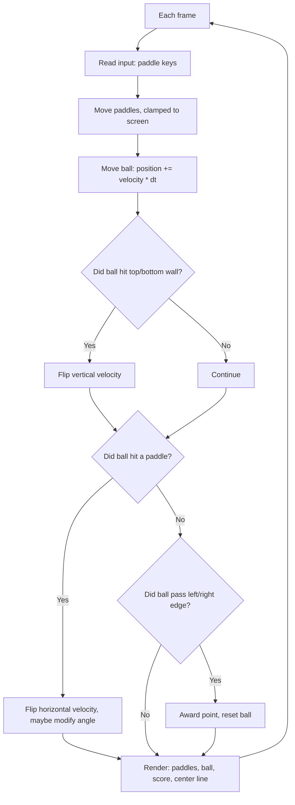

# Lab 09 — The Game That Started It All: Build a Pong Clone

> "Avoid missing ball for high score."
> — entire instructions for Atari Pong, 1972

**Time budget:** ~2 weeks, working at your own pace.
**Preferred language:** C++ or C# (any language is allowed; for this lab you can also have a great time in TypeScript with HTML canvas).
**Working style:** solo, or in a team of up to 3 people. Both are equally welcome.

---

## The hook

In 1972, Atari placed a single arcade cabinet in a bar in California. By the next morning the machine had jammed because it was full of quarters. That game was Pong. Two paddles. One ball. Eight pages of total source code. It launched the entire video game industry.

Half a century later, you're going to build it. Not because the world needs another Pong, but because *every* game ever made — from *Mario* to *Cyberpunk* — uses the same skeleton: a game loop, input, state updates, collision, rendering. Pong is the smallest possible project where every one of those pieces has to work together. Once you can ship Pong, you can ship anything.

The first time the ball bounces off your paddle and you feel the tiny dopamine hit of a satisfying click — congratulations, you've just experienced the same dopamine hit that built the trillion-dollar gaming industry.

If you want a 60-second appetizer, watch [original 1972 Atari Pong gameplay footage](https://www.youtube.com/watch?v=fiShX2pTz9A) on YouTube — that's literally the entire game. For the practical companion, read the [*Game Loop*](https://gameprogrammingpatterns.com/game-loop.html) chapter from *Game Programming Patterns* by Robert Nystrom. Free online. It's the cleanest 20-minute read about the heartbeat of every interactive program ever written.

---

## Why this is worth your time

- **The game loop is the most important pattern in interactive software.** Every game, every UI, every animation engine, every simulator runs one. After this lab, you'll see them everywhere.
- It's the **smallest meaningful project** that combines real-time input, math, collision, and rendering. If you can debug Pong, you can debug anything.
- A working game-from-scratch in your portfolio is **rarer than you think** and stands out instantly.
- It is, deliberately, **fun to play**. You'll polish it more than you have to. That's a feature.

---

## The target

> **Instructor TODO:** add reference screenshots to `docs/` once available.

**Basic — "It's Playable"**
Two paddles (one on each side), one ball, a center line. Player 1 controls the left paddle with `W`/`S`. Player 2 controls the right paddle with `↑`/`↓` (or just an AI that lazily tracks the ball). The ball bounces off paddles and walls. Score is shown at the top. When a player misses, the ball resets and the other player gets a point. *It feels like Pong because it is Pong.*

**Standard — "It Has Game Feel"**
The ball speeds up after every paddle hit. There's a clean game-state system — Title Screen → Playing → Game Over → back to title. The player can pause with `P` and reset with `R`. The ball's bounce angle depends on *where* on the paddle it hit (hitting the edge sends it sharply, hitting the center sends it back flat) — this single feature makes the game 10× more interesting.

**Advanced — "It Has a Soul"**
You've added something that makes the game memorable: a real **AI opponent** that you can pick a difficulty for, **screen shake** on hard hits, **particle effects** on bounces, **sound effects**, **two-player mode** with a third player as referee, **power-ups** that drop in mid-rally, or a **CRT-style visual filter** that makes the game look like 1972.

---

## The big idea, in one diagram



This entire game lives inside a `while` loop that runs 60 times per second. That loop is the same loop you'd write for *any* game. Internalize it once, then re-skin it for the rest of your life.

---

## Two-week plan with milestones

**Week 1 — Get to "playable"**

- **Day 1 — Window + game loop.** Open a window. Render a black screen with a single white rectangle in the middle. Run it in a `while` loop at 60 FPS. *Milestone: a stable game loop you can see.*
- **Day 2 — Paddle.** Add a left paddle. `W` and `S` move it up and down. Clamp its position so it can't leave the screen. *Milestone: input affects something visible.*
- **Day 3 — Ball.** Add a ball with `position` and `velocity`. Each frame: `position += velocity * dt`. Watch it drift off-screen. Make it wrap around for now (we'll fix this in a moment).
- **Day 4 — Wall bounce.** When the ball hits the top or bottom edge, flip `velocity.y`. The ball now stays on screen vertically.
- **Day 5 — Paddle bounce.** When the ball overlaps the left paddle, flip `velocity.x`. *Milestone: the first time you actually play your game. You will play three rallies before continuing the lab.*
- **Day 6 — Right paddle + score.** Add a second paddle (`↑`/`↓` or a simple AI: `paddle.y = ball.y`). When the ball passes the left or right edge, increment the appropriate score and reset the ball to the center.
- **Day 7 — Polish.** Center line, scoreboard text, sensible colors. *Milestone: it looks like Pong.* Take a screenshot.

**At this point you've completed the Basic level. You can stop here and submit a real, defendable project.**

**Week 2 — Make it feel good**

- **Day 8 — Game states.** Add a title screen ("Press SPACE to start") and a game-over screen ("Player 1 wins!"). Use a `GameState` enum — every game has one.
- **Day 9 — Pause / restart.** `P` pauses, `R` restarts. Every game needs these.
- **Day 10 — Bounce angle.** When the ball hits a paddle, its new vertical velocity depends on where on the paddle it hit. Top of the paddle = upward shot, bottom = downward, center = flat. This single change transforms the game.
- **Day 11 — Speedup.** After every paddle hit, multiply ball speed by 1.05. Rallies become more intense over time.
- **Day 12 — Pick a side quest.**
- **Day 13 — README, screenshot/GIF, demo prep.**
- **Day 14 — Buffer day.**

---

## Levels

### Basic — "It's Playable" (~6–10 hours)
- a working game loop at a stable 60 FPS
- two paddles (or one paddle + a simple AI)
- a ball with movement and wall bouncing
- paddle collision
- a working score
- the ability to play a complete rally without crashing

### Standard — "It Has Game Feel" (~12–18 hours)
- everything from Basic
- title screen → playing → game over → title screen
- pause / restart
- bounce angle depends on paddle hit position
- ball speed increases over a rally
- a "first to N points" win condition

### Advanced — "Side Quests" (each ~3–10h, pick what excites you)

- **AI Opponent.** Three difficulty levels: Easy (paddle moves slower than the ball), Medium (predicts ball position perfectly), Hard (also adds spin to the return).
- **Particles.** A burst of small dots fly out of the paddle on every hit. Two lines of code per particle, huge visual impact.
- **Screen Shake.** Shake the camera for 100ms on every paddle hit. The most addictive game-feel trick in the entire industry. Search "Juice it or lose it" by Martin Jonasson and Petri Purho — a famous 5-minute talk on this exact topic.
- **Sound.** A `boop` on wall bounce, a `boip` on paddle hit, a `boom` on score. Use any free sound library or even synthesize them with [sfxr](https://sfxr.me/).
- **Power-ups.** Random pickups drop on the field — bigger paddle, slower ball, multi-ball, reverse controls.
- **Multi-ball Mode.** Spawn 3 balls at the start of each rally. Chaos.
- **CRT Filter.** Add scanlines, slight color bleed, a green-on-black "Phosphor" mode. Suddenly the game looks like 1972.
- **Two-Player Online.** Significantly harder. WebSocket or simple TCP messaging between two clients. Don't pick this unless you've finished everything else and have a week to spare.
- **Local Two-Player on the Same Keyboard** — but on a controller (`Xbox` or `PlayStation` over USB) is much more fun. Most engines have a controller library.

---

## Extension challenges (3–5 weeks)

The 2-week scope above ships a real, defendable game. If you fall in love with game-dev, here's how to grow it into a portfolio piece:

- **Ship to itch.io.** Build a web version (TypeScript + canvas, or Godot's HTML5 export) and put it up. Anyone with the URL can play.
- **Combine with [Lab 19](lab-19-custom-game-controller.md).** Use *your* USB-HID controller (from [Lab 19](lab-19-custom-game-controller.md)) to play *your* Pong. Two labs, one demo.
- **Combine with [Lab 27](lab-27-multiplayer-browser-game.md).** A real two-player online Pong over WebSockets. Exactly the kind of "small but technically deep" portfolio piece recruiters love.
- **A polished, slightly-bigger game.** Use the Pong skeleton to make Breakout, Arkanoid, or Air Hockey. Same loop, different game.
- **Take it to a game jam.** [Lab 28](lab-28-game-jam.md) — the jam lab — pairs perfectly. Pong as a starting template for a 48-hour creative jam.

---

## Make it yours (required)

Pick **one** personal twist:

- **Theme it.** Reskin Pong as something specific: a tennis match between two cats, a duel between two pixel-art knights, two spaceships shooting at each other, two chefs throwing dough back and forth. The mechanics stay the same; the *feeling* changes completely.
- **Change a rule.** Add gravity that pulls the ball down. Make paddles shrink as the rally goes on. Make the screen scroll horizontally. Add a wall in the middle that the ball bounces off. One small twist, one fundamentally different game.
- **Custom soundtrack.** A single looping music track that you picked or made. The game becomes 5× more memorable.
- **Pong, but historically accurate.** Render it in literal monochrome at the original 1972 resolution (around 480×350), with the original tinny "boop" sound, no fancy effects. Pure homage.

You'll defend why you chose your twist.

---

## Working solo or in a team

You can do this lab alone or in a team of **up to 3 people**.

If you go solo: you'll touch every part — input, physics, collision, rendering, UI, polish. The whole loop is yours.

If you go as a team, sensible splits:

- *By layer:* one person owns the game logic (paddles, ball, collisions, scoring), the other owns rendering, input, UI, and game-state transitions.
- *By milestone:* one person drives Week 1 (playable), the other drives Week 2 (game feel + side quests). Pair on Day 10 (the bounce-angle change is small but tricky).
- *By feature:* one person owns the core game; the other owns AI, sound, particles, screen shake, the personal twist.

For a 3-person team: add a "polish + audio + UX" owner — particles, sound, screen shake, the title screen, the personal twist.

Two rules for teams:

1. **Use git from day one** with a branching workflow.
2. **In your README, list who did what.** Every member must be able to explain the game loop and the bounce-angle calculation.

---

## Tooling and language tips

**C++**
- [raylib](https://www.raylib.com/) is *perfect* for this lab — input, drawing, sound, all in one. Five-minute setup.
- SDL2 also works.
- Build with `-O2`. Pong won't be slow either way, but it sets a good habit.

**C#**
- [Raylib-cs](https://github.com/ChrisDill/Raylib-cs) is the smoothest path.
- [MonoGame](https://www.monogame.net/) is the classic C# game framework — slightly more setup, more powerful.
- Windows Forms with a `Timer` works for an absolute minimum version, but doesn't feel like a real game.

**TypeScript**
- HTML `<canvas>` + `requestAnimationFrame` is everything you need. No framework.
- Deploys to GitHub Pages — friends play your game with a link.

**Anyone**
- **Use delta time.** `position += velocity * dt`, not `position += velocity`. Otherwise your game runs at different speeds on different machines.
- **Lock the ball's max speed.** A long rally with 1.05× per hit will eventually break collision detection (the ball moves so fast it skips through paddles). Cap the speed at something reasonable.

---

## Suggested project structure

```txt
pong/
  README.md
  src/
    main.*
    Game.*                # owns state, runs the loop
    Paddle.*
    Ball.*
    Score.*
    AI.*                  # optional, for the AI opponent
    Renderer.*
    InputHandler.*
    SoundManager.*        # optional
  assets/
    boop.wav
    music.ogg
  docs/
    milestone-screenshots/
```

---

## When you get stuck

- **The ball passes through the paddle when it's moving fast.** Classic "tunneling" bug — the ball moved more than the paddle's width in a single frame. Fix: cap the speed, or do a swept collision check (does the ball's path cross the paddle?), or check collision in smaller sub-steps.
- **The ball gets stuck inside the paddle.** You're flipping `velocity.x` every frame the ball overlaps. Either also push the ball out (`ball.x = paddle.right + ball.radius`), or only flip when the ball is *moving toward* the paddle.
- **My game runs at 200 FPS on my machine, 30 FPS on my friend's.** You're not using delta time. Multiply every motion by `dt` (in seconds).
- **The AI is unbeatable.** That's because you set its position equal to the ball's. Add a max paddle speed so it can't keep up with fast balls.
- **The game stutters.** Are you allocating in the loop? Calling `Console.WriteLine` per frame? Is the framework's vsync off?

If you're stuck for 30+ minutes: print the ball's position and velocity each frame, drop the speed to 50px/s, and watch it tick.

---

## Deployment checklist

- [ ] Game runs end-to-end on a clean machine: clone → build → play.
- [ ] Stable 60 FPS on a normal laptop.
- [ ] No crash on edge cases: very fast ball, paddle pressed against wall, both paddles missing simultaneously.
- [ ] Title → game → game over → restart loop is unbroken.
- [ ] Pause/restart works.
- [ ] Mute works (or no sound at all — never blast unmuteable audio).
- [ ] If you built a web version: **a live URL on itch.io** (free; the standard for indie games).
- [ ] If you built a desktop binary: a downloadable build in your GitHub Releases.
- [ ] **A 15-second GIF of a rally** in the README.
- [ ] Controls listed clearly.

---

## What recruiters look at

- **They play it.** A recruiter will play 30 seconds of Pong. The first 5 seconds matter most — does it *feel* good?
- **They look at game feel.** Bounce angle, screen shake, ball speedup, particles — the things that take a "tech demo" to a "real game."
- **They look at the game loop.** A clean separation between *update* (game logic) and *render* (drawing) is a major engineering signal — same shape as every commercial engine.
- **They look at delta-time handling.** A game that runs at the same speed on a fast and slow machine is a strong signal of platform awareness.
- **They look at the GIF.** This is one of the most GIF-friendly labs on the list. A satisfying 15-second rally is worth 1000 words.
- **They look at how you handle the unbeatable-AI problem.** A balanced AI (with a max speed, with a small intentional miss rate) reads as design instinct.

---

## What to put in your README

1. Project name + one-sentence description.
2. **A GIF of a rally** at the top. Pong is one of the most GIF-friendly projects on this list.
3. Which level + side quests.
4. Your personal twist and why.
5. How to run it + which keys do what.
6. A short paragraph in your own words explaining the game loop.
7. (Optional but loved) Milestone gallery — first paddle, first ball, first rally, "with juice".
8. If you worked in a team — who did what.

---

## Reflection

Be ready to:

1. **Play one rally**, live, in front of me.
2. **Hit the ball to the top of the right paddle, then to the bottom.** Show me the angle changes. Explain how.
3. **What happens** if I crank the ball's speed to 5000 px/s? Why?
4. **Where exactly** in your code is the game loop? What runs every frame? What runs only on certain events?
5. **How would you add** a third paddle in the middle of the screen?
6. **What was the hardest bug**, and how did you find it?
7. **What's one thing your Pong does better than the original 1972 Pong?** What's one thing the original does better than yours?

---

## Showcase

At the end of the semester there will be a small gallery — anonymous voting for **best game feel**, **most creative theme**, and **best AI opponent**. Bring a 30-second clip of a rally.

---

## Going further

- *Game Programming Patterns* by Robert Nystrom — free online. The "Game Loop", "State", and "Update Method" chapters are gold.
- [*Juice it or lose it*](https://www.youtube.com/watch?v=Fy0aCDmgnxg) by Martin Jonasson & Petri Purho — 5-minute talk that will change how you build any game. Watch this even if you don't make games.
- *Atari: Game Over* (Netflix) — the rise and fall of the company that made Pong. Background reading for the curious.
- *The Making of Karateka* by Jordan Mechner — lovely book about hand-crafting a game alone. Inspirational.

---

## A final word

The first time you and a friend play your own Pong against each other, both grinning, neither of you saying anything — that's the moment this lab is for. Show a non-programmer parent or sibling. Watch their face when you say "I built this from nothing in two weeks." Take a video of the rally.
