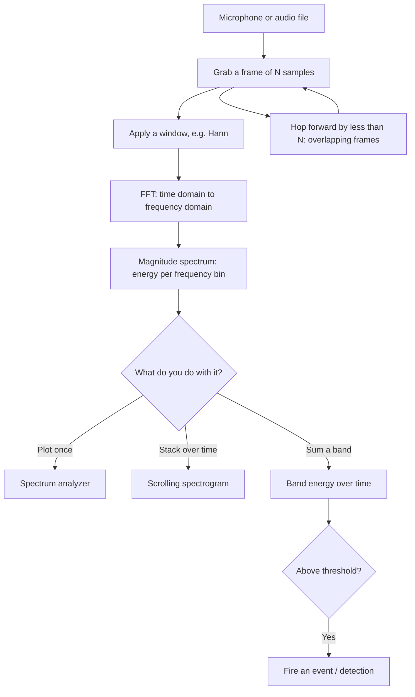

# Lab 09 — Hear the Drone: Real-Time Signal Processing

> "Every signal is secretly a sum of pure tones. The Fourier transform is how you hear them."
> — every DSP engineer, eventually

**Time budget:** ~2–3 weeks for the core lab, with extension challenges that grow it to 3–5 weeks.
**Preferred language:** Python (NumPy + SciPy + `sounddevice` + Matplotlib) — the DSP ecosystem is overwhelmingly Python. TypeScript (Web Audio API) is excellent for a live browser demo; C++ (with KissFFT / FFTW) is the performance path. Any language is allowed.
**Hardware:** *optional*. Your laptop's built-in microphone is enough for everything here. An **RTL-SDR** dongle (~$25) is optional, only for the radio-signals extension.
**Working style:** solo, or in a team of up to 3 people.
**Who this is for:** 3rd–4th-year students. Assumes comfort with complex numbers, calculus, and a little linear algebra (a concurrent *Signals & Systems* course is ideal but not required), plus solid programming. No prior DSP needed — that's exactly what this lab builds, from the transform up.

---

## The hook

In 1965, two mathematicians named Cooley and Tukey published a five-page paper describing a faster way to compute something called the Fourier transform. It turned a calculation that took `N²` steps into one that takes `N·log N`. That sounds boring. It is not. That algorithm — the **Fast Fourier Transform** — is now inside your phone, your Wi-Fi, every MP3, every JPEG, every 5G tower, every MRI machine, every radar, and every noise-cancelling headphone on Earth. It is quietly one of the most important algorithms ever written.

Here is the whole idea in one sentence: **any signal — a sound, a radio wave, a voltage over time — can be broken down into a sum of simple sine waves of different frequencies.** The FFT is the machine that does the breaking-down. Feed it a chord, and it tells you the individual notes. Feed it a noisy recording, and it shows you exactly which frequencies the noise lives in — so you can filter them out.

In this lab you'll build that machine, then point it at the real world. You'll turn your microphone into a live spectrum analyzer, watch your own voice paint colors across a spectrogram, design filters that surgically remove a hum, and — the payoff — build a detector that can **hear a drone by the signature of its rotors**. That last part isn't a toy: acoustic drone-detection arrays are deployed on real front lines right now. You're building the desktop version.

The first time you whistle and watch a bright horizontal line slide up and down a spectrogram in real time, something clicks. Sound stops being invisible.

If you want the perfect appetizer, watch 3Blue1Brown's [But what is the Fourier Transform? A visual introduction](https://www.youtube.com/watch?v=spUNpyF58BY) — the most beautiful 20 minutes on this topic anywhere. Pair it with Veritasium's [The Most Important Algorithm Of All Time](https://www.youtube.com/watch?v=nmgFG7PUHfo) for the FFT's story.

---

## Why this is worth your time

- **DSP is everywhere and rarely taught hands-on** — even at strong universities it stays on the whiteboard. Audio, radar, wireless, medical imaging, seismology, electronic warfare, motor diagnostics — all of it is signal processing. Almost no new-grad has actually *built* a working DSP pipeline. You'll stand out.
- **The FFT and "what is a frequency bin?" are classic interview questions** for embedded, audio, comms, and DSP roles. After this lab you'll answer them from muscle memory.
- **This is one of the few labs where math becomes literally audible and visible.** Sine waves, sampling, Nyquist — they stop being abstract the moment a peak lights up exactly where you predicted.
- **Acoustic drone detection is real, current defense technology.** A working detector that fires on a rotor's signature is a memorable, defensible, portfolio-grade artifact — and directly relevant to Ukraine's defense sector.

---

## The target

Here is what "done" looks like at each level. Every level is a complete, defendable project. **Because this lab targets 3rd–4th-year students, treat Standard as the expected floor and Advanced as the real goal** — Basic is a warm-up you should clear in the first few days.

> **Reference video:** 3Blue1Brown — [But what is the Fourier Transform? A visual introduction](https://www.youtube.com/watch?v=spUNpyF58BY). If you understand this video, you understand the heart of this lab. For the discrete/coding side, Steve Brunton's [Fourier Analysis playlist](https://www.youtube.com/playlist?list=PLMrJAkhIeNNT_Xh3Oy0Y4LTj0Oxo8GqsC) is the cleanest lecture series on YouTube.

> **Portfolio tip:** the strongest version of this project is one a recruiter can *hear react, live*. Aim to ship a browser build (Web Audio API + a canvas spectrogram) deployed to GitHub Pages / Vercel, so they can speak or clap into their own mic and watch it light up. Pair it with a **15–30 second clip of your drone/event detector firing** on a real sound. A live spectrogram plus a working detector is a 1-in-100 junior portfolio.

**Basic — "I Can See a Sound"**
A spectrum analyzer. You record (or load) a short sound, compute its FFT, and plot the magnitude spectrum — frequency on the x-axis, energy on the y-axis. When you feed it a pure tone (a 440 Hz sine you generate, a tuning-fork app, a whistle), a single clean peak appears at exactly the right frequency. You can read the dominant frequency off the plot and it matches reality.

**Standard — "It Listens in Real Time"**
A live, scrolling **spectrogram** driven by your microphone — a time-frequency image that updates as you speak, whistle, or play music. You've implemented **windowing** (Hann) and overlapping frames. You've designed at least one **filter** (low-pass, high-pass, or band-pass) and can show a before/after spectrum and play the filtered audio. A simple **band-energy detector** fires an event when energy in a chosen frequency band crosses a threshold (a clap, a sustained tone, a whistle).

**Advanced — "It Hears the Drone"**
An **acoustic event detector** with real evaluation. You build a labeled dataset (drone vs. no-drone from public data and/or your own recordings, or your own event vs. background), extract features grounded in the signal's physics (band energies, the rotor's harmonic stack, MFCCs), classify each clip, and report **precision / recall / F1 and an ROC curve with AUC** on a properly held-out test set. Alternatively: demodulate a real radio signal with an RTL-SDR, or ship the whole thing as a live web spectrogram. It works on sounds it has never seen before — and you can explain *why*.

---

## The big idea, in one diagram



The whole lab is this loop: **chop the signal into frames, FFT each frame, then look at where the energy is.** A spectrum is one frame. A spectrogram is many frames stacked. A detector is "watch one band and react." Master this loop and you've mastered the foundation of all DSP.

---

## Two-week plan with milestones

**Week 1 — From a wave to a live spectrogram**

- **Day 1 — Setup + see a wave.** Install your stack. Load or record 1–2 seconds of audio and plot it in the **time domain** (amplitude vs. time). *Milestone: you can see a sound as a wiggly line.*
- **Day 2 — DFT from scratch, then FFT.** Generate a pure 440 Hz sine. First implement the **DFT straight from its definition** (the `O(N²)` double loop) and confirm it matches `numpy.fft` bin-for-bin — this is the understanding you can't skip. Then switch to the FFT for speed, plot the magnitude spectrum, and confirm a single sharp peak at 440 Hz. *Milestone: you built the transform, you didn't just call it.*
- **Day 3 — Bins and Nyquist.** Understand why bin `k` corresponds to frequency `k · fs / N`, and why you can't see anything above `fs / 2` (the Nyquist limit). Label your x-axis in real Hz. Feed in two summed tones; see two peaks.
- **Day 4 — Windowing + frames.** Apply a **Hann window** before the FFT (and see how it cleans up "spectral leakage"). Chop a longer signal into overlapping frames and FFT each. *Milestone: you understand why raw FFTs of real signals look smeared.*
- **Day 5 — The spectrogram.** Stack your per-frame spectra into an image: time on x, frequency on y, energy as color (use a **log/dB** scale). *Milestone: you see time and frequency at once.*
- **Day 6 — Go live.** Read from the microphone in a callback and scroll the spectrogram in real time. Whistle and watch the line move. *Milestone: the "oh" moment. Record a clip.*
- **Day 7 — Polish + README.** Dominant-frequency readout, clean axes, a screenshot/GIF.

**At this point you've completed Basic and most of Standard. For a 3rd–4th-year submission, don't stop here — push through Week 2 (filtering + detection + evaluation); that's where the real DSP lives.**

**Week 2 — Filter it, then detect something**

- **Day 8 — Design a filter.** Build a low-pass, high-pass, or band-pass filter (`scipy.signal` or your own). Apply it; show before/after spectra; play the filtered audio. Remove a hum from a noisy clip.
- **Day 9 — Band-energy detector.** Pick a frequency band. Sum its energy per frame. Threshold it over time to fire an event (clap / whistle / sustained tone). Debounce so one event isn't counted ten times.
- **Day 10 — Label + evaluate properly.** Assemble a labeled set with a real **train / validation / test split** (record your own clips, and/or use a public dataset — see the flagship detector below). Run your detector and report a **confusion matrix, precision / recall / F1, and an ROC curve with AUC**. Pick your threshold on the validation set, never on the test set. *Milestone: you can defend a number, not just "it seems to work."*
- **Day 11–12 — Pick a side quest.**
- **Day 13 — README, demo clip, deploy.**
- **Day 14 — Buffer day.**

---

## Levels

### Basic — "I Can See a Sound" (~10–15 hours)
- load or record audio; plot the time-domain waveform
- compute an FFT and plot the magnitude spectrum
- correctly labeled frequency axis in Hz (bins → real frequencies)
- a pure tone produces a single peak at the right frequency
- read off the dominant frequency and verify it

### Standard — "It Listens in Real Time" (~16–22 hours)
- everything from Basic
- Hann windowing and overlapping frames
- a real-time scrolling spectrogram from the microphone
- a log/dB magnitude scale (so quiet detail is visible)
- at least one designed filter (low/high/band-pass) with before/after evidence
- a band-energy detector that fires on a chosen event, with debouncing

### Advanced — "Side Quests" (each ~5–12h, pick what excites you)

- **Acoustic Drone Detector (flagship).** Start from the physics: a rotor's **blade-pass frequency** is `num_blades × RPM / 60`, and its harmonic stack is the fingerprint you hunt. Extract features (band energies, harmonic-product spectrum, mel-spectrogram / MFCCs, spectral flatness), classify, and evaluate with an **ROC curve + AUC** on a held-out test set. Public data makes this achievable without owning a drone: **[DREGON](https://dregon.inria.fr/)** (drone ego-noise recordings), the **[Drone Audio Detection dataset](https://github.com/saraalemadi/DroneAudioDataset)** (Al-Emadi et al.), and **[ESC-50](https://github.com/karolpiczak/ESC-50)** / UrbanSound8K for realistic background negatives.
- **Pitch / Tuner.** Detect the fundamental frequency and show the nearest musical note and how many cents sharp/flat. Build a real instrument tuner.
- **Chord / Note Recognizer.** Identify multiple simultaneous notes. Harder — you're separating overlapping harmonics.
- **Noise Killer.** Implement spectral subtraction: estimate the noise spectrum from a silent section, subtract it, resynthesize cleaner audio. Show the SNR improvement.
- **RTL-SDR Radio (needs ~$25 dongle).** Capture real RF, demodulate an FM broadcast station, and listen. Then look at the drone-control band. *Only receive; never transmit.*
- **Learned Detector.** Feed spectrogram features into a tiny classifier (connects to [Lab 32](lab-32-neural-net-from-scratch.md)). Compare it against your hand-tuned threshold.
- **Web Spectrogram.** Rebuild the live spectrogram in the browser with the Web Audio API + canvas. Deploy it. Anyone with the URL can play.
- **DTMF / Morse Decoder.** Decode phone touch-tones or Morse code from audio purely by watching which bands light up.

---

## Depth expected at this level (3rd–4th year)

Clearing the levels is necessary but not sufficient — a strong submission *demonstrates understanding*, not just working code. Be able to reason about:

- **The transform.** DFT from its definition → FFT; why it's `N·log N`; conjugate symmetry of a real signal's spectrum (why `rfft` returns `N/2 + 1` bins).
- **STFT trade-offs.** Window length vs. hop size; the time–frequency resolution trade-off; Hann vs. Hamming vs. Blackman and what spectral leakage and scalloping loss cost you.
- **Spectral estimation.** Magnitude vs. power; the periodogram and **Welch's method** for a stable PSD; correct dB scaling.
- **Filters.** FIR vs. IIR; order and roll-off; phase response and **group delay**; zero-phase filtering with `filtfilt`; Butterworth vs. Chebyshev; stability.
- **Detection theory.** Energy detector vs. **matched filter**; the ROC curve and AUC; how the threshold trades false alarms against missed detections, and how to pick an operating point for a real cost model.
- **Sampling.** Nyquist, aliasing, and why a real system needs an **anti-alias filter** in front of the ADC.

You don't need all of it — but the more of this you can defend at a whiteboard, the stronger the project reads to a signals-savvy interviewer.

---

## Extension challenges (3–5 weeks)

The core scope ships a real, defendable DSP project. If signals pull you in, here's how to grow it into a portfolio standout:

- **Combine with [Lab 33](lab-33-object-detection-tracking.md) (object detection).** A **see-and-hear drone detector**: camera finds it, microphone confirms it. Sensor fusion is exactly how real counter-UAS systems work.
- **Combine with [Lab 40](lab-40-network-wireless-drone-security.md) (RF security) + RTL-SDR.** Move from acoustic to radio: detect and analyze a drone's control link on the RF side (receive-only, in a lawful band).
- **Combine with [Lab 04](lab-04-stm32-sensor-logger.md) (sensor logger).** Use your own filters to clean noisy IMU/telemetry data — real embedded DSP.
- **Combine with [Lab 32](lab-32-neural-net-from-scratch.md) (neural net).** Train a small CNN on spectrogram images to classify sounds. Compare learned vs. hand-designed features.
- **Combine with [Lab 16](lab-16-smart-telemetry-beacon.md) (telemetry beacon).** Stream live detections to a web dashboard: an early-warning acoustic sensor node.

---

## Make it yours (required)

Pick **one** personal twist. The DSP is the same; the *signal you care about* is what makes the project memorable.

- **Aviation / defense.** The acoustic drone detector. (Tie-in: real counter-UAS arrays localize drones by the blade-pass frequency of their rotors — the exact harmonic structure you'll be hunting.)
- **Music.** A tuner, a chord recognizer, a "what key is this song in?" analyzer, or a real-time visualizer that reacts to your favorite tracks.
- **Machinery / diagnostics.** Detect a failing motor, a loose fan, or a specific appliance by its acoustic hum — predictive maintenance is a real industry.
- **Nature.** A birdsong or cricket identifier. Wildlife bioacoustics is a growing field.
- **Speech.** A whistle-controlled game, a clap-activated switch, a crude voice-activity detector.

You'll defend why you chose your twist.

---

## Working solo or in a team

You can do this lab alone or in a team of **up to 3 people**.

If you go solo: you'll touch every layer — capture, FFT, visualization, detection. That's the fastest way to actually internalize DSP.

If you go as a team, sensible splits:

- *By layer:* one person owns the DSP core (capture, framing, FFT, filters); the other owns visualization (spectrogram, UI) and the demo.
- *By milestone:* one person drives Week 1 (spectrum → live spectrogram), the other drives Week 2 (filters, detector, evaluation).
- *By feature:* one person owns the detector + labeled dataset + evaluation; the other owns the real-time pipeline and the web demo.

For a 3-person team: add a "dataset + evaluation + README/demo" owner.

Two rules for teams:

1. **Use git from day one** with a real branching workflow.
2. **In your README, list who did what.** Each member must be able to explain, on demand, what a frequency bin is and how their detector decides.

---

## Tooling and language tips

**Python (recommended)**
- FFT: `numpy.fft.rfft` / `scipy.fft`. STFT / PSD: `scipy.signal.stft`, `welch`, `spectrogram`. Filters: `scipy.signal` (`butter`, `firwin`, `sosfilt`, `filtfilt` for zero-phase). Detection metrics: `sklearn.metrics` (`roc_curve`, `roc_auc_score`, `f1_score`, `confusion_matrix`). Mic: [`sounddevice`](https://python-sounddevice.readthedocs.io/) or `pyaudio`. Features: [`librosa`](https://librosa.org/) (mel-spectrogram, MFCC). Plots: `matplotlib`.
- Decouple audio capture (a callback filling a ring buffer) from rendering, or your real-time display will stutter.

**TypeScript (best for a live web demo)**
- The Web Audio API's `AnalyserNode.getByteFrequencyData()` gives you an FFT for free; draw the spectrogram to a `<canvas>`. Deploys to GitHub Pages with zero backend.

**C++ (performance path)**
- [KissFFT](https://github.com/mborgerding/kissfft) (tiny, MIT) or [FFTW](https://www.fftw.org/) for the transform; a plotting/GUI lib of your choice.

**Anyone — the four things that trip everyone up**
- **Nyquist.** You can only see frequencies up to `fs / 2`. At `fs = 44100 Hz`, that's ~22 kHz. Anything higher **aliases** (folds back and lies to you).
- **Bins.** An `N`-point FFT gives `N/2` useful bins; bin `k` is the frequency `k · fs / N`. Bigger `N` = finer frequency resolution but worse time resolution. That trade-off is the whole game.
- **Windowing.** Always apply a window (Hann is a fine default) before the FFT of a real-world frame, or peaks smear ("spectral leakage").
- **Log scale.** Plot magnitude in **dB** (`20·log10`), or everything but the loudest peak will look like zero.

---

## Suggested project structure

```txt
hear-the-drone/
  README.md
  src/
    capture.*            # mic / file input, ring buffer
    dsp/
      window.*           # Hann etc.
      fft.*              # wraps the FFT, returns magnitude spectrum
      filters.*          # low / high / band-pass design + apply
      spectrogram.*      # frames -> time-frequency image
    detect/
      band_energy.*      # threshold detector
      classifier.*       # advanced: features + precision/recall
    ui/
      spectrum_plot.*
      live_spectrogram.*
  data/
    clips/               # labeled audio for the detector
    labels.csv
  docs/
    spectrogram.png
    detection-demo.gif
```

---

## When you get stuck

- **My spectrum is all noise, no peak.** Check for a DC offset (subtract the mean), make sure you applied a window, and confirm you're plotting magnitude (`abs`) not the raw complex output.
- **The peak is at the wrong frequency.** Your sample rate `fs` is probably wrong, or you're computing bin frequencies without `fs / N`. Generate a known 1000 Hz tone and verify the peak lands on 1000 Hz.
- **The spectrogram is blank / all one color.** You forgot the log/dB scale, or your color range isn't normalized to the actual min/max energy.
- **Real-time display stutters or crashes.** You're doing heavy work (FFT + plot) inside the audio callback. Only copy samples in the callback; do FFT and drawing on another thread/timer.
- **A high whistle shows up as a low tone.** Aliasing — that frequency is above Nyquist for your sample rate. Raise `fs` or low-pass before sampling.

If you're stuck for 30+ minutes: drop back to a synthetic, known signal (a pure sine you generated). If the FFT is right on that, the bug is in your capture or scaling, not your transform.

---

## Deployment checklist

- [ ] Runs end-to-end on a clean machine: clone → install → analyze a file → open the live spectrogram.
- [ ] A pure-tone test produces a peak at the correct frequency (documented in the README).
- [ ] No crash on edge cases: silence, a clipped/too-loud signal, a very short clip, no microphone available.
- [ ] Filters show a clear before/after (spectrum image + audio you can play).
- [ ] The detector reports a **confusion matrix, precision / recall / F1, and ROC-AUC** on a held-out test set, with the threshold chosen on validation data.
- [ ] Sample audio is included so anyone can reproduce a detection without hardware.
- [ ] **A 15–30 second clip** in the README of the live spectrogram reacting and the detector firing.
- [ ] If you shipped the web demo: a **live URL** (GitHub Pages / Vercel).
- [ ] No private paths in source.

---

## What recruiters look at

- **They open the live demo and make a sound.** A spectrogram that reacts instantly to their voice or a clap sells the whole project in five seconds.
- **They probe the fundamentals.** Expect "what's a frequency bin?", "what's Nyquist?", "why window before the FFT?" — the classic DSP interview trio. Clear answers read as *real* understanding.
- **They look at the DSP-core vs. UI separation.** Pure, testable transform/filter modules decoupled from the display is the same structure production audio code uses.
- **They look for an evaluation.** A detector with precision/recall on a labeled set — not just "it works on my one clip" — is a strong, rare signal for a junior.
- **They look at the personal twist.** A drone detector, a tuner, a motor-fault listener — these read as "I built something I cared about," not "I followed a tutorial."

---

## What to put in your README

1. Project name + one-sentence description.
2. **A GIF/clip** of the live spectrogram reacting, right at the top.
3. Which level + side quests.
4. Your personal twist and why.
5. How to run it (analyze a file, open the live view).
6. A short paragraph, in your own words, explaining how a frequency bin maps to a real frequency and what Nyquist means.
7. Your detector's **metrics** (precision / recall / F1, ROC-AUC), your train/val/test split, and how you chose the threshold.
8. (Optional) A live demo URL.
9. If you worked in a team — who did what.

---

## Reflection

Be ready to:

1. **Show the spectrum of a pure tone** and explain why there's a single peak, and why it's exactly there.
2. **Explain Nyquist.** What happens if a sound's frequency is above `fs / 2`? Demonstrate aliasing if you can.
3. **Explain windowing.** Toggle it off and show the spectral leakage; explain why the window helps.
4. **Change the detector's band** live and show how its behavior changes. What false positives appear, and why?
5. **What's a frequency bin?** Given `fs` and `N`, compute the frequency of bin 50 on the spot.
6. **Where's the time-vs-frequency trade-off** in your code? What happens to the spectrogram if you double the frame size?
7. **Energy detector vs. matched filter** — which did you use, and when would the other one win?
8. **Read your ROC curve.** Where did you put the threshold, and what false-alarm rate did you accept to get there?
9. **Why `filtfilt` (or why not)?** Explain group delay and when zero-phase filtering matters — and why you *can't* use it in a real-time causal system.
10. **Sketch the harmonic model** of your target signal (e.g., a drone's blade-pass frequency and its harmonics).
11. **What was the hardest bug**, and how did you find it?

---

## Showcase

At the end of the semester there will be a small gallery — anonymous voting for **most beautiful spectrogram**, **best detector** (measured on a shared surprise clip), and **most creative signal**. Bring a 30-second clip of your system reacting live.

---

## Going further

- 3Blue1Brown — [But what is the Fourier Transform?](https://www.youtube.com/watch?v=spUNpyF58BY) and the follow-up on the [Uncertainty Principle](https://www.youtube.com/watch?v=MBnnXbOM5S4) (the time-frequency trade-off, made intuitive).
- [*The Scientist and Engineer's Guide to Digital Signal Processing*](https://www.dspguide.com/) by Steven W. Smith — free online, legendary, readable.
- [Steve Brunton's Fourier + DSP lectures](https://www.youtube.com/c/Eigensteve) — the best university-level DSP on YouTube.
- Julius O. Smith's [free online DSP books](https://ccrma.stanford.edu/~jos/) (Stanford CCRMA) — deep, when you're ready.
- Veritasium — [The Most Important Algorithm Of All Time](https://www.youtube.com/watch?v=nmgFG7PUHfo) (the FFT's history and impact).

---

## A final word

Most people go through life treating sound and radio as invisible magic. After this lab you won't — you'll look at a spectrogram and *read* it, the way you read text. You'll hear a motor and think "that hum is a 120 Hz peak with harmonics." You'll understand, at a mechanical level, how your phone pulls one Wi-Fi signal out of the air among thousands. And you'll have built something that can hear a threat coming before you can. That's a genuine superpower — go earn it.
