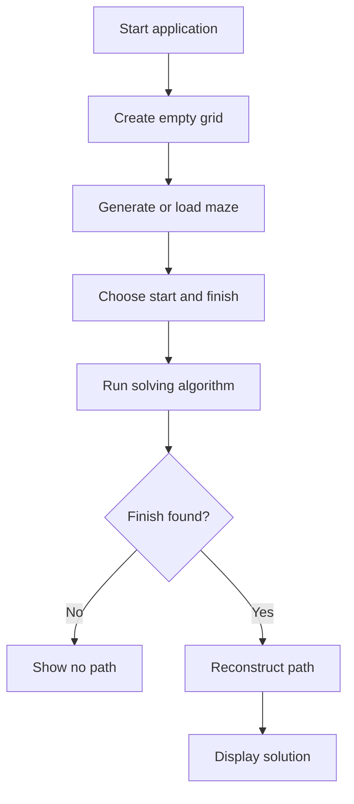

# Lab 10: Maze Generator and Solver

## Goal

Create an application that generates a maze and finds a path through it.

The goal is to understand grids, graph-like traversal, backtracking, and pathfinding.

You will practice:

- 2D arrays;
- recursion or stack-based algorithms;
- DFS/BFS;
- path reconstruction;
- visualization;
- algorithm debugging.

---

## Idea

A maze can be represented as a 2D grid.

Cells may be:

- wall;
- empty path;
- start;
- finish;
- visited cell;
- final path.

The application should generate or load a maze and then solve it.

---

## Maze Workflow



---

## Task

Implement a maze generator and solver.

Your application must:

- represent a maze as a grid;
- generate or load a maze;
- choose start and finish;
- find a path;
- display the maze and solution.

---

## Functional Requirements

### 1. Maze Representation

Use a 2D array or similar structure.

Recommended symbols:

- `#` wall;
- `.` empty cell;
- `S` start;
- `F` finish;
- `*` final path.

### 2. Maze Input

Implement at least one:

- hardcoded maze;
- maze loaded from file;
- generated maze.

### 3. Solver

Implement at least one algorithm:

- DFS;
- BFS;
- backtracking.

Recommended: BFS if you want shortest path.

### 4. Visualization

Show:

- original maze;
- visited cells, if possible;
- final path.

---

## Suggested Project Structure

```txt
maze-generator-solver/
  README.md
  src/
    main.*
    Maze.*
    MazeGenerator.*
    MazeSolver.*
    Renderer.*
```

---

## Difficulty Levels

### Basic

Implement:

- hardcoded maze;
- DFS or BFS solver;
- console output;
- final path display.

### Standard

Implement everything from Basic plus:

- maze loaded from file;
- generated maze;
- visited cells visualization;
- no-path handling;
- clean project structure.

### Advanced

Implement some of the following:

- animated solving;
- multiple generation algorithms;
- shortest path comparison;
- graphical UI;
- custom maze editor;
- export maze as image.

---

## Implementation Plan

1. Create grid representation.
2. Load or hardcode maze.
3. Add start and finish.
4. Implement solver.
5. Track visited cells.
6. Reconstruct final path.
7. Display result.
8. Add maze generation.
9. Refactor into modules.
10. Write README and prepare demo.

---

## Testing

Test at least the following:

- maze is represented correctly
- solver finds valid path
- no-path case works
- visited cells are tracked
- generated or loaded maze works

Automated tests are recommended but not strictly required. If you do not write automated tests, describe manual test cases in `README.md`.

---

## Demo

During the demo, show:

- show maze
- run solver
- display final path
- show no-path example
- explain algorithm

---

## README Requirements

Your repository must include `README.md` with:

1. Project name.
2. Short description.
3. Selected difficulty level.
4. Technologies used.
5. How to run the project.
6. Main features.
7. Short explanation of the main algorithm or architecture.
8. Screenshots or demo link, if possible.
9. Known problems or limitations.

---

## Defense Questions

Be ready to answer:

1. How is the maze represented?
2. Which algorithm did you use?
3. How do you track visited cells?
4. How do you reconstruct the path?
5. What is the difference between DFS and BFS?
6. How does maze generation work?
7. How would you animate the solver?

---

## Evaluation Criteria

| Criterion | Points |
|---|---:|
| Maze representation | 15 |
| Solver algorithm | 25 |
| Path reconstruction | 15 |
| Generation/loading | 15 |
| Visualization | 10 |
| Code structure | 10 |
| README/demo | 10 |
| **Total** | **100** |

---

## Expected Result

At the end of this lab, you should have a working project called **Maze Generator and Solver**.

The project should demonstrate both programming skills and the ability to structure, explain, and present a small but non-trivial software system.
