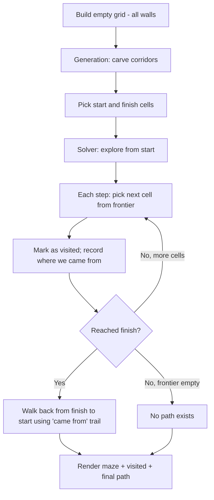

# Lab 10 — Lost on Purpose: Build a Maze Generator and Solver

> "A maze is a puzzle. A maze with an algorithm is a story."
> — paraphrasing every graph theory professor ever

**Time budget:** ~2 weeks, working at your own pace.
**Preferred language:** C++ or C# (any language is allowed; TypeScript with HTML canvas is also excellent for the visualization).
**Working style:** solo, or in a team of up to 3 people. Both are equally welcome.

---

## The hook

Every cathedral has a maze etched in its floor. Every Greek myth has one. Every adventure game ever made hides one. Mazes are the single oldest puzzle in human civilization — and yet, with about 30 lines of code, your computer can generate them, solve them, and animate the search.

In this lab you'll build both halves of the magic: a *generator* that carves out a perfect maze (one path between any two cells, no loops), and a *solver* that finds its way through. Watching the solver explore — flood-filling forward, hitting dead ends, backtracking, eventually emerging at the exit — is one of the most satisfying visualizations in computer science. It's also, secretly, your introduction to **graph algorithms**: the backbone of GPS routing, social network analysis, network protocols, dependency resolution, and roughly half of every job interview you'll ever take.

If you want a perfect appetizer, read [*Introduction to A\**](https://www.redblobgames.com/pathfinding/a-star/introduction.html) by Amit Patel at Red Blob Games. It's interactive, beautifully illustrated, and the most-cited pathfinding tutorial on the entire internet — every game programmer has read it. For the generation side, Jamis Buck's blog series *[Maze Generation Algorithms](https://weblog.jamisbuck.org/2011/2/7/maze-generation-algorithm-recap)* is the canonical resource (he literally wrote the book *Mazes for Programmers*).

---

## Why this is worth your time

- A maze is a **graph in disguise**. Once you've solved one, you'll see graphs in social networks, GPS, dependency trees, and Git history.
- BFS and DFS are **the two most-asked algorithms in technical interviews**. Building a maze project is the highest-leverage way to make them stick.
- The visualization — colors expanding through the maze as the solver explores — is one of the most satisfying things you'll ever code. It feels alive.
- A working "generate → solve → visualize" pipeline is the **smallest possible project that contains a real algorithmic core, a real data structure, and a real UI**. It's a tiny thesis on its own.

---

## The target

> **Instructor TODO:** add reference screenshots to `docs/` once available.

**Basic — "It Solves"**
A 21×21 grid of black walls and white corridors, with a green `S` (start) and a red `F` (finish). The maze is hand-coded or generated. You press a key; the program runs BFS or DFS; cells visited during the search turn light blue; the final path from start to finish turns yellow. You can run it again with `R`.

**Standard — "It Generates and Compares"**
A button (or key) generates a fresh, random maze every time. The maze always has exactly one path between any two cells (a "perfect" maze). The solver runs *visibly*, expanding cell-by-cell so you can watch it think. You can switch between BFS, DFS, and a "no path" mode (where the program proves the maze has no solution).

**Advanced — "It Has a Soul"**
You've added something memorable: smooth animation of both the generation *and* the solving, multiple generation algorithms with very different visual signatures (Recursive Backtracker → twisty, DFS-y; Prim's → blob-like, organic; Eller's → biased; Wilson's → uniformly random), a side-by-side comparison of BFS vs DFS vs A\* on the same maze, a maze editor where the user paints walls with the mouse, or export to PNG so the user can print a maze to do on paper.

---

## The big idea, in one diagram



Two ideas in one project: *carve a maze*, then *find a path through it*. The "frontier" data structure — a stack for DFS, a queue for BFS — is the entire difference between the two algorithms.

---

## Two-week plan with milestones

**Week 1 — Get the solver working**

- **Day 1 — Grid and rendering.** Define a `Grid` (2D array of cell types). Render it: walls as black squares, corridors as white, start as green, finish as red. Hardcode a small 11×11 maze for now. *Milestone: a maze on screen.*
- **Day 2 — Neighbors.** Write a function `neighbors(cell)` that returns the four adjacent corridor cells (no walls). This is the only "graph" function you'll need.
- **Day 3 — BFS.** Implement BFS from start. Use a queue, mark visited, stop when you reach the finish. Don't reconstruct the path yet — just print "FOUND" or "NO PATH". *Milestone: the algorithm runs without crashing.*
- **Day 4 — Path reconstruction.** As BFS runs, store `cameFrom[cell]` — for each visited cell, which cell did the algorithm come from? When you reach the finish, walk backward through `cameFrom` to recover the path. *Milestone: the program prints the path as a list of coordinates.*
- **Day 5 — Visualize.** Color visited cells light blue, the final path yellow. *Milestone: a beautiful first picture of an algorithm at work.* Take a screenshot.
- **Day 6 — DFS.** Same skeleton, but use a *stack* instead of a queue. Compare the two visually — DFS produces a long, snaking trail; BFS produces a flood-fill ripple.
- **Day 7 — Polish + a "no path" maze.** Build a maze with the finish walled off; verify your solver reports "no path" cleanly.

**At this point you've completed the Basic level. You can stop here and submit a real, defendable project.**

**Week 2 — Generate mazes and animate it**

- **Day 8 — Maze generation.** Implement Recursive Backtracker (also called "DFS maze generation"). Start with all walls; pick a cell; carve passages to random unvisited neighbors; recurse. *Milestone: you can press a key and a fresh maze appears.* This is the single most rewarding day of the lab.
- **Day 9 — Animate generation.** Slow the generation down to one step per ~10 ms so you can watch the maze grow.
- **Day 10 — Animate solving.** Same idea — slow the solver down so you can watch BFS spread like water and DFS snake forward.
- **Day 11–12 — Pick a side quest.**
- **Day 13 — README, screenshots/GIFs, demo prep.**
- **Day 14 — Buffer day.**

---

## Levels

### Basic — "It Solves" (~8–12 hours)
- a grid representation of a maze
- at least one input mode: hardcoded, file-loaded, or hand-built
- a working BFS or DFS solver
- correct path reconstruction
- a "no path" case handled cleanly
- visualization of visited cells and the final path

### Standard — "It Generates and Compares" (~14–20 hours)
- everything from Basic
- automatic maze generation (Recursive Backtracker is the recommended choice)
- the maze is *guaranteed perfect* — exactly one path between any two cells
- both BFS *and* DFS are implemented; you can switch between them
- visible animated solving (cells light up in real time)
- BFS-vs-DFS comparison either side-by-side or via toggle
- clean module separation: `MazeGenerator`, `MazeSolver`, `Renderer` are independent

### Advanced — "Side Quests" (each ~3–10h, pick what you find cool)

- **A\* Search.** Implement A* with the Manhattan-distance heuristic. Watch how it makes a *beeline* toward the finish compared to BFS's flood. Read [Red Blob Games's tutorial](https://www.redblobgames.com/pathfinding/a-star/introduction.html) — it's the gold standard.
- **Multiple Generators.** Add Prim's algorithm, Wilson's algorithm, and Kruskal's algorithm. Each has a *very* different visual signature. Make a "compare generators" mode that runs all four side by side.
- **Animated Generation.** Watch the maze actually carve itself out, cell by cell. Hypnotic.
- **Maze Editor.** Click cells to toggle wall/corridor. Drag to paint walls. Place start and finish anywhere.
- **PNG Export.** Save the current maze (with or without solution) to a PNG file. Bonus: print one out and solve it on paper.
- **Bigger and Faster.** Get to a 200×200 maze that generates and solves in under a second. Optimize the inner loops; use efficient data structures.
- **3D Maze.** A maze with multiple floors and stairs between them. Render top-down per-floor with a floor selector. The solver naturally extends to 3D.
- **Weighted Maze.** Some cells are "mud" (cost 5) and some are "road" (cost 1). BFS doesn't handle this — but Dijkstra and A* do. This side quest unlocks understanding of *every* shortest-path problem in computing.
- **Solve Race.** Two solvers run at the same time on the same maze (BFS vs DFS, or BFS vs A*). First one to reach the finish wins. Pure entertainment.

---

## Extension challenges (3–5 weeks)

The 2-week scope above ships a real, defendable maze tool. If algorithms or visualization pull you in, here's how to grow it into a portfolio standout:

- **Ship to the web.** A TypeScript + canvas port deployed to GitHub Pages. Algorithm visualizers shine on the web.
- **Build a teaching site.** Multiple generators (Recursive Backtracker, Prim, Wilson, Kruskal) and multiple solvers (BFS, DFS, A\*), each with a narrative explaining why they work and what their visual signature means. Distill.pub / Bret Victor energy.
- **Combine with [Lab 26](lab-26-procedural-roguelike.md) (procedural roguelike).** Use your generator algorithms for dungeon levels in your roguelike. Plug-and-play.
- **Combine with [Lab 7](lab-07-graph-route-finder.md) (graph algorithms).** A unified algorithm-visualization library — same engine, mazes and arbitrary graphs.
- **A real-world maze.** Take a hand-drawn paper maze, scan it, threshold it, run your solver. *Surprisingly* impressive demo.
- **Open source as an npm package** other students drop into their projects.

---

## Make it yours (required)

Pick **one** personal twist:

- **Make the maze be a place.** The corridors are streets of your hometown, hallways of your university building, the floor plan of your apartment, the layout of a famous museum. The algorithm is the same; the *meaning* of the maze is yours.
- **Make the solver a character.** A small sprite walks the path the algorithm finds — a cat, a robot, a tiny pixelated version of you. Suddenly your "BFS demonstration" is a story.
- **Theme the visuals.** Hand-drawn ink-on-parchment style. Glowing CRT green-on-black. Hedge-maze top-down view. Subway-map aesthetic. The maze is the same; the personality is different.
- **Solve a real problem.** Take a real-world map (a screenshot of a city's street grid, the layout of a small park) and convert it to a maze your solver can navigate. GPS, but ten thousand times simpler.

You'll defend why you chose your twist.

---

## Working solo or in a team

You can do this lab alone or in a team of **up to 3 people**.

If you go solo: you'll touch generation, solving, *and* visualization. The whole pipeline is yours, which is the fastest way to internalize how the three pieces fit together.

If you go as a team, sensible splits:

- *By half:* one person owns *generation* (Recursive Backtracker, alternative algorithms); the other owns *solving* (BFS, DFS, A*) and rendering. This is the cleanest split because the two halves talk through one shared `Maze` object.
- *By layer:* one person owns the algorithms (generator, solver), the other owns rendering, animation, UI, file I/O.
- *By milestone:* one person drives Week 1 (solver works on a hardcoded maze), the other drives Week 2 (generation + animation + side quest).

For a 3-person team: add a "compare mode + side quest + personal twist" owner — A*, multi-algorithm side-by-side, the visual theme.

Two rules for teams:

1. **Use git from day one** with a branching workflow.
2. **In your README, list who did what.** Each member must be able to walk through both BFS and the chosen generator on demand.

---

## Tooling and language tips

**C++**
- [raylib](https://www.raylib.com/) is the easiest entry point — a `DrawRectangle` per cell is more than fast enough for 100×100 mazes.
- For 200×200+, use a pixel buffer.
- Build with `-O2`. Even BFS gets noticeably faster.

**C#**
- [Raylib-cs](https://github.com/ChrisDill/Raylib-cs) or [MonoGame](https://www.monogame.net/) for desktop.
- WPF is fine for small mazes; for big ones, draw to a `Bitmap` with locked pixels.
- Run in `Release`.

**TypeScript**
- HTML `<canvas>` is *perfect* for this — `ctx.fillRect` per cell, deploy to GitHub Pages, share the link with friends. The animation feel is excellent because of `requestAnimationFrame`.

**Anyone**
- **Use a 2D array, not a fancy graph.** A maze cell at `(x, y)` has up to four neighbors at `(x±1, y)` and `(x, y±1)`. You don't need an adjacency list — the grid *is* the graph.
- **For BFS, use a real queue** (`std::queue`, `Queue<T>`, `[]` with `shift` is slow in JS — use a deque or a linked structure).
- **`cameFrom` is a `Map<Cell, Cell>` or a 2D array** of "where this cell was reached from". Reconstructing the path: `start at finish → cameFrom[finish] → cameFrom[that] → ... → start`.

---

## Suggested project structure

```txt
maze-generator-solver/
  README.md
  src/
    main.*
    maze/
      Maze.*               # the 2D grid
      Generator.*          # recursive backtracker, prim, ...
    solver/
      BFS.*
      DFS.*
      AStar.*              # if you do the side quest
    viz/
      Renderer.*
      Animator.*
    io/
      MazeLoader.*         # text file format
      MazeExporter.*       # PNG export
  mazes/
    classic.txt
    nopath.txt
  docs/
    milestone-screenshots/
```

---

## When you get stuck

- **My BFS doesn't find the shortest path.** Almost always: you're using a *stack* by mistake (so you implemented DFS). BFS uses a queue, FIFO.
- **My DFS finds a path that's clearly not the shortest.** That's expected — DFS doesn't guarantee shortest. If you want shortest, use BFS (unweighted) or A\* (weighted).
- **My generator produces a maze with loops.** You're not tracking visited cells correctly during generation. Recursive Backtracker only carves into *unvisited* neighbors.
- **My solver visits cells multiple times.** You forgot to mark cells as visited when you push them onto the frontier (not when you pop). The classic BFS trap.
- **My path reconstruction crashes.** You started from `start` instead of `finish`, or your `cameFrom[start]` is undefined and your loop never terminates. Always: walk *backward* from finish to start, stop when you hit start.
- **My animation is choppy.** Don't sleep inside the algorithm — that blocks rendering. Instead, run *one step* of the algorithm per frame, then let the renderer draw.

If you're stuck for 30+ minutes: shrink to a 5×5 hardcoded maze, print the visited grid after every step in the console, and watch the algorithm progress by hand.

---

## Submission checklist

- [ ] Tool runs end-to-end on a clean machine.
- [ ] Generated mazes are *perfect* — no loops, exactly one path between any two cells (test with a 5×5 by hand).
- [ ] No crash on edge cases: 1×1 maze, very large maze (200×200), no-path maze, start = finish.
- [ ] BFS finds the shortest path (verify on a small hand-drawn case).
- [ ] DFS does not (and that's fine — but the README acknowledges the difference).
- [ ] Animation is smooth (one step per frame, not blocked by `sleep`).
- [ ] If you ported to web: **a live URL** (GitHub Pages, Vercel — both free).
- [ ] **A 15-second GIF** in the README — preferably BFS spreading like a flood.
- [ ] No private paths in source.
- [ ] README explains BFS vs. DFS in your own words, with your own example.

---

## What evaluators look at

- **They watch the GIF.** A flood-filling BFS or a focused A\* sells the project in 5 seconds.
- **They check generation quality.** A perfect maze (no loops, fully connected) is the signature decision; getting it right reads as algorithmic care.
- **They check BFS correctness.** Does BFS find the *shortest* path? On a maze with multiple corridors, this is observable.
- **They check the visited-when-enqueued pattern.** This is the BFS-trap bug; getting it right is signal.
- **They look at the generation/solver/render separation.** Three independent modules talking through a shared `Maze` type = strong engineering signal.
- **They look at the personal twist.** A maze that *means* something (your university hallway, your hometown street grid) lifts this from "I implemented Recursive Backtracker" to "I made something."

---

## What to put in your README

1. Project name + one-sentence description.
2. **A GIF of the solver running** at the top — BFS spreading is the highest-impact image you can produce in this lab.
3. Which level + side quests.
4. Your personal twist and why.
5. How to run it.
6. A short paragraph in your own words explaining the difference between BFS and DFS, with reference to your visual.
7. (Optional but loved) A small gallery of mazes generated by different algorithms — they really do look different.
8. If you worked in a team — who did what.

---

## Reflection

Be ready to:

1. **Run the solver live**, on a fresh maze, and walk me through what each color means.
2. **Switch between BFS and DFS** on the same maze. Explain why the visited region looks completely different.
3. **What's the data-structure difference** between BFS and DFS? In one sentence.
4. **What does `cameFrom` do**, and why is it the trick that makes path reconstruction possible?
5. **What breaks** if start = finish? If the maze is 1×1? If start is inside a wall? If the maze is fully walled?
6. **What's the time complexity** of your solver? Why?
7. **What's the difference** between a "perfect" maze and a regular one? How does your generator guarantee perfect?

---

## Showcase

At the end of the semester there will be a small gallery — anonymous voting for **prettiest maze**, **most satisfying solving animation**, and **most creative theme**. Bring a 30-second clip of generation and solving.

---

## Going further

- *Introduction to A\** (the appetizer above) — Amit Patel, Red Blob Games. The most-read pathfinding tutorial on the internet.
- *Mazes for Programmers* by Jamis Buck (book, Pragmatic Bookshelf). The definitive treatment. Beautiful diagrams, eleven generation algorithms, in five languages.
- Jamis Buck's [free blog series on maze generation](https://weblog.jamisbuck.org/2011/2/7/maze-generation-algorithm-recap) — the same content, shorter.
- *The Algorithm Design Manual* by Steven Skiena — Chapter 5 on graphs is wonderful and turns "BFS for mazes" into "BFS for everything".

---

## A final word

The first time you watch BFS sweep through your own maze, you'll see something most people never get to see — an algorithm thinking. That moment is rare in computer science. Most algorithms are invisible. This one isn't. Take a video. Show your friends. The next time someone says "graph algorithms are abstract", you'll have a counter-example.
