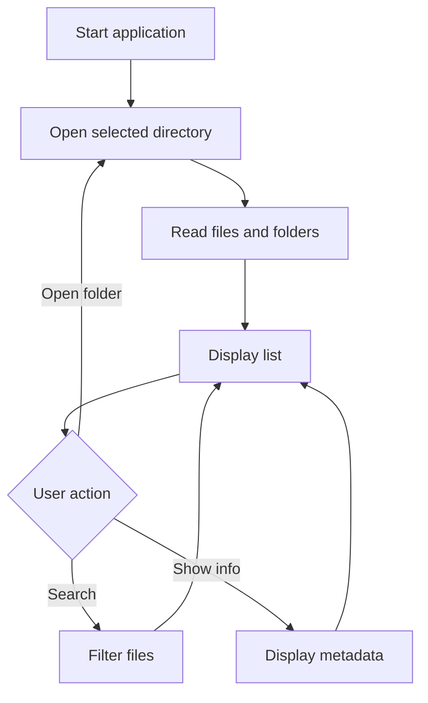

# Lab 11: Mini File Explorer

## Goal

Create a mini file explorer that can browse folders and display file information.

The goal is to understand file system operations, recursion, filtering, and user interaction.

You will practice:

- reading directories;
- working with files;
- recursion;
- search and filtering;
- error handling;
- CLI or simple UI design.

---

## Idea

A file explorer shows folders and files. It allows the user to navigate, search, and inspect file information.

This lab can be implemented as:

- console application;
- desktop application;
- web app with local mock data;
- command-line utility.

---

## File Explorer Workflow



---

## Task

Implement a mini file explorer.

The user must be able to:

- open a directory;
- list files and folders;
- navigate into folders;
- go back to parent folder;
- view basic file information;
- search or filter files.

---

## Functional Requirements

### 1. Directory Listing

Show:

- file names;
- folder names;
- file size, if available;
- file extension, if available.

### 2. Navigation

Support:

- open folder;
- go back;
- refresh current folder;
- handle invalid paths.

### 3. File Information

Show basic metadata:

- name;
- path;
- size;
- extension;
- type: file or folder.

### 4. Search / Filter

Implement at least one:

- search by name;
- filter by extension;
- filter by size;
- recursive search.

---

## Suggested Project Structure

```txt
mini-file-explorer/
  README.md
  src/
    main.*
    FileSystemService.*
    FileInfo.*
    SearchService.*
    Renderer.*
    InputHandler.*
```

---

## Difficulty Levels

### Basic

Implement:

- list files in one folder;
- show file/folder names;
- open subfolder;
- go back.

### Standard

Implement everything from Basic plus:

- file metadata;
- search by name;
- filter by extension;
- error handling;
- clean structure.

### Advanced

Implement some of the following:

- recursive search;
- sorting by name/size/date;
- file preview;
- copy/move/delete with confirmation;
- graphical UI;
- bookmarks.

---

## Implementation Plan

1. Read current directory.
2. Display files and folders.
3. Add navigation into folder.
4. Add parent directory navigation.
5. Add file metadata.
6. Add search/filter.
7. Add error handling.
8. Refactor into modules.
9. Write README and prepare demo.

---

## Testing

Test at least the following:

- directory listing works
- navigation works
- invalid path is handled
- metadata is displayed
- search/filter works

Automated tests are recommended but not strictly required. If you do not write automated tests, describe manual test cases in `README.md`.

---

## Demo

During the demo, show:

- open directory
- navigate into folder
- go back
- search/filter files
- show metadata

---

## README Requirements

Your repository must include `README.md` with:

1. Project name.
2. Short description.
3. Selected difficulty level.
4. Technologies used.
5. How to run the project.
6. Main features.
7. Short explanation of the main algorithm or architecture.
8. Screenshots or demo link, if possible.
9. Known problems or limitations.

---

## Defense Questions

Be ready to answer:

1. How do you read a directory?
2. How do you distinguish files and folders?
3. How do you handle invalid paths?
4. How does search work?
5. Where is recursion useful?
6. What file operations can be dangerous?
7. How would you add sorting?

---

## Evaluation Criteria

| Criterion | Points |
|---|---:|
| Directory listing | 20 |
| Navigation | 20 |
| File metadata | 15 |
| Search/filter | 15 |
| Error handling | 10 |
| Code structure | 10 |
| README/demo | 10 |
| **Total** | **100** |

---

## Expected Result

At the end of this lab, you should have a working project called **Mini File Explorer**.

The project should demonstrate both programming skills and the ability to structure, explain, and present a small but non-trivial software system.
