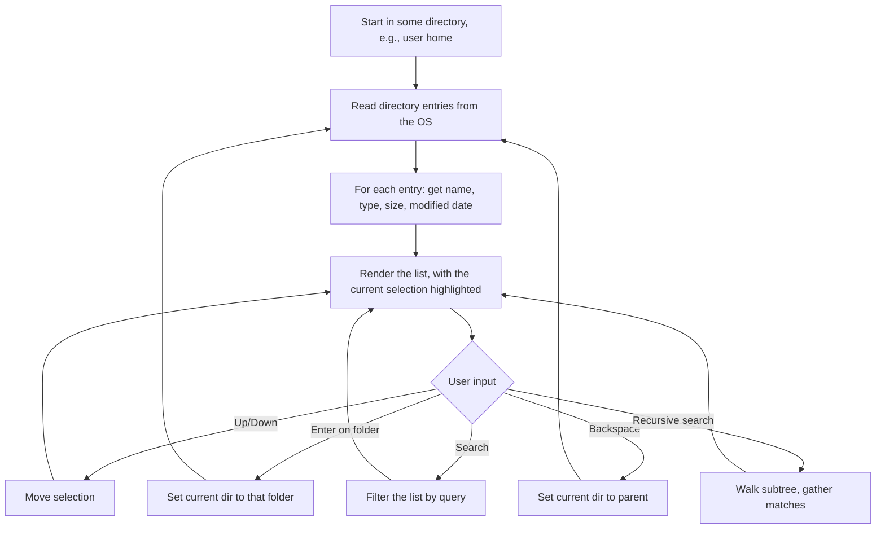

# Lab 11 — A Window Into the Machine: Build a Mini File Explorer

> "On Unix, everything is a file. Once you really feel that, the operating system stops being mysterious."
> — folk wisdom that turns out to be true

**Time budget:** ~2 weeks, working at your own pace.
**Preferred language:** C# or TypeScript (any language is allowed; this lab needs filesystem access, so a desktop-friendly language wins. Browser-only TypeScript can't do this — use Node.js or a desktop framework instead).
**Working style:** solo, or in a team of up to 3 people. Both are equally welcome.

---

## The hook

In 1986, Peter Norton released a small utility for DOS called **Norton Commander**. Two panes side by side. File operations on hotkeys. No mouse needed. It defined a generation of file managers and is still the inspiration behind tools that working professionals use every day — *Total Commander*, *Far Manager*, *Midnight Commander*, *Ranger*. The two-pane file manager is the keyboard-driven power user's secret. Once you've used a good one, regular Explorer and Finder feel slow.

In this lab you'll build a small but real file explorer. Not because the world needs another one — but because every operating system you'll ever work with is, underneath, **a giant tree of files**. Building a tool that walks that tree forces you to learn what's actually there. Filesystems, paths, permissions, hidden files, symlinks, the difference between "size on disk" and "logical size". On the second day of your first job, someone will ask you to write a script that walks a directory tree, and you'll already know how.

The first time your explorer correctly walks into a real directory on your computer — the same one VS Code or Finder would show — and you can navigate around with your own keys, something clicks: **the OS is not a black box anymore.** It's just code. Your code, in fact.

If you want a perfect appetizer, browse the [Total Commander](https://www.ghisler.com/) website and the [Far Manager](https://www.farmanager.com/) docs for 10 minutes — that's what "good" looks like. For deeper context, read the first chapter of [*The Linux Programming Interface*](https://man7.org/tlpi/) by Michael Kerrisk (free preview chapters online) or the wonderful free book [*Operating Systems: Three Easy Pieces*](https://pages.cs.wisc.edu/~remzi/OSTEP/) — Chapters 39–40 ("Files and Directories") are the textbook explanation of what your code is doing under the hood.

---

## Why this is worth your time

- **Filesystems are everywhere.** Every backend job, every devops job, every game studio job involves walking, reading, and writing files. This lab puts the muscles into your hands.
- Recursion finally has a *real* purpose. A directory tree is the most natural recursive structure on your computer.
- Building a tool you can actually use to navigate your own files is **immediately useful** — you'll spot ugly bits of your real workflow that no tutorial would.
- It's one of the few labs where the demo is "I navigated my own laptop for 10 seconds and you trust that it works." A non-technical person understands it instantly.

---

## The target

> **Instructor TODO:** add reference screenshots to `docs/` once available.

**Basic — "It Walks the Tree"**
A console app. The user starts in some directory; the app shows the contents — files in plain text, folders highlighted (or marked with `/`). Up/Down keys (or `j`/`k`) move the selection. Enter opens a folder. `Backspace` (or `..`) goes up. The current path is shown at the top. Invalid paths (e.g., a permission error) are caught cleanly without crashing.

**Standard — "It's Useful"**
The app shows file metadata — size (in human-readable form: `4.2 KB`, `1.7 MB`), last-modified date, extension/type. Sortable: by name, by size, by date. Search/filter by name (`*.png`, partial match). Recursive search across a whole subtree. A "preview" pane that shows the first few lines of text files. Errors (no permission, too large, broken symlinks) are reported but never crash the app.

**Advanced — "Two Panes, No Mouse"**
You've added something memorable: a **two-pane Norton-Commander-style UI** with hotkey file operations (`F5` copy, `F6` move, `F8` delete with confirmation), a **graphical desktop UI** (WPF / Avalonia), a **bookmarks system** for favorite folders, **disk-usage analyzer** that shows the largest files/folders in a tree like the famous tool [WinDirStat](https://windirstat.net/), or a **hash check** mode (compute SHA-256 of a file).

---

## The big idea, in one diagram



The whole tool lives inside that loop. The tricky bits are: **never crash on an unreadable file**, **handle huge directories without freezing the UI**, and **don't lie to the user** about what's there.

---

## Two-week plan with milestones

**Week 1 — Walking the tree**

- **Day 1 — Just list a folder.** Pick a hardcoded path (your home directory). Print every entry's name. *Milestone: your program can read a real directory.*
- **Day 2 — Tell files from folders.** For each entry, ask the OS: is this a file or a folder? Mark folders with `/` or color them differently.
- **Day 3 — Navigate.** Add a tiny REPL: type a folder name, the app sets that as the current dir and re-lists. Type `..`, go up. Type `q`, quit. *Milestone: you can walk around your own machine using your own program.*
- **Day 4 — Arrow-key UI.** Replace typing with up/down arrow keys for selection and Enter to open. (In C# `Console.ReadKey`, in Node.js use a library like `keypress` or `inquirer`.)
- **Day 5 — Metadata.** For each entry, get size and last-modified date. Show them in columns. Add a friendly file-size formatter (`bytesToHuman(1500) -> "1.5 KB"`).
- **Day 6 — Errors won't crash you.** Try to enter a folder you don't have permission for. Wrap every filesystem call in a try/catch. Show the error in the status bar and stay alive.
- **Day 7 — Polish + screenshot for README.**

**At this point you've completed the Basic level. You can stop here and submit a real, defendable project.**

**Week 2 — Make it actually useful**

- **Day 8 — Sorting.** Hotkeys `1`/`2`/`3` (or `n`/`s`/`d`) sort by name / size / date. Reverse with another key.
- **Day 9 — Search by name.** Press `/` (vim-style) or `Ctrl+F`. Type a substring. The list filters live as you type.
- **Day 10 — Recursive search.** Press `Ctrl+R`. Walk the entire subtree starting at the current directory. Use a queue (don't blow the stack on deep trees). Show progress ("scanning… 4231 files"). *Milestone: a working `find`-like search.*
- **Day 11 — File preview.** When the selection is a text file under, say, 1 MB, show its first 30 lines in a side panel. (For binary files, show "binary file, 1.7 MB".)
- **Day 12 — Pick a side quest.**
- **Day 13 — README, screenshots, demo prep.**
- **Day 14 — Buffer day.**

---

## Levels

### Basic — "It Walks the Tree" (~10–14 hours)
- list files and folders in the current directory
- visually distinguish files from folders
- navigate into folders, navigate to parent
- show the current path
- handle invalid paths and permission errors without crashing

### Standard — "It's Useful" (~14–20 hours)
- everything from Basic
- file metadata: size (human-readable), modified date, type/extension
- sorting by name / size / date
- search by name (live filter)
- recursive search across a subtree
- preview pane for small text files
- robust error handling on all filesystem operations

### Advanced — "Side Quests" (each ~6–14h, pick what you find cool)

- **Two-Pane Mode.** Norton-Commander-style: two directory panes side by side, `Tab` swaps focus, `F5`/`F6` copy/move from one to the other. Read a 10-minute Total Commander tutorial first to understand why this is so good.
- **Graphical UI.** A real desktop app with WPF or Avalonia. Sidebar with bookmarks, main pane with files, breadcrumb path navigation, drag-and-drop.
- **Disk Usage Analyzer.** Walk a tree, sum up sizes per folder, show the biggest folders/files in descending order. Bonus: render a treemap (the WinDirStat aesthetic — beautiful and addictive).
- **Hash Check.** Compute SHA-256 of a selected file. Useful for verifying downloads.
- **File Operations.** Copy, move, delete with confirmation. *Always* prompt before destructive actions. Test on dummy files first.
- **Bookmarks.** Save the current folder under a name. `b` opens a bookmark menu.
- **Quick Open.** A "command palette" (`Ctrl+P` style) that searches all bookmarks + recent folders.
- **File Type Icons.** Use Unicode glyphs (or font icons) to show file types: `📄` for docs, `🖼` for images, `🎵` for audio. (Skip if your terminal doesn't render these well.)
- **External Open.** Press `Enter` on a file to open it with the OS's default app (Windows: `Process.Start`, macOS: `open`, Linux: `xdg-open`).
- **Watch Mode.** Press `w`. The app watches the current folder and re-renders when files change. Useful while running a build.

---

## Extension challenges (3–5 weeks)

The 2-week scope above ships a real, defendable tool. If filesystem hacking pulls you in, here's how to grow it into something portfolio-worthy:

- **Ship a real CLI.** Globally installable via `npm i -g` or `dotnet tool install`. Other people install your file explorer and use it. *Surprisingly* impressive on a CV.
- **Build a TUI in the spirit of Total Commander / Far Manager.** Two panes, keyboard-only, fast as hell. Use it yourself for a month.
- **Combine with [Lab 15](lab-15-mini-search-engine.md) (search).** Add full-text search (your inverted index from [Lab 15](lab-15-mini-search-engine.md)) over the contents of all text files in a directory tree. A *grep that's faster than ripgrep* on warm cache. Real engineering.
- **Build a desktop GUI** with Avalonia or Tauri. Drag-and-drop, modern UI, packaged installer. Looks like a real product.
- **Open source it.** A license, GitHub Actions CI, contributing guide. Get one external pull request.

---

## Make it yours (required)

Pick **one** personal twist. Generic file explorers are a dime a dozen — your version should fit a *purpose*.

- **Photo organizer.** A specialized explorer that shows image thumbnails and metadata (resolution, date taken, camera model from EXIF). Sort by date taken, not by filename.
- **Code project navigator.** Hide files matching `.gitignore`, color-code by language, show line counts. Press `Enter` to open in `code` (VS Code).
- **Music library browser.** Show MP3/FLAC files with artist, album, duration (parse the ID3 tags). Group by artist.
- **Aviation logbook reader.** Show `.log` or `.csv` files from a flight simulator (Microsoft Flight Simulator, X-Plane, DCS) with parsed flight data — date, aircraft, duration. (Aviation tie-in: real digital pilot logbooks like ForeFlight do exactly this.)
- **Theme.** Norton Commander 1989 (blue background, yellow text, ASCII borders). Modern terminal beauty (gruvbox / nord palette). Glassmorphism for the GUI version.

You'll defend why you chose your twist.

---

## Working solo or in a team

You can do this lab alone or in a team of **up to 3 people**.

If you go solo: you'll touch low-level filesystem APIs, UI rendering, and ergonomics. The whole tool is yours.

If you go as a team, sensible splits:

- *By layer:* one person owns the filesystem service (read directory, get metadata, recursive walk, error handling); the other owns rendering, input, search.
- *By feature:* one person drives Basic (navigation, metadata), the other drives Standard (sort, search, recursive search, preview).
- *By view:* one person owns single-pane mode, the other owns the two-pane mode and bookmarks.

For a 3-person team: add a "side quest + UX" owner — disk usage analyzer, file operations, the personal twist.

Two rules for teams:

1. **Use git from day one** with a branching workflow.
2. **In your README, list who did what.** Each member must be able to handle a permission error gracefully on demand.

---

## Tooling and language tips

**C#**
- `System.IO.Directory.EnumerateFileSystemEntries` is your friend (lazy, won't load all entries into RAM).
- `FileSystemInfo`, `FileInfo`, `DirectoryInfo` give you metadata.
- For TUI (terminal UI): [`Spectre.Console`](https://spectreconsole.net/) is excellent.
- For GUI: WPF (Windows) or Avalonia (cross-platform).

**TypeScript / Node.js**
- `fs.readdirSync` for simple listing; `fs.readdir` (async) for big directories.
- `fs.stat` for metadata.
- For TUI: [`blessed`](https://github.com/chjj/blessed) (classic, ncurses-style) or [`ink`](https://github.com/vadimdemedes/ink) (React for the terminal — surprisingly delightful).
- For GUI: Electron, Tauri (much smaller binaries), or just stick to TUI.

**Anyone**
- **Never trust the filesystem to behave.** A directory can disappear *while* you're listing it. Permissions can flip between calls. Files can be deleted mid-read. Wrap everything in try/catch and degrade gracefully.
- **Don't load gigantic directories into a single array.** Use streaming/iteration when possible.
- **Path handling: never concatenate strings.** Use the language's path utilities (`Path.Combine`, `path.join`). Otherwise your tool breaks on Windows.
- **Test on hidden files, files with non-ASCII names, files with spaces, files starting with `-`.** Those are where 90% of file-tool bugs hide.

---

## Suggested project structure

```txt
mini-file-explorer/
  README.md
  src/
    main.*
    fs/
      FileSystemService.*    # read dir, get metadata, recursive walk
      PathUtils.*
    search/
      SearchService.*        # name search, recursive search
    ui/
      Renderer.*
      InputHandler.*
      Theme.*
    state/
      AppState.*              # current dir, selection, search query
  docs/
    screenshots/
```

---

## When you get stuck

- **The program crashes when I navigate into a system folder.** Permission denied. Wrap every directory read in try/catch and show the error in the status bar.
- **Some folder names appear as gibberish.** Encoding issue. Use UTF-8 everywhere; tell the terminal to use UTF-8 (`chcp 65001` on Windows).
- **My recursive search blows the stack.** Use an explicit queue or stack instead of recursion. Modern filesystems can have surprisingly deep nesting.
- **The UI freezes on a big folder.** You're loading every entry into RAM before rendering. Use lazy iteration. Show a loading state.
- **My search is case-sensitive but I want it case-insensitive.** Lowercase both sides before comparing. (Be careful with non-ASCII alphabets — `ß` vs `SS` is famously tricky in German. For 1st-year scope, ASCII-lowercase is fine.)

If you're stuck for 30+ minutes: print the path and the exact OS error to a log file. The bug is almost always in path construction or error handling.

---

## Submission checklist

- [ ] Tool runs end-to-end on a clean machine.
- [ ] Doesn't crash on permission errors, missing folders, broken symlinks, gigantic directories.
- [ ] Handles non-ASCII filenames (try a folder named `тест` and a file `файл.txt`).
- [ ] Path construction uses the language's path utilities — works on Windows *and* Unix.
- [ ] If you built a CLI: a one-line install command in the README (`npm i -g …` or download link).
- [ ] If you built a desktop GUI: a downloadable installer or signed binary in GitHub Releases.
- [ ] **A 15-second screen recording or GIF** in the README — real navigation, real folders.
- [ ] No private paths or absolute paths in source.
- [ ] Keyboard shortcuts listed in the README.

---

## What evaluators look at

- **They navigate.** A reviewer types in your hands' workflow — go up, go down, search, sort. Speed and responsiveness sell the project in 10 seconds.
- **They abuse it.** They'll point it at `/`, at `C:\`, at a folder full of 10000 files, at a permission-denied folder, at a deep symlink loop. *Plan for these.* Graceful degradation reads as senior-level care.
- **They look at your error handling.** A `try/catch` at every filesystem call + a status-bar error message = strong signal. Crashes on permission errors = "didn't think about real users."
- **They look at path-handling code.** String concatenation = junior. `Path.Combine` / `path.join` = professional.
- **They look at non-ASCII support.** Most student projects break here; getting it right marks you as someone who tests with real-world data.
- **They look at the personal twist.** A photo organizer / code-project navigator / aviation logbook reader is *much* stronger signal than "yet another file explorer."

---

## What to put in your README

1. Project name + one-sentence description.
2. **A screenshot of the explorer running** at the top — your home folder, your project tree, anything real.
3. Which level + side quests.
4. Your personal twist and why.
5. How to run it + the 5 most useful keys/commands.
6. A short paragraph in your own words on how the tool walks a directory tree.
7. A short paragraph on how you handle permission errors (the most common real-world failure).
8. (Optional but loved) A "before / after" of finding the same file with regular Explorer vs. your tool.
9. If you worked in a team — who did what.

---

## Reflection

Be ready to:

1. **Navigate to a real folder on the laptop**, live, using only your tool.
2. **Try to enter a folder you don't have permission for.** Show that the program survives.
3. **Run a recursive search** for a common filename in a big subtree. Explain what's happening.
4. **Walk through your `readDirectory` function.** What does the OS actually return? What error cases exist?
5. **Where does your code break** if the current directory is deleted while the app is running? If a file's name has a newline in it (yes, this is legal on Unix)?
6. **What's the difference between recursion and iteration with a queue** for tree walking? Which did you use, and why?
7. **What was the hardest bug**, and how did you find it?

---

## Showcase

At the end of the semester there will be a small gallery — anonymous voting for **best UX**, **most useful specialization** (best personal twist), and **most polished UI**. Bring a 30-second clip of someone navigating around with hotkeys.

---

## Going further

- *Operating Systems: Three Easy Pieces* (free, online) — Chapters 39–40 are exactly the OS-level theory behind what you built.
- *The Linux Programming Interface* by Michael Kerrisk — when you're ready to write a Unix shell.
- *Far Manager* and *Total Commander* — keep one installed; you'll keep using it.
- The classic [Norton Commander UI screenshots from 1986](https://en.wikipedia.org/wiki/Norton_Commander) — for the historical aesthetic.
- *Build Your Own Shell* tutorials (search "Build Your Own Shell in C") — the natural next step from this lab.

---

## A final word

The OS is not magic. It's the same kind of code you write, just bigger and older. After this lab, when you `cd` somewhere or open Finder, you'll have a quiet sense of *how it works underneath*. That demystification is one of the most powerful things a 1st-year course can give you. The tool you built may not replace Total Commander, but the understanding it taught you is permanent.
