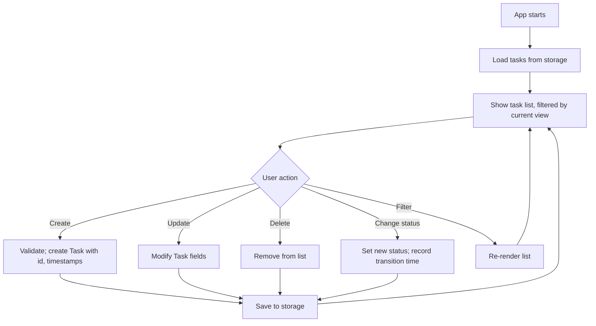

# Lab 12 — The Tool You'll Actually Use: Build a Task Tracker

> "Just write down the next thing. The hard part is not forgetting."
> — every productivity book ever, condensed

**Time budget:** ~2 weeks, working at your own pace.
**Preferred language:** C# or TypeScript (any language is allowed; this lab is backend-friendly and TS is excellent for the optional web UI).
**Working style:** solo, or in a team of up to 3 people. Both are equally welcome.

---

## The hook

Trello started as a weekend hack at a small NYC software studio in 2011. Three years later it had 4 million users. Notion was a 5-person company in San Francisco for years before "going viral". Linear was three engineers in 2019 — today it's the issue tracker every serious tech startup wants. Every one of them started at the same place: **a list of tasks, with statuses, that survives a restart.** That's the entire skeleton.

In this lab you'll build that skeleton. Not because the world needs another task tracker, but because **task tracking is the most-built kind of app on Earth**. Half of the apps you'll ever be paid to write are some flavor of "list of things, with statuses, with filters, with deadlines." Once you've built a clean one — really clean, where you'd be happy to use it yourself — you've shipped a small piece of software that demonstrates the same skills as the first three years of your career.

The truly motivating thing here: if you do this lab well, **you should genuinely use your own task tracker**. Not because it's the best one. Because *you wrote it*, and there's something quietly powerful about opening a tool you built and watching it work for you while you study or work on the next lab.

If you want a perfect appetizer, read [*Getting Real*](https://basecamp.com/gettingreal) by 37signals — the makers of Basecamp and the inventors of Ruby on Rails. It's a free book about how small teams build software that people actually use. Read also: a 5-minute version of the [Trello origin story](https://blog.trello.com/the-four-year-journey-to-create-trello) — Trello was a side project at Joel Spolsky's company, FogCreek, before it became a billion-dollar product.

---

## Why this is worth your time

- Some flavor of "list with statuses" is the most common shape of every job-listing for a junior engineer. **Building a clean one is the closest 1st-year project to "first day of work."**
- Persistence, validation, and CRUD — the same trio as Lab 01 — are the boring-looking work that takes up 70% of any real product. This lab gets you fluent.
- A well-designed task tracker is a **portfolio piece you can show to a non-technical person**. They'll understand what it is in 5 seconds and remember the demo. Most of your other projects need explanation.
- It is the rare lab where, if you genuinely care about your own productivity, **you'll keep using the result for the rest of the semester** — and that's the highest compliment a piece of software can get.

---

## The target

> **Instructor TODO:** add reference screenshots to `docs/` once available.

**Basic — "It Tracks Tasks"**
A console (or simple GUI) application. The user can create tasks (title + status), list them, change a task's status (`todo → in-progress → done`), and delete tasks. Tasks are saved to disk; closing and reopening the app shows them again. Empty titles are rejected. Each task has a creation timestamp.

**Standard — "It's a Real Tool"**
Full CRUD + edit. Filtering — by status, by priority (`low / med / high`), by deadline (overdue, due-today, future), by text search. Tags / labels. A "today" view that shows what to focus on. Storage is in JSON or SQLite, with safe writes (no data loss on crash). The CLI/UI is fast enough that *you'd actually use it* when you don't have to.

**Advanced — "It's Almost a Product"**
You've added something memorable: a **kanban board** view (three columns, drag-and-drop in a web UI), **subtasks** with progress bars, **recurring tasks** ("repeat every Monday"), a **statistics dashboard** ("you completed 12 tasks last week"), **multiple users / accounts** with separate task lists, **import/export** to/from CSV or Markdown, or a **command-line interface** that's so good you can do everything without leaving the terminal.

---

## The big idea, in one diagram



A task tracker is the simplest non-trivial CRUD app. There's almost nothing here that *isn't* in this diagram. The hard, valuable part is making the UX feel **fast and trustworthy**.

---

## Two-week plan with milestones

**Week 1 — A working tracker on disk**

- **Day 1 — Sketch the model.** On paper: what fields does a `Task` have? `id`, `title`, `status`, `createdAt`. Optional: `description`, `priority`, `deadline`, `tags`. Decide what's *required* and what's optional.
- **Day 2 — In-memory tracker.** Implement `Task` and a `TaskService` with `add`, `list`, `delete`, `markDone`. Use it from a small script.
- **Day 3 — A CLI.** A simple command loop: `add "buy milk"`, `list`, `done 3`, `delete 5`, `quit`.
- **Day 4 — Persistence.** Save tasks to a JSON file. Load on startup. *Milestone: closing and reopening the app preserves state.*
- **Day 5 — Validation.** Reject empty titles. Cap title length. Reject deletes of non-existent IDs. Print clear errors.
- **Day 6 — Statuses.** Add `IN_PROGRESS` and a way to move tasks between `TODO`, `IN_PROGRESS`, `DONE`. Record the timestamp of each transition.
- **Day 7 — Polish + a daily-use README.** *Milestone: you have a task tracker you could use today.* Try using it for one day.

**At this point you've completed the Basic level. You can stop here and submit a real, defendable project.**

**Week 2 — Make it good enough to actually use**

- **Day 8 — Priority + deadline.** Add `priority` (`low / med / high`) and `deadline` (a date). Show overdue tasks in red. Sort by priority by default.
- **Day 9 — Filtering and views.** Add commands: `today` (due today + overdue), `done-this-week`, `tag work`. The "today" view is the single most important feature in any task tracker.
- **Day 10 — Tags.** A task can have multiple tags. Filter by tag.
- **Day 11 — Atomic save + better storage.** Either move to SQLite, or implement atomic JSON writes (write to `.tmp`, rename). Either way: no data loss on crash.
- **Day 12 — Pick a side quest.**
- **Day 13 — README, screenshots, demo prep.**
- **Day 14 — Buffer day.**

---

## Levels

### Basic — "It Tracks Tasks" (~8–12 hours)
- a `Task` model (id, title, status, createdAt)
- create, list, delete, mark-done
- two or more statuses
- persistent storage in a file
- empty / invalid input rejected
- timestamps recorded

### Standard — "It's a Real Tool" (~14–20 hours)
- everything from Basic
- full CRUD (including edit)
- ≥ 3 statuses with transitions
- priority and deadline
- tags or labels
- filtering: by status, by priority, by tag, by text search
- a "today" view
- safe storage (atomic file writes or SQLite)
- clean module separation

### Advanced — "Side Quests" (each ~6–14h, pick what you find cool)

- **Kanban Web UI.** A small web app with three columns (`To Do`, `In Progress`, `Done`), drag-and-drop. ASP.NET Core + plain HTML, or Node + a small frontend framework. The single biggest "this looks like a real product" upgrade you can make.
- **Subtasks.** A task can contain a list of subtasks; the parent's progress is `completed / total`.
- **Recurring Tasks.** "Every Monday", "every 2 weeks". When marked done, the next instance is automatically scheduled. Surprisingly tricky and very valuable.
- **Statistics Dashboard.** A page that shows completed-per-week, average time-to-completion, most-used tags. Live charts.
- **Markdown Notes.** Each task has a body where the user can write notes in Markdown.
- **CSV / Markdown Export.** "Export this week's done tasks" → a clean text artifact you could paste into a status report.
- **CLI Power Tool.** A real CLI: `tt add "fix bug" -p high -d today -t work`. Globally installable. Fast as hell. The kind of thing you'd actually keep using.
- **Multi-user.** Sign-in (even just username, no password — same caveats as Lab 01). Each user has their own task list.
- **Calendar View.** Show this week / next week as a 7-column grid with tasks placed on their deadlines.
- **Pomodoro Integration.** Click "start" on a task, a 25-minute timer counts down, completion logs the session. Build a "I worked for 4 hours today" stats page.

---

## Make it yours (required)

The technical bar isn't higher because of this — but a personal angle is what turns this from "yet another to-do app" into something memorable.

Pick **one**:

- **Build it for one specific kind of person.** A marathon trainee (tasks = workouts, plus distance/pace fields). A thesis writer (tasks = chapters/sections, plus word-count goals). A parent of toddlers (tasks = doctor visits, school events, no priority field — there's no time to set priorities). A freelancer (tasks = client projects, plus hourly rate, plus invoiced/not-invoiced flag). The constraints reveal themselves and the tool actually fits the user.
- **A specific theme or aesthetic.** A calm, low-stim minimalist design. A retro "DOS era" green-on-black UI. A handwritten "bullet journal" look. A Soviet-era institutional aesthetic with stern typography.
- **A philosophy.** The "no priorities" tracker (you can only have 3 tasks, period — adding a 4th forces you to delete one). The "one thing today" tracker (only one task is visible at a time). The "future-only" tracker (everything has a deadline; nothing is "someday").
- **Aviation tie-in (optional, fits this institute).** A "pilot's logbook" mode — tasks are flights, with fields for hours flown, aircraft type, instructor name. Log to a CSV that resembles an actual pilot's logbook. The tracker is now a piece of domain software.

You'll defend why you chose your twist.

---

## Working solo or in a team

You can do this lab alone or in a team of **up to 3 people**.

If you go solo: you'll touch model, validation, storage, CLI/UI, *and* whatever side quest you pick. Closest thing to a one-person product on the entire course.

If you go as a team, sensible splits:

- *By layer:* one person owns model + service + storage; the other owns UI/CLI + filtering + statistics.
- *By feature:* one person drives Basic (CRUD, statuses, persistence); the other drives Standard (priorities, tags, filters, today view).
- *By interface:* if you do the kanban web UI side quest, one person owns the backend API; the other owns the frontend.

For a 3-person team: add a "side quest + UX + dataset/demo" owner.

Two rules for teams:

1. **Use git from day one** with a branching workflow.
2. **In your README, list who did what.** Each member must be able to explain the data model and the storage strategy.

---

## Tooling and language tips

**C#**
- Console app or ASP.NET Core minimal API both work.
- For the kanban side quest: ASP.NET Core + plain HTML/JS, or a frontend framework of your choice.
- Storage: `System.Text.Json` for JSON; `Microsoft.Data.Sqlite` for SQLite. EF Core is overkill for this — stay simple.
- For a polished CLI: [`Spectre.Console`](https://spectreconsole.net/) for tables, prompts, and color is a delightful library.

**TypeScript**
- Node.js + plain `fs` for JSON, [`better-sqlite3`](https://github.com/WiseLibs/better-sqlite3) for SQLite.
- For the kanban web UI: any backend (Express, Fastify, Hono) + plain HTML or React/Svelte/Vue.
- Modern CLI tooling: [`commander`](https://github.com/tj/commander.js) for argument parsing, [`chalk`](https://github.com/chalk/chalk) for colors, [`ora`](https://github.com/sindresorhus/ora) for spinners.
- Deploy a web version to GitHub Pages or Vercel — instant share-with-friends.

**Anyone**
- **Atomic file writes.** Write to `tasks.json.tmp`, then rename. Five lines of code, saves you from data loss forever.
- **Use UUIDs or sequential ids.** Never assume "task index in array" is stable across deletes.
- **Store dates in ISO 8601, in UTC.** Convert to local time for display only.

---

## Suggested project structure

```txt
task-tracker/
  README.md
  src/
    main.*
    models/
      Task.*                # id, title, status, priority, deadline, tags, ...
    services/
      TaskService.*         # business logic: filtering, transitions, search
    storage/
      Repository.*          # interface
      JsonRepository.*
      SqliteRepository.*    # if you upgrade
    ui/
      Cli.*
      Web.*                 # kanban, if you do the side quest
  data/
    tasks.json
  docs/
    screenshots/
```

---

## When you get stuck

- **My tasks reset every time I run the program.** You forgot to load on startup, or you're saving to a different path than you load from. Print the absolute path of the storage file at startup.
- **Two tasks have the same id.** You're using array index. Use a UUID, or always increment from `max(existing ids) + 1`.
- **Filtering returns the wrong tasks.** Hand-trace filter logic on a 5-task list. Most filter bugs come from mixing AND/OR or treating string `"high"` as `> "low"` (lexicographic, not semantic).
- **Deadlines are off by a day.** Almost certainly timezone-related. Always store in UTC; display in local time.
- **The CLI feels slow.** Are you re-reading the file on every command? Read once at startup, save on every change.

If you're stuck for 30+ minutes: print the in-memory list and the on-disk file side by side. The bug is almost always a mismatch.

---

## What to put in your README

1. Project name + one-sentence description.
2. **A screenshot of the tracker with real tasks** (your own — don't fake them; recruiters can tell).
3. Which level + side quests.
4. Your personal twist and why.
5. How to run it + the 5 most useful commands or hotkeys.
6. A short paragraph on the data model in your own words.
7. A short paragraph on how you handle storage atomicity.
8. (Optional but loved) A "before / after one week of use" — show that you actually used the tool.
9. If you worked in a team — who did what.

---

## Reflection

Be ready to:

1. **Add a task, restart the app, show the task is still there.**
2. **Try to add an empty task.** Show what happens. Show me where in the code that decision is made.
3. **Walk through your data model.** What's required, what's optional, why.
4. **Filter for "overdue tasks tagged 'work', sorted by priority".** Show the code path.
5. **What goes wrong** if the storage file is hand-edited and becomes invalid? If two writes happen at exactly the same time?
6. **What changes** if we want to support 100 users with separate task lists?
7. **What was the hardest bug**, and how did you find it?
8. **Real talk: did you actually use this for a day?** If yes, what did you change after using it? If no, what would you change before you would?

---

## Showcase

At the end of the semester there will be a small gallery — anonymous voting for **most polished UI**, **best CLI ergonomics**, and **best fit-for-its-user** (best personal-twist execution). Bring a 30-second demo: one task created, one moved, one filtered.

---

## Going further

- *Getting Real* by 37signals (free) — the appetizer above. Read it after the lab too.
- *Rework* by Jason Fried & DHH — the follow-up book. Short, brutal, useful.
- *Refactoring UI* by Adam Wathan & Steve Schoger — practical, beautiful, transforms how you think about visual polish.
- *Linear's blog* — the company that made the famously fast issue tracker writes well about UI craft and "feel".
- *The Pragmatic Programmer* (Hunt & Thomas) — about turning code into reliable software in general.

---

## A final word

There's something small but real about opening a tool you wrote, two weeks after writing it, and finding everything where you left it. Not because it's clever. Because *it works*. After this lab, you'll have built one such thing. Many of your future jobs will be the same shape, just larger. You'll be a few months ahead of where most graduates start.
