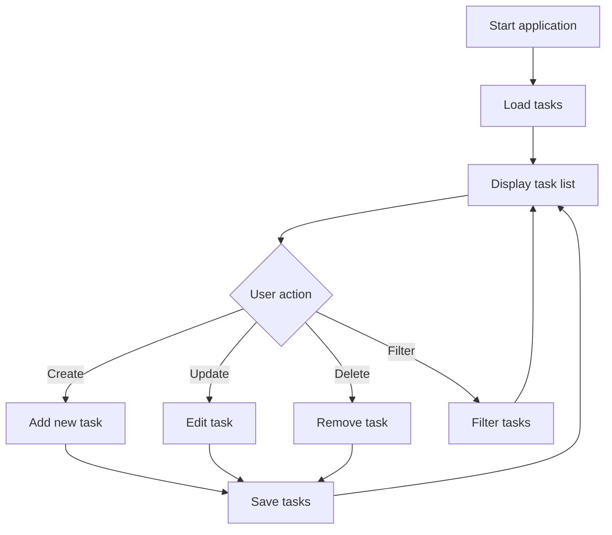

# Lab 12: Task Tracker

## Goal

Create a simple task tracker similar to a minimal Trello or TODO board.

The goal is to understand CRUD operations, application state, validation, and persistent storage.

You will practice:

- data modeling;
- create/read/update/delete operations;
- UI or CLI design;
- filtering;
- persistence;
- basic architecture.

---

## Idea

A task tracker helps users organize tasks.

Each task may have:

- title;
- description;
- status;
- priority;
- deadline;
- creation date.

The user should be able to create tasks, update them, move them between statuses, and filter the list.

---

## Task Tracker Workflow



---

## Task

Implement a task tracker.

The application must allow the user to:

- create tasks;
- view tasks;
- update tasks;
- delete tasks;
- change task status;
- save tasks between application runs.

---

## Functional Requirements

### 1. Task Model

Each task must have:

- id;
- title;
- status;
- creation date.

Recommended fields:

- description;
- priority;
- deadline.

### 2. CRUD Operations

Implement:

- create task;
- list tasks;
- update task;
- delete task.

### 3. Statuses

Support at least three statuses:

- TODO;
- IN_PROGRESS;
- DONE.

### 4. Storage

Use one of:

- JSON file;
- SQLite;
- browser local storage;
- simple database.

### 5. Filtering

Support at least one filter:

- by status;
- by priority;
- by text;
- by deadline.

---

## Suggested Project Structure

```txt
task-tracker/
  README.md
  src/
    main.*
    models/
      Task.*
    services/
      TaskService.*
    storage/
      TaskRepository.*
    ui/
```

---

## Difficulty Levels

### Basic

Implement:

- create tasks;
- list tasks;
- mark task as done;
- store tasks in memory or file.

### Standard

Implement everything from Basic plus:

- full CRUD;
- status changes;
- persistent storage;
- filtering;
- validation.

### Advanced

Implement some of the following:

- kanban board UI;
- drag and drop;
- deadlines and overdue tasks;
- tags;
- subtasks;
- statistics;
- user accounts.

---

## Implementation Plan

1. Create task model.
2. Implement task storage.
3. Add create and list operations.
4. Add update and delete.
5. Add statuses.
6. Add filtering.
7. Add validation.
8. Save data between runs.
9. Refactor into modules.
10. Write README and prepare demo.

---

## Testing

Test at least the following:

- task creation works
- tasks are saved
- update/delete work
- status change works
- filtering works

Automated tests are recommended but not strictly required. If you do not write automated tests, describe manual test cases in `README.md`.

---

## Demo

During the demo, show:

- create task
- update task
- change status
- filter tasks
- restart app and show saved data

---

## README Requirements

Your repository must include `README.md` with:

1. Project name.
2. Short description.
3. Selected difficulty level.
4. Technologies used.
5. How to run the project.
6. Main features.
7. Short explanation of the main algorithm or architecture.
8. Screenshots or demo link, if possible.
9. Known problems or limitations.

---

## Defense Questions

Be ready to answer:

1. What fields does your task have?
2. How do you store tasks?
3. How do CRUD operations work?
4. How do you validate input?
5. How do statuses work?
6. What is the repository responsible for?
7. How would you add user accounts?

---

## Evaluation Criteria

| Criterion | Points |
|---|---:|
| Task model | 15 |
| CRUD operations | 25 |
| Persistent storage | 15 |
| Statuses/filtering | 15 |
| Validation | 10 |
| Code structure | 10 |
| README/demo | 10 |
| **Total** | **100** |

---

## Expected Result

At the end of this lab, you should have a working project called **Task Tracker**.

The project should demonstrate both programming skills and the ability to structure, explain, and present a small but non-trivial software system.
