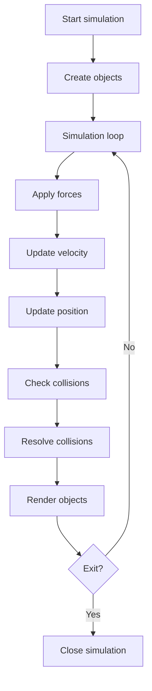

# Lab 13: Physics Sandbox

## Goal

Create a simple 2D physics sandbox where objects move, fall, and collide with borders.

The goal is to understand position, velocity, acceleration, gravity, and collision response.

You will practice:

- 2D coordinates;
- vectors;
- simulation loop;
- basic physics;
- collision detection;
- rendering.

---

## Idea

A physics sandbox simulates objects over time.

Each object may have:

- position;
- velocity;
- acceleration;
- radius or size;
- mass, optionally.

The program updates object positions every frame and handles collisions.

---

## Physics Simulation Workflow



---

## Task

Implement a simple 2D physics sandbox.

The application must show moving objects affected by basic physics.

At minimum, implement:

- one or more balls;
- gravity;
- bouncing from screen borders;
- continuous update loop.

---

## Functional Requirements

### 1. Objects

Each object must have:

- position;
- velocity;
- size or radius.

Recommended:

- acceleration;
- mass;
- color.

### 2. Physics Update

Each frame must:

- apply gravity;
- update velocity;
- update position.

### 3. Collision Detection

Implement collision with:

- floor;
- walls;
- ceiling, optionally.

Recommended:

- ball-ball collision;
- energy loss after bounce.

### 4. User Interaction

Support at least one:

- add new ball;
- reset simulation;
- change gravity;
- pause/resume.

---

## Suggested Project Structure

```txt
physics-sandbox/
  README.md
  src/
    main.*
    physics/
      Body.*
      PhysicsWorld.*
      Vector2.*
    rendering/
      Renderer.*
    input/
      InputHandler.*
```

---

## Difficulty Levels

### Basic

Implement:

- one ball;
- gravity;
- border collision;
- simple rendering.

### Standard

Implement everything from Basic plus:

- multiple balls;
- pause/resume;
- reset;
- configurable gravity;
- clean physics module.

### Advanced

Implement some of the following:

- ball-ball collisions;
- friction;
- different materials;
- mouse interaction;
- object spawning;
- trajectory display;
- fixed timestep simulation.

---

## Implementation Plan

1. Create vector or coordinate structure.
2. Create ball/body object.
3. Add simulation loop.
4. Apply gravity.
5. Update position.
6. Add border collision.
7. Add rendering.
8. Add controls.
9. Add multiple objects.
10. Refactor into modules.
11. Write README and prepare demo.

---

## Testing

Test at least the following:

- gravity affects objects
- position updates over time
- border collision works
- pause/reset works if implemented
- simulation remains stable

Automated tests are recommended but not strictly required. If you do not write automated tests, describe manual test cases in `README.md`.

---

## Demo

During the demo, show:

- show moving object
- show bounce
- change or reset simulation
- show multiple objects if implemented
- explain physics update

---

## README Requirements

Your repository must include `README.md` with:

1. Project name.
2. Short description.
3. Selected difficulty level.
4. Technologies used.
5. How to run the project.
6. Main features.
7. Short explanation of the main algorithm or architecture.
8. Screenshots or demo link, if possible.
9. Known problems or limitations.

---

## Defense Questions

Be ready to answer:

1. What is velocity?
2. What is acceleration?
3. How do you apply gravity?
4. How do you detect wall collision?
5. How do you change direction after bounce?
6. What is a simulation loop?
7. How would you add ball-ball collision?

---

## Evaluation Criteria

| Criterion | Points |
|---|---:|
| Physics update | 25 |
| Collision detection | 20 |
| Rendering | 15 |
| User interaction | 10 |
| Multiple objects/features | 10 |
| Code structure | 10 |
| README/demo | 10 |
| **Total** | **100** |

---

## Expected Result

At the end of this lab, you should have a working project called **Physics Sandbox**.

The project should demonstrate both programming skills and the ability to structure, explain, and present a small but non-trivial software system.
