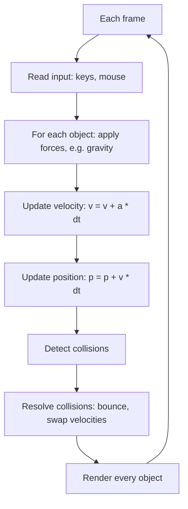

# Lab 13 — Make Things Fall: Build a 2D Physics Sandbox

> "Physics is what physicists do late at night."
> — Murray Gell-Mann

**Time budget:** ~2 weeks, working at your own pace.
**Preferred language:** C++ or C# (any language is allowed, but real-time graphics is fastest in these).
**Working style:** solo, or in a team of up to 3 people. Both are equally welcome.

---

## The hook

A ball drops. It hits the floor. It bounces, slightly less high than before. It rolls, slows, stops. You've watched this happen ten thousand times in your life and never thought about it. In this lab you'll build it. With code. From the ground up.

It is one of the most satisfying programs you can write. There is something almost magical about typing `gravity.y = -9.81` and seeing a circle on your screen do *exactly* what objects in the real world do. Then you realize that gravity, position, velocity, and a bit of vector math is the entire foundation of every video game, every car simulator, every Pixar physics shot, every rocket trajectory ever computed. You're not building a toy — you're building a tiny universe that obeys rules you wrote.

If you want a 12-minute appetizer before starting, watch Sebastian Lague's [*Coding Adventure: Solar System*](https://www.youtube.com/watch?v=7axImc1sxa0) on YouTube — it's the same idea (forces, velocities, integration) applied to planets instead of bouncing balls. The classic companion text for this lab is Daniel Shiffman's [*The Nature of Code*](https://natureofcode.com/) — a free online book that's literally written for someone doing exactly this lab. Chapters 1, 2, and 3 are gold.

---

## Why this is worth your time

- **Vectors stop being abstract.** After this lab, "position", "velocity", and "acceleration" will mean something physical to you, not just symbols on a board.
- This is **the exact same math** as in every game engine — Unity, Unreal, Godot, Box2D, Bullet. You're learning their core, not their API.
- The simulation loop you'll build (read input → update physics → render) is the **heartbeat of every interactive program ever written**, from Pong to Cyberpunk 2077.
- It is **genuinely fun**. Once you get one ball working, you'll lose an hour throwing in 200 of them and watching the screen go nuts.

---

## The target

> **Reference build:** [Writing a Physics Engine from scratch — collision detection optimization — Pezzza's Work](https://www.youtube.com/watch?v=9IULfQH7E90) — Verlet-physics in C++, with the legendary spatial-grid optimization. The visual bar to aim for at the Advanced level.

**Basic — "It Falls"**
A single ball falls under gravity in a window. It hits the floor, bounces with reduced energy, bounces again a little lower, and eventually settles. The ball stays inside the window — left wall, right wall, floor, ceiling all push it back. Run the program and you can stare at it like a screensaver.

**Standard — "It's a Sandbox"**
You can spawn a new ball with a key press or a mouse click. The simulator handles 50+ balls cheerfully. You can pause and resume with `space`. You can reset with `R`. Gravity is a slider. Each ball has a different size and color.

**Advanced — "Things Talk to Each Other"**
Balls now collide with each other — when two balls touch, they push apart and swap momentum realistically. You've added one bigger feature: maybe a chain of balls connected by springs, or a mouse cannon that fires balls in the direction you drag, or a "trails" mode where every ball leaves a fading line behind it. The result is mesmerizing.

---

## The big idea, in one diagram



Five lines of physics, plus rendering. That's the whole sandbox. The game loop ties it all together — at 60 FPS, this entire diagram runs sixty times per second.

---

## Two-week plan with milestones

**Week 1 — Make one ball behave**

- **Day 1–2 — Window setup.** Open a window, render a single white circle in the middle of a black background, in a `while` loop. *Milestone: a circle on a screen, redrawn 60 times per second.*
- **Day 3 — Vectors.** Implement a tiny `Vec2 { x, y }` with `+`, `-`, `*scalar`, `length`, `normalize`. Don't render anything new yet — write a few `print` checks.
- **Day 4 — Position and velocity.** Give the ball `position` and `velocity` (`Vec2`s). Each frame: `position += velocity * dt`. Set the velocity to `(100, 0)` and watch the ball drift right. *Milestone: motion.*
- **Day 5 — Gravity.** Add `acceleration = (0, 400)` (pixels/sec²). Each frame: `velocity += acceleration * dt`. Run it. *Milestone: it falls.*
- **Day 6 — The floor.** When the ball's bottom hits the floor, flip the y-velocity (`velocity.y = -velocity.y`) and multiply by `0.8` to lose some energy. *Milestone: it bounces. Take a video.*
- **Day 7 — Walls and ceiling.** Same trick on the other three sides. The ball is now contained.

**At this point you've completed the Basic level. You can stop here and submit a real, defendable project.**

**Week 2 — Make it a sandbox**

- **Day 8 — Many balls.** Replace your single ball with a `List<Ball>` / `std::vector<Ball>`. Loop over them in update and render. Spawn 50 of them at random positions and watch the chaos.
- **Day 9 — Spawn on click.** Mouse click → spawn a new ball at the click location with a random small velocity. Suddenly you have a creator's hand.
- **Day 10 — Pause / resume / reset.** `Space` toggles pause; `R` resets the scene; `G` cycles gravity strength. These tiny controls make the whole thing feel like a real tool.
- **Day 11 — Ball-ball collisions.** When two balls overlap: push them apart along the line between centers, then swap the components of their velocities along that line. *Milestone: balls clack off each other.* This is the hardest day — give yourself time.
- **Day 12 — Pick a side quest.**
- **Day 13 — README, screenshot, demo prep.**
- **Day 14 — Buffer day.**

---

## Levels

### Basic — "It Falls" (~6–10 hours)
- one ball
- gravity
- bouncing off all four walls
- some energy loss per bounce
- a real-time render loop

### Standard — "It's a Sandbox" (~12–18 hours)
- everything from Basic
- a list of balls (multiple objects)
- spawn balls on demand (key or click)
- pause / resume / reset controls
- configurable gravity (slider or hotkey)
- a clean separation between physics and rendering code

### Advanced — "Side Quests" (each ~3–10h, pick what you find cool)

- **Particle Storm.** Push the simulation to 1000+ small particles. Profile and optimize until it runs at 60 FPS.
- **Color by Speed.** Each ball's color depends on its current speed — slow = blue, fast = red. The screen becomes a thermal map.
- **Mouse Cannon.** Click and drag to draw a velocity vector; release to fire a ball in that direction with that speed.
- **Springs and Chains.** Connect two balls with a spring (Hooke's law: `F = -k * (length - rest)`). Make a chain of 10. Make a 2D cloth.
- **Solar System.** Replace constant downward gravity with point gravity (`F = G * m1 * m2 / r²`) toward a fixed central mass. Watch orbits emerge.
- **Trail Mode.** Every ball leaves a fading line behind it. Run it for 30 seconds with 50 balls — it looks like fireworks.
- **Time Machine.** Record positions every frame; let the user scrub a timeline backward and forward.
- **Slow Motion.** Hold a key to drop simulation speed to 10%. Tiny feature, huge feel.
- **Fixed Timestep.** Decouple physics from frame rate so the simulation is stable on a 30 Hz laptop and a 240 Hz monitor alike. (Read about "Fix Your Timestep" by Glenn Fiedler.)

---

## Extension challenges (3–5 weeks)

The 2-week scope above ships a real, defendable simulator. If physics or game-feel pulls you in, here's how to grow it into something portfolio-worthy:

- **Ship to the web.** Port to TypeScript + canvas (or compile your C++/C# version to WASM). Deploy to GitHub Pages — anyone with the URL plays.
- **Build a real "pinball table"** with bumpers, flippers (driven by left/right keys), tilt, and a high-score system. Now your sandbox is a tiny game.
- **Combine with [Lab 17](lab-17-pid-self-balancer.md) (PID).** Add a self-balancing ball-on-a-plate simulator — change "the user controls gravity" to "a PID controller does." A real control-theory toy.
- **Combine with [Lab 25](lab-25-platformer-game.md) / 28 (Game / Jam).** Use the physics engine as the core of a 48-hour jam game.
- **A 2D rigid-body engine.** Move beyond circles to polygons, with proper SAT (Separating Axis Theorem) collision detection and rotational physics. Substantial; legendary as a portfolio project.

---

## Make it yours (required)

Pick **one** personal twist:

- Make the simulator be about *something*: bouncing snowflakes around a snow globe, popcorn popping out of a pan, a pinball table with bumpers, gas particles in a heating room.
- Build it as a "calm-down" tool: pastel colors, soft physics, gentle controls. Something you'd actually open at the end of a long day.
- Build it as a chaos engine: maximum velocity, screen-shake, pulsing colors, sound on every collision.
- Re-skin the balls as something else — emoji, planets, raindrops, fireflies.

You'll defend why you chose it.

---

## Working solo or in a team

You can do this lab alone or in a team of **up to 3 people**. Pick whichever sounds more fun.

If you go solo: you'll touch every part of the code and build the whole loop yourself. Lonelier when the math goes wrong, but the win is fully yours.

If you go as a team: physics sandboxes split very cleanly. Sensible splits:

- *By layer:* one person owns the physics module (`Body`, `Vec2`, integration, collisions); the other owns rendering, input, UI.
- *By feature:* one person drives the basic single-ball simulation, the other drives multi-object support and ball-ball collisions.
- *By milestone:* one person owns Week 1 (Basic), the other owns Week 2 (sandbox + side quests). Pair-program the collision resolution day.

For a 3-person team: add a "polish + side quest" owner (mouse cannon, springs, trails).

Two rules for teams:

1. **Use git from day one** with a branching workflow.
2. **In your README, list who did what.** Each member must be able to defend the *whole* project, not just their slice.

---

## Tooling and language tips

**C++**
- [raylib](https://www.raylib.com/) is by far the easiest entry point — open a window and draw a circle in 5 lines. SDL2 and SFML also work well.
- Build with `-O2` or `-O3`. Releases are 5–20× faster than debug for physics loops.

**C#**
- Windows Forms / WPF with a `Timer` is the fastest way to start.
- For better performance and cross-platform support: [MonoGame](https://www.monogame.net/), [Raylib-cs](https://github.com/ChrisDill/Raylib-cs), or [Avalonia](https://avaloniaui.net/).
- Build in `Release` mode.

**Anyone**
- Use `dt` (delta time) in seconds, not "1 frame." Otherwise your simulation runs 4× faster on a 240 Hz monitor than a 60 Hz one. The first thing every game programmer learns the hard way.
- A common physics constant: `gravity = 400` to `800` pixels/second² *feels* like Earth gravity at typical screen sizes. Real-world `9.81 m/s²` will feel sluggish.

---

## Suggested project structure

```txt
physics-sandbox/
  README.md
  src/
    main.*
    physics/
      Vec2.*
      Body.*                # position, velocity, radius, mass, color
      World.*               # the list of bodies + simulation step
      Collision.*           # wall and ball-ball collision logic
    rendering/
      Renderer.*
    input/
      InputHandler.*
  docs/
    milestone-screenshots/
```

---

## When you get stuck

- **The ball falls forever / passes through the floor.** Your bounce check probably uses `y > floorY` instead of `y >= floorY`, or you forgot to also clamp the position back to `floorY`. Without clamping, the ball keeps drifting deeper each frame.
- **The ball gains energy each bounce.** You're doing `velocity.y = -velocity.y` *before* clamping the position; the ball ends up slightly below the floor and the next frame "frees" it with even more speed. Always: clamp first, then flip velocity.
- **Everything moves wildly fast.** You're probably using `dt` measured in milliseconds (e.g., 16) when you should be using seconds (e.g., 0.016). Or you forgot to multiply by `dt` at all.
- **Ball-ball collision sometimes makes balls stick together.** They're overlapping when you flip velocities. Push them apart *first* (so they no longer overlap), then resolve velocities.
- **My 1000-ball test is slow.** Naive ball-ball collision is O(n²). For thousands of balls, look up "spatial hashing" or "uniform grid" — but only after you've finished the basics.

If you're stuck for 30+ minutes: print the ball's position and velocity each frame, drop the simulation to 1 ball, then ask a friend to look at your screen.

---

## Submission checklist

- [ ] Sandbox runs end-to-end on a clean machine.
- [ ] Stable 60 FPS with 100+ balls on a normal laptop.
- [ ] No crash on edge cases: zero gravity, negative mass, very high speeds, balls spawned at the same position.
- [ ] Pause / reset / spawn controls all work.
- [ ] If you ported to web: **a live URL** (GitHub Pages, Vercel, or itch.io for a polished version).
- [ ] **A 15-second GIF or video** in the README — physics sims are GIF-friendly; use this.
- [ ] No private paths in source.
- [ ] Controls listed in the README.

---

## What evaluators look at

- **They watch the GIF.** First 5 seconds: does it look smooth, alive, fun? Or stuttery and broken?
- **They open the simulation.** They will crank gravity to zero, hold spawn, and see what happens. *Plan for these abuse cases.*
- **They look at the physics/rendering separation.** A clean `World.step(dt)` divorced from drawing is a major signal — it's the same shape as Box2D, Bullet, every commercial engine.
- **They look at delta-time handling.** Stable behavior across frame rates is a strong signal of platform awareness.
- **They look at collision quality.** Balls sticking together, tunneling through walls, gaining energy — these are the bugs that distinguish a "works on my machine" project from one engineered with care.
- **They look at performance.** Code reviewers love seeing "naive O(n²) collisions are fine for ≤200 balls; spatial hashing kicks in at 1000+" — even if you didn't implement the spatial hash, *acknowledging* the tradeoff is signal.

---

## What to put in your README

1. Project name + one-sentence description.
2. **A short GIF or video of the simulation running** at the top. (A still screenshot works, but motion sells the project.)
3. Which level you reached + which side quests.
4. Your personal twist and why.
5. How to run it (3 lines max).
6. A short paragraph explaining the simulation loop in your own words.
7. (Optional but loved) A milestone gallery: "first fall", "first bounce", "many balls", "first ball-ball collision".
8. If you worked in a team — who did what.

---

## Reflection

Be ready to:

1. **Crank gravity to zero, live.** Show the balls float and drift in straight lines. Explain why.
2. **Crank `dt` to 1 second** for one frame. Watch what breaks. Explain why physics simulators care so deeply about small timesteps.
3. **Explain in your own words** what "velocity" means in your code, and where exactly that variable changes.
4. **Walk through one collision** — two balls touching — line by line.
5. **Where does the simulation break** if I make a ball with radius 0? Negative mass? Initial position outside the window?
6. **What was the hardest bug**, and how did you find it?
7. **What's one thing this simulator gets wrong** vs. real-world physics?

---

## Showcase

At the end of the semester there will be a small gallery — anonymous voting for **most satisfying physics**, **most chaotic sandbox**, and **most creative twist**. Bring your favorite scene preset.

---

## Going further

- *The Nature of Code* — Daniel Shiffman. Free online. The canonical text for this exact lab.
- *Game Physics in One Weekend* — Gabor Szauer (book). Modern, focused, short.
- *Coding Adventure: Solar System* — Sebastian Lague on YouTube. 12 minutes, breathtaking.
- *Fix Your Timestep!* — Glenn Fiedler's classic blog post. Read this once, never write a wobbly simulation again.

---

## A final word

The first time you spawn fifty balls and they all bounce around correctly, you will lose at least ten minutes just watching them. That's normal. That's the lab working as intended. Take a video — your future self will thank you.
