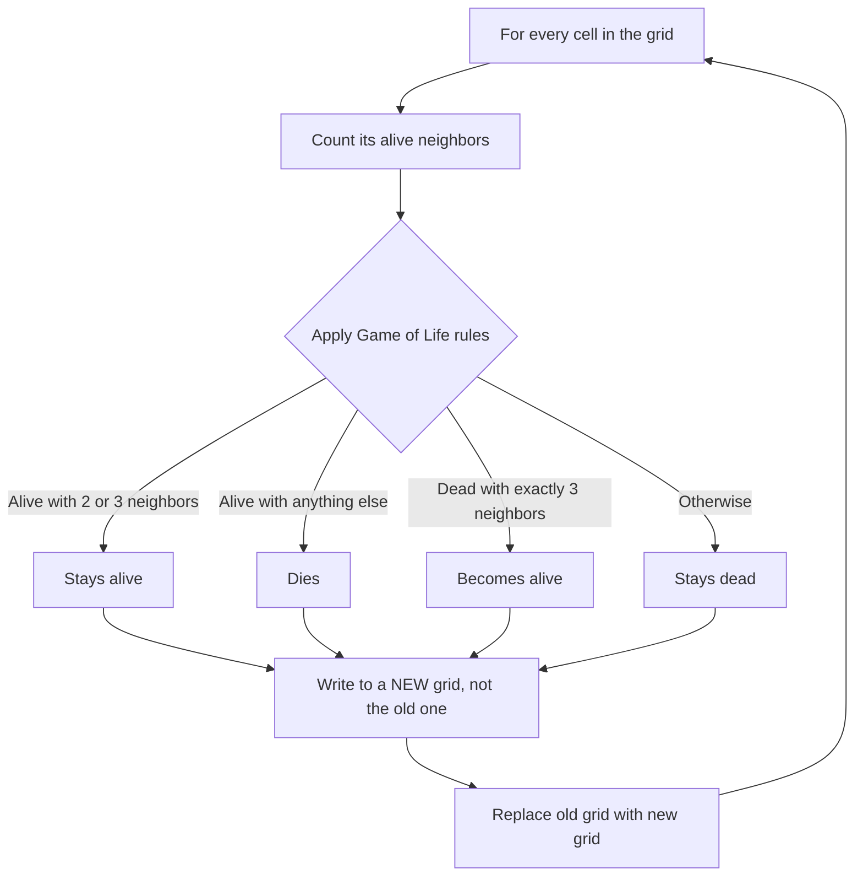

# Lab 14 — Tiny Rules, Huge Worlds: Build a Cellular Automata Simulator

> "It is impossible to grasp how strange this is, until you've watched it run."
> — almost everyone, after seeing a glider for the first time

**Time budget:** ~2 weeks, working at your own pace.
**Preferred language:** C++ or C# (any language is allowed; if you want a browser-based version, TypeScript with HTML canvas is also excellent).
**Working style:** solo, or in a team of up to 3 people. Both are equally welcome.

---

## The hook

In 1970, mathematician John Conway invented a game with four rules. They take ten seconds to read. They produce, on an infinite grid, behavior so rich that mathematicians are *still* discovering new patterns in it half a century later. People have built **a working CPU** inside it. People have run **another copy of the Game of Life** inside it. Conway's "game" turned out to be a universal computer hiding in three lines of math.

In this lab you'll build that game — *Conway's Game of Life* — from scratch. You'll start with a grid of cells. You'll write a function that counts neighbors. You'll write four rules. You'll watch what happens. You'll show a friend, and they will not believe you wrote this in two weeks.

If you want a 5-minute appetizer before starting, watch Numberphile's [*Inventing Game of Life*](https://www.youtube.com/watch?v=R9Plq-D1gEk) — it's John Conway himself, on camera, talking about how he came up with the rules. (Conway died in 2020 from COVID-19. This video has weight.) For the practical companion, Daniel Shiffman's [*The Nature of Code*](https://natureofcode.com/), Chapter 7, walks through cellular automata and Game of Life with code.

---

## Why this is worth your time

- This is the most famous **emergent system** in computer science. Watching it for the first time is a permanent memory.
- You'll work with **2D grids, neighbor counting, and double-buffering** — three skills that show up in image processing, game development, AI, and graphics for the rest of your career.
- It's **the Hello World of complex systems**. Once you understand it, fluid simulation, traffic models, and forest-fire simulators will feel familiar.
- It is, dollar for dollar, the highest "wow per line of code" project on this entire lab list.

---

## The target

> **Reference video:** [7.3: The Game of Life — The Coding Train (Nature of Code)](https://www.youtube.com/watch?v=tENSCEO-LEc) — Conway in 16 minutes, with code. Pair with [Coding Challenge #179: Elementary Cellular Automata](https://www.youtube.com/watch?v=Ggxt06qSAe4) for the 1D companion.

**Basic — "It Generates"**
A grid (say 50×50) of squares — black for dead, white for alive. You start with a hardcoded pattern. Press a key; the grid advances one generation. Press it again; it advances another. The classic shapes work — a "blinker" oscillates, a "block" stays still, a "glider" moves diagonally across the screen.

**Standard — "It Lives"**
The simulator runs continuously at a controllable speed. You can pause, resume, step one generation at a time, and reset. You can click on any cell to flip it alive or dead. A handful of famous patterns (Glider, Blinker, R-pentomino, LWSS) are loadable from a menu.

**Advanced — "It Surprises You"**
You've added something interesting: maybe Gosper's Glider Gun (the pattern that emits gliders forever), or an RLE pattern loader so you can paste any pattern from the Game of Life community, or a different rule set entirely (Wireworld, Brian's Brain), or an alternate grid topology (toroidal world, hexagonal cells). The simulator runs at 60 FPS even on a 200×200 grid.

---

## The big idea, in one diagram



The single most important detail in this whole lab: **never modify the grid you're reading from.** Compute the next generation into a *separate* grid, then swap. Get this wrong and your gliders will mutate into glitchy nonsense. Get this right and the simulator works on day one.

---

## Two-week plan with milestones

**Week 1 — Make the rules work**

- **Day 1–2 — Setup & a grid on screen.** Open a window. Render a 30×30 grid of squares — color a few of them by hand to make sure the rendering works. *Milestone: a checkerboard of cells you can see.*
- **Day 3 — Neighbor counting.** Write a function `countNeighbors(grid, x, y)` that returns the number of alive cells in the 8 surrounding cells. Print a 5×5 grid in the console with the counts under it. Verify by hand. **This is the most important function in the whole project — make it bulletproof.**
- **Day 4 — One step.** Write `nextGeneration(grid) -> newGrid` using the four rules. Press `space` to advance one step. Place a "blinker" (three cells in a row) by hand and verify it oscillates. *Milestone: rules work on a known pattern.*
- **Day 5 — Click to edit.** Mouse click on a cell flips it alive/dead. The user can now draw their own initial states.
- **Day 6 — Famous patterns.** Add three preloadable patterns: Block (still life), Blinker (oscillator), Glider (spaceship). Reset key (`R`) clears the grid. *Milestone: a glider walks across your screen for the first time.* Take a video.
- **Day 7 — Polish & buffer.**

**At this point you've completed the Basic level. You can stop here and submit a real, defendable project.**

**Week 2 — Make it run, look good, and surprise you**

- **Day 8 — Continuous run.** Press `space` to pause/resume continuous simulation. Add a speed control: `+` and `-` to make it faster or slower (e.g., 1 step every 50 ms vs every 500 ms).
- **Day 9 — Bigger grid + smooth render.** Push to 100×100 or 200×200. Make sure rendering is fast (avoid drawing each cell as a separate API call when you can — paint to a pixel buffer, or use a tile renderer).
- **Day 10 — A famous big pattern.** Hand-code Gosper's Glider Gun (or paste an RLE-encoded version). Watch it generate gliders forever. *Milestone: emergent behavior you didn't program.*
- **Day 11–12 — Pick a side quest.**
- **Day 13 — README, screenshot/GIF, demo prep.**
- **Day 14 — Buffer day.**

---

## Levels

### Basic — "It Generates" (~6–10 hours)
- a grid (size of your choice, ~30×30 or larger)
- correct neighbor counting
- correct rules implementation, **using a separate next-generation grid**
- step-by-step advancement
- visible rendering (console, terminal grid, or window)

### Standard — "It Lives" (~12–18 hours)
- everything from Basic
- start / pause / step / reset controls
- click to edit cells live
- adjustable simulation speed
- at least 3 preloaded famous patterns
- clean separation between rule logic, grid storage, and rendering

### Advanced — "Side Quests" (each ~3–10h, pick what you find cool)

- **Glider Gun.** Preload Gosper's Glider Gun and watch it shoot gliders forever. Five minutes of effort, big visual payoff.
- **RLE Loader.** Parse the standard [RLE format](https://conwaylife.com/wiki/Run_Length_Encoded) used by the Game of Life community. Now you can load thousands of patterns from [conwaylife.com](https://conwaylife.com/).
- **Wireworld.** Same kind of simulator, totally different rules — implement [Wireworld](https://en.wikipedia.org/wiki/Wireworld), where cells simulate electronic signals along wires. Build a logic gate with it.
- **Brian's Brain.** Another famous rule set — three states (off, on, dying) — produces beautiful, moving, neuron-like patterns.
- **Heatmap Mode.** Track how often each cell has been alive over the simulation; render hot cells in warmer colors. Old patterns leave ghost-trails.
- **Hexagonal Grid.** Same Game of Life idea, but on hexagons (different neighbor count + different rule thresholds). It looks completely different.
- **Toroidal World.** Wrap the grid edges so the world is a donut. Patterns that fall off one side reappear on the other.
- **Pattern Library.** Build a small in-app menu of 10+ patterns. Bonus for thumbnails.
- **Big & Fast.** Get the simulator to run a 1000×1000 grid at 60 FPS. (Look up "bit-packed grids" or "Hashlife" — Hashlife is a famous algorithm that simulates billions of generations in seconds.)
- **Statistics Panel.** Show live: generation count, alive-cell count, density. A small graph of population over time is mesmerizing.

---

## Extension challenges (3–5 weeks)

The 2-week scope above ships a real, defendable simulator. If you fall in love with emergent systems, here's how to grow it into a portfolio standout:

- **Ship to the web.** A TypeScript + canvas port deployed to GitHub Pages — anyone with the URL plays. Cellular automata are uniquely web-friendly because the simulation *is* the demo.
- **Build an interactive explainable.** A web page in the style of [Bret Victor](http://worrydream.com/) or [Distill.pub](https://distill.pub/) — interactive sliders, narrative text, the user discovers Conway's rules by manipulating cells. *Genuinely rare* portfolio piece.
- **Hashlife.** Implement Bill Gosper's legendary algorithm — simulates *billions* of generations in seconds via memoization. One of the most elegant algorithms in CS.
- **3D Cellular Automata.** Lift the rules to three dimensions. Visualize with WebGL / Three.js. Looks alien.
- **Combine with [Lab 32](lab-32-neural-net-from-scratch.md) (neural net).** Train a tiny network to *learn* Conway's rules from data — does it converge to the right rule? A nice toy ML experiment.

---

## Make it yours (required)

Pick **one** personal twist:

- **Design your own rule set.** Tweak Conway's rules — survive on `B3/S23` becomes `B36/S23` (HighLife), or `B2/S` (Seeds), or anything you invent. Name it. Describe what behavior emerges. (A whole community calls these "Life-like cellular automata".)
- **Initial state from an image.** Take a small grayscale picture (your face, your university logo, a pixel-art sprite) and use it as the starting grid — alive cells where the image is dark. Watch what evolves.
- **Re-skin it as a story.** Same rules, different theme — fungus spreading on bread, gossip in a school, fire in a forest, infections in a city.
- **Make it pretty.** Custom color palette, smooth fade-out as cells die, a CRT-screen filter. The rules stay the same; the *feeling* changes completely.

You'll defend why you chose your twist.

---

## Working solo or in a team

You can do this lab alone or in a team of **up to 3 people**.

If you go solo: you'll touch every part — rules, grid, render, input. The whole loop is yours to debug.

If you go as a team, sensible splits:

- *By layer:* one person owns the grid + rules + correctness; the other owns rendering, input, UI controls, pattern library.
- *By milestone:* one person drives Basic (rules + step), the other drives Standard (continuous run + edit + speed + patterns); pair on Day 10.
- *By feature:* one person owns the simulation core, the other owns the side-quest variants (Wireworld, hex grid, statistics).

For a 3-person team: add a "patterns + visuals + personal twist" owner.

Two rules for teams:

1. **Use git from day one** with a branching workflow.
2. **In your README, list who did what.** Every member must be able to explain the rules and the swap-grid trick.

---

## Tooling and language tips

**C++**
- [raylib](https://www.raylib.com/) makes a window and a grid of rectangles trivial.
- For a fast renderer, write all cells to a pixel buffer (a `unsigned char[]` of RGB) and upload it as a single texture per frame. Drawing 10000 separate rectangles is much slower.

**C#**
- Windows Forms or WPF with a `Bitmap` works well. Lock the bitmap and write directly to the byte array — `SetPixel` is too slow.
- Cross-platform: [Avalonia](https://avaloniaui.net/), [Raylib-cs](https://github.com/ChrisDill/Raylib-cs), or `SkiaSharp`.

**TypeScript (browser)**
- HTML `<canvas>` + `ctx.fillRect()` is fine for grids up to ~100×100.
- For big grids, use `ctx.putImageData()` with a pixel buffer.
- This gives you a project you can deploy to GitHub Pages — the easiest possible way to share with friends.

**Anyone**
- **Always allocate a second grid for the next generation.** Allocating it once outside the loop and reusing it is fine — just don't read and write the same grid in the same step.
- Start small (30×30) until correctness is verified, then scale up.

---

## Suggested project structure

```txt
cellular-automata/
  README.md
  src/
    main.*
    Grid.*                 # 2D storage, get/set/copy
    Rules.*                # nextGeneration(grid) -> newGrid
    Patterns.*             # blinker, glider, gosper gun, ...
    Simulator.*            # owns current grid, controls step/run/pause
    Renderer.*
    InputHandler.*
  patterns/                # if you implement RLE loader
    glider.rle
    gosper-gun.rle
  docs/
    milestone-screenshots/
```

---

## When you get stuck

- **My patterns mutate into garbage after one step.** You're modifying the grid you're reading from. Compute next-gen into a *separate* grid, then swap. This is the #1 bug in this lab.
- **My neighbor counter crashes at the edges.** You're reading `grid[-1]` or `grid[width]`. Either clamp coordinates to the grid, or wrap them (toroidal world — actually a nice feature), or skip cells on the edge.
- **My glider doesn't move.** Either (a) the rules are slightly wrong (re-read them), (b) you're reading and writing the same grid (see above), or (c) you initialized the glider in the wrong shape — there are 4 rotational variants; double-check.
- **It's correct but slow.** Are you redrawing 10000 rectangles each frame? Switch to a pixel buffer or texture upload. Are you allocating a fresh next-gen grid every step? Allocate once and reuse.
- **My RLE loader produces a glitchy result.** RLE is finicky; print what you parsed before you set cells. Test on the smallest pattern first (a glider).

If you're stuck 30+ minutes: print a 5×5 grid before and after one step, by hand verify the rules cell-by-cell, then ask a friend.

---

## Submission checklist

- [ ] Simulator runs end-to-end on a clean machine.
- [ ] Stable 60 FPS on a 100×100 grid (or document FPS at your chosen size).
- [ ] No crash on edge cases: empty grid, fully alive grid, single cell, edge-adjacent patterns.
- [ ] Start / pause / step / reset / speed controls all work.
- [ ] At least 3 famous patterns preloaded and selectable.
- [ ] If you ported to web: **a live URL** (GitHub Pages, Vercel — both free).
- [ ] **A 15-second GIF** in the README — preferably Gosper's Gun firing or a glider crossing the screen.
- [ ] No private paths in source.
- [ ] Controls listed in the README.

---

## What evaluators look at

- **They watch the GIF.** A glider walking across, or Gosper's Gun firing, sells the project in 5 seconds.
- **They look for the separate-next-gen-grid pattern.** This is *the* signature bug in this lab; getting it right reads as care.
- **They read the rules paragraph in your README.** Conway's four rules in your own words + a sentence on *why* the swap-grid trick matters = strong technical writing signal.
- **They look at the rule/grid/render separation.** Clean modules read as engineering instinct; tangled code reads as "barely got it working."
- **They look at performance.** Is the simulator fluid at 100×100? 500×500? Is rendering done with `putImageData` / pixel buffers, or naive `fillRect` per cell?
- **They poke pattern loading.** Glider, blinker, Gosper Gun pre-loaded = polish; user has to hand-edit cells = student project.

---

## What to put in your README

1. Project name + one-sentence description.
2. **A GIF of a glider walking across your simulator** at the top. Or Gosper's Gun firing. Highest-impact README image of all 15 labs.
3. Which level + side quests.
4. Your personal twist and why.
5. How to run it.
6. The four rules of Game of Life, written in your own words. Plus one sentence on *why* you have to use a separate next-gen grid.
7. (Optional but loved) A small milestone gallery — first blinker, first glider, gun firing, your favorite emergent moment.
8. If you worked in a team — who did what.

---

## Reflection

Be ready to:

1. **Step the simulator one generation, by hand**, on a 5×5 grid I draw on paper. Show me the next state.
2. **Explain why you can't update the grid in place.** Demonstrate what goes wrong if you try.
3. **Show me a glider.** Pause and explain why it moves.
4. **Where does your code break** if the grid is 1×1? If neighbor counting goes off the edge? If `space` is pressed during a long step?
5. **Walk through `countNeighbors`** line by line.
6. **What was the hardest bug**, and how did you find it?
7. **If you had to handle a 10000×10000 grid**, what would you change first?

---

## Showcase

At the end of the semester there will be a small gallery — anonymous voting for **prettiest visual style**, **most surprising emergent pattern**, and **most creative custom rule set**. Bring a 30-second clip of your simulator running.

---

## Going further

- *The Nature of Code*, Chapter 7 — Daniel Shiffman. Free online.
- The [LifeWiki](https://conwaylife.com/wiki/) — an entire encyclopedia of Game of Life patterns. Lose an evening here.
- *A New Kind of Science* — Stephen Wolfram. The 1200-page book that argues cellular automata are the secret behind everything. Heavy. Provocative.
- *Hashlife* algorithm — read about it after the lab. It feels like cheating until you understand why it works.
- *Inventing Game of Life* — Numberphile (the appetizer above). Watch it again after the lab; it'll mean more.

---

## A final word

The first time a glider walks across your simulator and you didn't program it to walk — you only programmed four rules — you'll feel something quiet and strange. That's emergence. Most of CS hides it. This lab puts it on screen. Pay attention to the moment.
