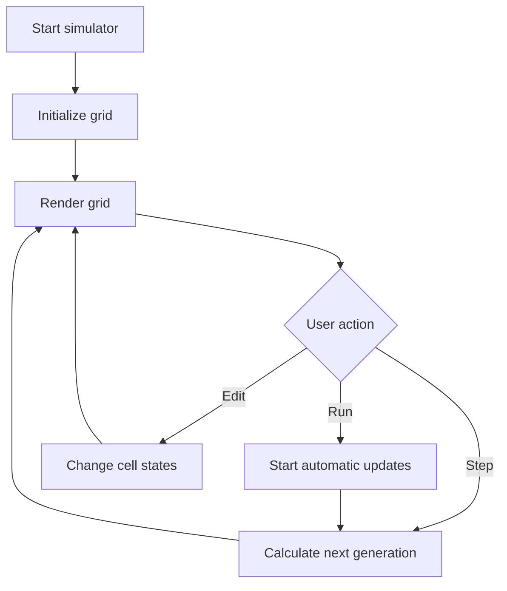

# Lab 14: Cellular Automata Simulator

## Goal

Create a simulator for cellular automata, for example Conway's Game of Life.

The goal is to understand grid-based simulations and state transitions.

You will practice:

- 2D arrays;
- simulation steps;
- neighbor counting;
- state transitions;
- rendering;
- UI controls.

---

## Idea

A cellular automaton consists of a grid of cells.

Each cell has a state. In Conway's Game of Life, a cell is either:

- alive;
- dead.

At every step, the next state of each cell is calculated based on its neighbors.

---

## Simulation Workflow



---

## Task

Implement a cellular automata simulator.

Recommended automaton: **Conway's Game of Life**.

The user must be able to:

- create or edit initial grid;
- run simulation;
- pause simulation;
- step one generation;
- reset grid.

---

## Functional Requirements

### 1. Grid

Represent the world as a 2D grid.

Each cell must have a state.

For Game of Life:

- alive;
- dead.

### 2. Rules

Implement correct transition rules.

For Conway's Game of Life:

- live cell with fewer than 2 live neighbors dies;
- live cell with 2 or 3 live neighbors survives;
- live cell with more than 3 live neighbors dies;
- dead cell with exactly 3 live neighbors becomes alive.

### 3. Simulation Control

Support:

- start;
- pause;
- step;
- reset.

### 4. Rendering

Show the grid visually.

Possible implementations:

- console;
- browser canvas;
- HTML table;
- desktop UI.

---

## Suggested Project Structure

```txt
cellular-automata/
  README.md
  src/
    main.*
    Grid.*
    Cell.*
    AutomatonRules.*
    Simulator.*
    Renderer.*
```

---

## Difficulty Levels

### Basic

Implement:

- fixed grid;
- step-by-step simulation;
- console or simple visual output.

### Standard

Implement everything from Basic plus:

- start/pause;
- reset;
- user editing cells;
- adjustable speed;
- clean rule module.

### Advanced

Implement some of the following:

- multiple rule sets;
- pattern library;
- infinite or larger grid;
- save/load patterns;
- statistics;
- colorful states.

---

## Implementation Plan

1. Create grid.
2. Render grid.
3. Implement neighbor counting.
4. Implement transition rules.
5. Calculate next generation.
6. Add step button/command.
7. Add run and pause.
8. Add reset and editing.
9. Refactor into modules.
10. Write README and prepare demo.

---

## Testing

Test at least the following:

- neighbor counting is correct
- rules are applied correctly
- grid updates generation by generation
- pause/step/reset work
- editing works if implemented

Automated tests are recommended but not strictly required. If you do not write automated tests, describe manual test cases in `README.md`.

---

## Demo

During the demo, show:

- show initial grid
- step one generation
- run simulation
- pause/reset
- explain rules

---

## README Requirements

Your repository must include `README.md` with:

1. Project name.
2. Short description.
3. Selected difficulty level.
4. Technologies used.
5. How to run the project.
6. Main features.
7. Short explanation of the main algorithm or architecture.
8. Screenshots or demo link, if possible.
9. Known problems or limitations.

---

## Defense Questions

Be ready to answer:

1. What is a cellular automaton?
2. How is the grid stored?
3. How do you count neighbors?
4. Why should next generation be calculated separately?
5. What are the Game of Life rules?
6. How do you control simulation speed?
7. How would you add another rule set?

---

## Evaluation Criteria

| Criterion | Points |
|---|---:|
| Grid representation | 15 |
| Rule implementation | 25 |
| Simulation controls | 15 |
| Rendering | 15 |
| User editing/features | 10 |
| Code structure | 10 |
| README/demo | 10 |
| **Total** | **100** |

---

## Expected Result

At the end of this lab, you should have a working project called **Cellular Automata Simulator**.

The project should demonstrate both programming skills and the ability to structure, explain, and present a small but non-trivial software system.
