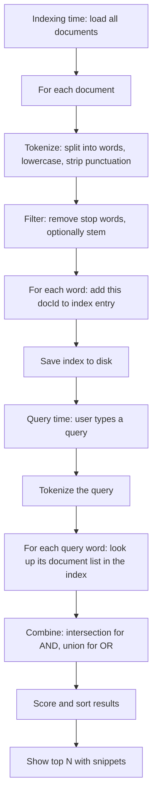

# Lab 15 — Build a 1998-Era Google: A Mini Search Engine

> "The goal of our system is to provide higher quality search results."
> — Sergey Brin and Larry Page, 1998, *The Anatomy of a Large-Scale Hypertextual Web Search Engine*

**Time budget:** ~2 weeks, working at your own pace.
**Preferred language:** C# or TypeScript (any language is allowed; this lab is text-and-data heavy, so the languages with strong string-handling and a good standard library win).
**Working style:** solo, or in a team of up to 3 people. Both are equally welcome.

---

## The hook

In 1998, two PhD students at Stanford — Sergey Brin and Larry Page — published a paper titled *The Anatomy of a Large-Scale Hypertextual Web Search Engine*. The system it described was running at `google.stanford.edu` and indexed about 24 million pages. The paper was free. The code was open. Within five years that little academic project had eaten the entire web.

The core data structure they used to make search fast wasn't AI, wasn't blockchain, wasn't anything fancy. It was something a 1st-year student can build in two weeks: an **inverted index**. A word-to-document map. A `Dictionary<string, List<DocumentId>>`. That's it. The cleverness on top — ranking, relevance, PageRank — comes after.

In this lab you'll build a working search engine from scratch. Not over the web (that would be polite to skip), but over your own collection of text files: books, articles, your essay archive, your music lyrics, your project's documentation. By the end you'll be able to type a query and watch results stream back, ranked by relevance, with snippets and highlighted matches, **in milliseconds**, even over thousands of documents. You'll also understand the most important data structure in information retrieval — and you'll appreciate why every grep-faster-than-light tool, from Elasticsearch to Lucene to ripgrep, is a refinement of what you're about to build.

If you want a perfect appetizer, read the original [Brin & Page 1998 paper](http://infolab.stanford.edu/~backrub/google.html) — yes, *that* paper, the one that founded Google, freely readable online. Skim Sections 1, 2, and 4. It's surprisingly approachable. For a textbook companion, [*Introduction to Information Retrieval*](https://nlp.stanford.edu/IR-book/) by Manning, Raghavan, and Schütze is free at Stanford's website — Chapters 1–6 are the foundation of this lab.

---

## Why this is worth your time

- **Search is the secret skill** behind every "fast" feature in modern software — autocomplete, log analysis, e-commerce recommendations, GitHub code search, your IDE's `Cmd+P`. After this lab, you'll see them all the same way.
- The **inverted index** is one of the dozen data structures every working programmer should know on sight. This lab makes it permanent.
- You'll touch **file I/O, string processing, hash maps, sorting, and ranking** — the everyday tools of backend engineering — in a single coherent project.
- The 1998 Google paper is one of the most accessible CS papers in history. Reading a real research paper *and then implementing it* is a milestone in a programmer's life.

---

## The target

> **Instructor TODO:** add reference screenshots / terminal recordings to `docs/` once available.

**Basic — "It Searches"**
A program that loads a folder of text files (≥ 10 files), builds an inverted index, and lets the user search for a single word from the command line or a console prompt. The output is a list of files where the word appears, sorted by how many times it appears. Search is instant — even on 100 files, the index makes the lookup essentially free.

**Standard — "It Ranks"**
Multi-word search ("AND" semantics: documents must contain *all* the words). Results ranked by relevance — at minimum by total match count, ideally with TF-IDF scoring. Stop words filtered. Snippets shown — 30 characters around each match, with the matching word highlighted in **bold** or **color**. Index is saved to disk and reloaded on startup, so you don't re-tokenize 1000 files every time.

**Advanced — "It's a Real Tool"**
You've added something memorable: a small **web UI** where you type a query and see results live, **phrase search** (`"quick brown fox"` matches exact order), **boolean operators** (`cats AND NOT dogs`), **stemming** so `running` matches `run`, **fuzzy search** so `gogle` finds `google`, an **autocomplete** that suggests queries as you type, or a **PageRank-like** scoring layer. The engine handles a Wikipedia article dump (a few thousand small files) without breaking a sweat.

---

## The big idea, in one diagram



Two phases: **build the index once**, **answer many queries fast**. Every modern search system has the same shape. The fancy parts are all about *what* you put in the index and *how* you score the results.

---

## Two-week plan with milestones

**Week 1 — Build the index**

- **Day 1 — Documents on disk.** Create a `documents/` folder. Drop in 5–10 text files (free books from Project Gutenberg are excellent — *Alice in Wonderland*, *Sherlock Holmes*, *War and Peace*). Write a `loadAll()` that reads them into memory.
- **Day 2 — Tokenizer.** Split text into words. Lowercase everything. Strip punctuation. Verify on a small example: `"Hello, World!"` → `["hello", "world"]`.
- **Day 3 — Inverted index.** Build `Map<string, List<docId>>`. For each token in each document, add the document's id to the word's list. Print the index for the word `"the"` — it should appear in every document. *Milestone: you can ask "where does this word appear?" in O(1).*
- **Day 4 — Single-word search.** A simple console loop: type a word, get back the list of documents. Show document name + match count.
- **Day 5 — Match counts (per document).** Upgrade the index entries from `List<docId>` to `List<{docId, count}>` so you know how many times each word appears in each document. Sort results by count.
- **Day 6 — Multi-word search (AND).** When the user types `quick fox`, look up both words and *intersect* their document lists. Only documents containing both words appear in results.
- **Day 7 — Polish.** Show results in a tidy format. Print "no results" when nothing matches.

**At this point you've completed the Basic level. You can stop here and submit a real, defendable project.**

**Week 2 — Make it feel like a real tool**

- **Day 8 — Stop words.** Build a small list (`the`, `a`, `is`, `and`, `of`, …) and skip them at index time. The index gets dramatically smaller, and `quick fox` no longer matches every document because of `the`.
- **Day 9 — TF-IDF ranking.** For each result, compute `tf-idf = (term frequency in this doc) * log(total docs / docs containing term)`. Sort by total tf-idf score across query words. *Milestone: results suddenly feel "smart" — rare, specific words rank specific documents to the top, not just whichever document happens to be the longest.*
- **Day 10 — Snippets.** For the top word match in each result, return the surrounding 30 characters as a snippet, with the match itself **bolded** (or in color in the terminal).
- **Day 11 — Persistent index.** Save the index to disk (JSON, or a simple binary format). On startup, load it instead of re-indexing.
- **Day 12 — Pick a side quest.**
- **Day 13 — README, screenshots, demo prep.**
- **Day 14 — Buffer day.**

---

## Levels

### Basic — "It Searches" (~8–12 hours)
- load at least 10 documents from a folder
- a working tokenizer (lowercase, punctuation stripped)
- an inverted index built in memory
- single-word search
- results sorted by match count
- "no results" handled cleanly

### Standard — "It Ranks" (~14–20 hours)
- everything from Basic
- multi-word search (AND semantics)
- stop-word filtering
- TF-IDF or another match-quality ranking
- snippets with the matched word highlighted
- index saved to disk and reloaded
- error handling for missing folders, empty files, weird encodings

### Advanced — "Side Quests" (each ~3–10h, pick what you find cool)

- **TF-IDF.** If you didn't do it in Standard, do it now. The single biggest "results suddenly feel smart" upgrade.
- **Phrase Search.** `"quick brown fox"` must match in order. To do this, you need a *positional* inverted index that stores `(docId, position)` pairs. A real upgrade.
- **Boolean Operators.** `cats AND NOT dogs`, `(java OR kotlin) AND android`. Implement a tiny query parser.
- **Stemming.** Use the Porter stemmer (well-known, ~20 lines in any language) so `run`, `runs`, `running`, `ran` all match.
- **Fuzzy Search.** Use Levenshtein distance to match misspelled queries. Cap at distance 2.
- **Autocomplete.** As the user types, show the top 5 most likely full queries based on the index.
- **Web UI.** A simple HTML page with a search box and a results pane. Backend: any tiny HTTP server you like (ASP.NET minimal API, Node + Express, Go's `http`).
- **PageRank-Lite.** If your documents have links between them (e.g., one essay references another by filename), compute a basic PageRank score and use it as a relevance boost.
- **Wikipedia Mode.** Index a Wikipedia article-dump subset (a few thousand small files — easy to find online). Search across millions of words. Watch your engine still answer in milliseconds.
- **Live Reindex.** Watch the documents folder for changes. When a file is added/edited/deleted, update the index incrementally. Production-grade behavior.

---

## Make it yours (required)

Pick **one** personal twist:

- **Index something that means something.** Don't just dump random text files. Index your favorite books, the lyrics of your favorite albums, your university's lecture notes, your own essays/journal/blog, the script of every Star Wars movie, the entire Bible (it's free), Project Gutenberg's top-100 list.
- **A themed query language.** A "music search engine" with operators like `artist:`, `album:`, `year:` that let you scope queries. Or a "code search" mode that pretends to be GitHub Search.
- **A teaching mode.** Your engine prints, for every query, *why* the top result was chosen — "this document scored highest because it has 'frodo' 412 times and 'mordor' 87 times, with TF-IDF score 18.2."
- **A specific persona.** Make your engine pretend to be a search engine from a specific era — a 1996 AltaVista clone (deliberately ugly, deliberately simple), a 1998 Google clone (just a search box, two buttons, no header), a 2025 minimal one (clean, instant).

You'll defend why you chose your twist.

---

## Working solo or in a team

You can do this lab alone or in a team of **up to 3 people**.

If you go solo: you'll touch indexing, ranking, *and* the UI/CLI. The whole pipeline is yours, which is the fastest way to internalize how each piece supports the next.

If you go as a team, sensible splits:

- *By layer:* one person owns indexing (loader, tokenizer, inverted index, persistence); the other owns querying (search, ranking, snippets, UI/CLI).
- *By milestone:* one person drives Week 1 (Basic), the other drives Week 2 (TF-IDF + snippets + persistence + side quest).
- *By feature:* one person owns the engine core, the other owns the dataset, the personal twist, and the UI.

For a 3-person team: add a "side quest + UX" owner (web UI, autocomplete, Wikipedia mode).

Two rules for teams:

1. **Use git from day one** with a branching workflow.
2. **In your README, list who did what.** Each member must be able to explain the inverted index *and* TF-IDF on demand.

---

## Tooling and language tips

**C#**
- The standard library is very strong here. `Dictionary<string, List<int>>`, `string.Split`, `Regex`, `JsonSerializer` get you 80% of the way.
- For persistent index: `System.Text.Json` is fine for small indexes; use a binary format (or [MemoryPack](https://github.com/Cysharp/MemoryPack)) for large ones.
- For the Web UI side quest: ASP.NET Core Minimal APIs — a search backend in 30 lines.

**TypeScript**
- Plain Node.js + `fs.readFileSync` + a `Map<string, ...>` is enough.
- For the web UI: any framework or none — vanilla `<form>` + `fetch` works.
- For persistent index: `JSON.stringify` is fine to start; switch to a streaming format if it gets big.

**C++**
- `std::unordered_map<std::string, std::vector<...>>` for the index.
- String handling is more painful than in C#/TS — be ready for a bit of friction. `std::regex` is acceptable but slow; manual character-loop tokenization is faster.

**Anyone**
- **Lowercase before you tokenize.** Don't store both `"hello"` and `"Hello"` as different keys.
- **Don't load every document into memory at query time.** The whole point of an index is that you only need to read documents to *show snippets*, not to find matches.
- **Don't re-index on every query.** Build it once; reuse forever.

---

## Suggested project structure

```txt
mini-search-engine/
  README.md
  src/
    main.*
    indexing/
      DocumentLoader.*
      Tokenizer.*
      InvertedIndex.*       # the core data structure
      IndexPersistence.*    # save/load to disk
      StopWords.*
    search/
      QueryParser.*
      Ranker.*              # TF-IDF and other scoring
      Snippeter.*           # snippet generation + highlighting
      SearchService.*
    ui/
      ConsoleUi.*
      WebUi.*               # if you do the side quest
  documents/
    pride-and-prejudice.txt
    sherlock-holmes.txt
    ...
  index/
    inverted.json
  docs/
    screenshots/
```

---

## When you get stuck

- **My index has a separate entry for `Hello`, `hello`, and `HELLO`.** You're not lowercasing before storing.
- **`hello,` and `hello` are different.** You're not stripping punctuation. A simple `Regex` like `\w+` (word characters) tokenizes well enough for this lab.
- **Multi-word search returns nothing for queries that should match.** You're treating it as OR but pretending it's AND, or vice versa. For AND, *intersect* the document lists. Walk through a 2-word example by hand on paper.
- **TF-IDF returns weird zero or negative scores.** `log(N / df)` is zero when `df == N` (the term appears in every document — usually a stop word). That's actually correct behavior. Filter stop words first and the issue goes away.
- **My index file is huge.** That's normal — the index can be several times the size of the input text. Strategies: lowercase before storing, drop stop words, or use a more compact format than JSON (e.g., a binary delta-compressed posting list).
- **Snippets cut words in half.** Snap the start to the previous space and the end to the next space.

If you're stuck for 30+ minutes: pretty-print your index for one document, hand-verify against the source text, then bring back the search.

---

## What to put in your README

1. Project name + one-sentence description.
2. **A screenshot of a real search query and its results** at the top — the snippets, ranked. This README is going to look professional.
3. Which level + side quests.
4. Your personal twist and why (which dataset, which theme).
5. How to run it + example queries.
6. A short paragraph in your own words explaining what an inverted index is and why it makes search instant.
7. (Optional but loved) A "before TF-IDF / after TF-IDF" comparison — the same query showing how ranking improves results.
8. If you worked in a team — who did what.

---

## Reflection

Be ready to:

1. **Search for a word** that appears in exactly one document. Show me how fast it returns. Now show me a brute-force grep over the same files. Compare.
2. **Search for a multi-word query**, live. Walk me through how the AND happens.
3. **Explain TF-IDF** in your own words, with reference to one specific result in your engine.
4. **What goes wrong** if you don't filter stop words? Demonstrate.
5. **Where does your code break** if a document is empty? If two documents have the same name? If a query has only stop words?
6. **Walk through the indexing pipeline** end to end for one document.
7. **What was the hardest bug** and how did you find it?
8. **If you had to handle one billion documents**, what would you change first?

---

## Showcase

At the end of the semester there will be a small gallery — anonymous voting for **most useful dataset**, **best ranking quality**, and **most creative theme**. Bring your engine running, plus 3 example queries to demo.

---

## Going further

- *The Anatomy of a Large-Scale Hypertextual Web Search Engine* by Brin & Page, 1998 (the appetizer above). Read it after the lab too — different parts will mean different things.
- *Introduction to Information Retrieval* by Manning, Raghavan, Schütze (free at Stanford). The textbook. Chapters 1–6.
- *Lucene in Action* — the real-world Java search engine that powers Elasticsearch and Solr. Worth skimming after this lab.
- The [PageRank original paper](http://ilpubs.stanford.edu:8090/422/) by Page, Brin, Motwani, Winograd. Six pages, deeply elegant.
- *Designing Data-Intensive Applications* by Martin Kleppmann — Chapter 3 on storage and retrieval has a beautiful section on indexes.

---

## A final word

When you type a query into your own search engine and watch results stream back in milliseconds, ranked by relevance, with snippets that are clearly *the right ones* — that's a feeling most working programmers go their whole career without producing for themselves. Most people use search a thousand times a day and never build it once. You'll have built it. That's a permanent unlock in how you understand software.
