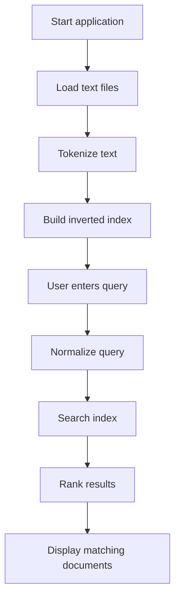

# Lab 15: Mini Search Engine

## Goal

Create a small search engine for a collection of text files.

The goal is to understand indexing, text processing, search queries, and ranking basics.

You will practice:

- file reading;
- string processing;
- data structures;
- inverted index;
- search logic;
- result ranking.

---

## Idea

A search engine does not scan all documents from zero every time. It usually builds an index.

A simple inverted index maps words to documents where those words appear.

Example:

```txt
drone -> file1.txt, file3.txt
software -> file2.txt, file3.txt
design -> file3.txt
```

When the user searches for a word, the program quickly finds related documents.

---

## Search Engine Workflow



---

## Task

Implement a mini search engine.

The application must:

- read multiple text files;
- build an index;
- accept a search query;
- return matching documents;
- show simple ranking or match count.

---

## Functional Requirements

### 1. Document Loading

Load text files from a folder.

Requirements:

- read at least 3 files;
- handle empty files;
- handle missing folder or invalid path.

### 2. Tokenization

Split text into words.

Recommended normalization:

- lowercase words;
- remove punctuation;
- ignore very short words, optionally.

### 3. Inverted Index

Build an index where:

- key = word;
- value = list of documents or occurrences.

### 4. Search

Support at least:

- single-word search;
- display matching files.

Recommended:

- multi-word search;
- result ranking by number of matches;
- show short snippets.

---

## Suggested Project Structure

```txt
mini-search-engine/
  README.md
  src/
    main.*
    DocumentLoader.*
    Tokenizer.*
    InvertedIndex.*
    SearchService.*
    RankingService.*
  documents/
```

---

## Difficulty Levels

### Basic

Implement:

- load several text files;
- tokenize words;
- build simple word-to-file index;
- single-word search.

### Standard

Implement everything from Basic plus:

- multi-word search;
- ranking by match count;
- punctuation handling;
- case-insensitive search;
- snippets or matched words.

### Advanced

Implement some of the following:

- phrase search;
- stop words;
- stemming;
- TF-IDF ranking;
- web UI;
- indexing cache;
- highlighting matches.

---

## Implementation Plan

1. Load files from folder.
2. Read file contents.
3. Implement tokenizer.
4. Normalize words.
5. Build inverted index.
6. Implement single-word search.
7. Add multi-word search.
8. Add ranking.
9. Add snippets or match counts.
10. Refactor into modules.
11. Write README and prepare demo.

---

## Testing

Test at least the following:

- files are loaded
- tokenization works
- index maps words to documents
- single-word search works
- multi-word/ranking works if implemented

Automated tests are recommended but not strictly required. If you do not write automated tests, describe manual test cases in `README.md`.

---

## Demo

During the demo, show:

- load documents
- search one word
- search multiple words
- show ranking or matches
- explain inverted index

---

## README Requirements

Your repository must include `README.md` with:

1. Project name.
2. Short description.
3. Selected difficulty level.
4. Technologies used.
5. How to run the project.
6. Main features.
7. Short explanation of the main algorithm or architecture.
8. Screenshots or demo link, if possible.
9. Known problems or limitations.

---

## Defense Questions

Be ready to answer:

1. What is an inverted index?
2. How do you tokenize text?
3. How do you handle uppercase/lowercase?
4. How does search work?
5. How do you rank results?
6. How do you handle punctuation?
7. How would you implement phrase search?

---

## Evaluation Criteria

| Criterion | Points |
|---|---:|
| Document loading | 15 |
| Tokenization | 15 |
| Inverted index | 25 |
| Search logic | 20 |
| Ranking/snippets | 10 |
| Code structure | 10 |
| README/demo | 5 |
| **Total** | **100** |

---

## Expected Result

At the end of this lab, you should have a working project called **Mini Search Engine**.

The project should demonstrate both programming skills and the ability to structure, explain, and present a small but non-trivial software system.
