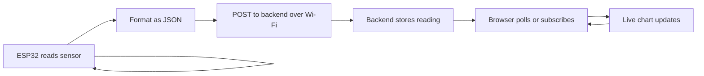

# Lab 16 — From Sensor to Browser: Build a Smart Telemetry Beacon

> "Telemetry is the difference between a device that exists and a device you can actually trust."
> — every avionics engineer, ever

**Time budget:** ~2 weeks for the core lab, with extension challenges that grow it to 3–5 weeks.
**Preferred language:** C/C++ on the device (Arduino-mode), TypeScript on the dashboard (any language is allowed).
**Working style:** solo, or in a team of up to 3 people.
**Hardware:** an **ESP32** (~$5–10) is strongly recommended for this lab — its built-in Wi-Fi is what makes the whole thing possible. A pure software simulator is fully acceptable if you can't get hardware.

---

## The hook

In [Lab 4](lab-04-stm32-sensor-logger.md) you built a sensor logger that talked to itself — print to console, write to a file, done. Real avionics doesn't work that way. Every drone, satellite, weather balloon, and aircraft sends its sensor data **somewhere else** — a ground station, a cloud server, a cockpit display, an air-traffic controller's screen. That stream of values, going from a small device into a system that watches and reacts, is called *telemetry*. It's one of the most important and least-taught topics at the 1st-year level.

In this lab you'll close the loop. A small device — an ESP32 the size of a coin — sits anywhere with Wi-Fi. It reads sensor data, packages it into JSON, and pushes it to a tiny backend you wrote, which displays it on a web page that you can open from your phone. Your friend opens the page in another country and sees your sensor moving in real time. That's the entire IoT industry, in 200 lines of code.

The first time you wave your hand near the device, watch the value spike on the dashboard, and realize the loop is *yours* — that's the moment "embedded" stops being a separate world and becomes something you build with.

If you want a perfect appetizer, browse [**Random Nerd Tutorials**](https://randomnerdtutorials.com/) — the most-cited ESP32 resource on the web; their *"ESP32 + Wi-Fi + JSON"* tutorial is exactly the right starting point. Pair it with [**Andreas Spiess**](https://www.youtube.com/@AndreasSpiess) ("the guy with the Swiss accent") on YouTube — his channel is a friendly tour of every IoT topic this lab touches.

---

## Why this is worth your time

- **IoT is one of the largest hiring categories in Ukrainian tech.** Drone telemetry, smart-agriculture systems, defense-tech sensor networks, energy monitoring — they all need exactly this skill set.
- The pipeline you'll build (**device → Wi-Fi → backend → web dashboard**) is the *same shape* as what every modern IoT product uses, from $20 smart bulbs to $200,000 industrial gas analyzers.
- A working live-dashboard project on your portfolio with a public URL is **memorable in interviews**. The recruiter can open it and *see your device's data*. Few projects achieve that.
- This lab connects directly to the web track (Labs [21](lab-21-rest-api-auth.md)–[22](lab-22-spa-frontend.md)) — the backend you write here is the same shape as a real REST API.

---

## The target

> **Reference build:** [ESP32 Based IoT Weather Station — Complete Guide](https://www.youtube.com/watch?v=GE5an3kYOKQ) — multi-sensor → cloud-dashboard pipeline, end-to-end. Pair with [Andreas Spiess channel](https://www.youtube.com/c/AndreasSpiess) for the full Swiss-accent ESP32 / LoRa / IoT canon.

**Basic — "It Streams"**
The ESP32 connects to Wi-Fi, reads a sensor every second (the onboard temperature is fine, or any external sensor like an LM35 / DHT11 / soil moisture probe), wraps the reading in a JSON message, and POSTs it to a small backend running on your laptop. The backend logs it. You can see the values arrive in the terminal. Closing and reopening anything still works — Wi-Fi reconnects, backend handles disconnects.

**Standard — "It's a Dashboard"**
The backend is a real web server (Node.js, ASP.NET Core, FastAPI, or similar) with two endpoints: `POST /telemetry` to ingest data, `GET /dashboard` to serve a web page that shows the last N readings as a live chart. Open the page in two browser tabs — both update in real time. The dashboard handles temporary device disconnects gracefully ("device offline" badge).

**Advanced — "It's a Real Product"**
You've added something memorable: deployment of the backend to a public host (Render / Fly.io / Railway free tier) so anyone can see your live data, an authentication token so only your device can post to your endpoint, multiple devices visible on one dashboard, historical data stored in a database with date-range queries, an alerting layer that sends a notification when a value crosses a threshold, or a downloadable CSV of all logged data.

---

## The big idea, in one diagram



Three pieces of code — firmware, backend, frontend — talking through HTTP. The pattern shows up everywhere in industry: *Tesla cars sending telemetry to Tesla's servers, Apple Watches syncing to your phone, Strava bikes uploading rides, John Deere tractors phoning home with field data.* You're building the smallest version of all of them.

---

## Two-week plan with milestones

**Week 1 — Make it talk**

- **Day 1 — ESP32 hello world.** Install PlatformIO + the ESP32 Arduino framework. Blink an LED. Print "hello" to serial. *Milestone: your board works.*
- **Day 2 — Wi-Fi connection.** Use `WiFi.begin(ssid, password)`. Print "connected" once it joins. Print the IP. (Don't commit your Wi-Fi password to git — use a separate header file in `.gitignore`.)
- **Day 3 — Read a sensor.** Pick the easiest one available. Print structured JSON to serial: `{"temp":24.7,"unit":"C","ts":"2026-05-09T11:00:00Z"}`. Verify another program (a `cat`, a Python script) can parse it.
- **Day 4 — Tiny backend.** Spin up a Node.js / ASP.NET Core / FastAPI server with one endpoint: `POST /telemetry`. Log the JSON body. Run it on your laptop.
- **Day 5 — Connect them.** Make the ESP32 POST to your laptop's IP every 2 seconds. Watch the values appear in the backend's console. *Milestone: device → laptop pipeline works. Take a video of the terminal scrolling.*
- **Day 6 — Disconnection handling.** Pull the ESP32's power, wait 30 seconds, plug it back in. Does the backend handle it? Does the device reconnect Wi-Fi? Add retries with exponential backoff.
- **Day 7 — Polish + screenshots.**

**At this point you've completed the Basic level.**

**Week 2 — Add the dashboard**

- **Day 8 — Web page that lists data.** A `GET /dashboard` endpoint that returns a tiny HTML page showing the last 10 readings as a table.
- **Day 9 — Live chart.** Replace the table with a live line chart (Chart.js — one `<script>` tag, free, popular). Update via polling every 1–2 seconds, or use Server-Sent Events (`EventSource` — easier than WebSockets for this case).
- **Day 10 — In-memory ring buffer.** Backend keeps the last N readings in a circular buffer. No DB yet — RAM is fine.
- **Day 11 — Multiple devices.** Each device sends its `device_id` in the message. Dashboard shows them as separate lines.
- **Day 12 — Pick a side quest.**
- **Day 13 — README, screenshots, demo prep.**
- **Day 14 — Buffer day.**

---

## Levels

### Basic — "It Streams" (~10–14 hours)
- ESP32 reads at least one sensor periodically
- Wi-Fi connection with reconnect on failure
- Structured JSON messages with timestamp + sensor name + value + unit
- Tiny backend that receives and logs incoming data
- The full chain runs without crashing for 10+ minutes

### Standard — "It's a Dashboard" (~14–22 hours)
- everything from Basic
- web dashboard with a live chart
- last-N-readings storage on the backend
- multi-device support (`device_id` in every message)
- handles device disconnects, network failures, malformed messages without crashing

### Advanced — "Side Quests" (each ~3–10h)

- **Public Deployment.** Push the backend to Render / Fly.io / Railway free tier. The dashboard URL works from anywhere.
- **Auth Token.** The device sends an `Authorization` header. The backend rejects unsigned requests. Now your endpoint isn't the world's open trash can.
- **Persistent Storage.** Add SQLite / PostgreSQL. Show the last 24 hours of data, queryable by time range.
- **Alerts.** When a value crosses a threshold, send a notification — Telegram bot is the easiest path in Ukraine (free, official API, students already use it).
- **CSV Export.** A `GET /export?from=...&to=...` endpoint returns a CSV download.
- **Battery + Solar.** Make the device run untethered. LiPo + TP4056 + solar panel.
- **Multiple Sensor Types.** Temperature *and* humidity *and* light *and* battery voltage, all on one device.
- **OTA Updates.** Push new firmware over Wi-Fi. The way real IoT products update.
- **Mobile-First Dashboard.** A polished mobile-friendly page. Open it on a phone — looks great.

---

## Extension challenges (3–5 weeks)

If you want to grow this into a serious portfolio project:

- **The Drone-Style Telemetry Stack.** Send 50+ values per second (orientation from an IMU, GPS coordinates, battery, throttle, temperature) at high rate. Optimize the protocol — switch from JSON to a binary format (CBOR, MessagePack, or your own). The dashboard shows a live "instrument cluster": artificial horizon, altimeter, battery gauge.
- **Edge AI Anomaly Detection.** Use TinyML (preview of [Lab 34](lab-34-ai-capstone.md)) to detect unusual patterns *on the device* and only transmit when something interesting happens. Massive bandwidth savings; smarter device.
- **Ground Station Pairing.** Two devices: one transmitter (the "drone"), one receiver (the "ground station"), connected via LoRa (1–10 km range, ~$5/module). The ground station reposts data over Wi-Fi to the cloud. Real long-range telemetry.

These extensions can take you all the way to a full embedded portfolio capstone — the kind of project that gets shown in job interviews.

---

## Make it yours (required)

Pick **one** personal twist. The technical stack is universal — *what your beacon measures and for whom* is what makes the project memorable.

- **A weather station for your balcony or garden.** Record everything for a month, plot the data, write a blog post about what you learned.
- **A drone-flight telemetry recorder.** Even on the bench: simulate a flight profile (climb, cruise, descent), generate realistic data, and produce a "post-flight summary" page.
- **An aircraft cockpit reproducer.** Connect to Microsoft Flight Simulator via SimConnect (Windows) or X-Plane via UDP. Display real flight data on your physical dashboard. (Real aviation flavor.)
- **A study-room productivity sensor.** Light, temperature, ambient noise. Plot when you're most focused. Use the data to argue with yourself.
- **A "is the bus coming?" beacon.** Place an ESP32 with a sensor on a window facing the street; detect when the bus arrives by light/motion changes. Way over-engineered, very fun.

You'll defend why you chose your twist.

---

## Working solo or in a team

You can do this lab alone or in a team of **up to 3 people**.

If you go solo: you'll touch firmware, networking, backend, *and* frontend. Broadest skillset of any single lab on the course.

If you go as a team:
- *By layer:* one person owns the device firmware (sensors, Wi-Fi, JSON, retries); the other owns the backend + dashboard.
- *By feature:* one person drives Basic, the other drives Standard + a side quest.
- *By stack:* one person writes embedded C++; the other writes server JS/C# and the web frontend.

Two team rules: **git from day one with branches**, and **list who did what in the README.** Each member must be able to demo the full chain solo if needed.

---

## Tooling and language tips

**Device firmware**
- **PlatformIO inside VS Code** is by far the smoothest experience. Better than the Arduino IDE for anything beyond hello-world.
- For HTTP requests on ESP32: `HTTPClient` (Arduino framework) — covers 90% of cases.
- For JSON: `ArduinoJson` library — small, fast, well-documented.

**Backend**
- **Node.js + Express / Fastify / Hono** — the fastest path; deploys easily.
- **ASP.NET Core minimal API** — first-class on Render, full strong typing.
- **Python + FastAPI** — has the best OpenAPI integration if you want auto-generated docs.
- All three are free to deploy; pick whichever you'll continue with on [Lab 21](lab-21-rest-api-auth.md).

**Frontend**
- For the dashboard: **plain HTML + Chart.js** is more than enough. No framework needed.
- If you want hot-reload during development: Vite (TS) or Live Server VS Code extension.

**Anyone**
- **Never commit Wi-Fi credentials.** `secrets.h` in `.gitignore`, with an `secrets.example.h` checked in.
- **Use UTC ISO 8601 timestamps.** `2026-05-09T11:00:00Z`. Always.
- **Plan for offline.** Wi-Fi will drop. Sensors will glitch. The backend will be down. Write code that survives all three.

---

## Suggested project structure

```txt
telemetry-beacon/
  README.md
  device/                       # ESP32 firmware
    platformio.ini
    src/
      main.cpp
      Sensors.cpp
      Network.cpp
      MessageFormat.cpp
    include/
      secrets.example.h
  backend/                      # the API + dashboard
    package.json (or .csproj)
    src/
      main.*
      routes/
        telemetry.*
        dashboard.*
      storage/
        RingBuffer.*
        Database.*               # if you do persistent storage
    public/
      dashboard.html
  docs/
    wiring-diagram.png
    architecture.png
    screenshots/
```

---

## When you get stuck

- **The ESP32 won't connect to Wi-Fi.** Print the SSID and password from code (just to check), make sure the network is 2.4 GHz (most ESP32 boards don't speak 5 GHz), check there are no special characters in the password.
- **The device posts but the backend gets nothing.** A firewall on your laptop. Check your laptop's IP from the same Wi-Fi network. Try `curl` from another device first to verify the backend is reachable.
- **The chart on the dashboard freezes.** You're polling too fast for the backend to respond, or you're growing an unbounded array of points in the browser. Cap the chart to last 100 points.
- **JSON gets cut off mid-message.** TCP doesn't guarantee whole messages — frame your data with a clear delimiter (newline, length prefix), or just always use full HTTP request/response cycles.
- **The device works for 10 minutes, then freezes.** Memory leak. ESP32 has only 320 KB of RAM; allocate strings carefully. `String` (the Arduino class) is notorious for fragmentation — prefer `char[]` buffers.

If stuck for 30+ minutes: simplify to one fixed value sent every 5 seconds; verify each link of the chain in isolation.

---

## Deployment checklist

Before you call it done:

- [ ] Backend deployed to a public URL (Render / Fly.io / Railway free tier or equivalent).
- [ ] Dashboard URL opens correctly on first try in an incognito browser.
- [ ] Wi-Fi credentials are NOT in git history (check with `git log -p | grep -i password`).
- [ ] Backend handles a malformed request (`curl -X POST -d 'garbage'`) without crashing.
- [ ] README includes the live URL and a 60-second video demonstrating the device → dashboard chain.
- [ ] If using auth: a "wrong token" request returns 401, not 200.
- [ ] The whole project builds from a fresh clone with one command (`docker compose up`, `npm start`, etc).

---

## What recruiters look at

- **The live URL works** when they click it (this filters out 70% of "I built X" claims on resumes).
- **A real video of your device** doing something — not a screenshot of code.
- **Clean repo structure** — separate `device/` and `backend/` folders, a top-level README that explains the architecture in 2 paragraphs.
- **Wi-Fi credentials are not committed.** This is the single fastest "no" they'll give a junior. Check.
- **The README has an architecture diagram.** Even hand-drawn, photographed, embedded — recruiters love it.
- **The README's first image is the live dashboard, not your face or your team logo.** First impression: this person ships things.

---

## What to put in your README

1. Project name + one-sentence description.
2. **A screenshot or GIF of the live dashboard** at the top.
3. **Architecture diagram** — boxes and arrows for device, backend, dashboard.
4. **The live URL** for the dashboard.
5. Which level + side quests + extensions.
6. Your personal twist and why.
7. Hardware list and wiring (a phone photo of a hand-drawn diagram is fine).
8. Build & run instructions (one command for backend, PlatformIO for device).
9. Message format spec (every JSON field, type, unit).
10. If team: who did what.

---

## Reflection

Be ready to:

1. **Power on the device, live.** Show it joining Wi-Fi and the dashboard updating.
2. **Pull the device's power.** Show the dashboard handling it gracefully. Plug it back. Show recovery.
3. **What goes wrong** if 100 devices send data at the same time? At 1000 messages per second?
4. **Walk through one message** end to end — every byte from sensor read to chart pixel.
5. **Where does authentication belong** in this stack — and why? (Even if you didn't add it, you should know.)
6. **What was the hardest bug** — wiring, network, code, or deployment?
7. **What's the next thing you'd add** if this were a real product?

---

## Showcase

End-of-semester gallery — anonymous voting for **most polished dashboard**, **most useful real device**, and **most creative twist**. Bring the running device + the live URL.

---

## Going further

- *Random Nerd Tutorials* — the appetizer above. Bookmark this site for life.
- *Andreas Spiess* on YouTube — IoT in friendly Swiss-accented depth.
- *The TCP/IP Guide* by Charles Kozierok — when you're ready to understand what HTTP is doing under the hood.
- *Designing Data-Intensive Applications* by Martin Kleppmann — the chapters on data flows and reliability are gold for telemetry-style systems.
- The [BetaFlight](https://github.com/betaflight/betaflight) and [PX4](https://github.com/PX4/PX4-Autopilot) source code on GitHub — telemetry done at the professional drone-firmware level.

---

## A final word

The first time you watch your sensor's value move on a public web page that anyone in the world can open — *your device, your code, your URL* — something quietly clicks. The "internet" stops being other people's servers. It becomes the network of things you can put your code on. After this lab, you'll feel a little ownership over a part of the world that most people never even notice.
