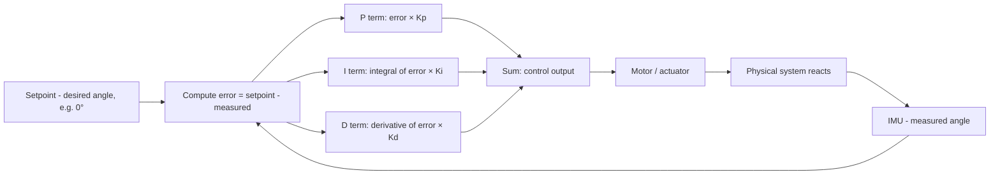

# Lab 17 — The Algorithm Inside Every Drone: Build a PID-Controlled Self-Balancer

> "PID is the algorithm that flies your drone, lands a SpaceX rocket, holds your car at cruise speed, and stops your washing machine from shaking itself across the floor."
> — what they don't tell you in 1st-year textbooks

**Time budget:** ~2 weeks for the core lab, with extension challenges that grow it to 3–5 weeks.
**Preferred language:** C/C++ on the device; Python or C# for the simulator path.
**Working style:** solo, or in a team of up to 3 people.
**Hardware:** **strongly recommended** but **not required**. A real two-wheel self-balancer (~$30–40), a simple ball-on-tube (~$15), or a fan-balanced lever all work. **A pure software simulator is fully acceptable** — the algorithm and the lessons are identical. (Same approach as [Lab 4](lab-04-stm32-sensor-logger.md).)

---

## The hook

Every drone you have ever seen flies because of a control algorithm called **PID**. It is the same algorithm that holds your car at exactly 90 km/h on cruise control. The same algorithm that lets a SpaceX Falcon 9 stand vertically on a tiny pillar of fire and land on a barge. The same algorithm running inside the temperature controller of every espresso machine. PID was first formalized in the 1920s for ship steering — and a century later it is still the most important control algorithm in the world.

In this lab you'll build a thing that **balances itself**. A two-wheeled robot that should fall over but doesn't. A simulated inverted pendulum that stays upright when you'd expect it to flop. A fan-controlled lever that holds at exactly the angle you typed. The mechanism is small. The lesson is huge: **closed-loop feedback is what separates a program that runs from a system that holds.**

The first time you push your robot, watch it almost fall, watch it correct, and stand again — without you doing anything — that's the moment "control theory" stops being abstract and becomes *the algorithm I made the thing do.* It's also the lab that, by itself, qualifies you to apply for any drone-firmware junior role in Ukraine.

If you want a perfect appetizer, watch [**Brian Douglas's "Understanding PID Control"**](https://www.youtube.com/watch?v=wkfEZmsQqiA) series on YouTube — four short videos, world-famous in control engineering, free, and exactly the right level. Pair it with [Joop Brokking's *self-balancing robot* tutorial](https://www.youtube.com/watch?v=4WfrHN4Sktc) — the most-watched practical build guide for this exact project. And for context, browse the [PX4 Pixhawk attitude controller documentation](https://docs.px4.io/main/en/flight_stack/controller_diagrams.html) — that is what real drone PID looks like, and it's not much more complicated than what you're about to build.

---

## Why this is worth your time (especially at an aviation institute)

- **PID is the single most important algorithm in aerospace, robotics, and automation.** Every junior drone-firmware role asks about it; very few candidates can speak to it from real hands-on experience. You will be one of the few.
- The Ukrainian drone industry — Skyeton, Quadrocopter Ukraine, Aerodrone, the army's UAV units, dozens of new defense-tech startups — hires people who can tune control loops. This lab is a direct hiring artifact.
- It is the rare lab where **a single algorithm + careful tuning** produces a thing that *moves the way you wanted*. The feedback loop is fast, visible, and addictive.
- Even on the simulator-only path, the algorithm and tuning intuition are identical to what you'd run on a real drone.

---

## The target

> **Reference build:** [Joop Brokking — *Your Arduino Balancing Robot* (YABR)](http://www.brokking.net/yabr_main.html) — the legendary self-balancing-robot build with code, schematics, and a multi-part [video walkthrough on YouTube](https://www.youtube.com/playlist?list=PL0K4VDicBzshc4hIwPZ1B-faaaY9DPbLf) (start with Part 1 — *PID controller explained*).

**Basic — "It Doesn't Fall (Much)"**
A self-balancing robot (or simulator pendulum, or fan-lever) reads its tilt from an IMU 100+ times per second, computes a motor command using a PID controller, and applies it. The setpoint is "vertical." When you nudge the robot, it leans, then corrects, then settles. It might wobble. It might overshoot. But left alone, it stays upright for at least 10–30 seconds.

**Standard — "It's Stable"**
The same robot, but tuned. The wobble is gone. It absorbs nudges and returns smoothly to vertical. Tuning parameters (`Kp`, `Ki`, `Kd`) are exposed via a serial / Bluetooth / web interface so you can adjust them live. A small log shows tilt-angle vs time as a graph — you can see the controller's quality with your eyes.

**Advanced — "It Has Personality"**
You've added a real feature: directional control (`drive forward`, `turn left`) layered on top of the balance loop, line-following with a downward sensor, a remote control via Bluetooth or Wi-Fi from your phone, autonomous obstacle avoidance with an ultrasonic sensor, or — for the simulator path — a 2D physics simulation of a quadrotor that you stabilize with four independent PID loops (this is exactly what real drone firmware does).

---

## The big idea, in one diagram



`output = Kp * error + Ki * integral(error) + Kd * derivative(error)`. Three terms, three constants. The whole field of control engineering is an elaboration of this idea. Your job in this lab is to **understand each term, see what it does, and tune the three constants until the system behaves.**

In one sentence each:
- **P (proportional)** = "react to how big the error is right now."
- **I (integral)** = "react to how long the error has been there." (Cures steady-state offsets.)
- **D (derivative)** = "react to how fast the error is changing." (Damps oscillation.)

---

## Two-week plan with milestones

(Adjust days based on your platform.)

**Week 1 — Make it sense and move**

- **Day 1 — Pick your platform & toolchain.** Hardware (ESP32 / Arduino / STM32 + IMU + motors + battery) or simulator (Python / C# / browser-based). Get a basic "blink" running. *Milestone: tooling works.*
- **Day 2 — Read the IMU.** MPU6050 is the standard, $3, well-documented. Print roll/pitch in degrees, 100+ times per second. Wave the device, watch the values change. *Milestone: you can measure angle.*
- **Day 3 — Drive the motors (or actuator).** Make the motors spin both directions with a configurable speed (PWM). For the simulator path, simulate a "torque" applied to the pendulum.
- **Day 4 — Pure-P control.** No I, no D yet. `output = Kp * (setpoint - measured)`. Try `Kp = 5`, `Kp = 30`, `Kp = 100`. Notice how the robot wobbles or chatters. *Milestone: the system reacts to its own state — closed-loop control exists.*
- **Day 5 — Add D.** Add the derivative term. Tune Kd by hand until oscillation calms. The robot starts looking *almost* stable.
- **Day 6 — Add I.** Add the integral term. Tune Ki to remove any persistent lean. The robot now actively centers itself.
- **Day 7 — A graph.** Log angle vs time. Plot it (matplotlib / Chart.js / pyplot). Compare different tuning. *Milestone: the math is visible.*

**At this point you've completed the Basic level.**

**Week 2 — Make it good**

- **Day 8 — Live tuning.** Send Kp/Ki/Kd over serial / Bluetooth / a web UI. Tune in real time, watching the graph.
- **Day 9 — Filtering.** The IMU is noisy. Add a complementary filter (`angle = 0.98 * (angle + gyro * dt) + 0.02 * accel_angle`) or a tiny Kalman filter. Watch the noise vanish.
- **Day 10 — Anti-windup.** Cap the integral term so it doesn't overshoot when the robot has been knocked over. (Subtle but important; real drone firmware has this.)
- **Day 11 — Disturbance rejection.** Push the robot. Drop a coin on it. Lean it 30°. Does it recover? Tune until yes.
- **Day 12 — Pick a side quest.**
- **Day 13 — README, video, demo prep.**
- **Day 14 — Buffer day.**

---

## Levels

### Basic — "It Doesn't Fall" (~12–18 hours)
- a working IMU read at 100+ Hz
- a working motor / actuator output
- a PID loop with all three terms (P, I, D)
- the system stabilizes and remains upright (or holds setpoint) for 10+ seconds
- a graph or video showing angle vs time
- documentation of your tuning process

### Standard — "It's Stable" (~16–24 hours)
- everything from Basic
- complementary filter or Kalman filter on IMU data
- live PID tuning interface
- anti-windup on the integral term
- recovers smoothly from nudges
- adjustable setpoint (lean forward to drive)

### Advanced — "Side Quests" (each ~4–10h)

- **Drive Mode.** A second PID loop on top: setpoint becomes "lean forward at angle X to drive forward." Now you can drive the robot.
- **Bluetooth Remote.** Control it from your phone with a virtual joystick. Bluetooth on ESP32 is straightforward.
- **Line Follower.** A pair of IR sensors looking down. Steer based on which sees the line.
- **Obstacle Avoidance.** Add an ultrasonic distance sensor (HC-SR04, ~$2). Stop / steer when something's close.
- **Web-Based PID Tuning Dashboard.** ESP32 hosts a web page with three sliders and a live chart of the angle. The most addictive demo of any embedded lab.
- **Quadrotor Simulator (simulator-path only).** Simulate a 2D quadrotor with two motors. Stabilize attitude *and* altitude. This is exactly what real drone firmware does.
- **Autotune.** Implement Ziegler-Nichols autotuning — the algorithm finds Kp/Ki/Kd by perturbing the system and measuring its response.
- **Bode Plot Analyzer.** Plot the system's frequency response. Real control engineers tune by looking at Bode plots; doing this by hand is a powerful learning experience.

---

## Extension challenges (3–5 weeks)

- **Build a Real Quadcopter Stabilizer Board.** STM32 / ESP32 + IMU + four ESCs + four motors on a small frame. Tune four PID loops simultaneously. This is a 4–5 week project that ends with a thing that flies. Take photos.
- **Inverted Pendulum on a Cart.** A cart that drives left/right to balance a pendulum standing on top of it. The classic control-theory problem, beautiful when it works.
- **Connect to [Lab 16](lab-16-smart-telemetry-beacon.md)'s Telemetry Dashboard.** Stream PID errors, IMU readings, and motor commands live to your dashboard from [Lab 16](lab-16-smart-telemetry-beacon.md). Tune by watching graphs in your browser. *This is exactly how professional drone telemetry tuning works.*

---

## Make it yours (required)

Pick **one** personal twist:

- **Theme the robot.** Give it a name, a face (LCD with eyes), or a 3D-printed personality. A tiny self-balancing penguin is more memorable than a generic robot.
- **A specific use case.** A "follow me" robot that uses an ultrasonic sensor to track a person walking. A "library trolley" that balances books while moving. A "service tray" that holds a glass of water without spilling.
- **A specific demo.** Make it dance to music (synchronize movements to BPM). Make it record its own falls and play them back as videos.
- **Aviation flavor (recommended).** Build a quadrotor attitude simulator with realistic dynamics, control it with a USB joystick ([Lab 19](lab-19-custom-game-controller.md) connection!), display the cockpit on screen.

---

## Working solo or in a team

Solo: you'll touch electronics, control theory, sensor fusion, and software. The widest skillset of any lab on the course.

Team:
- *By layer:* one person owns hardware (wiring, motors, IMU); the other owns software (PID, filtering, tuning UI).
- *By feature:* one person drives Basic (working PID + balance), the other drives Standard (filtering + anti-windup + tuning UI).

Two team rules: **git from day one** and **list who did what in the README.** Each member must be able to explain Kp/Ki/Kd and demonstrate tuning live.

---

## Tooling and language tips

**Hardware path**
- **ESP32** is recommended — built-in Bluetooth + Wi-Fi makes the tuning UI trivial. ~$5.
- **MPU6050** IMU. ~$3. Excellent libraries.
- **L298N** or **TB6612FNG** motor drivers (for two-wheel robot).
- **Frame:** 3D-printed (lots of free designs on Thingiverse), laser-cut acrylic, or a cardboard hack. The robot doesn't need to be pretty.

**Simulator path**
- **Python + matplotlib** is the gentlest. Simulate the inverted-pendulum dynamics in Euler integration. Plot live.
- **Browser + Canvas + JS** also works — and lets you ship a public link for the README.
- *Pre-built option:* the OpenAI Gym `Pendulum-v1` or `CartPole-v1` environments — your PID controller as the agent. Excellent way to test the algorithm in isolation.

**Anyone**
- **Use a fixed-rate loop.** PID assumes equal time between updates. A 100 Hz loop = `dt = 0.01s` *every iteration*. Don't use `delay()` for non-PID work; use a hardware timer or schedule.
- **`dt` matters.** I and D terms multiply or divide by `dt`. Get it wrong, your tuning is meaningless.
- **Save your tuning.** Tuning is hours of work. Write Kp/Ki/Kd to flash / EEPROM / a config file.

---

## Suggested project structure

```txt
self-balancer/
  README.md
  firmware/
    src/
      main.cpp
      Imu.cpp                # read MPU6050, complementary filter
      Pid.cpp                # generic PID class
      Motors.cpp
      Telemetry.cpp          # serial / BLE / Wi-Fi tuning
  simulator/                 # if you take this path
    src/
      pendulum.py
      pid.py
      visualizer.py
  docs/
    wiring-diagram.png
    pid-block-diagram.png
    tuning-log.md            # write down each tuning attempt!
    videos/
```

---

## When you get stuck

- **It oscillates wildly.** Kp too high. Or you forgot the sign — `output` should *oppose* the lean.
- **It leans and stays leaning.** No I term, or I term too small.
- **It twitches every loop.** Kd too high amplifying noise. Add a low-pass filter to the angle, or reduce Kd.
- **It works in one direction but not the other.** Probably a sign error, or asymmetric motor calibration.
- **The robot vibrates so hard it falls apart.** You're commanding the motors too aggressively at high frequencies. Cap output magnitude. Filter the angle harder.
- **Loop time is irregular.** Don't `Serial.print` inside the PID loop — UART is slow. Buffer messages and print outside the critical loop.

If stuck for 30+ minutes: log Kp, Ki, Kd, dt, error, P_term, I_term, D_term, output, motor, angle for one second. The bug is almost always visible in that table.

---

## Deployment checklist

- [ ] A README video (30–60 seconds) of the robot balancing — including a deliberate nudge that it recovers from.
- [ ] Tuning parameters (Kp, Ki, Kd, sample rate, filter constant) are documented.
- [ ] At least one graph of angle-vs-time for the final tuning.
- [ ] Wiring diagram in the README.
- [ ] Build instructions (parts list with prices, assembly steps).
- [ ] Code builds cleanly from a fresh clone.
- [ ] Anti-windup is implemented (or its absence is explicitly noted).

---

## What recruiters look at

- **A real video of the device working.** Recruiters scroll past code; they don't scroll past a video of a robot recovering from a push.
- **Tuning is documented.** A "tuning-log.md" with five tuning attempts and their videos demonstrates that you understand the process, not just the algorithm.
- **You can write `class PID` in a clean, isolated, reusable file.** That class alone, well-written, is one of the cleanest portfolio items on the course.
- **You used a real filter** (complementary or Kalman). Anyone can compute Kp × error; the filter is the pro-level detail.
- **The README explains "why" each term exists**, not just "what" they are.

---

## What to put in your README

1. Project name + one-sentence description.
2. **A 30–60-second video** at the top — the balancing robot, with a nudge.
3. Hardware photo and wiring diagram.
4. Block diagram of the PID loop.
5. Final tuning values + a graph of angle-vs-time.
6. A "tuning log" — at least 3 attempts with what changed and what you observed.
7. Build / flash instructions.
8. Your personal twist.
9. If team: who did what.

---

## Reflection

Be ready to:

1. **Power on the robot, live.** Push it. Watch it recover.
2. **Disable the I term, live.** Show what happens.
3. **Disable the D term, live.** Show what happens.
4. **Show me the IMU output before and after filtering.** Plot side by side.
5. **Walk through one PID iteration** — every variable, every multiplication, every addition.
6. **What's anti-windup**, and why does it matter on a robot that has been knocked over?
7. **What changes** if you double the loop rate from 100 Hz to 200 Hz?
8. **What was the hardest tuning insight** you discovered?

---

## Showcase

End-of-semester gallery — anonymous voting for **most stable balance**, **best disturbance rejection** (videos of robots being shoved), and **most creative twist**. Bring the device, a fresh battery, and your final tuning.

---

## Going further

- **Brian Douglas's *Understanding PID Control* and *Control Bootcamp***. The free curriculum that turns "I memorized PID" into "I think in control loops."
- *Feedback Systems* by Åström & Murray (free PDF) — the textbook. Surprisingly readable.
- The PX4 / Pixhawk source code on GitHub — `src/modules/mc_att_control/` is a real attitude controller, in C++, doing exactly what you built.
- *Quanser* online labs — free interactive simulations of inverted pendulums and rotor systems.
- *Practical Control* by Anthony Lewis — short, friendly, full of "here's what actually goes wrong" wisdom.

---

## A final word

The first time your robot recovers from a push without your help — without you doing anything — there's a quiet shock. *The thing decided.* It didn't decide; you wrote three lines of math. But the experience is the same as the first time you saw a recursion produce a fractal: a small rule, applied over and over, makes the world behave. Once you have felt this, every drone you ever see will look slightly different. You'll know what's keeping it up.
