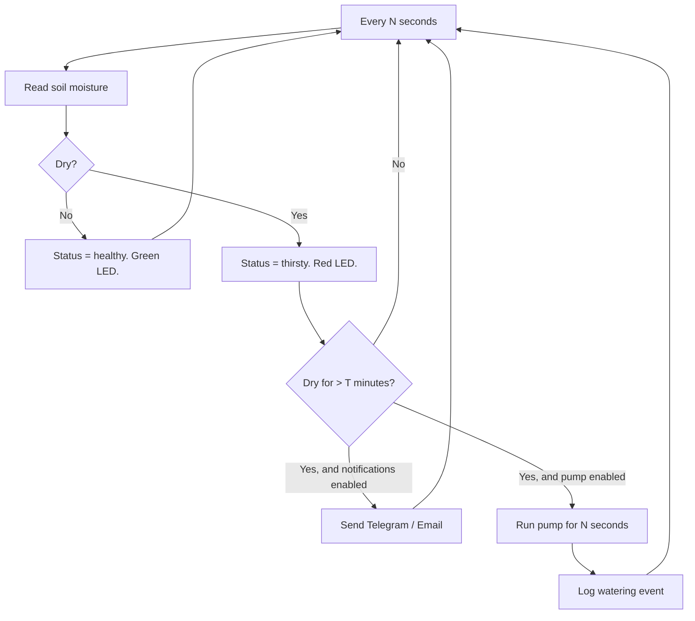

# Lab 18 — The IoT Device Anyone Can Understand: A Smart Plant / Greenhouse Monitor

> "Build a thing your grandparent can describe to their friend."
> — the highest bar in product design

**Time budget:** ~2 weeks for the core lab, with extension challenges that grow it to 3–5 weeks.
**Preferred language:** C/C++ (Arduino-mode) on the device; any language for any companion app.
**Working style:** solo, or in a team of up to 3 people.
**Hardware:** **strongly recommended**, total cost ~$10–20. A pure software simulator is acceptable but loses much of the lab's charm — this is a project where the magic is *that the physical world responds to your code.*

---

## The hook

Most projects on this course are demos. This one is a *thing*. You install it. It runs. It does its job. It saves a plant from your forgetful self. It has the highest "explainability score" of any lab on the course — your grandparent will understand it in five seconds, and so will every recruiter you ever show it to.

The mechanism is shamefully simple. A small probe goes into the soil. Every minute, a microcontroller asks the probe: "is the soil dry?" If the answer is yes for too long, the device blinks an LED, beeps a buzzer, sends a Telegram message, or — for the brave — turns on a small water pump. That's the whole product. And yet: **basically every smart-agriculture company in Ukraine, every commercial greenhouse, every "smart home" startup runs on the same logic.** Skyeton is a defense-tech drone company in Kyiv; it grew, like many Ukrainian companies, from people who had built exactly this kind of thing as students.

This is also the lab where you stop building "code that runs" and start building **products that exist.** A clean enclosure (3D-printed, taped together, even an old food container with holes), a power supply, a few sensors, a clear LED on the front. Show it to a friend. Ten years later, you'll still have a photo of it on your portfolio.

If you want the perfect appetizer, browse [**Random Nerd Tutorials**](https://randomnerdtutorials.com/) — their *"ESP32 Soil Moisture Sensor with Email Notifications"* tutorial is exactly this lab in tutorial form, free, polished, with photos. Pair it with [Andreas Spiess](https://www.youtube.com/@AndreasSpiess) — his garden-and-greenhouse video series is delightful and surprisingly deep.

---

## Why this is worth your time

- **The IoT-product shape is everywhere.** Smart locks, weather stations, drone health monitors, agricultural sensors, defense-tech ground sensors. They're all *this lab*, scaled up.
- It's the kind of project a non-technical person — a parent, a recruiter, a friend's friend — *understands instantly.* That makes it shockingly effective at the start of any portfolio conversation.
- Real Ukrainian opportunities: smart agriculture (Climate Field View, Smart Farming Ukraine), defense-tech ground sensors, energy monitoring startups. They hire on demonstrated IoT skills, and this lab is one demonstration.
- The skills compound: builds on Lab 04 (sensors), connects to Lab 16 (telemetry), prepares Lab 21 (backend) and Lab 33 (AI integration via thresholds → smart alerts).

---

## The target

> **Instructor TODO:** add reference photos to `docs/` once available.

**Basic — "It Watches"**
A probe sits in soil (or a dummy variable in simulator mode). Every 30–60 seconds, the device reads moisture. An LED is green if soil is wet enough, red if dry. A buzzer beeps once a minute when the soil is critically dry. The device runs forever, on a USB cable or a small battery. You install it in a real plant pot.

**Standard — "It Notifies"**
The device connects to Wi-Fi. When the soil is dry for more than X minutes, it sends a Telegram (or Discord, or email) message to you: *"Your plant is thirsty."* Multiple sensors are supported (one for each plant). A small web page shows the current moisture of all your plants. The device is robust to Wi-Fi drops — it stores readings locally and uploads when the network comes back.

**Standard+ — "It Acts"**
A relay (~$2) controls a small water pump (~$3). When the soil is dry, the pump runs for N seconds. The device records *how often it watered, when, and for how long.* Optionally: a button to force-water now, with a confirmation buzzer. **You can leave for the weekend without your plants dying.** The full closed-loop "device that takes care of a thing" stack — closer to a real product than 90% of student projects.

---

## The big idea, in one diagram



A simple state machine on top of a simple sensor read. The product-engineering work is in the *thresholds, the timing, the recovery*: how to handle false-positive dry readings, how to avoid spamming notifications, how to not overwater after a brief sensor glitch.

---

## Two-week plan with milestones

**Week 1 — Make it sense**

- **Day 1 — Pick the platform & toolchain.** ESP32 is the recommended choice (Wi-Fi built in, ~$5). Arduino Nano if no Wi-Fi needed (~$3). Pi Pico if preferred. Get blink running.
- **Day 2 — Read moisture.** A capacitive soil moisture sensor (~$2). Print raw analog values. Stick it in a glass of water — value should change. Stick it in dry sand — value should change again. Calibrate: dry = 4095, wet = ~1500 (your numbers may vary).
- **Day 3 — Convert to a percentage.** Map raw → 0–100% with a clean formula. Print "Moisture: 67%" once a minute.
- **Day 4 — LEDs.** Green if > 40%, red if < 25%, yellow in between. Wire them up. *Milestone: a working visual indicator.*
- **Day 5 — Buzzer.** A piezo buzzer (~$0.50). Beep when critically dry. *Milestone: an actual annoying-when-you-need-it product.*
- **Day 6 — Calibration UX.** Add two buttons: "Calibrate dry" (record current value as 0%) and "Calibrate wet" (record current value as 100%). Save to flash so calibration survives reboot.
- **Day 7 — Polish + plant it.** Stick it in a real plant. Take a photo. Walk away. *Milestone: a working device in the real world.*

**At this point you've completed the Basic level.**

**Week 2 — Make it useful**

- **Day 8 — Wi-Fi (ESP32 path).** Connect on boot. Reconnect on drop. (Skip if you're on Arduino-no-Wi-Fi path; instead build a simple OLED display that shows current status.)
- **Day 9 — Telegram alerts.** Telegram has a free official bot API. With one library (e.g., `UniversalTelegramBot`) and your bot's token, the device can send you messages. *Milestone: your phone buzzes when your plant needs water.*
- **Day 10 — Multiple sensors.** Wire 2–3 moisture probes to different ADC pins. The device reports each one separately.
- **Day 11 — Mini web dashboard.** ESP32 hosts a tiny web page on its IP. Open it from any device on the same Wi-Fi: see all sensors' current moisture, last watering, status.
- **Day 12 — Pick a side quest.**
- **Day 13 — README, photos, demo prep.**
- **Day 14 — Buffer day.**

---

## Levels

### Basic — "It Watches" (~10–14 hours)
- moisture readings via a real (or simulated) sensor
- visual status (LEDs, OLED, or display)
- audible alerts (buzzer)
- calibration UX
- runs continuously and is robust to power cycles

### Standard — "It Notifies" (~14–22 hours)
- everything from Basic
- Wi-Fi-connected
- Telegram or email notifications when dry
- supports multiple sensors
- a tiny web dashboard
- handles Wi-Fi drops gracefully

### Standard+ / Advanced — "Side Quests" (each ~3–10h)

- **Pump Control.** Add a relay + small pump. When dry, water for N seconds. **Always include a manual override button.** Test with dry runs first; flooding your dorm room is bad.
- **Solar + Battery.** Untethered. LiPo + TP4056 + a small solar panel = a sensor that lives outside and never needs charging.
- **Temperature & Humidity.** Add a DHT22 (~$3). Now it's a complete environmental monitor.
- **Light Sensor.** A photoresistor (~$0.50) detects how much light the plant gets. Combined with moisture: a real growth assistant.
- **Telegram Two-Way.** You can send commands back: `/status`, `/water now`, `/snooze 6h`.
- **Connect to Lab 16 Backend.** Push readings to your telemetry dashboard from Lab 16. The full IoT stack: many devices, one backend, one beautiful UI.
- **Public Garden Page.** Deploy the dashboard publicly. Share a URL with friends so they can check on your plants. Surprisingly fun.
- **Long-Term Logging.** Save daily averages to flash. Build a "30 days of moisture" chart.

---

## Extension challenges (3–5 weeks)

- **A Real Mini Greenhouse.** Multiple plants. Pump-per-plant. A grow light that turns on with a relay when ambient light is low. A dashboard that shows the whole "garden" at a glance. Connects to Lab 16's telemetry backend. Document with a 5-minute video tour.
- **AI-Driven Watering Schedule.** Log watering frequency, moisture decay rates, ambient temperature. Use the data (offline analysis in Python with pandas) to *predict* when each plant will need water. The device watering schedule becomes adaptive. Excellent bridge to the AI/ML labs.
- **Defense-Tech Inspired Ground Sensor.** Same hardware, different framing: a ruggedized, battery-powered ground sensor that detects soil disturbance / vibration / sound, transmits over LoRa to a base station. The skill graph from "smart plant" to "ground reconnaissance" is short.

---

## Make it yours (required)

Pick **one** personal twist:

- **The plant gets a personality.** Name it. Give it a voice (a "this-plant-uses-it/she/they" pronoun in the alert message). Have the alerts read in increasing urgency: "Hey, getting a bit dry." → "Could really use a sip." → "DYING, HUMAN." Surprisingly memorable and will be the thing the recruiter laughs about.
- **A specific use case.** A monitor for a tomato seedling tray. A monitor for an orchid (notoriously fussy). A monitor for cannabis (you'll need to handle the legal angle in your README).
- **Theme the dashboard.** Pixel-art plant grows when watered, wilts when dry. Or 1920s-engineering-blueprint aesthetic. Or hand-drawn.
- **Aviation flavor.** Repurpose the device — same hardware, same software — as a "model rocket pad humidity & temperature monitor", a "drone storage hangar climate sensor", or a "STM32 development bench environmental logger" (bonus: connects to Lab 16's dashboard).

You'll defend why you chose your twist.

---

## Working solo or in a team

Solo: device + cloud + UI all yours. Most demonstrably "shipped a product" of any lab.

Team:
- *By layer:* one person owns the device firmware (sensor + LEDs + buzzer + Wi-Fi); the other owns notifications + dashboard + alerts.
- *By feature:* one person drives Basic (sensing + LEDs), the other drives Standard (Wi-Fi + Telegram + dashboard + multi-sensor).
- *By extension:* one person drives the core lab; the other drives the pump & relay extension or the LoRa long-range version.

Two team rules: **git from day one** and **list who did what.** Each member must be able to explain calibration and the alert-debouncing logic.

---

## Tooling and language tips

**ESP32 (recommended)**
- PlatformIO + Arduino framework.
- Telegram: `UniversalTelegramBot` library.
- Web dashboard: serve static HTML from PROGMEM, or use `ESPAsyncWebServer` for fancier endpoints.

**Arduino (no Wi-Fi)**
- Same Arduino framework. Replace Wi-Fi with an OLED display or SD-card logging for offline status.

**Sensors**
- **Capacitive** soil moisture sensor (~$2). The cheaper *resistive* ones corrode in ~3 weeks; capacitive last for years.
- DHT22 for temperature + humidity (~$3).
- BH1750 for light (~$2).

**Pump (if you do that side quest)**
- A 5V or 12V mini submersible pump (~$3).
- A relay module rated for the pump's voltage (~$2). NEVER drive the pump directly from the microcontroller.
- A separate power supply for the pump. Don't share the microcontroller's power.

**Anyone**
- **Sensors lie.** Always read 5 times, take the median. A single noisy read can flood-trigger a pump.
- **Don't spam notifications.** Send one Telegram per "dry event", not one per minute. Implement a state machine: `HEALTHY → DRY (notify once) → WATERED → HEALTHY`.
- **Calibrate per pot.** Different soils have different baselines. Build the calibration UX in.

---

## Suggested project structure

```txt
plant-monitor/
  README.md
  firmware/
    src/
      main.cpp
      Sensors.cpp           # moisture, temp/humidity, light
      Indicators.cpp        # LEDs, buzzer
      Network.cpp           # Wi-Fi, retries
      Notifier.cpp          # Telegram, email
      WebServer.cpp         # mini dashboard
      Calibration.cpp       # save/load to flash
      State.cpp             # healthy / dry / watering state machine
  docs/
    parts-list.md
    wiring-diagram.png
    screenshots/
    photos/                 # the device in real plants
```

---

## When you get stuck

- **The moisture value is the same in water and dry sand.** You have a resistive sensor that's corroded, or a wiring issue. Check with a multimeter. Use a capacitive one if possible.
- **Telegram messages don't arrive.** You forgot to start a chat with your bot first (Telegram requires it). Or your `chatId` is wrong (use `@userinfobot` to get yours).
- **The device sends 100 dry alerts in a row.** Your state machine is checking moisture every loop and sending a notification every time. Add a "notified about this dry event" flag.
- **Wi-Fi reconnect doesn't work.** The ESP32 needs `WiFi.setAutoReconnect(true)` and a periodic check; otherwise it silently dies after the first dropout.
- **The pump runs forever once.** A relay glitch or a moisture sensor that doesn't update fast enough. Always cap pump runtime at a hard maximum (e.g., 10 seconds), regardless of state.

If stuck for 30+ minutes: serial-print the entire state every loop (moisture, LED, alert flag, last alert time). The bug is almost always there.

---

## Deployment checklist

- [ ] A photo of the device installed in a *real* plant — not a staged photo on your desk.
- [ ] The device runs for 24+ hours without manual intervention. Document this.
- [ ] Calibration is settable without re-flashing.
- [ ] If the pump side quest: a hard maximum runtime is enforced.
- [ ] Wi-Fi credentials and Telegram tokens are NOT in git. (`secrets.h` in `.gitignore`.)
- [ ] README has a parts list with prices.
- [ ] One real notification screenshot from your phone is in the README.

---

## What recruiters look at

- **Photos of the device in real life.** A device installed in a tomato pot beats any rendered diagram.
- **A 30-second video** showing the alert flow: dry sensor → LED red → buzzer → Telegram on phone.
- **A clean parts list with prices.** Shows you can spec a hardware project, not just code one.
- **Calibration is a real feature**, not hardcoded values. Demonstrates product-thinking.
- **The README addresses failure modes.** What happens if Wi-Fi drops? Pump valve sticks? Sensor disconnects? A junior who thinks about these gets called back.

---

## What to put in your README

1. Project name + one-sentence description.
2. **A real-life photo** of the device installed at the top.
3. **A 30-second video** showing the alert flow.
4. Parts list with prices and links.
5. Wiring diagram.
6. Build & flash instructions.
7. Calibration steps for a new pot.
8. Failure-mode notes (what happens if X breaks).
9. Telegram bot setup instructions.
10. If team: who did what.

---

## Reflection

Be ready to:

1. **Show the device, live, in a real plant.** Stick a finger in the wet/dry switch and watch the alert flow.
2. **Walk through your state machine.** When does a notification fire? When is it suppressed?
3. **Explain calibration.** Why per-pot? What if you skip it?
4. **What goes wrong** if the pump's valve sticks open? If the moisture sensor disconnects mid-loop? If Wi-Fi is gone for 6 hours?
5. **What changes** if you have 20 plants instead of 3? 200?
6. **Cost analysis** — a parts list. Is this a viable $30 product?
7. **What was the hardest non-software bug?**

---

## Showcase

End-of-semester gallery — anonymous voting for **most installed-in-real-life device**, **best alert UX**, and **best personal twist** (best plant personality). Bring the device, plus a photo of it in service.

---

## Going further

- *Random Nerd Tutorials* — bookmark for life.
- *Andreas Spiess* on YouTube — his garden series is wonderful.
- *Make: Smart Home* by Gordon McComb — the kindest book on home-automation projects.
- *The Smart Garden* — Wired's archive of articles on hobbyist agricultural sensors.
- The **Mycelium** (yes, the fungal computing project) and **The Things Network** (free LoRa community) — when you want to take your sensors outdoors and far.

---

## A final word

There is something specifically wonderful about building a thing that *does its job while you're not looking.* Most code we write runs only when we're at the keyboard. This thing wakes up at 3 AM, decides everything is fine, goes back to sleep. That's the difference between writing software and shipping products. After this lab, you'll have one of each in your hand.
