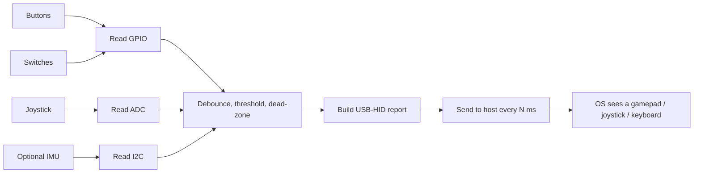

# Lab 19 — Make Your Own Joystick: A Custom USB Game Controller

> "Plug it in. The OS recognizes it. You play a game with it. There is no clearer demo."
> — what every interviewer thinks when you show them this lab

**Time budget:** ~2 weeks for the core lab, with extension challenges that grow it to 3–5 weeks.
**Preferred language:** C/C++ on the device; Python or JS for any companion tools.
**Working style:** solo, or in a team of up to 3 people.
**Hardware:** a **Raspberry Pi Pico (RP2040)** is strongly recommended (~$5, native USB-HID support, perfect for this lab). STM32 also works. A pure-software simulator path is *not* applicable here — the joy of this lab *is* a physical thing you plug into a USB port. Borrow / share if budget is tight.

---

## The hook

You build a thing. You plug it into your laptop's USB port. Your operating system says: *"Generic Game Controller detected."* You open a game. You move the stick. You press the buttons. You play the game. Your friends look at you like you're a wizard.

Custom USB game controllers and flight sticks are one of the most memorable portfolio projects a 1st-year can make. The build is small, the demo is *immediate*, and unlike most embedded projects, the result is something you can use forever — for flight simulators, for fighting games, for retro emulation, for a bespoke productivity dashboard with custom hotkeys. Most of the gaming industry's "premium custom controllers" cost $300+. You'll make yours for $15 in parts.

The aviation tie-in is direct: a custom **flight stick for Microsoft Flight Simulator, X-Plane, or DCS World** is a great theme for this lab. So is a **HOTAS** (Hands-On Throttle and Stick) build, a **rudder pedal set**, or a **simulated cockpit panel** with toggle switches and indicator LEDs. Real cockpit-grade controllers cost thousands. Yours will not. But the hardware skill behind the cheap version is the same skill behind the expensive one.

If you want a perfect appetizer, watch the YouTube channel [**Adafruit's HID-via-CircuitPython tutorials**](https://learn.adafruit.com/category/hid) — Adafruit has built more "weird custom controllers" than any company on Earth. Pair it with [the Raspberry Pi Pico SDK's HID examples](https://github.com/raspberrypi/pico-examples/tree/master/usb/device/dev_hid_composite) — the canonical reference. For inspiration, search YouTube for "DIY flight stick Pi Pico" and "DIY HOTAS Arduino" — there is a small global subculture of people building exactly this.

---

## Why this is worth your time

- **A working USB-HID device on your portfolio is rare and impressive.** Most students never touch the device side of USB. You will, in two weeks.
- The skills (USB descriptors, polling rates, debouncing, ergonomics) are **directly relevant** to robotics, drone-firmware, and avionics roles — these systems all speak USB or USB-HID-compatible protocols.
- It's a **memorable demo.** Plug, play, win. Three seconds. No setup.
- This lab pairs gloriously with **[Lab 25](lab-25-platformer-game.md) (2D platformer)** and **[Lab 28](lab-28-game-jam.md) (3D first-person)** — students who do all three can demo their controller playing their own game.

---

## The target

> **Instructor TODO:** add reference photos to `docs/` once available.

**Basic — "It's a Controller"**
A Pi Pico (or STM32) wired to at least 4 buttons and 1 analog joystick (a cheap PSP-style thumbstick, ~$2). When plugged in via USB, the OS recognizes it as a generic gamepad. Test in a game settings menu (or use [gamepad-tester.com](https://gamepad-tester.com/) in a browser) — buttons light up, stick deflects. Plays a real game (any browser game with controller support, e.g., the Chrome dinosaur game has community mods, or use a Steam game like *Stardew Valley*).

**Standard — "It Has Identity"**
The controller has a custom name in the OS (e.g., "MyName HOTAS v1"). Buttons are properly debounced (no double-fires). Analog sticks have a configurable dead zone. Optional: a small OLED display on the device shows what's currently pressed. Optional: physical labels (3D-printed or laser-cut) so the device looks professional. The cabling is tidy. It's a real-feeling thing.

**Advanced — "It's a Production"**
You've added something real: a **multi-mode controller** (a button switches profiles — flight mode, gaming mode, productivity mode), a **configurable button mapping** via a companion desktop app, an **OLED screen showing live telemetry** (button frame counts, axis values), an **IMU-based motion controller** (tilt to steer — like a Wiimote), or — for the boldest — a **simulated cockpit dashboard** with multiple toggle switches, encoders, and LEDs.

---

## The big idea, in one diagram



USB-HID is a standard "report" format — a small packed byte sequence that says "buttons pressed, stick X, stick Y, throttle, hat, etc." The microcontroller emits one report every few milliseconds. The OS does the rest. The cleverness is **ergonomic**: getting the buttons to feel right, the stick to feel right, the device to *not* feel like a homework assignment.

---

## Two-week plan with milestones

**Week 1 — Make it talk to the OS**

- **Day 1 — Pi Pico hello.** Install PlatformIO + Pico SDK (or CircuitPython if you want the gentlest path). Blink the onboard LED. *Milestone: tooling works.*
- **Day 2 — One button.** Wire a single push-button to a GPIO. Read it. Print "pressed" / "released" via serial.
- **Day 3 — A real keyboard.** Use the USB-HID library (TinyUSB on Pico, or `usb_hid` on CircuitPython) to make the device emit a keypress when the button is pressed. Open a text editor, press your button, see the letter appear. *Milestone: your device just typed for you.*
- **Day 4 — Many buttons.** Wire 4–8 buttons. Each one emits a different keypress or gamepad button. Use `gamepad-tester.com` or a game's input config screen to verify.
- **Day 5 — Joystick.** Wire a thumbstick to two analog inputs. Read X/Y. Map to gamepad axes. Test in `gamepad-tester.com`.
- **Day 6 — Debouncing.** Cheap buttons "bounce" — one press generates 4 fake presses. Add a software debouncer (state machine + a few-millisecond delay). Without debouncing, the controller is unusable.
- **Day 7 — Polish + a real game.** Plug into Steam or a flight simulator. Play one round. *Milestone: someone watches you play a game with hardware you built.*

**At this point you've completed the Basic level.**

**Week 2 — Make it feel right**

- **Day 8 — Dead zone.** Sticks rest at "0", but in reality rest at something like "12, -7" depending on physical alignment. Add a calibration step: read rest position on boot, treat values within ±X of rest as zero.
- **Day 9 — A custom name & USB descriptor.** Edit the USB descriptor strings so the OS shows "FlightStick v1 — by [Your Name]". Tiny but feels professional.
- **Day 10 — Enclosure.** Cardboard box, 3D-printed shell, laser-cut acrylic, or a re-purposed plastic container. Make it stop looking like a breadboard. Take photos.
- **Day 11 — Ergonomics.** Re-wire so the buttons fall under the fingers properly. Move the stick to the right place. Iterate based on actually playing a game.
- **Day 12 — Pick a side quest.**
- **Day 13 — README, photos, demo prep.**
- **Day 14 — Buffer day.**

---

## Levels

### Basic — "It's a Controller" (~10–14 hours)
- USB-HID device recognized by Windows / Linux / macOS without drivers
- at least 4 buttons + 1 analog stick (or equivalent)
- working in `gamepad-tester.com` (or equivalent OS test tool)
- plays at least one real game
- buttons are debounced

### Standard — "It Has Identity" (~14–20 hours)
- everything from Basic
- custom USB device name visible in the OS
- analog calibration & dead-zones
- enclosure that hides the breadboard
- 8+ inputs (buttons, axes, switches in any combo)
- README with build photos and a video

### Advanced — "Side Quests" (each ~3–10h)

- **Multi-Mode Controller.** A toggle switch or button changes profiles. Mode 1 = gaming, Mode 2 = flight sim, Mode 3 = video editing hotkeys. Each mode rebinds every input.
- **Companion Configurator App.** A small desktop app (Electron / .NET / Python+Tk) that talks to your controller over USB-CDC (serial-over-USB), lets you reassign button mappings on the fly, and saves them to flash on the device.
- **OLED Display.** A small OLED on the device shows the current mode, button presses, axis values, frame count. Excellent for live tuning.
- **IMU-Based Motion Control.** Add an MPU6050. Tilt the controller — it steers the in-game character. Wiimote-style.
- **Macro Buttons.** A button emits a sequence (e.g., "Ctrl+Shift+P, type 'Format Document', Enter"). Productivity gold.
- **Custom Cockpit Panel.** A small instrument panel with toggle switches, rotary encoders, indicator LEDs. Map to flight-simulator instruments via a community library (e.g., `MobiFlight`).
- **Multiple Devices.** Two controllers, networked together via USB-OTG or Wi-Fi, present as one cooperative device.
- **Hot-Swappable Profiles.** Plug your controller into any computer; it greets the OS with the last-used profile saved in flash.

---

## Extension challenges (3–5 weeks)

- **A Real HOTAS for Flight Simulator.** A two-piece controller: throttle quadrant + flight stick. Each is its own Pi Pico, presenting as separate USB devices, with realistic axes and switches. Calibrate in MSFS / X-Plane / DCS. Document the build with photos at every stage.
- **A Cockpit Panel Box.** A boxed instrument panel for a specific aircraft (Cessna 172, F-16, A320 — pick one you love). Toggle switches for radios, rotary encoders for frequencies, OLED for transponder display. Plugs in as multiple HID devices simultaneously. *This is a portfolio piece a flight-sim community will brag about.*
- **A Macro Pad for Coding / Editing.** 12 mechanical-keyboard switches in a small case. Each one runs a productivity macro (compile-and-test, format, switch desktops, scene transitions for OBS). Build it once, use it for the rest of your career.

---

## Make it yours (required)

Pick **one** personal twist:

- **A specific game.** Build the controller specifically for *one* game you love. *Stardew Valley* deserves a different layout than *Counter-Strike* than *Microsoft Flight Simulator*.
- **A specific aircraft.** A flight stick for the F-16. An ergonomic Cessna 172 yoke. A Soyuz / Vostok control panel. The constraints reveal themselves.
- **A specific aesthetic.** WW2 cockpit with phenolic-resin look. Soviet space-program aluminum with stenciled labels. Steam-punk with brass fittings. Cyberpunk with RGB.
- **A productivity tool, not a game.** A "coding macro pad" that runs your most-used VS Code shortcuts. A "Zoom controller" with mute/camera/share buttons. A "DJ deck" for OBS scene transitions. Same hardware skills, different domain.

You'll defend why you chose your twist.

---

## Working solo or in a team

Solo: hardware design, firmware, ergonomics, build — broad skill set.

Team:
- *By layer:* one person owns the firmware (USB-HID, debouncing, calibration); the other owns the physical build (enclosure, wiring, button selection).
- *By feature:* one person drives Basic (working device); the other drives Standard (enclosure + ergonomics) and one side quest.
- *By device:* in a HOTAS extension, one person owns the throttle, the other owns the stick.

Two team rules: **git from day one** and **list who did what.** Each member must be able to flash the device and explain debouncing live.

---

## Tooling and language tips

**Raspberry Pi Pico (recommended)**
- Two language paths:
  - **C/C++** with the Pico SDK (more "real embedded"); use the official `dev_hid_composite` example as a starting point.
  - **CircuitPython** with the `usb_hid` library (much friendlier — Python on a microcontroller). Adafruit's tutorials assume this path.
- Both are valid. C/C++ compiles smaller and faster; CircuitPython gets you to working in 30 minutes.

**STM32**
- TinyUSB stack works. STM32CubeIDE has a USB-HID example.
- Steeper learning curve than Pico, but the device feels more "professional".

**ESP32**
- Has USB but less mature as an HID device. Possible, but Pico is much smoother for this lab.

**Buttons & Sticks**
- **Buttons:** mechanical-keyboard switches (Cherry MX clones, ~$0.50 each) feel premium; cheap arcade buttons (~$1 each) are bigger and tactile; tact-switches (~$0.05 each) are the smallest and cheapest.
- **Joystick:** a "PSP-style" thumbstick with two pots and a pushbutton, ~$2.
- **Toggle switches** for cockpit-style: SPDT/DPDT, ~$0.50 each.
- **Rotary encoders:** ~$1 each; great for radio frequencies and dials.
- **OLED:** SSD1306 128×64, I2C, ~$3.

**Anyone**
- **Debounce in software, not hardware.** Hardware debouncing (RC filters) is a 1970s solution. Software is faster and free. The standard pattern: a button is "pressed" only after it reads HIGH consistently for ≥10 ms.
- **Polling rate matters.** 1000 Hz (1 ms reports) feels great. 125 Hz feels OK. 30 Hz feels broken. Default Pi Pico HID is 1000 Hz; don't slow it down.
- **Test in `gamepad-tester.com`** before testing in a game. Faster feedback loop.

---

## Suggested project structure

```txt
custom-controller/
  README.md
  firmware/
    src/
      main.c                 # USB-HID main loop
      Buttons.c              # debouncing
      Sticks.c               # ADC, dead zones, calibration
      HidReport.c             # builds the USB-HID report
      Display.c              # if OLED
      Modes.c                # multi-mode controller
    descriptors/
      hid_descriptor.c
      usb_descriptor.c
  hardware/
    parts-list.md
    schematic.png             # KiCad / Fritzing / hand-drawn photo
    enclosure/                # STLs / DXFs / cardboard cut diagrams
  companion/                  # if you make a desktop configurator
    src/...
  docs/
    photos/
    videos/
```

---

## When you get stuck

- **The OS doesn't see the device at all.** USB-HID descriptor wrong, or you're plugged into a power-only USB port. Try a different port. Check `dmesg` (Linux) or Device Manager (Windows). On macOS: System Information → USB.
- **Buttons report 5 presses for one click.** No debouncing. The classic 1st-day bug.
- **Stick says "(12, -8)" when at rest.** Calibration step missing. Read rest position on boot, subtract.
- **Holding a button down looks like rapid presses.** You're sending "pressed" + "released" reports per loop, instead of holding the pressed state. Maintain a button state, only emit changes.
- **Stick is too sensitive / too dead.** Adjust the curve. Linear is rarely right; a soft cubic (`x = x * x * x` keeping sign) gives much better feel for fine control.
- **Computer sees the stick but games don't.** Some games only see "DirectInput" controllers, some only "XInput". On Windows, [vJoy](https://sourceforge.net/projects/vjoystick/) or [DS4Windows](https://github.com/Ryochan7/DS4Windows) can convert. Or change your USB descriptor.

If stuck for 30+ minutes: USB sniffer software (Wireshark + USBPcap on Windows) shows you exactly what your device is sending. The bug is almost always in the descriptor or the report bytes.

---

## Deployment checklist

- [ ] The device is recognized by Windows, macOS, **and** Linux without drivers.
- [ ] `gamepad-tester.com` shows all inputs working.
- [ ] At least one real game has been played, with a video.
- [ ] Custom USB descriptor name is set.
- [ ] Buttons are debounced (no double-fires).
- [ ] Joystick has dead zone calibration.
- [ ] An enclosure or at least a tidy build (no exposed breadboard).
- [ ] Parts list with prices in the README.
- [ ] At least one photo of the device in use.

---

## What recruiters look at

- **A 30–60 second video of you playing a game with the device.** This single video is worth more than 1000 lines of code.
- **A photo of the build with the cover off** — shows the wiring is real.
- **A photo of the build with the cover on** — shows you finished it.
- **The schematic.** Even hand-drawn and photographed.
- **A clean README** that *names* the device (not "lab-19"). Branding signals product-thinking.
- **The device name in the OS is custom**, not "Generic HID". Tiny detail. Recruiters who do hardware notice immediately.

---

## What to put in your README

1. Project name + one-sentence description (give it a real name!).
2. **A 30–60 second video** of the device playing a game.
3. **Photos** — assembled, internals, plugged into a computer.
4. Parts list with prices.
5. Schematic (hand-drawn is fine).
6. Build instructions, step-by-step with photos.
7. The custom USB descriptor name and how to verify it.
8. Code build & flash instructions.
9. Calibration / pairing steps for a new computer.
10. If team: who did what.

---

## Reflection

Be ready to:

1. **Plug the controller in, live.** Show the OS recognizing it. Open `gamepad-tester.com`, demo every input.
2. **Play a real game** for 30 seconds.
3. **Walk through your debouncing logic.** What goes wrong without it?
4. **Show me your USB-HID report** byte by byte. Explain every bit.
5. **What's the polling rate?** Why does it matter?
6. **What changes** if I want to add a 9th button right now? A second analog stick? A throttle?
7. **What was the hardest non-software issue** — wiring, USB descriptor, ergonomics, or enclosure?

---

## Showcase

End-of-semester gallery — anonymous voting for **best-feeling controller**, **most beautiful build**, and **best aviation tie-in** (best flight stick / cockpit panel). Bring the device. Plug it into a laptop. Demo it.

---

## Going further

- *Adafruit Learn* — every variation of HID device imaginable, with photos.
- *Pi Pico USB examples* on GitHub — `dev_hid_composite` is the canonical reference.
- *MobiFlight* community — open-source ecosystem for flight-sim cockpit hardware. Once you've finished the lab, you can integrate.
- *Crowdfunding pages for premium controllers* (Saitek, VKB, Virpil, Winwing) — see what professional builds look like.
- *Reverse Engineering for Beginners* by Dennis Yurichev — when you want to dig into how USB really works.

---

## A final word

There is something specifically magical about plugging in a thing you built and watching the OS treat it like a real product. Most software work is invisible — it lives in browsers and processes you can't point at. This is the opposite. You can hold the result. You can give it as a gift. You can use it for the next 10 years. After this lab, "hardware" stops being a separate world. It's a thing you've now made.
