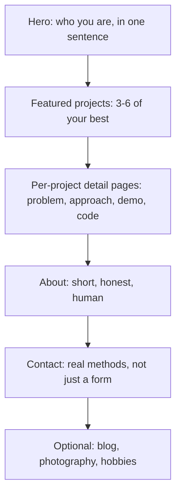

# Lab 20 — The Page That Gets You Hired: Build Your Personal Portfolio Site

> "Your portfolio is the thing recruiters open before they read your CV. Sometimes it's the only thing they open."
> — every dev recruiter, on the record

**Time budget:** ~2 weeks for the core lab, with extension challenges that grow it to 3–5 weeks.
**Preferred language:** TypeScript / HTML / CSS (any modern static-site stack is fine).
**Working style:** solo. *This one is intentionally solo* — the site is *yours* and represents *you*; teams don't make sense.

---

## The hook

This is the **single highest-leverage lab on the entire course.** Every junior who ever gets a tech job has a portfolio site. Every recruiter who finds you on LinkedIn opens the link in your bio. Every interviewer at the start of a screening looks at your projects on it. It is, dollar-for-dollar of effort, the most valuable two weeks you'll spend on any web work all year.

You will keep using this site for the next 5–10 years. The first version will look basic — that's fine. The version six months from now will be polished. The version two years from now will list your internship, your university group's hackathon, the Steam game you shipped, the open-source contributions you started making. *This is the meta-lab*: it links to all the other 33 labs you'll build on this course, and it grows with you.

The tone should be honest. You are a 1st-year student with real, interesting projects. You are not a "Senior Full-Stack Engineer with 5+ years experience" (the most common lie on bad junior portfolios — recruiters can smell it instantly). You are a person who built a self-balancing robot, a real-time multiplayer game, a search engine over Tolkien's books, and a flight-stick for Microsoft Flight Simulator. Show those things. Be honest about what you built, what you learned, what you'd do differently. *Honesty is rare in junior portfolios. It's also the thing that makes the few good ones stand out.*

If you want a perfect appetizer, browse [**Brittany Chiang's portfolio**](https://brittanychiang.com/) — the single most-imitated developer portfolio on the web (she's a senior engineer at Klarna, but the structure works at any level). Pair it with [**Refactoring UI**](https://www.refactoringui.com/) by Adam Wathan & Steve Schoger — the most practical book ever written on visual polish for engineers. There are free chapters online; the full book is one of the few worth the money.

---

## Why this is worth your time

- **Recruiters open this before your CV.** A clean, fast, working portfolio is the difference between "the candidate I emailed back" and "the resume I scrolled past."
- It is the **one piece of code you'll keep updated for years.** Most class projects die after the demo. This one is *infrastructure for your career.*
- It teaches **HTML, CSS, responsive design, deployment, and the modern frontend toolchain** in a project that genuinely needs to be polished, not just "working."
- It links your other 33 labs together into a *coherent story* — which is what gets you hired far more than any single brilliant project.

---

## The target

> **Instructor TODO:** add reference screenshots to `docs/` once available. (Compare against [brittanychiang.com](https://brittanychiang.com/) and [paco.me](https://paco.me/) for the look-and-feel target.)

**Basic — "It Exists"**
A static site at a real public URL — `yourname.github.io`, `yourname.vercel.app`, or a custom domain (~$10/year). Sections: a brief introduction (3–5 sentences in your own voice), 3+ project cards each with a thumbnail and link, a short About page, an honest CV/resume download, contact methods. Mobile-friendly. Loads in under 2 seconds. Works in incognito mode. No "Lorem Ipsum", no broken links, no 2017 placeholder photos.

**Standard — "It Looks Sharp"**
The site is genuinely well-designed: consistent typography (one body font, one heading font max), a clear color palette, generous whitespace, smooth scroll anchors, subtle animations on hover/scroll. Lighthouse score of 95+ on performance, accessibility, best practices. Dark/light theme toggle. Each project card opens a detailed case-study page (build vs. just a "view repo" link). Uses a real static-site framework (Astro, Next.js, SvelteKit). Custom domain.

**Advanced — "It's Memorable"**
Something specific makes this *yours, not a template*. A genuinely unique landing page (not just "Brittany's portfolio with my name swapped"). Animations that *fit the theme* (an aviation portfolio with subtle compass/instrument-cluster motifs; a game-dev portfolio with pixel-art touches; a low-tech "punk-zine" aesthetic). A blog with 1–3 real posts about projects you built. Live embedded demos (your [Lab 25](lab-25-platformer-game.md) platformer playable inline; your [Lab 22](lab-22-spa-frontend.md) dashboard live; your [Lab 9](lab-09-console-paddle-game.md) Pong embedded in the page).

---

## The big idea, in one diagram



Most great developer portfolios follow this exact spine. **The "secret" is not novel structure — it's polish.** Tight typography, fast load, mobile-perfect, no broken links, real photos. The "wow" is in the execution.

---

## Two-week plan with milestones

**Week 1 — Get a real site online**

- **Day 1 — Pick a stack.** Astro is the strongest recommendation: built for content sites, fast, works with React/Svelte/Vue components when needed. Alternatives: Next.js (if you'll do React heavy work), SvelteKit, or even plain HTML/CSS for the bravest. *Don't pick whatever you don't already know — Lab 20 is not a JS-framework deep dive.*
- **Day 2 — Deploy "Hello World."** A repo on GitHub, deployed to Vercel/Netlify/GitHub Pages. Live URL works. *Milestone: a real URL with your name on it.* This is the hardest psychological step, get it done first.
- **Day 3 — Write the hero section.** One sentence about who you are. *Three* iterations on paper before you commit to one. ("Hi, I'm Yana. I'm a 1st-year aviation-institute student in Kyiv who builds drones, web tools, and tiny game engines.")
- **Day 4 — Project cards (without details yet).** A grid of 3–6 of your best projects. For each: title, one-sentence summary, thumbnail screenshot, "view repo" + "live demo" links. Even rough screenshots — placeholder is fine until your projects are ready.
- **Day 5 — Project case-study pages.** Pick *one* project you're proudest of. Write a 200–400 word case study: *what was the problem, what did I build, what was hard, what would I do differently.* Include the architecture diagram and 2–3 screenshots. *Milestone: your portfolio has at least one case study a recruiter would actually read.*
- **Day 6 — About page + contact.** A short, real "about me." Real photo (or a clean illustration if you don't want one — both are acceptable). Real email. LinkedIn / GitHub / Telegram (if you use it professionally). *No fake forms that "send to the void"* — they're a bad signal.
- **Day 7 — Polish: typography, spacing, mobile.** Open the site on your phone. Fix everything that breaks. Use a single font pair (one heading, one body). Generous spacing.

**At this point you've completed the Basic level.**

**Week 2 — Make it sharp**

- **Day 8 — Lighthouse pass.** Run Chrome's Lighthouse audit. Fix performance issues (compress images, lazy-load, preload critical assets) until you're at 95+ on all four scores.
- **Day 9 — Accessibility.** Keyboard navigation works. Color contrast passes WCAG AA. Alt text on every image. Semantic HTML. (Recruiters at companies like Stripe, Klarna, Atlassian *check this* — and most junior portfolios fail.)
- **Day 10 — Dark mode.** Add a theme toggle. Two CSS variables, ten lines of JS. Modern feature, expected on senior portfolios, doable in an hour.
- **Day 11 — Three more case studies.** One for each of three other projects.
- **Day 12 — Pick a side quest.**
- **Day 13 — Custom domain + final polish.** Buy a domain (~$10/year on Namecheap or similar). Connect it to Vercel/Netlify. SSL is automatic.
- **Day 14 — Buffer day. Show it to 3 people for honest feedback before "shipping."**

---

## Levels

### Basic — "It Exists" (~10–14 hours)
- live URL on Vercel / Netlify / GitHub Pages
- 3+ projects with screenshots, descriptions, working links
- about + contact sections
- mobile-responsive
- no broken links, no placeholder text
- README on the GitHub repo with build instructions

### Standard — "It Looks Sharp" (~14–22 hours)
- everything from Basic
- consistent typography (1 heading + 1 body font, no more)
- a color palette of 4–6 colors, used consistently
- per-project case studies (200–400 words each)
- Lighthouse 95+ on all four scores
- accessibility: keyboard navigation, alt text, semantic HTML, contrast
- dark / light theme toggle
- a custom domain

### Advanced — "Side Quests" (each ~3–10h)

- **A Real Blog.** 1–3 written posts about projects you built — *not* "10 things I learned about React this week" generic content. Real, specific, technical. *"How I balanced my robot in PID — three failed tunings before it worked."* Generates traffic. Demonstrates communication.
- **Live Embedded Demos.** Embed [Lab 9](lab-09-console-paddle-game.md) Pong, [Lab 25](lab-25-platformer-game.md) platformer, [Lab 22](lab-22-spa-frontend.md) dashboard, etc., directly into the project pages as `<iframe>`s. Recruiter clicks, plays. Magic.
- **Resume Builder.** A `/cv` page that's both viewable in-browser AND downloadable as PDF. Single source of truth.
- **i18n.** A second language (Ukrainian + English is the obvious choice for the local job market; English-only is also fine).
- **A `/uses` page.** A trend among senior devs — list your hardware, software, terminal setup. Honest, useful, often shared.
- **A `/now` page.** What you're currently working on (updated quarterly). Signals you're alive and active.
- **Microinteractions.** Subtle animations on scroll, hover-state polish, page-transition effects. *Subtle.* Loud animations on a portfolio are a red flag.
- **OpenGraph / SEO.** Proper meta tags so when someone shares your link on Discord / Telegram / Twitter, a beautiful preview card appears. Single biggest "this person ships" signal.

---

## Extension challenges (3–5 weeks)

- **A Project-Per-Lab Site.** A `/projects/lab-XX` page for *every* lab in this course you completed. Each one a real case study. By end of semester, your portfolio has 15–34 detailed project pages — most senior portfolios online have 5.
- **A "Building Out Loud" Blog.** Commit to publishing one "build journal" post per lab as you complete them. The discipline is hard. The traffic + signal is huge.
- **Open Source the Template.** Once your portfolio is good, generalize it into a starter repo and open-source it. Include in the README: "this is the template I used for my own portfolio at [URL]." Other students will star it. You will get GitHub followers. This is *exactly* how senior dev influencers started.

---

## Make it yours (required)

This entire lab is "make it yours" — your face, your projects, your voice. **Don't clone Brittany Chiang's portfolio with your name swapped.** Recruiters have seen that template thousands of times.

But also pick **one** specific signature element:

- **A unique hero animation** — not "particles", not "matrix rain." Something that fits *you*. A subtly animated propeller for an aviation theme. A pixelated "mascot" that follows the cursor. Hand-drawn typography for the name.
- **A specific color palette** with intent. The Refactoring UI book has exquisite advice here.
- **A signature theme.** Engineering blueprint. Late-90s vaporwave. CRT terminal. Pen-and-ink illustration. Just *one* aesthetic, applied consistently.
- **One quirky page that's not standard.** A `/playlist` of music you code to. A `/reading` of books you finished. A `/inflight` (aviation pun!) of "what I'm currently building." These linger in recruiters' minds.

---

## Working solo or in a team

**This lab is solo.** A portfolio site is fundamentally personal. (If two students collaborate to build *each* of their portfolios, helping each other with code review, that's encouraged — but each delivers their own.)

---

## Tooling and language tips

**Astro (recommended)**
- Built for content-heavy sites. Output is static HTML by default — fast, deploys anywhere.
- Markdown-driven content (case studies in `.md` files, no need to learn a CMS).
- Lets you mix React / Svelte / Vue / Solid components when needed; otherwise, plain HTML/CSS.
- Excellent docs, active community.

**Next.js**
- Strong choice if you'll do heavy React work in the rest of your career.
- More machinery than Astro for a static site, but pays off if you'll grow into a SaaS.

**SvelteKit**
- Great DX, smaller output. Recommended if you genuinely like Svelte.

**Plain HTML/CSS**
- The honest path. Surprisingly few developers can write modern semantic HTML and a clean CSS file from scratch — *the ones who can stand out.* Use [Pico CSS](https://picocss.com/) or [Simple.css](https://simplecss.org/) as a starting style.

**Hosting**
- **Vercel** — best DX for Astro/Next; auto-deploy from GitHub.
- **Netlify** — equally good.
- **GitHub Pages** — free forever, slightly more setup, fine for plain HTML.
- **Cloudflare Pages** — also free, great for high-traffic.

**Anyone**
- **Don't pick a random template.** Use the time to actually design *one* page that looks like *you*.
- **Compress every image.** [Squoosh.app](https://squoosh.app/) is free, in-browser, perfect.
- **Use real fonts.** Google Fonts is free. Pair one heading font + one body font. *Inter* and *IBM Plex* are both excellent neutral choices.

---

## Suggested project structure

```txt
yourname-portfolio/
  README.md
  src/
    pages/
      index.astro                # hero + featured projects
      about.astro
      projects/
        index.astro              # list of all projects
        [slug].astro             # case-study template
      blog/
        index.astro
        [slug].astro
    content/
      projects/
        lab-17-self-balancer.md
        lab-22-dashboard.md
        ...
      blog/
        ...
    components/
      Hero.astro
      ProjectCard.astro
      ThemeToggle.astro
    styles/
      global.css
  public/
    images/
    favicon.svg
    cv.pdf
  astro.config.mjs
```

---

## When you get stuck

- **It looks like a generic Bootstrap site.** Strip everything, start with one font and one color, add detail back slowly.
- **Lighthouse performance score is bad.** Almost always: huge images. Compress with Squoosh. Use modern formats (WebP, AVIF).
- **Mobile breaks at small widths.** Use the browser dev tools' responsive mode. Common fix: `max-width: 100%` on images, `flex-wrap: wrap` on grids.
- **My case studies feel like resumes.** A case study is a story. *Problem → my approach → what happened → what I'd do differently.* Past-tense, specific, no buzzwords.
- **It looks fine on my laptop, terrible on someone else's.** Different default fonts, different screen sizes. Test on at least one different device.
- **I can't think of what to write in "About."** Write the email you'd send a friend introducing yourself. Edit ruthlessly. Don't try to sound impressive.

If stuck: open three portfolios you admire, list specifically what you like, copy *the technique* (not the words). Inspiration is good; templates are bad.

---

## Deployment checklist

- [ ] Live URL works on first click in incognito mode.
- [ ] Site loads in < 2 seconds on a 3G connection (test in DevTools throttling).
- [ ] Lighthouse: Performance, Accessibility, Best Practices, SEO all ≥ 90, ideally 95+.
- [ ] Works on mobile (375px width minimum).
- [ ] No broken links anywhere.
- [ ] No "Lorem Ipsum" anywhere.
- [ ] All project links go to real working things (live demo OR working GitHub repo with README).
- [ ] CV/resume PDF downloads on click.
- [ ] OpenGraph meta tags work — paste your URL in Telegram, you should get a nice preview card.
- [ ] favicon set, not the framework default.
- [ ] Custom domain (recommended; not strictly required).

---

## What recruiters look at

In the first 10 seconds, in this order:

1. **The site loads.** Sounds dumb; ~30% of junior portfolios fail this on the first click.
2. **The hero says clearly who you are** in plain language, not "Innovative Full-Stack Wizard."
3. **The first 3 projects** in the projects section. Are they real? Are there *links*? Are the screenshots clear?
4. **At least one case study they can actually read.** Most junior portfolios have project cards with no detail. The ones that have read-worthy case studies are 10× more memorable.
5. **The recruiter clicks one live demo.** Does it work?
6. **The CV is downloadable.**
7. **There's a real way to contact you** — real email, not just LinkedIn DM.

After the call: they share your URL with 1–2 colleagues. *Make sure that link survives that share* — fast load, no spam, no flashing animations, professional.

---

## What to put in your README (on the GitHub repo)

1. The live URL of the deployed site.
2. Tech stack used.
3. How to run locally (one command).
4. How to deploy (one command if possible).
5. License (MIT or "use as inspiration, not a template").
6. Credits for any specific code/design borrowed.

---

## Reflection

Be ready to:

1. **Open the live URL on a phone you've never used before.** Show it loads correctly.
2. **Explain why you chose your color palette and fonts.**
3. **Walk through how the site is built and deployed** — from `git push` to live URL.
4. **Show me your Lighthouse scores live.**
5. **Read me one of your case studies.** (Recruiters won't ask this, but reading aloud reveals padding and buzzwords.)
6. **What would you change** if a recruiter said "I love this but it's too long; you have 5 seconds, what would you cut?"
7. **What's the next thing** you'll add — and why is it not in v1?

---

## Showcase

End-of-semester gallery — anonymous voting for **most polished portfolio**, **best case study**, and **most memorable signature element**. Bring the URL.

---

## Going further

- *Refactoring UI* by Wathan & Schoger — the appetizer above. Read it.
- *Practical Typography* by Matthew Butterick (free online) — the next-level reading.
- *Brittany Chiang's portfolio*, *Paco Coursey's site*, *Linear's homepage*, *Rauno Freiberg's site* — go-tos for inspiration.
- *Smashing Magazine*, *CSS Tricks*, *Josh Comeau's blog* — long-form modern frontend writing.
- *Resume Worded* — once your portfolio is up, get free CV review.

---

## A final word

This is the lab whose impact compounds the longest. The robot rusts. The fractal loses novelty. The portfolio site, well-tended, is the door every recruiter walks through to get to *you*. Two weeks now buys you years of leverage. Build it carefully. Update it forever.
