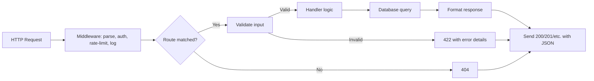

# Lab 21 — The Backend Behind Every App: A REST API with Real Auth

> "Show me your API and I'll tell you who you are."
> — anyone who has ever read a Stripe doc and a 1st-year CRUD project on the same afternoon

**Time budget:** ~2 weeks for the core lab, with extension challenges that grow it to 3–5 weeks.
**Preferred language:** C# (ASP.NET Core) or TypeScript (Node + Express/Fastify/Hono); Python (FastAPI) is also excellent.
**Working style:** solo, or in a team of up to 3 people.

---

## The hook

Every web app you have ever used — Spotify, Telegram, Bolt, Monobank, Diia, Steam, anything — talks to a backend through an API. The frontend is the painted shell; the API is the thing that *actually does the work.* Stores data. Authenticates users. Enforces rules. Hides secrets. Decides what each user is allowed to see. **A clean, well-documented, deployed REST API is the most interview-relevant artifact a junior backend developer can show.**

In this lab you'll build one. Real users with hashed passwords. Real authentication with tokens. Real CRUD over a real database. Real error handling, real validation, real OpenAPI documentation. Deployed to a real server with a real public URL. Everything an interviewer can poke with `curl` and find that *it doesn't fall over.*

The hardest thing about this lab is **resisting the temptation to skip the boring parts.** Auth is boring. Validation is boring. Error handling is boring. Pagination is boring. Logging is boring. *That's exactly why most juniors skip them, and exactly why the ones who don't skip them get hired first.* This is the lab where you learn that "boring" backend work is what *actually* separates a hobby project from production software.

If you want a perfect appetizer, read [the Stripe API documentation](https://stripe.com/docs/api) for 30 minutes — even if you don't process payments. Stripe's docs are widely regarded as the gold standard of API design; understanding *why* they're good is worth a semester of theory. Pair it with [Microsoft's REST API design guidelines](https://github.com/microsoft/api-guidelines) (free on GitHub) and the [OWASP API Security Top 10](https://owasp.org/API-Security/editions/2023/en/0x11-t10/) — the canonical list of what goes wrong in real APIs.

---

## Why this is worth your time

- **Junior backend interviews are 80% about this exact lab.** "Walk me through how you'd design an API for X" is the most common screening question in the world. After this lab, you have a real, deployed answer.
- This is also the lab where you finally understand **passwords, tokens, sessions, JWTs, salts, hashing**, and the difference between "authentication" and "authorization." Not from theory; from making them work.
- Combined with **[Lab 22](lab-22-spa-frontend.md)** (the SPA frontend) and **[Lab 30](lab-30-cross-platform-app.md)** (the mobile app), this becomes a full-stack project — the strongest single artifact a junior can have.
- Ukrainian backend hiring is *strong* — Reface, Grammarly, MacPaw, Petcube, ETERNA, Restream, Ajax Systems, Genesis ecosystem — they all hire on this exact skill set.

---

## The target

> **Instructor TODO:** add reference screenshots / curl recordings to `docs/` once available.

**Basic — "It Has Endpoints"**
A REST API with at least 5 endpoints (list / get-one / create / update / delete on one main resource of your choosing). Persistent storage in SQLite (or a file). Input validated server-side. Sensible HTTP status codes (200, 201, 400, 404, 422). Error responses are structured JSON. The API is reachable via `curl` from your laptop. Domain is your choice: a recipe API, a flashcard API, a workout-tracker API, a flight-log API (aviation-flavored).

**Standard — "It's Multi-User"**
The API supports **authentication**. Users register with an email + password. Passwords are hashed with bcrypt or argon2 (never plaintext, never SHA-256-without-salt). On login, the API returns a JWT (or session cookie). Protected endpoints reject requests without a valid token. Each user can only see their *own* data. **Deployed to a public URL** (Render / Fly.io / Railway / Azure free tier). OpenAPI/Swagger UI live at `/docs`.

**Advanced — "It's Almost Production"**
You've added something real: **rate limiting** (max N requests per minute per IP), **role-based access control** (admin vs. regular user), a **password-reset** flow with email tokens, **pagination** on list endpoints, **structured logging** (every request logs method/path/user/duration to JSON), **automated tests** (the API has a test suite), **CI/CD** (push to GitHub → auto-deploy), or **a tracing/metrics endpoint** for observability.

---

## The big idea, in one diagram



A request walks through a pipeline, gets validated, executes business logic, talks to a database, and returns a structured response. **The art is in the boring parts** — what happens when input is malformed, when the database is down, when the user's token expired, when two requests race.

---

## Two-week plan with milestones

**Week 1 — A working public-API**

- **Day 1 — Pick stack & "hello world."** ASP.NET Core minimal API, Express + TypeScript, FastAPI — all good. Deploy a "hello world" endpoint to Render/Fly/Railway *immediately.* (Don't develop locally for a week and then attempt to deploy on the last day. Deploy first; develop against the deployed version.)
- **Day 2 — Pick a domain.** Recipes? Flashcards? Flight logbook? Habit tracker? Pick *one* concrete domain and stick to it. Sketch the data model on paper (5 fields max for the main resource).
- **Day 3 — Database.** SQLite is the right answer. Add an ORM (EF Core in .NET, Prisma in TypeScript, SQLAlchemy in Python) or write SQL by hand — both are valid. Migrations from day one.
- **Day 4 — Five CRUD endpoints.** `GET /resources`, `GET /resources/:id`, `POST /resources`, `PATCH /resources/:id`, `DELETE /resources/:id`. Test each with `curl`.
- **Day 5 — Validation.** Use a library (FluentValidation in .NET, Zod in TypeScript, Pydantic in Python). Reject malformed input with structured 422 responses. *No 500 errors when the user sends garbage.*
- **Day 6 — Status codes.** 201 on create, 204 on delete, 404 when missing, 422 on validation errors, 500 only on actual server errors. Get the discipline right.
- **Day 7 — OpenAPI docs.** All three frameworks generate OpenAPI/Swagger UI for free. Verify `/docs` shows your endpoints clearly. Polish the descriptions.

**At this point you've completed the Basic level.**

**Week 2 — Make it multi-user**

- **Day 8 — User registration.** A `/auth/register` endpoint. Hash the password with bcrypt or argon2 (built-in in .NET, `bcrypt` package in Node, `passlib` in Python). Store the hash; never the password.
- **Day 9 — Login & JWT.** A `/auth/login` endpoint that verifies password against hash and returns a JWT. Use the canonical library (`Microsoft.AspNetCore.Authentication.JwtBearer`, `jsonwebtoken`, `python-jose`).
- **Day 10 — Protected routes.** Middleware that extracts the user from the JWT. Each resource endpoint scopes data to the requesting user. *Test this hard: log in as Alice, try to read Bob's data, get 403/404.*
- **Day 11 — Deploy auth-enabled version.** Update environment variables (JWT secret) on the host. **Never commit secrets.** Set them via the host's dashboard.
- **Day 12 — Pick a side quest.**
- **Day 13 — README, OpenAPI screenshot, demo prep.**
- **Day 14 — Buffer day.**

---

## Levels

### Basic — "It Has Endpoints" (~12–18 hours)
- 5+ endpoints implementing CRUD on one resource
- SQLite (or another DB) with migrations
- input validation with structured error responses
- correct HTTP status codes
- OpenAPI/Swagger UI live at `/docs`
- API is reachable from `curl` running on the laptop

### Standard — "It's Multi-User" (~16–24 hours)
- everything from Basic
- user registration + login with hashed passwords
- JWT-based authentication on all data endpoints
- per-user data scoping (no peeking at other users' rows)
- **deployed to a public URL** (Render, Fly.io, Railway, etc.)
- secrets in environment variables, not in code
- README has the live URL and example `curl` commands

### Advanced — "Side Quests" (each ~3–10h)

- **Rate Limiting.** Per-IP rate limit (e.g., 60 requests/minute). Return 429 when exceeded. Use the framework's built-in or [`express-rate-limit`](https://www.npmjs.com/package/express-rate-limit).
- **Role-Based Access Control.** Two roles (admin / user). Admins can list all resources; users only their own. Middleware enforces it.
- **Password Reset Flow.** "Forgot password" → email token → set new password. (Use a free email service like [Resend](https://resend.com/) or just log the email to console for the lab.)
- **Pagination.** `GET /resources?limit=10&offset=20` returns paginated results with `total` and `next` metadata. The single most-asked-about API feature in interviews.
- **Search & Filtering.** `GET /resources?q=search&status=active` with proper SQL parameter binding (NEVER string concatenation — that's SQL injection).
- **Soft Delete.** Mark rows as deleted instead of removing them. Standard production pattern.
- **Audit Log.** Every mutation logged with user/timestamp/old-value/new-value to a separate table.
- **Automated Tests.** Integration tests with a real test database. xUnit (.NET), Vitest/Jest (Node), pytest (Python).
- **CI/CD.** GitHub Actions: run tests on every push; auto-deploy on merge to `main`.
- **OAuth Login.** Sign in with Google / GitHub. Use [Auth.js](https://authjs.dev/) or framework equivalents.
- **API Versioning.** `/v1/resources` vs `/v2/resources`. Both running side by side.

---

## Extension challenges (3–5 weeks)

- **Connect to [Lab 22](lab-22-spa-frontend.md) (Frontend Dashboard).** Pair this API with a real React/Svelte SPA. Now you have a deployed full-stack app. *This is the highest-ROI extension on the entire course.*
- **Connect to [Lab 30](lab-30-cross-platform-app.md) (Mobile App).** Same API, now consumed by a React Native app. Full-stack with mobile. Senior-level portfolio piece.
- **Add the [Lab 33](lab-33-object-detection-tracking.md) RAG Layer.** Wire your API to an LLM-powered chat that answers questions about the data ("how many recipes used eggs this month?"). Combine backend + AI in one project.
- **Real Production Practices.** Add structured logging (Pino, Serilog, structlog), metrics (Prometheus), tracing (OpenTelemetry), Sentry for error tracking, GitHub Actions for tests + deploys. Document each in the README. *This list, completed, is what mid-level engineers do at real jobs.*

---

## Make it yours (required)

The mechanics are universal. **What your API does for whom** is what makes this memorable.

Pick **one**:

- **A specific domain.** A flight logbook (aviation flavor — register flights, hours, aircraft type, instructor name; closes nicely against [Lab 12](lab-12-task-tracker.md) task tracker). A workout tracker. A study-flashcard system. A book library. A "places I've been" travel log. A daily journaling API. Pick something *you* would use.
- **A community-specific tool.** An API for your university's club. An API for a small business (a tutor scheduling lessons, a restaurant tracking ingredients). Real domain, real users.
- **Aviation simulator integration.** An API that ingests data from Microsoft Flight Simulator (via SimConnect) and stores flight history. Beautiful direct tie-in to the institute.

You'll defend why you chose this domain.

---

## Working solo or in a team

Solo: full ownership of model, validation, auth, deployment. Strongest single backend learning experience.

Team:
- *By layer:* one person owns the data model + storage; the other owns auth + middleware + deployment.
- *By feature:* one person drives Basic (CRUD + validation + docs); the other drives Standard (auth + per-user scoping + deploy).
- *By domain:* if your API has multiple major resources, each person owns one and they integrate.

Two team rules: **git from day one** and **list who did what.** Each member must be able to walk through one full request lifecycle and explain how a password becomes a hash, then a JWT, then a logged-in user.

---

## Tooling and language tips

**ASP.NET Core (C#)**
- Minimal APIs are excellent for this lab — concise, fast, well-documented.
- EF Core for the ORM (sqlite provider). Code-first migrations.
- `Microsoft.AspNetCore.Authentication.JwtBearer` for JWTs.
- FluentValidation for input.
- Swashbuckle / NSwag for OpenAPI (built into the templates now).

**Node.js + TypeScript**
- **Hono** is the modern recommendation — fast, tiny, beautiful types. Express still works but feels old.
- Prisma for the ORM — generates types from your schema.
- `bcrypt` and `jsonwebtoken` (or `jose`) for auth.
- Zod for validation.
- `swagger-ui-express` or Hono's built-in OpenAPI generator.

**FastAPI (Python)**
- The strongest "automatic OpenAPI" experience — your endpoints *are* your docs.
- SQLAlchemy + Alembic for the database.
- `passlib[bcrypt]` for password hashing.
- `python-jose` for JWTs.
- `pydantic` for validation (built-in).

**Hosting (free tier)**
- **Render** — easiest. PostgreSQL DB free tier, deploy from GitHub.
- **Fly.io** — more powerful, slightly more setup.
- **Railway** — great DX, has free hours per month.
- **Azure** — good for .NET; Microsoft offers student credits.

**Anyone**
- **Never log passwords or full JWTs.** Even on dev. Even in error messages.
- **Never use `MD5` or `SHA-1` for passwords.** Always bcrypt or argon2 with a per-user salt (the libraries do this automatically — just use them properly).
- **Always use parameterized queries.** Never `"SELECT * FROM users WHERE name='" + userInput + "'"`. SQL injection is still the #1 web vulnerability.
- **Always include a `Content-Type` and CORS headers.** Frontend in [Lab 22](lab-22-spa-frontend.md) will need them.

---

## Suggested project structure

```txt
api-backend/
  README.md
  src/
    Program.cs (or main.ts / main.py)
    Endpoints/
      Resources.*               # /resources CRUD
      Auth.*                    # /auth/register, /auth/login
    Models/
      Resource.cs
      User.cs
    Services/
      ResourceService.*
      AuthService.*              # hashing, JWT issuing
    Middleware/
      AuthMiddleware.*
      RateLimit.*
    Data/
      ApplicationDbContext.cs (or schema.prisma / models.py)
      Migrations/
    Validation/
      ResourceValidator.*
  tests/
    integration/
      Resources.test.*
      Auth.test.*
  docs/
    architecture.png
    er-diagram.png
    openapi-screenshot.png
  .github/
    workflows/
      ci.yml                    # if you do CI/CD
  README.md
  Dockerfile (or render.yaml / fly.toml)
```

---

## When you get stuck

- **My deployed API returns 500 but works locally.** Almost always: a missing environment variable on the host (DB connection string, JWT secret) or a build issue. Check the host's logs.
- **Frontend can't talk to my API.** CORS. Add a permissive CORS policy for development; tighten it for production.
- **Login works but protected routes return 401.** Token isn't being sent (frontend bug), or the secret used to sign the JWT isn't the same as the secret used to verify it.
- **Passwords aren't being hashed.** You're calling the wrong function or hashing on the *wrong* side. The hash should happen *server-side* during register/login, on the plaintext password from the request body.
- **OpenAPI docs are empty.** You forgot to register the OpenAPI services, or your endpoints aren't decorated correctly. Check the framework's quick-start.
- **The database file is empty after deploy.** Your host wiped it. Render's free tier is ephemeral — use Render's PostgreSQL add-on, or switch to a managed Postgres host (Neon, Supabase, Turso are all free).

If stuck for 30+ minutes: `curl -v` your endpoint locally, then `curl -v` it on the deployed URL. Compare the responses.

---

## Deployment checklist

- [ ] API live at a public URL.
- [ ] OpenAPI/Swagger UI accessible at `/docs` (or `/swagger`).
- [ ] Three example `curl` commands in the README, including auth.
- [ ] Secrets (DB URL, JWT secret) in environment variables, NOT in code.
- [ ] `.env` is in `.gitignore`. (Run `git log -p | grep -i secret` to verify nothing leaked.)
- [ ] Passwords are hashed with bcrypt or argon2.
- [ ] Wrong password returns 401, not 200 with "wrong password" in body.
- [ ] An unauthorized request to a protected endpoint returns 401.
- [ ] One user can't access another user's data (verified manually).
- [ ] A `Content-Type: application/json` header is sent.
- [ ] CORS is configured (at least permissively for development).
- [ ] Deployed version's `/health` endpoint returns 200.

---

## What recruiters look at

- **They open `/docs` first.** Is the OpenAPI clean? Are descriptions written? Are example values realistic?
- **They `curl` the API.** Does it respond on the first try? With reasonable status codes?
- **They try to register a user.** Does it work? Are passwords hashed? (They check by reading the README + GitHub source.)
- **They try to access a protected endpoint** without auth. Do they get a clean 401?
- **They look at your repo structure.** Is it organized? Is the README professional? Are there migrations? Tests? CI?
- **They look at your `.env.example`.** Is it documented? Are placeholders sensible?
- **They check git log for secrets.** This is a real check; juniors fail this constantly.

---

## What to put in your README

1. Project name + one-sentence description of the domain.
2. **The live URL of the API** + **link to the live OpenAPI docs**.
3. Tech stack used.
4. Architecture diagram.
5. ER diagram (database model).
6. Example `curl` commands — register, login, list, create, get, update, delete.
7. How to run locally + `.env.example`.
8. How to deploy.
9. List of completed side quests + extensions.
10. Known limitations / TODOs (recruiters love honest ones).
11. If team: who did what.

---

## Reflection

Be ready to:

1. **`curl` the live API**, register a user, log in, fetch a protected resource. Live.
2. **Walk through one request** end to end — from the client's `curl` to the database row.
3. **Show the user's password in the database.** It should be a hash, not plaintext. Explain bcrypt.
4. **Show the JWT structure.** Decode it on jwt.io. Explain the three parts.
5. **What's the difference between authentication and authorization?**
6. **What goes wrong** if I leak the JWT secret? If two users register simultaneously? If the database is unreachable for 30 seconds?
7. **What's an SQL injection?** Show me where in your code you prevent it.
8. **What was the hardest bug** — code, deployment, or auth?

---

## Showcase

End-of-semester gallery — anonymous voting for **cleanest API design**, **best OpenAPI docs**, and **best domain choice**. Bring the live URL + a 90-second demo with `curl`.

---

## Going further

- *Designing Data-Intensive Applications* by Martin Kleppmann — Chapter 1, 2, 4.
- *The Stripe API documentation* — read it, even if you'll never use Stripe. Gold standard.
- *Microsoft REST API Guidelines* on GitHub — surprisingly readable.
- *OWASP API Security Top 10* — the canonical list of what goes wrong.
- *Web Security Academy* by PortSwigger (free) — eye-opening interactive labs on real vulnerabilities.
- *Building Microservices* by Sam Newman — when you're ready to scale beyond a single service.

---

## A final word

The boring parts — validation, error handling, hashed passwords, environment-variable secrets, proper status codes — are exactly what a working junior backend engineer does eight hours a day. After this lab, those things will feel familiar instead of intimidating. That familiarity, more than any single algorithm, is what gets you hired.
