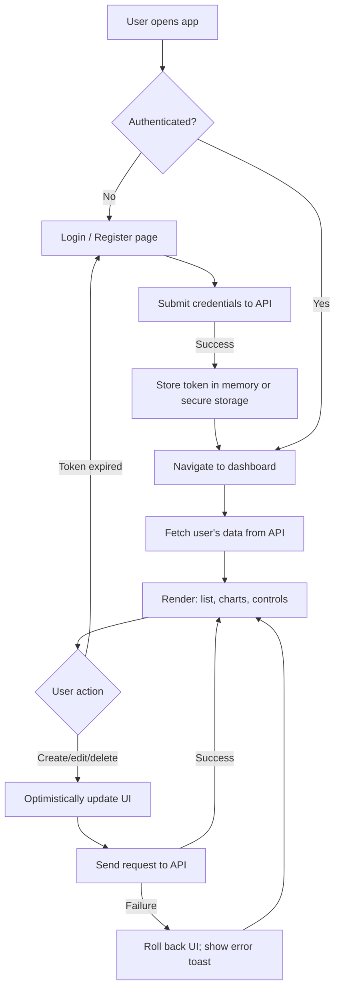

# Lab 22 — The Painted Shell: Build the SPA Frontend for Your API

> "Backend engineers build cathedrals; frontend engineers build the windows. Both decide whether anyone wants to come inside."
> — paraphrased from a thousand engineering blogs

**Time budget:** ~2 weeks for the core lab, with extension challenges that grow it to 3–5 weeks.
**Preferred language:** TypeScript with React (recommended), Svelte, or Vue.
**Working style:** solo, or in a team of up to 3 people.

---

## The hook

The API you built in Lab 21 is invisible. It returns JSON. It's correct, it's secure, it's deployed — and a non-technical human can never tell. **This lab is the painted shell that turns "an API" into "an app".** Login screens. Forms. Tables. Charts. Error states. Loading spinners. Dark mode. The thousand small decisions that turn correct data into a thing people *use*.

Modern frontend is the most-hired junior skill in Ukraine. It's also the most overproduced — too many "I built a TODO app with React" portfolios that all look the same. **The way to stand out is not to use 17 frameworks; it's to actually finish *one* small frontend that genuinely works against a real backend, looks honestly designed, handles real-world failure cases (the network died mid-form, the token expired, the input is invalid), and is deployed to a public URL someone can use.** That's a 1-in-30 portfolio. This is your shot at building it.

Pair it with Lab 21 and you have a deployed full-stack app. Pair *that* with Lab 30 (mobile) and you have a portfolio piece that genuinely impresses senior engineers. This is the lab where the "full stack" becomes more than a buzzword on your CV.

If you want a perfect appetizer, browse [**Linear's website and product**](https://linear.app/) — it's the textbook example of what excellent modern frontend feels like. Pair with [**Josh Comeau's blog**](https://www.joshwcomeau.com/) — the best writer on modern CSS and React on the internet, and his free [*CSS for JS Developers*](https://css-for-js.dev/) intro is gold. For tactical reference: Adam Wathan & Steve Schoger's [**Refactoring UI**](https://www.refactoringui.com/), which is referenced in nearly every senior frontend portfolio you'll ever see.

---

## Why this is worth your time

- **Frontend is the largest junior hiring pool in Ukrainian tech.** This lab is your interview practice.
- It is the lab where you finally understand **components, state, effects, async data, forms, and routing** — five concepts most students bounce off four or five times before they stick.
- Combined with **Lab 21**, this is the most-likely-to-be-cloned-by-recruiters portfolio piece in this whole course. They will literally pull up the URL during the call.
- **Real-world frontend is 80% handling failure.** Network drops, validation errors, expired sessions, race conditions. After this lab, you'll have *seen* all five.

---

## The target

> **Instructor TODO:** add reference screenshots to `docs/` once available.

**Basic — "It Talks to the API"**
A single-page app at a public URL that consumes Lab 21's API. Users can register, log in, log out. Logged-in users see a list of their data, can create new items, edit, and delete. Forms validate before submission. Loading states are visible. Errors are shown clearly (not just `alert()` boxes). The app doesn't crash when the API is unreachable — it shows an honest "couldn't load — try again" message.

**Standard — "It's Polished"**
The app feels good. Typography is consistent. There's a real color palette. Mobile-responsive (it should look fine on a phone). Forms have proper field-level validation, good labels, and helpful error messages. Tables are sortable; long lists are paginated. There's a settings page. Dark/light theme. Loading skeletons (not spinners) on data fetches. Optimistic updates on common actions (delete an item; the UI updates instantly, then rolls back if the API fails). Lighthouse score 90+ on mobile.

**Advanced — "It Has Real-World Polish"**
You've added something that elevates it: **charts and visualizations** (recharts, Chart.js, Visx) on the data, **drag-and-drop** for reordering items, **keyboard shortcuts** that feel like a power tool (Linear-style `Cmd+K` command palette), **infinite scroll** with proper virtualization for huge lists, **real-time updates** via polling or Server-Sent Events (the data updates if you change it from another tab), **i18n** (Ukrainian + English at minimum), or **offline support** with a service worker (the app works on the metro).

---

## The big idea, in one diagram



A frontend is a state machine that mirrors API state and handles failure. The hard parts are *invisible* — what happens when the network blips during a save, when two browser tabs disagree, when the token quietly expired three minutes ago and the next request will fail.

---

## Two-week plan with milestones

**Week 1 — Login → list → create**

- **Day 1 — Pick stack & deploy "hello."** React + Vite + TypeScript is the recommended baseline. Or SvelteKit, or Vue 3. Deploy a "hello world" to Vercel/Netlify *immediately.* Same pattern as Lab 21: deploy first, develop against deployed version. *Milestone: live URL works.*
- **Day 2 — Routing.** Set up basic routing — `/login`, `/register`, `/dashboard`, `/settings`. React Router, SvelteKit's file-based routing, or Vue Router. A protected-route wrapper that redirects to `/login` if no token.
- **Day 3 — Login form.** A real form with proper labels, validation (use `zod` + `react-hook-form`, or your framework's equivalent). On submit, call `POST /auth/login` against your Lab 21 API. Store the JWT in memory + (carefully) localStorage. *Milestone: you can log in to your own backend from your own frontend, both deployed.*
- **Day 4 — Register form.** Same pattern. Handle the "user already exists" error case gracefully.
- **Day 5 — Authenticated fetch wrapper.** A `fetch()` helper that automatically adds the `Authorization: Bearer <token>` header and handles 401 by redirecting to `/login`.
- **Day 6 — Dashboard with list.** Fetch the user's data on mount. Show loading state, then the list. Show "no items yet" empty state.
- **Day 7 — Create form.** A dialog or page to create a new item. POST to API. On success, refresh the list.

**At this point you've completed the Basic level.**

**Week 2 — Make it polished**

- **Day 8 — Edit and delete.** Inline editing or a detail page. Delete with confirmation. Optimistic updates.
- **Day 9 — Real error handling.** Replace every `alert()` and `console.log` with toast notifications (`react-hot-toast`, `sonner`, or your framework's equivalent). Network errors, validation errors, server errors all handled distinctly.
- **Day 10 — Mobile responsive.** Open in dev tools at 375px width. Fix everything that breaks. Use a CSS framework (Tailwind, vanilla CSS Grid, your preference) — but don't write 800 lines of CSS without one.
- **Day 11 — Theme + visual polish.** Dark mode toggle. Pick a color palette. Pick fonts. Add micro-interactions where they matter (button hovers, focus rings).
- **Day 12 — Pick a side quest.**
- **Day 13 — README, screenshots, demo prep.**
- **Day 14 — Buffer day.**

---

## Levels

### Basic — "It Talks to the API" (~12–18 hours)
- live URL, deployed
- consumes a real public API (your Lab 21 deployment)
- register / login / logout flow
- a list view of the user's data
- create / edit / delete actions
- forms with validation
- loading and error states (no `alert()`)
- handles network failures without crashing

### Standard — "It's Polished" (~16–24 hours)
- everything from Basic
- mobile-responsive (≥ 375px width)
- consistent typography + color palette
- dark/light theme
- toast notifications instead of alerts
- pagination or infinite scroll for lists
- field-level form validation with helpful messages
- loading skeletons (not just spinners)
- Lighthouse mobile score ≥ 90

### Advanced — "Side Quests" (each ~3–10h)

- **Charts.** Recharts, Chart.js, or Visx for visualizations of the user's data (e.g., monthly tasks completed, recipes by category, training hours per week).
- **Command Palette.** A `Cmd+K` quick-action menu (the Linear / GitHub / Slack pattern). Use [`cmdk`](https://cmdk.paco.me/) — five lines of code, huge UX win.
- **Optimistic Updates.** Already covered in Standard, but go *deeper* — write a queue that retries failed mutations.
- **Real-Time Updates.** Server-Sent Events from your API or polling every 5 seconds. Two browser tabs stay in sync.
- **Drag and Drop.** `dnd-kit` for accessible drag-and-drop on lists. Excellent feel.
- **Search & Filter.** A search bar that hits `GET /resources?q=...` with proper debouncing.
- **i18n.** Ukrainian + English. Use `i18next` or `Lingui`. Even *one* translation pair is a strong signal in Ukrainian portfolio context.
- **Offline.** A service worker that caches the app shell + last-fetched data. Works on the metro.
- **Skeleton-First Loading.** Replace every spinner with a skeleton matching the content shape. Used by Facebook, LinkedIn, Stripe — a known senior-engineer signal.
- **Accessibility Pass.** Real keyboard navigation. Real focus management. Real ARIA labels. WCAG AA contrast. Use Axe DevTools to verify.

---

## Extension challenges (3–5 weeks)

- **Couple it tightly with Lab 21.** Treat them as a single full-stack project. Single repo (monorepo), shared types via OpenAPI codegen or a shared package, single CI/CD pipeline, single README. *This is what production-grade junior portfolios look like.*
- **Real-Time Multiplayer Layer.** Add WebSockets (extends to Lab 23 territory) — multiple users see each other's actions live. The data refreshes when someone else changes it.
- **Mobile Companion.** Build Lab 30 (React Native) that consumes the same API. Now you have full-stack with mobile. The strongest junior portfolio piece achievable in a single semester.
- **Real Production Practices.** End-to-end tests (Playwright or Cypress), CI on every PR, error tracking with Sentry, analytics with Plausible (privacy-friendly). Document each in the README.

---

## Make it yours (required)

The mechanics are universal. *What the app looks like and feels like* is what makes it yours.

Pick **one**:

- **A specific aesthetic.** Linear-inspired clean minimalism with subtle animations. Notion-inspired warm and friendly. CRT-style retro for fun. Brutalist on purpose. Refined "newspaper" with serif headlines. *Don't pick everything; pick one and commit.*
- **A specific domain treatment.** If your API is a flight logbook, the dashboard should *look* like a pilot's logbook (paper texture, plane silhouettes, runway-style headings). If it's a recipe app, food photography. If it's a workout tracker, athletic-feeling typography.
- **A signature feature.** A unique data visualization (a flight-track map for the logbook; a heatmap for the workout tracker). A unique input method (voice notes? camera-OCR for receipts?). Something *one* recruiter remembers from 50 portfolios.

You'll defend why you chose this aesthetic / feature.

---

## Working solo or in a team

Solo: state, routing, forms, deployment — all yours. Most thorough single-frontend learning experience.

Team:
- *By layer:* one person owns infrastructure (router, auth, fetch wrapper, theming); the other owns features (list, forms, charts).
- *By page:* one person owns auth pages + settings; the other owns dashboard + charts.
- *By milestone:* one person drives Basic; the other drives Standard + side quests.

Two team rules: **git from day one** and **list who did what.** Each member must be able to explain how the JWT is stored and how a 401 is handled.

---

## Tooling and language tips

**React + Vite + TypeScript (recommended)**
- The job-market default in Ukraine. If you're going to learn one frontend stack deeply, this is it.
- TanStack Query for server state (a *huge* unlock — handles caching, refetching, optimistic updates).
- React Hook Form + Zod for forms.
- Tailwind CSS + shadcn/ui for styling. Both are senior-favored.
- Vercel for hosting.

**SvelteKit**
- Beautifully ergonomic. Fewer bookings/Vercel jobs ask for it but the developer experience is exquisite.
- Built-in routing, form actions, server-side rendering.

**Vue 3 + Vite**
- Strong in Asia and growing elsewhere. Composition API + `<script setup>` is excellent.

**Anyone**
- **Don't reinvent forms or fetching.** Use TanStack Query (or framework equivalents). Use a form library. Hand-rolling these is a known time sink.
- **Use a UI primitive library.** Radix UI, shadcn/ui, Headless UI — none of them prescribe styling, all of them solve accessibility correctly. Save weeks of debugging.
- **Don't store JWT in localStorage if you can avoid it.** It's vulnerable to XSS. For most labs, the trade-off is fine; for production, use httpOnly cookies. *Document the trade-off in your README — recruiters notice.*
- **Compress images. Use modern formats (WebP, AVIF).** Most "frontend is slow" is image weight.

---

## Suggested project structure

```txt
frontend-spa/
  README.md
  src/
    main.tsx (or main.ts)
    App.tsx
    routes/
      _layout.tsx
      login.tsx
      register.tsx
      dashboard/
        _layout.tsx
        index.tsx
        new.tsx
        [id].tsx
      settings.tsx
    components/
      ui/                   # buttons, dialogs, toasts, primitives
      forms/
      charts/
    api/
      client.ts             # the fetch wrapper
      types.ts              # API response shapes
    auth/
      AuthContext.tsx       # current user + token
      ProtectedRoute.tsx
    hooks/
      useResources.ts       # TanStack Query hooks
    styles/
      globals.css
  public/
  .env.example
  vite.config.ts
  tailwind.config.ts
```

---

## When you get stuck

- **CORS errors when calling the API.** Configure your backend (Lab 21) to allow the frontend's origin. For development, set `Access-Control-Allow-Origin: *` is acceptable.
- **JWT works on first login, then 401 forever.** You're not sending the `Authorization` header on subsequent requests. Add it in your fetch wrapper.
- **Forms submit empty data.** You're using uncontrolled inputs without proper `name` attributes, or you're not preventing the form's default submission.
- **Dark mode flashes on page load.** Set the initial theme from `localStorage` *synchronously* in a `<script>` in `<head>`, before React renders.
- **The deployed site shows a blank page.** Check the browser console — usually a 404 on a JS bundle (deployment misconfigured, base path wrong) or a CORS error on the API (most common). Inspect the Network tab.
- **The site works on my laptop but not on a phone.** Check viewport meta tag, fixed widths, hover-only interactions. Open DevTools' device mode.

If stuck for 30+ minutes: open the network tab. The bug is almost always in a request URL, a missing header, or a CORS preflight.

---

## Deployment checklist

- [ ] Live URL works on first click.
- [ ] Mobile viewport renders correctly (375px width minimum).
- [ ] Lighthouse mobile score ≥ 90 on Performance, Accessibility, Best Practices.
- [ ] No console errors on a fresh load.
- [ ] No `alert()` calls anywhere.
- [ ] API base URL is configured via environment variable.
- [ ] `.env` is in `.gitignore`.
- [ ] CORS is properly configured between frontend (this lab) and backend (Lab 21).
- [ ] 404 page exists.
- [ ] Favicon set (not the framework default).
- [ ] OpenGraph meta tags work — paste link in Telegram, see preview.

---

## What recruiters look at

- **The URL works on a phone.** They click from LinkedIn on a phone first.
- **The first 5 seconds.** Hero, login form, navigation. Is it confusing? Is it slow?
- **They register a fake account.** Does it work? Are validation errors helpful? Does the UI react intelligently to bad input?
- **They look at the URL bar while clicking around.** Does routing make sense (`/dashboard`, `/settings`, `/items/123`)? Or is everything `/?q=foo&id=42&modal=open`?
- **They open dev tools.** Are there console errors? Are network requests sensibly named? Are responses cached well?
- **They check the GitHub repo.** Is the structure clean? Are TypeScript types real (not `any` everywhere)?

---

## What to put in your README

1. Project name + one-sentence description.
2. **The live URL** + **a 60-second screen recording** showing register → login → list → create.
3. Tech stack with versions.
4. Architecture diagram (frontend, API, browser, host).
5. How to run locally + `.env.example`.
6. How to deploy.
7. Side quests + extensions completed.
8. A demo account credentials (`demo@example.com` / `demo`) — be honest about it.
9. Known limitations / TODOs.
10. If team: who did what.

---

## Reflection

Be ready to:

1. **Open the live URL on a phone**, register, log in, create an item. Live.
2. **Walk through the auth flow** — what happens when login succeeds, how is the token stored, what happens when it expires.
3. **Open the network tab during a "create" action.** Walk through every request.
4. **Disable your laptop's Wi-Fi mid-action.** Show the app degrades gracefully (and recovers when the network returns).
5. **Show me the JWT in storage.** What's in it? Why is storing it there a security trade-off?
6. **What goes wrong** if two tabs are open and one user changes data? If the API returns a 500 mid-form-submit?
7. **What was the hardest bug** — CORS, state, deployment, or styling?

---

## Showcase

End-of-semester gallery — anonymous voting for **most polished UI**, **best UX in failure cases**, and **most creative theming**. Bring the URL + the API URL.

---

## Going further

- *Refactoring UI* by Wathan & Schoger — the appetizer above.
- *Josh Comeau's blog* — modern CSS and React done well.
- *Linear's blog* — best writing on UI craft from a real product team.
- *Patterns.dev* — free deep-dive into React/Vue patterns.
- *Web.dev* (Google) — performance, PWAs, accessibility.
- *Refactoring UI* + *CSS for JS Developers* (paid but transformative) — best two paid frontend resources.

---

## A final word

The backend you built in Lab 21 is correct. This lab makes it *exist* in the world. After this, you'll have something a recruiter clicks on, registers for, uses for 30 seconds, and thinks "this person ships." That impression — built in 30 seconds, kept for the entire interview — is the hidden value of the frontend.
