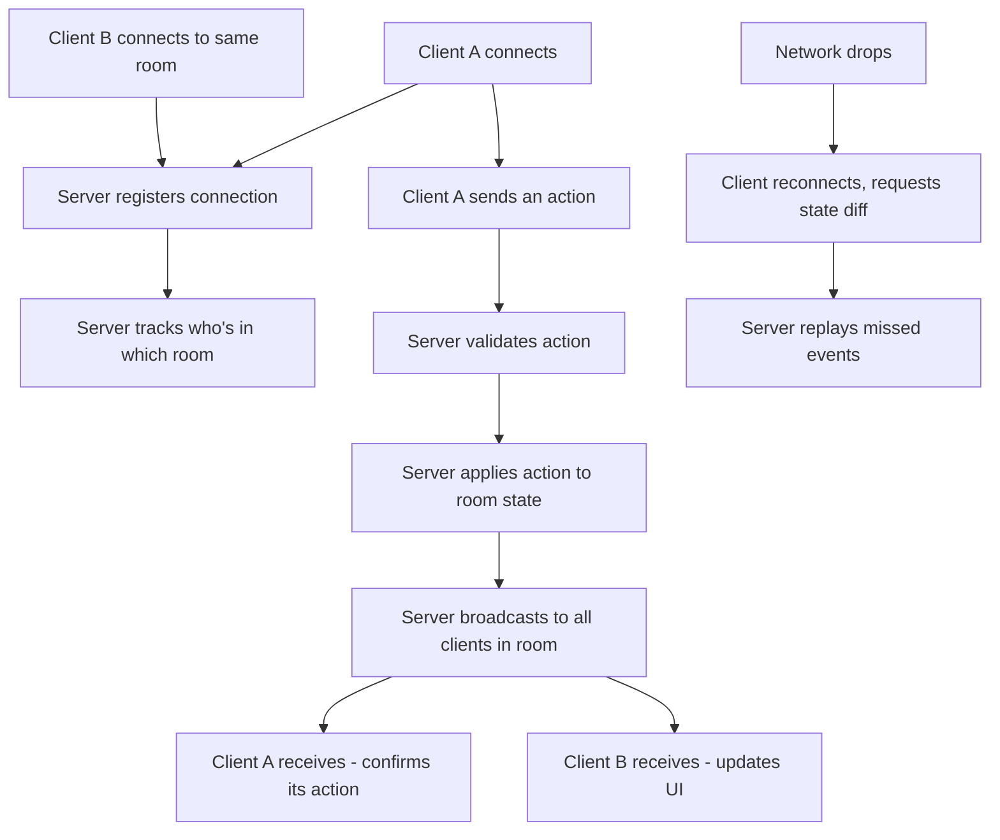

# Lab 23 — Two Browsers, One Reality: A Real-Time Multiplayer Web App

> "The first time another browser tab updates because of you, the web stops being read-only."
> — every developer's first WebSocket moment

**Time budget:** ~2 weeks for the core lab, with extension challenges that grow it to 3–5 weeks.
**Preferred language:** TypeScript (Node.js + Socket.IO is the standard path); C# (ASP.NET Core SignalR) also excellent.
**Working style:** solo, or in a team of up to 3 people.

---

## The hook

For most of the web's history, browsers spoke to servers in a strict, polite turn-taking pattern: client asks, server answers, conversation ends. Then in 2011 a quiet specification called **WebSockets** shipped, and suddenly the server could just *talk* — pushing data to every connected browser whenever something happened. That single shift gave us Discord, Figma, Google Docs, Linear's live cursors, every multiplayer browser game, every live-coding pair tool, every collaborative whiteboard, every realtime stock-trading dashboard. The web stopped being read-only.

In this lab you'll build a real-time multiplayer app — something where two browser tabs see *each other's* actions live. A multiplayer drawing board. A live quiz that the host runs while players answer on their phones. A Skribbl-style guessing game. A collaborative TODO list. A typing-race. The mechanics are simple. The "wow" is *visible* — open two windows side by side, type in one, watch the other update. Show a friend. Their face changes.

This is also the lab that teaches you what makes real-time hard: **race conditions, optimistic updates, conflict resolution, reconnection, "lost message" recovery, lag compensation, what happens when two users do the same thing at the same time.** These are the exact concepts that show up in interviews for *any* senior backend or full-stack role. Build them once at this scale and you'll feel them forever.

If you want a perfect appetizer, read [**Gabriel Gambetta's *Fast-Paced Multiplayer*** series](https://www.gabrielgambetta.com/client-server-game-architecture.html) — five short articles, free, the canonical reference for client-server real-time architecture. Pair it with [**Glenn Fiedler's *Networking for Game Programmers***](https://gafferongames.com/) — the legendary blog series every multiplayer game programmer reads, also free. And if you want one talk: [**Figma's *How we built our multiplayer cursors***](https://www.figma.com/blog/how-figmas-multiplayer-technology-works/) — a beautiful real-world post-mortem.

---

## Why this is worth your time

- **Real-time UX is the modern web's most distinguishing feature.** Every "feels like magic" product (Linear, Figma, Notion, Discord) has it. Most junior portfolios don't.
- The skills (**WebSockets, broadcasting, room/channel management, optimistic updates, reconnection logic**) are some of the most asked-about in senior backend interviews and rare in junior portfolios.
- A multiplayer web app **demos itself.** Two browser tabs, one URL — the recruiter sees the magic in 5 seconds. *Most* portfolio projects need a 2-minute explanation; this one needs none.
- This lab synergizes powerfully with **[Lab 27](lab-27-multiplayer-browser-game.md) (multiplayer browser game)** — same WebSocket spine, two products built on it. Combined, they're the most distinctive single multiplayer skill set in any junior portfolio.

---

## The target

> **Reference build:** [How to Create the Simplest .io Game in 30 Minutes — JavaScript + Node.js + Socket.IO](https://www.youtube.com/watch?v=hj4ZF1FlkDE) — full real-time multiplayer baseline in 30 minutes; matches the Basic target end-to-end.

**Basic — "It Syncs"**
Two browser tabs see each other. The chosen project — a drawing board, a TODO list, a poll, a typing race — has the property that an action in one tab visibly updates the other within a second. Both tabs handle disconnects: when the network drops, the tab shows "reconnecting…", and when it recovers, state catches up.

**Standard — "It's Multi-Room"**
Multiple independent "rooms" (or "games", or "boards") run simultaneously. Each user creates or joins a room with a shareable URL (`/r/abc123`). Up to 10 users per room. The user can see other connected users (avatars, names, "user X is typing"). The app handles the messy real-world cases — users joining mid-action, rooms being abandoned, the network glitching for 5 seconds, two users editing the same thing at the same time.

**Advanced — "It Handles Real-World Mess"**
You've added something serious: **persistence** (the room's state survives a server restart), **authentication-aware rooms** (private rooms only logged-in users can enter — connects to [Lab 21](lab-21-rest-api-auth.md)'s auth), **conflict resolution** beyond last-writer-wins (a real CRDT or operational transform — used by Figma and Google Docs), **lag compensation** so the UI feels instant even on slow networks, **a spectator mode** (read-only viewers don't count toward the user limit), or **end-to-end encryption** of room contents (server can broker but not read).

---

## The big idea, in one diagram



The server is the **single source of truth**. Every action goes through it. Every client receives the state. Reconnection is "ask for what I missed." That model — when you understand it deeply — is the foundation of every collaborative app on the internet.

---

## Two-week plan with milestones

**Week 1 — Make it sync**

- **Day 1 — Pick a project.** Pick *one*: a drawing board, a chat with typing indicators, a multiplayer TODO list, a typing-race game, a live-poll/quiz host, a collaborative whiteboard. The simpler your project, the more polished it can be. *Don't pick all four; pick one and commit.*
- **Day 2 — Tooling & "hello world."** Node.js + TypeScript + Socket.IO + a simple frontend (React + Vite). Or ASP.NET Core SignalR + a static frontend. Connect a browser to a server, log "client connected" on both sides. Deploy a hello-world version *immediately* (Render / Fly.io). *Milestone: deployed real-time scaffold.*
- **Day 3 — Your first "echo" event.** A button on the client emits `'ping'`; the server responds with `'pong'`; the client logs it. The whole pipeline lives.
- **Day 4 — Broadcast.** When client A sends a message, the *server* broadcasts it to all connected clients (including B). Open two browser tabs, send from one, see it in the other. *Milestone: the magic.* Take a video.
- **Day 5 — Domain action.** Whatever your project's *one* main action is (draw a stroke, add a TODO, type a character, place a vote), wire it through the same broadcast pattern.
- **Day 6 — State on join.** When a new client connects, the server sends them the current state of the room. Late joiners catch up.
- **Day 7 — Polish + first demo.** Open three tabs side by side. Demonstrate. Take a GIF for the README.

**At this point you've completed the Basic level.**

**Week 2 — Make it multi-room**

- **Day 8 — Rooms.** Each connection joins a specific room. Server-side `rooms[id] = { state, sockets[] }`. Broadcast scoped to room. URL like `/r/abc123` joins room `abc123`.
- **Day 9 — User identity.** Names + avatars (auto-generated, or chosen on first visit). Show a list of connected users in the room.
- **Day 10 — Disconnection handling.** When a tab closes, the server removes them from the room and broadcasts "user X left." Stale rooms (no users for 5 minutes) get garbage-collected.
- **Day 11 — Reconnection.** When the network blips, the client reconnects automatically. On reconnect, fetch the room state again. Show a "reconnecting…" banner during the gap.
- **Day 12 — Pick a side quest.**
- **Day 13 — README, screenshots/GIF, demo prep.**
- **Day 14 — Buffer day.**

---

## Levels

### Basic — "It Syncs" (~12–18 hours)
- WebSockets connection between client and server
- one user action propagates to all connected clients
- deployed to a public URL
- two browser tabs visibly sync within ~1 second
- handles connect / disconnect cleanly

### Standard — "It's Multi-Room" (~16–24 hours)
- everything from Basic
- multi-room support with shareable join URLs
- per-room user lists with names/avatars
- new users see current state on join
- automatic reconnection on network drops
- room garbage collection

### Advanced — "Side Quests" (each ~3–10h)

- **Persistence.** Room state stored in Redis or a database. Survives server restart.
- **Auth-Gated Rooms.** Connects to [Lab 21](lab-21-rest-api-auth.md)'s auth: private rooms only logged-in users can enter.
- **Real CRDT.** Use Yjs or Automerge for conflict-free concurrent editing. Used by Linear, Figma, Notion. Game-changer for collaborative editing.
- **Live Cursors.** Show every connected user's mouse position in the room — Figma-style. Visceral "this is multiplayer" effect.
- **Optimistic UI.** Local action updates UI instantly; server confirmation arrives later. Roll back if rejected.
- **Spectator Mode.** Read-only viewers count separately from active players.
- **Replay.** Record all events. Play back a room from start to finish like a video.
- **Voice / Video.** WebRTC layer on top of the WebSocket signaling. Suddenly your TODO app has voice chat.
- **Mobile-First Layout.** Many real-time apps die on mobile. Make yours feel native there.

---

## Extension challenges (3–5 weeks)

- **Combine With [Lab 27](lab-27-multiplayer-browser-game.md) (Multiplayer Browser Game).** Same WebSocket backbone, two different products on top. Massive portfolio leverage.
- **Build a Tiny Figma.** A real collaborative drawing app with shapes, text, layers, undo, multiplayer cursors. Use Yjs or Automerge for conflict-free state. Document the architecture extensively. *This is a senior-level project at junior scale.*
- **End-to-End Encryption.** Encrypt room contents on the client; the server broadcasts ciphertext only. Use the Web Crypto API. The architecture conversation in interviews this unlocks is gold.

---

## Make it yours (required)

The mechanics are universal. The *project* is what makes it memorable.

Pick **one** project (and stick to it):

- **Multiplayer Drawing Board.** Skribbl-style. Players take turns drawing while others guess in chat. Or freeform: anyone can draw, everyone sees.
- **Live Quiz / Kahoot Clone.** Host runs a quiz; players answer on their phones; live scoreboard.
- **Collaborative TODO List.** Cleanest possible version. Two people share a tab. Add, edit, delete; both see live.
- **Typing Race.** A paragraph appears; multiple users race to type it. Live position bar.
- **Multiplayer Pomodoro Room.** A study room where multiple people work in synchronized 25-minute focus sessions. Surprisingly humane.
- **Live Poll for an Audience.** A speaker shows the QR code; audience votes; results update live on screen. Useful, real, used at conferences.
- **Aviation flavor.** A "shared cockpit" where two students fly the same simulated aircraft from two computers. One handles throttle and radio, the other flies. Real CRM training in miniature.

You'll defend why you chose your project.

---

## Working solo or in a team

Solo: connection management, state sync, reconnection, UI — you'll touch every part of a real-time system.

Team:
- *By layer:* one person owns the server (room manager, broadcasting, persistence); the other owns the client (UI, optimistic updates, reconnection).
- *By feature:* one person drives Basic (single room sync); the other drives Standard (multi-room + users + reconnection).
- *By stack split:* if you do both [Lab 22](lab-22-spa-frontend.md) and 23 as a team, one person can own auth + REST, the other owns real-time. Both surfaces feed into the same product.

Two team rules: **git from day one** and **list who did what.** Each member must be able to explain how a single user action travels from one tab to another tab.

---

## Tooling and language tips

**Node.js + Socket.IO (recommended)**
- The default for this kind of work. Battle-tested, well-documented, supports rooms natively, falls back to long-polling on networks that block WebSockets.
- TypeScript end-to-end with shared types between server and client.
- Vite for the frontend, Vercel/Railway/Render for hosting.

**ASP.NET Core SignalR (C#)**
- Microsoft's first-class real-time framework. Excellent if your backend is already in C#.
- Has groups (rooms) and users built in.
- Slightly less common in the global JS ecosystem; perfectly viable.

**Plain WebSockets**
- For the brave: `ws` library on Node, or browser's native `WebSocket`. No reconnection logic, no rooms, no fallbacks — you build them yourself. Educational; not productive.

**Frontend**
- React + TanStack Query + Socket.IO client. Or Svelte + Socket.IO. Pick what you used in [Lab 22](lab-22-spa-frontend.md).
- Tailwind for styling.

**Hosting**
- **Render** and **Railway** support WebSockets on free tiers.
- **Fly.io** is excellent for any TCP/WebSocket workload.
- **Vercel** does NOT support persistent WebSocket connections on its serverless functions — pair Vercel for the frontend with a separate WebSocket host for the server.

**Anyone**
- **Server is source of truth.** Always validate user actions on the server. Never trust the client.
- **Reconnection is not "automatic."** Socket.IO does it for you, but you still need to handle "what state did I miss?" manually.
- **Don't broadcast everything to everyone.** Scope broadcasts to rooms; otherwise your server's outbound bandwidth scales as O(users²).
- **Throttle high-frequency events** (mouse move, keystroke). 30 events/second per user is plenty; don't send 200/second.

---

## Suggested project structure

```txt
realtime-app/
  README.md
  server/
    src/
      main.ts
      rooms/
        RoomManager.ts
        Room.ts
      events/
        index.ts              # all event handlers
      auth/                   # if you do auth
      persistence/            # if you do persistence
    package.json
  client/
    src/
      main.tsx
      App.tsx
      socket.ts               # connection setup + reconnect logic
      hooks/
        useRoom.ts
        usePresence.ts
      components/
        Room.tsx
        UserList.tsx
        ConnectionStatus.tsx
    package.json
  shared/
    types.ts                  # event shapes, shared between client and server
  docs/
    architecture.png
    screenshots/
```

---

## When you get stuck

- **It works locally but not deployed.** Almost always: the deployed host doesn't support WebSockets on the path you're using, or the frontend is connecting to the wrong URL. Check the network tab — you should see a `101 Switching Protocols` response.
- **Two clients see each other intermittently.** You're broadcasting to one room but the user joined a different one. Log room IDs everywhere during dev.
- **Reconnection floods the server with events.** You're emitting on `connect` instead of `reconnect`. Use Socket.IO's `reconnect` event explicitly.
- **State is out of sync after reconnect.** You're not requesting the current state on reconnect. Add a `'sync'` event the client sends on connect.
- **Hot reload kills the connection.** Vite's HMR replaces modules; your socket reference goes stale. Use a module-level singleton or a `useEffect` cleanup.
- **The page memory leaks.** Forgot to call `socket.off()` in component cleanup. Every event listener should be removed on unmount.

If stuck for 30+ minutes: open three browser tabs, console-log every send/receive on every tab, watch the timing. The bug is almost always visible.

---

## Deployment checklist

- [ ] Live URL works — opening two tabs visibly syncs.
- [ ] WebSockets confirmed in browser dev tools (`101 Switching Protocols`).
- [ ] Reconnection works (toggle airplane mode briefly, app recovers).
- [ ] No console errors.
- [ ] Mobile works (open on phone + laptop, both sync).
- [ ] Server doesn't crash if a client disconnects mid-message.
- [ ] One bad client (e.g., sending huge payloads) doesn't bring down the room.
- [ ] CORS configured if frontend and backend are on different domains.

---

## What recruiters look at

- **They open two tabs.** This is the first thing they do. The "wow" moment must work in 5 seconds.
- **They open one tab on a phone, one on a laptop.** Mobile + desktop sync = signal of real-world thinking.
- **They open the network tab.** They want to see the WebSocket connection. They might glance at the messages going through.
- **They look at your handling of failure.** Disconnect Wi-Fi mid-action. Does the app survive?
- **They read the README's architecture section.** Real-time is famously hard; if your README explains *why* you chose your patterns (server-authoritative, broadcast scope, reconnection strategy), that signals depth.

---

## What to put in your README

1. Project name + one-sentence description (name the project, e.g., "Skribbl Lite", "PomoRoom", "FlightShare").
2. **A 30-second GIF of two tabs syncing** at the top.
3. Architecture diagram (browser ↔ WebSocket ↔ server ↔ state).
4. Tech stack.
5. **The live URL.**
6. How to run locally + how to test multi-tab sync.
7. How to deploy.
8. Side quests + extensions completed.
9. Known limitations / TODOs.
10. If team: who did what.

---

## Reflection

Be ready to:

1. **Open two tabs in incognito**, demonstrate sync. Live.
2. **Disconnect Wi-Fi mid-action.** Show the app surviving and recovering.
3. **Walk through one event** — from a click in tab A to a render in tab B.
4. **Why is the server the source of truth?** What goes wrong in a "peer-to-peer" version?
5. **What happens** if 1000 users are in the same room? If a user opens 50 tabs? If two users do the same conflicting action at the exact same millisecond?
6. **What's the difference** between WebSockets and Server-Sent Events? When would you pick which?
7. **What was the hardest bug** — transport, state sync, or UI?

---

## Showcase

End-of-semester gallery — anonymous voting for **most fun multiplayer experience**, **best handling of disconnects**, and **best UX**. Bring the URL. Recruiters will play it during demos.

---

## Going further

- *Fast-Paced Multiplayer* by Gabriel Gambetta (the appetizer above).
- *Networking for Game Programmers* by Glenn Fiedler — five-article series, world-famous.
- *How Figma's multiplayer technology works* — a real architecture post-mortem.
- *Liveblocks* and *PartyKit* documentation — modern real-time-as-a-service. Excellent reference architectures.
- *CRDTs: A Visual Explanation* (interactive blog post by Yjs's author) — when you want conflict-free editing.
- *WebSocket: The Definitive Guide* — when you want to go deep.

---

## A final word

The first time you open two browser tabs and they react to each other because of code *you* wrote — there's a small shift in how you understand the web. It stops being a one-way page and starts being a network of small live connections. Every product you'll ever work on has some form of this. After this lab, you'll know how to build it.
