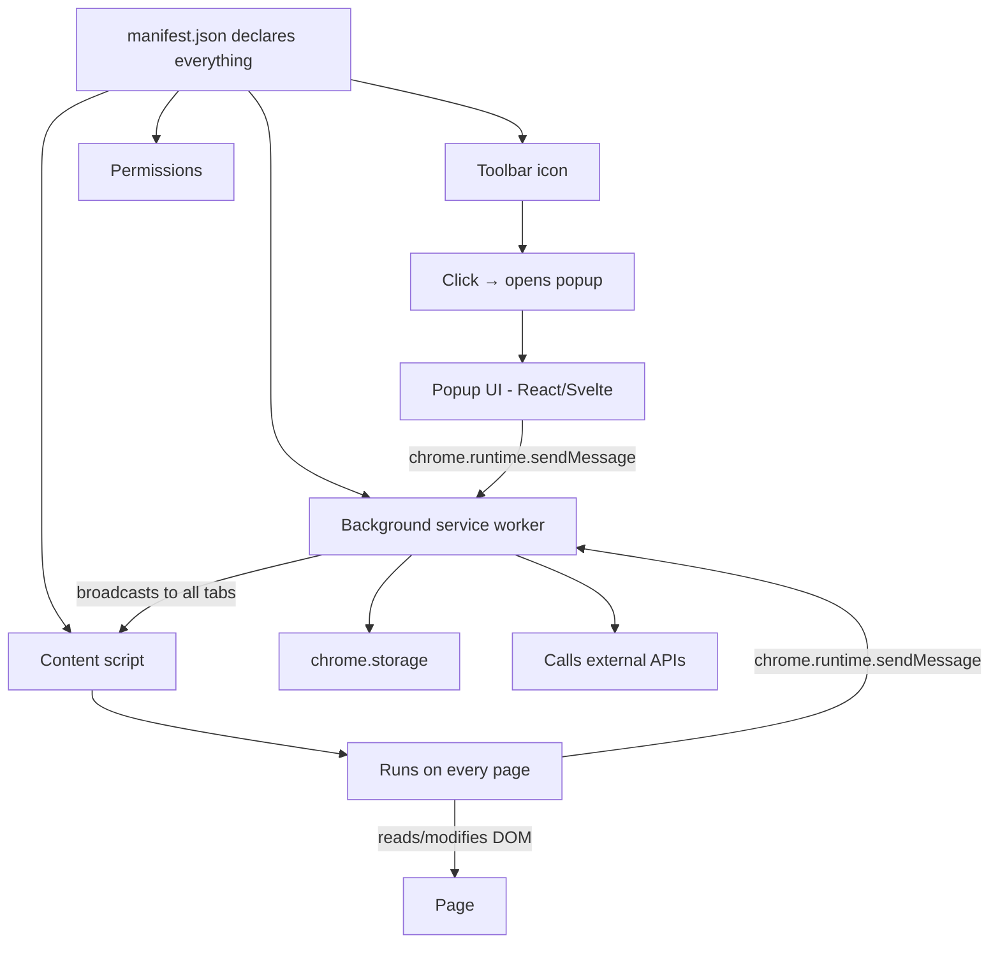

# Lab 24 — A Tool That Lives In Every Tab: Build a Browser Extension

> "The web shapes you. With an extension, you shape it back."

**Time budget:** ~2 weeks for the core lab, with extension challenges that grow it to 3–5 weeks.
**Preferred language:** TypeScript (with React or Svelte for the popup/options UI).
**Working style:** solo, or in a team of up to 3 people.

---

## The hook

Most software lives behind a domain. You go to it. Browser extensions are different — they live *inside the browsers themselves.* They wake up on every page. They read the DOM. They modify content. They add buttons that weren't there. They move in beside the page like a thin, friendly ghost. The most important productivity tools many developers use — **Vimium, uBlock Origin, React DevTools, 1Password, Grammarly, Dark Reader, ColorZilla, JSON Viewer, Wappalyzer** — are extensions.

Building one rewires how you understand the web. You'll touch a quiet, magical corner of the platform: **content scripts** that run alongside any webpage, **background service workers** that live across tabs, **manifest V3** declarations, **popup UIs** that appear when you click the toolbar icon, **storage** that syncs across the user's browsers via their Google account. Almost no junior developer has built one. It's instantly memorable on a portfolio. Recruiters install it and try it; they don't do that with most projects.

If you want a perfect appetizer, watch [**Wes Bos's *Building a Chrome Extension* talks**](https://wesbos.com/) and read [**Chrome's official extension docs**](https://developer.chrome.com/docs/extensions/get-started) — the official tutorial, the canonical reference. Google's own [**"Build a Chrome extension that boosts productivity" series**](https://developer.chrome.com/docs/extensions/get-started) is excellent and free.

---

## Why this is worth your time

- **Almost no one has one in their portfolio.** A working, installed extension is a *visible* signal of someone who builds tools, not just consumes them.
- The skills (**DOM scripting at scale, message passing between contexts, Manifest V3, storage APIs, permissions models**) are real and unique. They map directly to web platform expertise.
- Extensions are **uniquely social.** When friends install yours and use it, you become "the person who made that thing." That story compounds.
- The "ship it" moment — *publishing to the Chrome Web Store* — is one of the highest-confidence wins in a programmer's first year. Anyone in the world can install your software with one click.

---

## The target

> **Reference build:** [Build a Chrome Extension — Course for Beginners — freeCodeCamp](https://www.youtube.com/watch?v=0n809nd4Zu4) — Manifest V3 from scratch with a real published-extension target.

**Basic — "It Works"**
You've built and *installed* (in developer mode) an extension that does **one useful thing on every page** — adds a button to the toolbar that triggers an action, changes pages in some way (e.g., dark mode all sites), or shows useful info about the page. The popup looks polished. The icon looks deliberate.

**Standard — "It's Polished and Published"**
The extension is **published to the Chrome Web Store** (or a publicly downloadable signed `.crx` if the $5 developer fee is a barrier — see softening below). It has a real name, real icon, screenshots, a description, an options page (settings stored via `chrome.storage`), and at least one real user (a friend, a teammate). It handles edge cases — pages where the script can't run, tabs that don't exist anymore, etc.

**Advanced — "It's a Real Tool"**
You've added: cross-browser support (Firefox in addition to Chrome), syncing of settings across the user's devices via `chrome.storage.sync`, integration with an external API (calls to your own backend from [Lab 21](lab-21-rest-api-auth.md)? a third-party service?), keyboard shortcuts, a context-menu integration, an onboarding flow on first install, telemetry of *anonymous* usage (so you know how many people use what features), or a settings UI built with proper React + state management.

---

## The big idea, in one diagram



The three contexts — **content script** (lives in the page), **background worker** (lives across tabs), **popup** (appears when icon is clicked) — talk to each other only through `chrome.runtime` messages. Understanding this trio is the *whole* mental model for extensions.

---

## Two-week plan with milestones

**Week 1 — Make it work**

- **Day 1 — Pick what your extension does.** *One thing.* See the project ideas below — pick one, commit. The narrower the scope, the more polished it will be.
- **Day 2 — Hello world manifest.** Create `manifest.json` (Manifest V3), an icon, and a popup that shows "hello world." Load it in Chrome via `chrome://extensions` → developer mode → load unpacked. *Milestone: it appears in the toolbar.*
- **Day 3 — Popup UI.** Wire React (or Svelte) into the popup with Vite. Polished UI: spacing, font, colors, an actual layout. Take a screenshot.
- **Day 4 — Content script.** Add a content script that runs on every page and visibly does *something* — even just adds a colored border to the body, or logs something to the page's console. Confirm with a test page.
- **Day 5 — The real action.** Whatever your extension's *one* main function is — implement it. Tab counter, password generator, dark mode toggle, page reading-time estimator, whatever. End-to-end working flow.
- **Day 6 — Background worker.** Add a background service worker for any state that needs to live across tabs.
- **Day 7 — Polish + GIF.** Pretty icon, polished popup, README with screenshots and a 15-second GIF.

**At this point you've completed the Basic level.**

**Week 2 — Make it shippable**

- **Day 8 — Options / settings page.** Add an options page where users configure the extension. Settings persist via `chrome.storage`.
- **Day 9 — Edge cases.** What happens on `chrome://` pages where extensions can't run? On PDFs? On pages that load slowly? On pages with strict CSPs? Make it fail gracefully.
- **Day 10 — Listing assets.** Real name, polished icons (16 / 48 / 128 px), screenshots, store description. (Use [Squoosh.app](https://squoosh.app/) for icons.)
- **Day 11 — Publish.** Chrome Web Store ($5 one-time developer fee — see softening below) or release a signed `.crx` and instructions for sideloading.
- **Day 12 — Cross-browser.** Test on Firefox / Edge. With small tweaks, most Manifest V3 extensions run on all three.
- **Day 13 — Pick a side quest.**
- **Day 14 — README, demo video, buffer.**

---

## Levels

### Basic — "It Works" (~10–15 hours)
- Manifest V3 extension loads in dev mode
- popup with polished UI
- content script with one visible effect on a page
- one real, useful function
- a custom icon

### Standard — "Polished and Published" (~14–22 hours)
- everything from Basic
- options page with persistent settings
- handles edge cases gracefully
- *publicly available* — Chrome Web Store, Firefox Add-ons store, or a signed `.crx` with public install instructions
- README with screenshots, GIF, and install instructions
- at least one real external user

### Advanced — "Side Quests" (each ~3–10h)

- **Cross-Browser.** Works on Chrome, Firefox, Edge from one codebase.
- **Keyboard Shortcuts.** Custom keyboard shortcuts via the `commands` API.
- **Context Menu.** Right-click integration that runs your action on a selected text/image/link.
- **Onboarding Flow.** First-install opens a welcome page that teaches the user what your extension does.
- **External API.** Talks to a backend ([Lab 21](lab-21-rest-api-auth.md)'s, OpenAI's, an open API). Adds real intelligence.
- **AI-Powered.** Integrates with an LLM API (OpenAI / Claude / Gemini) for summarization, translation, etc. Connects directly to [Lab 31](lab-31-llm-rag-app.md).
- **Anonymous Telemetry.** Tracks how many people use what feature. (Be transparent — explain it in your privacy notice.)
- **Theming / Dark Mode.** Settings auto-adapt to system theme.
- **Settings Sync.** `chrome.storage.sync` so the user's settings follow them across devices.
- **Site-Specific Behavior.** Extension activates only on specific sites; on others, stays dormant.

---

## Extension challenges (3–5 weeks)

- **Build a Real Productivity Tool.** A genuine, full-featured extension that you (or a small group) actually use daily for a month. Iterate based on real feedback. Submit a polished version to the Chrome Web Store.
- **Companion to Another Lab.** [Lab 21](lab-21-rest-api-auth.md)'s API + a browser extension client. Or [Lab 31](lab-31-llm-rag-app.md)'s LLM playground + an extension that summarizes any page in your browser using your own API. Cross-lab projects are extremely strong portfolio pieces.
- **Open Source.** Publish on GitHub with a license, contribute guide, issue templates, and CI. Get one external pull request.

---

## Make it yours (required)

The technical skeleton is the same. The *idea* is what makes it memorable. Some examples to get you thinking:

- **Reading-Time Estimator.** Adds an accurate "X minute read" badge to article pages.
- **Tab Limiter / Tab Saver.** Saves all your tabs to a list, lets you restore them later. (Inspired by The Great Suspender — RIP.)
- **Wikipedia Race Tracker.** Shows your click depth and path on Wikipedia. A toy, but viscerally fun.
- **JSON Viewer.** When you visit a URL that returns JSON, render it as a tree. (Yes, others exist; build your own.)
- **Page Word Counter.** Live word count, character count, reading time on the current page.
- **Personal Dictionary.** Highlight a word on any page → "add to my dictionary"; later browse all your saved words and definitions (via a free dictionary API).
- **Dark Mode for Any Site.** A real, live dark-mode injector. Surprisingly hard; surprisingly impressive.
- **Aviation flavor.** A METAR fetcher — the user sees an airport ICAO code (e.g., "KJFK") on a page, and your extension shows live weather conditions. Pilots, simmers, and aviation students will use it.
- **Coding-flavored.** A LeetCode-on-any-site extension that overlays "this is an O(n²) loop" hints when you select code. Very ambitious but very memorable.
- **AI-flavored (links to [Lab 31](lab-31-llm-rag-app.md)).** Right-click → "summarize this article with AI." Calls an LLM API; shows the summary in a side panel.

You'll defend why you chose yours.

---

## Working solo or in a team

Solo: this is one of the most contained labs — perfect for solo work.

Team:
- *By layer:* one person owns the popup + options UI; the other owns the content script + background worker logic.
- *By feature:* split your extension into two independent features and own one each.
- *By platform:* one person targets Chrome, the other validates and tweaks for Firefox.

Two team rules: **git from day one** and **list who did what.** Every team member must be able to demo end-to-end.

---

## Tooling and language tips

**TypeScript + Vite (recommended)**
- Use a Vite plugin like **`@crxjs/vite-plugin`** or scaffolds like **WXT** or **Plasmo** — they handle the awkward Manifest V3 + bundling + hot-reload setup for you.
- Use **WXT** if you want a "Next.js for browser extensions" experience: cross-browser, hot reload, perfect TypeScript support.
- Tailwind for the popup styling. The popup is small — keep CSS lean.

**JavaScript + plain HTML**
- For the simplest possible extension. No build step. Edit files, reload extension, done. Educational; not what you want for anything serious.

**Anyone**
- **Manifest V3 is non-negotiable** in 2026. Manifest V2 is deprecated.
- **Content scripts are sandboxed.** They don't share globals with the page. To touch the page's JavaScript context, you need to inject a `<script>` tag.
- **Background scripts are now service workers.** They can be killed at any time. Don't store state in memory; use `chrome.storage`.
- **Permissions affect adoption.** Fewer permissions = more users will install. Don't ask for `<all_urls>` if you only need `activeTab`.
- **Test with a clean Chrome profile.** Your extension behaves differently on a profile with 50 other extensions installed.

---

## Suggested project structure

```txt
my-extension/
  README.md
  manifest.json              # Manifest V3
  src/
    popup/
      Popup.tsx
      index.html
    options/
      Options.tsx
      index.html
    content/
      content-script.ts
    background/
      service-worker.ts
    shared/
      storage.ts
      messages.ts
      types.ts
  public/
    icons/
      icon-16.png
      icon-48.png
      icon-128.png
  vite.config.ts
  docs/
    screenshots/
    demo.gif
```

---

## When you get stuck

- **"Service worker registration failed"** — your `manifest.json` likely has a syntax error or a missing field. Check the developer console for extensions on `chrome://extensions`.
- **Content script doesn't run.** Check `matches` in your manifest. `<all_urls>` runs everywhere; specific patterns run only there. Also: it doesn't run on `chrome://` pages, the Web Store, or PDFs by default.
- **Popup closes when I click somewhere.** That's by design — popups are dismissed on outside click. For persistent UI, use a side panel or inject a UI into the page.
- **Hot reload breaks.** Use a scaffold (WXT, Plasmo, `@crxjs/vite-plugin`) instead of raw Vite. Manifest V3 hot reload is finicky.
- **Storage doesn't persist.** You're using `chrome.storage.local` (clears on uninstall). Use `chrome.storage.sync` if you want it to follow the user's account.
- **CORS errors from background script.** Background can call any URL if `host_permissions` is set in the manifest.

If stuck for 30+ minutes: open the *extension's* DevTools (right-click extension icon → "Inspect popup", or on `chrome://extensions` click "Inspect views: service worker"). Most bugs are visible in those consoles, not the page console.

---

## Deployment checklist

- [ ] Manifest is V3.
- [ ] Icons exist at 16 / 48 / 128 px.
- [ ] Popup, content script, background worker all work in a fresh Chrome profile.
- [ ] No errors in the extension's service worker console.
- [ ] Permissions are *minimal*. (Don't ask for `<all_urls>` if you only need `activeTab`.)
- [ ] `web_accessible_resources` declared if your content script injects external assets.
- [ ] Privacy notice in the README explaining what data is collected (even if "none").
- [ ] **Either** published to Chrome Web Store ($5 one-time fee) **or** a signed `.crx` is downloadable from your repo with sideloading instructions. (See note below.)
- [ ] Tested on at least one *other* person's machine.
- [ ] Screenshots and GIF in the README.

> **About the $5 fee.** The Chrome Web Store has a one-time $5 developer fee. If that's a barrier, you have three valid alternatives:
> 1. **Firefox Add-ons store** — free to publish.
> 2. **Edge Add-ons store** — free to publish.
> 3. **Sideload a signed `.crx`** — package and distribute via your repo with installation instructions. This is enough for the lab.

---

## What recruiters look at

- **They install it.** This is the whole game. The first 30 seconds — does it install cleanly, does the icon look right, does the popup open without errors — *is* the recruiter's review.
- **They look at permissions.** A junior asking for `<all_urls>` for a tip calculator looks careless. Minimal permissions = security awareness.
- **They look at the listing page** (icons, screenshots, description). Polished listing = product thinking.
- **They poke the README** for the source code. Clean code, a clear architecture comment, sensible separation of popup/content/background = engineering signal.
- **They check whether it crashes** when run on weird pages (PDFs, `about:blank`, an SPA).

---

## What to put in your README

1. Project name + one-liner.
2. **Screenshots and a 15-second GIF** at the top.
3. The install link (Web Store / Firefox / `.crx` sideload).
4. What it does, in 2 sentences.
5. Tech stack.
6. Architecture (popup ↔ content script ↔ background worker, with a diagram).
7. How to run locally + how to load unpacked.
8. Permissions and *why* each is needed.
9. Privacy: what data (if any) is collected, where it goes.
10. Side quests + extensions.
11. Known limitations / TODOs.
12. If team: who did what.

---

## Reflection

Be ready to:

1. **Live install it on a fresh laptop.**
2. **Demo it on a normal page, a slow page, a `chrome://` page, and a PDF.**
3. **Walk through one user action** end-to-end: popup click → message → content script → DOM mutation.
4. **Why are content scripts isolated** from the page's JavaScript context? What protection does this provide?
5. **Why is the background a service worker now** instead of a persistent page (Manifest V2)?
6. **What permissions did you ask for and why?** What would happen if you asked for fewer? More?
7. **What was the hardest bug** — manifest, message passing, DOM manipulation, or storage?

---

## Showcase

End-of-semester gallery — anonymous voting for **most installed**, **most polished UX**, and **most useful**. Bring the install link or QR code to your listing page; let classmates install on the spot.

---

## Going further

- *Chrome Extensions Get Started* — Google's official tutorial.
- *WXT documentation* — modern, ergonomic framework for building cross-browser extensions.
- *Plasmo Docs* — alternative to WXT.
- *Browser Extension Security* (MDN) — what the permissions model actually does.
- Reverse-engineer your favorite extensions: most are open source on GitHub. Read [**Vimium's**](https://github.com/philc/vimium) source. Read [**uBlock Origin's**](https://github.com/gorhill/uBlock) architecture docs.

---

## A final word

The web wasn't built to be modified by users; it was built to be consumed by them. Extensions are the polite, official way to push back. Yours doesn't have to be world-changing. It has to be *yours*. Something you wish existed. Something a friend laughs at and asks for the install link. Build that.
