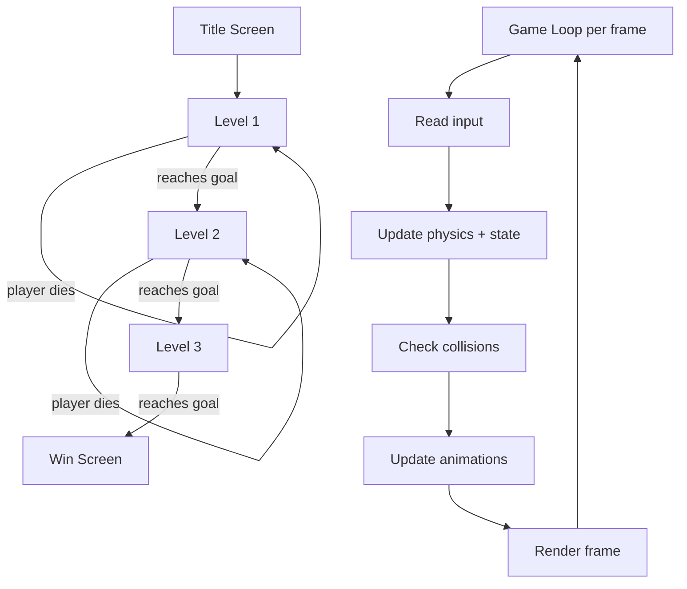

# Lab 25 — A Game People Actually Play: Build and Ship a 2D Platformer

> "Make a small game. Finish it. Put it online. Ninety percent of game-dev portfolios stop before that last step."
> — every game-dev recruiter

**Time budget:** ~2 weeks for the core lab, with extension challenges that grow it to 3–5 weeks.
**Preferred engines:** Godot (recommended — free, lightweight, easy to ship to web) or Unity (industry-standard).
**Working style:** solo, or in a team of up to 3 people.

---

## The hook

In 1985 a small team at Nintendo made a game where a man in red overalls jumped on goombas. Forty years later **Super Mario Bros.** still holds up — its physics, its level pacing, its enemy design were studied frame-by-frame by everyone who came after. Indie developers keep returning to the platformer because *it teaches you everything*: input, physics, collision, animation, level design, audio, UI, polish, and the brutal lesson of "what's fun?"

In this lab, you're going to make a small, complete, *playable* 2D platformer — and **publish it to itch.io** for anyone in the world to play. Three levels. A character that feels good to control. Enemies. A goal. A title screen. A win screen. Music. Sound effects. The whole loop.

This is the lab where most students discover that **the hardest thing in game development isn't code — it's "is it fun?"** You'll spend half your time tweaking jump heights, gravity, and timing windows by single-frame increments. That tiny dial is what separates Celeste from a clone.

If you want a perfect appetizer, watch [**Mark Brown's *Game Maker's Toolkit* — *The Art of the Jump*** (YouTube, ~10 min)](https://www.youtube.com/watch?v=hG9SzQxaCm8) — a beautiful breakdown of *why* Mario, Sonic, and Celeste feel different. Pair it with [**Maddy Thorson's blog on Celeste's player mechanics**](https://maddythorson.medium.com/celeste-forgiveness-mechanics-3eebcbb2cffb) — the developer of Celeste explaining the "coyote time," "jump buffering," and "input forgiveness" tricks that make jumps feel right. They're the most-cited game-feel writeups in the industry.

---

## Why this is worth your time

- **You will ship something that other humans play.** That sentence alone separates you from 95% of CS students.
- A playable, hosted game on **itch.io** is one of the highest-conversion portfolio pieces possible — recruiters click, play for 30 seconds, and form an instant opinion of "this person finishes things."
- You'll learn **game feel** — the most underrated, least-taught skill in software. The same instincts make UIs, animations, and tools feel good too.
- You'll learn an engine (Godot or Unity) that you can use for **every game lab in this course** — and for the rest of your life if you love it.
- "Has shipped a game" is a startlingly rare line on a junior CV. It implies finishing, polish, scope discipline, and self-direction in one phrase.

---

## The target

> **Reference build:** [Pygame Platformer Tutorial — Full Course — DaFluffyPotato](https://www.youtube.com/watch?v=2gABYM5M0ww) — 6-hour platformer build covering tiles, physics, particles, parallax, AI, level editing, and packaging. The Advanced bar for this lab.

**Basic — "It Plays"**
A single level. A character that runs, jumps, and dies. At least one type of enemy or hazard. A goal. A working game loop: title → play → win/lose → restart. Built and exported to a **playable web build on itch.io** that anyone with a URL can play.

**Standard — "It's a Real Tiny Game"**
**Three levels** of increasing difficulty, each with a clear concept (level 1 teaches jumping, level 2 introduces enemies, level 3 introduces a hazard). A title screen and credits screen. **Music + sound effects** (royalty-free is fine; *credit your sources*). A polished player feel — coyote time, jump buffering, screen shake on hit. At least 2 distinct enemy types. Published, with at least 5 friends having actually completed level 1.

**Advanced — "It Has Soul"**
You've added something that takes your game from "student project" to "actually fun for 10 minutes": a final boss, a unique gameplay mechanic (gravity flip, time rewind, double jump unlocked mid-game), a basic story/lore, animated cutscenes, secret/optional levels, an unlockable, a leaderboard, mobile-touch controls, controller support, or original art (yours or a friend's).

---

## The big idea, in one diagram



Two loops live in your head at once: the **scene loop** (which level the player is on) and the **frame loop** (what happens 60 times a second to update the world).

---

## Two-week plan with milestones

**Week 1 — Make it playable**

- **Day 1 — Pick an engine + concept.** Godot or Unity. One-line concept ("a knight rescuing a cat", "a robot plumber escaping a factory", "a pilot bailing out of a falling plane onto rooftops"). *One concept, one art style, one moveset.*
- **Day 2 — Hello world.** Engine installed. A character on screen. Move with arrow keys. *Milestone: a controllable character.*
- **Day 3 — The jump.** A working jump. Gravity. Falling. Landing. *Milestone: physics that doesn't make you nauseous.* Spend more time tuning than you think you should.
- **Day 4 — A level.** Tiles for ground. Walls. A goal flag at the end. Reach the goal → "you win" message.
- **Day 5 — Death and respawn.** Pits / spikes that kill on contact. Player respawns at the start. A simple HUD (lives or just deaths counter).
- **Day 6 — One enemy.** A patrolling enemy that kills the player on contact (or that the player kills by jumping on top, à la Mario).
- **Day 7 — Polish + first deploy.** Title screen → level 1 → win screen → restart. Export to web. **Upload to itch.io.** *Milestone: someone outside your room has played.* Take a 30-second GIF.

**At this point you've completed the Basic level.**

**Week 2 — Make it feel good**

- **Day 8 — Game feel pass.** Coyote time, jump buffering, screen shake on enemy stomp. Watch your Day-3 footage vs. Day-8; the difference is everything.
- **Day 9 — Two more levels** with different concepts.
- **Day 10 — Audio.** Music, jump SFX, death SFX, victory SFX. (See sources below.)
- **Day 11 — One more enemy + one hazard** (moving platform, falling block, projectile).
- **Day 12 — Pick a side quest.**
- **Day 13 — Polish: title screen, credits, pause menu, mute toggle.**
- **Day 14 — Re-export, re-upload, README, demo video.**

---

## Levels

### Basic — "It Plays" (~14–18 hours)
- runnable, jumpable, dieable character
- one playable level with a goal
- one enemy or hazard
- a title screen and a win screen
- exported to a playable web build on itch.io

### Standard — "It's a Real Tiny Game" (~18–28 hours)
- everything from Basic
- 3 levels of increasing difficulty
- coyote time + jump buffering (game feel basics)
- 2+ enemy types
- music + sound effects
- title / pause / win / credits screens
- 5 friends have actually completed level 1

### Advanced — "Side Quests" (each ~3–10h)

- **Game Juice.** Particles on jump, screen shake, hit-stop, time freeze on big moments, smear frames. (Watch [Vlambeer's *The Art of Screenshake*](https://www.youtube.com/watch?v=AJdEqssNZ-U).)
- **Boss Fight.** A final boss with an attack pattern. Multiple phases.
- **Gimmick Mechanic.** Gravity flip, time rewind, hookshot, double jump unlocked mid-game, "two characters at once."
- **Level Editor.** Players design their own level and share via a code or URL. *Massive* portfolio impact.
- **Speedrun Timer.** With a leaderboard backed by [Lab 21](lab-21-rest-api-auth.md)'s API. Combine labs!
- **Mobile Touch Controls.** Game playable on a phone.
- **Controller Support.** Gamepad input. (Connects to [Lab 19](lab-19-custom-game-controller.md).)
- **Original Art.** You drew the sprites, or a friend did. Credit them. *Even crude original art beats a polished asset pack on portfolios.*
- **Local Co-op.** Two-player on the same keyboard.

---

## Extension challenges (3–5 weeks)

- **A Polished 10-Minute Game.** 5+ levels, a full story arc, original audio and visual polish. The kind of thing you'd hand a friend without apologizing.
- **Combine With [Lab 27](lab-27-multiplayer-browser-game.md) (Multiplayer).** Add online multiplayer to your platformer — one character per player on the same level. Hard but absurdly impressive.
- **Take It To A Game Jam.** Use your engine + skills to enter a real jam (Ludum Dare, Global Game Jam, GMTK Jam). The deadline pressure of a jam is a different kind of education.

---

## Make it yours (required)

The mechanics are universal; *what your character is, what they want, how the world looks* — those are entirely yours. Some directions:

- **A pilot ejecting and landing on rooftops.** Aviation flavor.
- **A cat trying to find the way home.** (Players are softer on cats than on humans.)
- **A reverse platformer** where you play as the boss trying to stop a hero.
- **A platformer where one mechanic is a metaphor.** "You collect memories." "You leave a trail of doubt that becomes platforms." Play with it.
- **A two-screen platformer** where the player controls two characters simultaneously, one on each screen half.
- **A horror platformer.** A dark world; clever sound design; understated lore. (Think *Limbo*.)

You'll defend why you chose your concept.

---

## Working solo or in a team

Solo: you'll touch every part of game development. Slow but life-changing.

Team:
- *By role:* one person owns design + level design; another owns code + character feel; another owns art + audio. Specialization works extremely well in game-dev teams.
- *By feature:* one person owns "the player feels good" (movement, animation, polish); the other owns "the world feels alive" (enemies, levels, hazards, audio).
- *By tier:* one person owns the Standard tier; the other targets Advanced side quests.

Two team rules: **git from day one** (engines have specific Git ignore rules — use `.gitignore` templates from each engine's docs, and use **Git LFS** for large assets) and **list who did what.** Every team member must be able to demo the game live.

---

## Tooling and engine tips

**Godot 4 (recommended for this lab)**
- Free, lightweight, fully open-source. Single ~80MB download.
- Excellent 2D pipeline. Built-in physics, animation tree, particles, tilemaps.
- Exports to **HTML5 / web**, Windows, macOS, Linux, Android with one button.
- **GDScript** (Python-like, very approachable) or C#.
- Best for first-time game devs. The whole engine fits in your head in a week.

**Unity (industry standard)**
- The most-used engine in the industry.
- Heavyweight install, more powerful, larger learning curve.
- C# everywhere. Great if you've used C# before (great [Lab 12](lab-12-task-tracker.md)/[Lab 21](lab-21-rest-api-auth.md) transfer).
- Exports to web (WebGL), but the build is large and the export pipeline is finicky.
- Good if you're sure you want to do game-dev professionally; Godot is enough for this lab.

**LÖVE (Lua) / Pygame (Python)**
- Simple frameworks for the brave / curious. No editor — just code. Great learning experience, harder to ship polish in 2 weeks.

**Anyone**
- **Use a tilemap, not hand-placed sprites.** Tilemaps make level design 10x faster.
- **Don't write your own physics.** Both Godot and Unity have excellent built-in 2D physics. Use them.
- **Use existing art for v1.** Replace later if time. [Kenney.nl](https://kenney.nl/) — free, public-domain assets used by hundreds of indie games. [itch.io free assets](https://itch.io/game-assets/free) — beautiful, often free.
- **Audio:** [freesound.org](https://freesound.org/), [Pixabay](https://pixabay.com/sound-effects/), [Bensound](https://www.bensound.com/), [Incompetech](https://incompetech.com/). Always credit.

---

## Suggested project structure (Godot)

```txt
my-platformer/
  README.md
  project.godot
  scenes/
    Main.tscn
    Player.tscn
    Enemy.tscn
    Levels/
      Level1.tscn
      Level2.tscn
      Level3.tscn
    UI/
      TitleScreen.tscn
      PauseMenu.tscn
      WinScreen.tscn
  scripts/
    Player.gd
    Enemy.gd
    GameManager.gd
  assets/
    sprites/
    tiles/
    audio/
    music/
  exports/
    web/
  docs/
    screenshots/
    demo.gif
```

---

## When you get stuck

- **Jump feels bad.** Add **coyote time** (~6 frames after walking off a ledge, jump still works) and **jump buffering** (~6 frames before landing, queued jump fires). These two together transform a game.
- **Player gets stuck on tile edges.** Use a `CapsuleShape2D` instead of a `RectangleShape2D`. Mario's iconic look hides the same trick.
- **Web export is huge.** Unity's WebGL exports are 30+ MB and slow to load. Godot exports are typically <10 MB. If you must use Unity, expect this.
- **Game runs differently on different machines.** You're using delta-time wrong. Multiply velocities by `delta` every frame.
- **Music is too loud / too soft.** Always include a mute button or a volume slider. Always.
- **My game is hard.** It's almost always too hard. Watch a non-game-developer play. They will struggle in places you can't imagine. Tune accordingly.

If stuck for 30+ minutes: **playtest with one human.** They will reveal the bug or design flaw you're invisible to.

---

## Deployment checklist

- [ ] Game works in latest Chrome and Firefox.
- [ ] Loads in <10 seconds on a normal connection.
- [ ] No console errors.
- [ ] Audio doesn't auto-play before user interaction (browser policy).
- [ ] Mute button works.
- [ ] Title → level → win → restart loop is unbroken.
- [ ] Mobile (touch) support works **or** you've explicitly disabled mobile with a "play on desktop" message.
- [ ] **Live URL on itch.io** with a short description, GIF/screenshots, controls listed.
- [ ] Credits page lists all assets you didn't make (with author + license).

---

## What recruiters look at

- **They click play.** They will play *briefly* — 30 to 90 seconds. The first level must hook them in 10 seconds.
- **They die.** Most recruiters have not played a platformer in years. If your level 1 isn't winnable in 90 seconds by a casual player, they'll quit. *Make level 1 easy.*
- **They look at your itch.io page.** Title, screenshots, GIF, description. This is your store page; treat it like one.
- **They look at your README's architecture/diary section.** A short "what I learned" or a devlog is gold.
- **They install nothing.** Web builds are king for portfolios. Don't ask them to download an `.exe`.

---

## What to put in your README

1. Game title + tagline.
2. **The play link** (itch.io URL).
3. A 15-second GIF.
4. Controls.
5. Credits — every asset, every sound, every font, with author and license.
6. Tech (engine version, language).
7. How to run locally (clone + open in editor).
8. Devlog: a short "what I built and what I learned" section. Even 100 words is impactful.
9. Side quests + extensions.
10. Known bugs / TODOs.
11. If team: who did what.

---

## Reflection

Be ready to:

1. **Live demo on the projector.** (Web build, single click.)
2. **Show the moment your game feels best** — and explain *why* (coyote time, screen shake, audio).
3. **Show the moment your game feels worst** — and explain why you didn't fix it.
4. **Tune one variable live.** "What if I increase gravity by 50%?" — show the effect.
5. **Walk through your physics step.** What does a single frame's update look like?
6. **Why platformers as a genre?** What is uniquely teaching you to make this and not, say, a top-down shooter?
7. **Did you playtest with someone outside your team? What did you learn?**

---

## Showcase

End-of-semester gallery — anonymous voting for **most fun in 30 seconds**, **best game feel**, and **most original concept**. Bring laptops; people will play.

---

## Going further

- *Game Maker's Toolkit* (Mark Brown, YouTube) — the best game design channel on the internet. Watch *The Art of the Jump*, *What Makes a Good Combat System*, *Boss Keys*.
- *Sebastian Lague* (YouTube) — for procedural generation, technical art, and engine-deep techniques.
- *Brackeys* (YouTube) — the gentlest Unity intro that exists.
- *GDQuest* (YouTube) — the Brackeys of Godot.
- *Celeste's source code* — yes, the game is open source. Read it: [github.com/NoelFB/Celeste](https://github.com/NoelFB/Celeste).
- *Game Feel* by Steve Swink — book. The canonical resource on what makes games "feel" good.

---

## A final word

You'll spend a week making the platformer work. Then you'll spend a week making it *feel* good. The second week is the one that teaches the most. By the end, you'll have something a stranger on the internet can play — and somewhere, someone will. That's a strange, small, real thing to have made.
